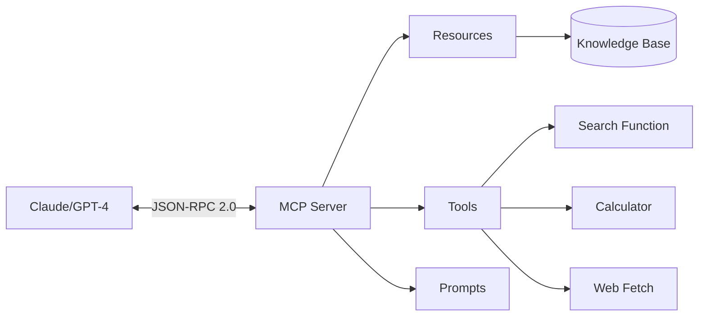

# 🔌 MCP Server Implementation

A production-ready Model Context Protocol (MCP) server that provides AI assistants with access to a knowledge base, tools, and prompts.

## Features

- ✅ **Resources** - Access to knowledge base articles
- ✅ **Tools** - Executable functions (search, calculate, web fetch)
- ✅ **Prompts** - Reusable templates
- ✅ **Authentication** - API key validation
- ✅ **Rate Limiting** - Request throttling
- ✅ **Logging** - Comprehensive audit trail

## Architecture



## Setup

```bash
# Install dependencies
pip install mcp anthropic-sdk python-dotenv

# Set API key
echo "MCP_API_KEY=your-secret-key" > .env
```

## Usage

### Start the Server

```bash
python mcp_server.py
```

### Configure Claude Desktop

Add to `~/Library/Application Support/Claude/claude_desktop_config.json`:

```json
{
  "mcpServers": {
    "knowledge-base": {
      "command": "python",
      "args": ["/path/to/mcp_server.py"],
      "env": {
        "MCP_API_KEY": "your-secret-key"
      }
    }
  }
}
```

### Test with Python

```python
from mcp import ClientSession, StdioServerParameters
from mcp.client.stdio import stdio_client

# Connect to server
server_params = StdioServerParameters(
    command="python",
    args=["mcp_server.py"]
)

async with stdio_client(server_params) as (read, write):
    async with ClientSession(read, write) as session:
        # Initialize
        await session.initialize()

        # List resources
        resources = await session.list_resources()
        print(resources)

        # Call tool
        result = await session.call_tool(
            "search_knowledge",
            {"query": "MCP protocol"}
        )
        print(result)
```

## Available Resources

| URI | Description |
|-----|-------------|
| `kb://articles/mcp` | MCP Protocol Documentation |
| `kb://articles/rag` | RAG Systems Guide |
| `kb://articles/agents` | Multi-Agent Frameworks |

## Available Tools

| Tool | Parameters | Description |
|------|-----------|-------------|
| `search_knowledge` | `query: str` | Search knowledge base |
| `calculate` | `expression: str` | Evaluate math expressions |
| `web_fetch` | `url: str` | Fetch web content |

## Available Prompts

| Prompt | Arguments | Description |
|--------|-----------|-------------|
| `explain_concept` | `concept: str` | Explain technical concept |
| `code_review` | `code: str, language: str` | Review code |
| `summarize` | `text: str` | Summarize content |

## Security Features

- **API Key Authentication** - All requests require valid API key
- **Rate Limiting** - Max 100 requests per minute
- **Input Validation** - Sanitize all inputs
- **Audit Logging** - Track all operations

## Files

- `mcp_server.py` - Main MCP server implementation
- `knowledge_base.py` - Knowledge base management
- `tools.py` - Tool implementations
- `test_server.py` - Test suite
