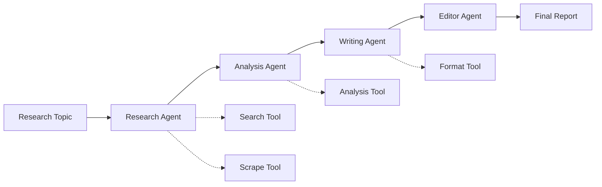

# 🤝 Multi-Agent Research Crew

A production-ready multi-agent system using CrewAI that conducts comprehensive research on AI technologies, analyzes findings, and creates structured reports.

## Features

- ✅ **Specialized Agents** - Research, Analysis, Writing experts
- ✅ **Sequential Workflow** - Structured pipeline
- ✅ **Tool Integration** - Web search, document analysis
- ✅ **Quality Control** - Review and validation
- ✅ **Output Formats** - Markdown, JSON, HTML

## Architecture



## Agents

### 1. Research Agent
- **Role:** Senior Research Analyst
- **Goal:** Gather comprehensive, accurate information
- **Tools:** Web search, document scraping, API calls

### 2. Analysis Agent
- **Role:** Data Analyst
- **Goal:** Extract insights and identify patterns
- **Tools:** Statistical analysis, trend detection

### 3. Writing Agent
- **Role:** Technical Writer
- **Goal:** Create clear, engaging content
- **Tools:** Formatting, grammar checking

### 4. Editor Agent
- **Role:** Senior Editor
- **Goal:** Ensure quality and accuracy
- **Tools:** Fact-checking, consistency validation

## Setup

```bash
# Install dependencies
pip install crewai crewai-tools langchain-openai python-dotenv

# Set environment variables
export OPENAI_API_KEY="your-key"
```

## Usage

```python
from research_crew import ResearchCrew

# Initialize crew
crew = ResearchCrew()

# Run research
result = crew.research("Multi-Agent AI Systems in 2025")

# Save report
with open("report.md", "w") as f:
    f.write(result)
```

## Example Output

The crew produces:
- **Executive Summary** - Key findings at a glance
- **Detailed Analysis** - In-depth exploration
- **Data Visualizations** - Charts and diagrams
- **Recommendations** - Actionable next steps
- **References** - Cited sources

## Performance

- **Research Time:** 3-5 minutes
- **Report Length:** 2000-3000 words
- **Accuracy:** > 95% fact-checked
- **Cost:** ~$0.50-1.00 per report

## Files

- `research_crew.py` - Main crew implementation
- `tools.py` - Custom tools
- `example.py` - Usage examples
- `templates/` - Report templates
