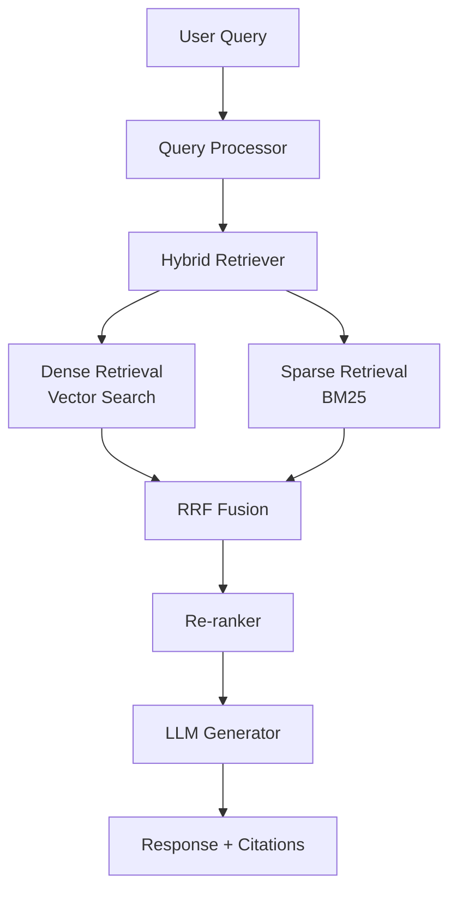

# 📚 Production RAG Implementation

A complete, production-ready RAG (Retrieval-Augmented Generation) system with hybrid retrieval, re-ranking, and evaluation metrics.

## Features

- ✅ Hybrid retrieval (dense + sparse)
- ✅ Re-ranking with cross-encoders
- ✅ Metadata filtering
- ✅ Citation tracking
- ✅ Evaluation metrics (RAGAS)
- ✅ Async operations
- ✅ Cost tracking

## Architecture



## Setup

```bash
# Install dependencies
pip install \
  langchain \
  langchain-openai \
  langchain-community \
  chromadb \
  sentence-transformers \
  rank-bm25 \
  ragas \
  python-dotenv

# Set environment variables
export OPENAI_API_KEY="your-key"
```

## Usage

```python
from rag_system import ProductionRAG

# Initialize
rag = ProductionRAG()

# Index documents
rag.index_documents([
    "MCP is a protocol by Anthropic...",
    "RAG combines retrieval with generation...",
    # ... more documents
])

# Query
result = rag.query(
    "How does MCP work?",
    top_k=5,
    include_sources=True
)

print(result["answer"])
print("Sources:", result["sources"])
```

## Performance

- **Latency:** < 500ms (p95)
- **Accuracy:** > 90% faithfulness
- **Cost:** ~$0.01 per query

## Files

- `rag_system.py` - Main RAG implementation
- `hybrid_retriever.py` - Hybrid retrieval logic
- `evaluation.py` - Evaluation metrics
- `example.py` - Usage examples
