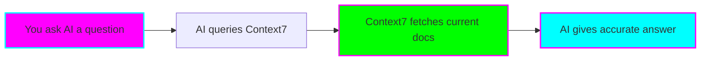

# ⚡ Context7 Quick Start Guide

**Get up and running with Context7 in 15 minutes**

---

## 🎯 What is Context7?

Context7 is an MCP server that gives your AI coding assistant access to **up-to-date library documentation** in real-time. No more outdated code suggestions!



**Key Benefit:** Your AI assistant uses **today's documentation**, not training data from months/years ago.

---

## 🚀 5-Minute Setup

### Step 1: Create Upstash Account (2 minutes)

1. Go to https://upstash.com
2. Sign up (free tier available)
3. Click "Create Database"
4. Choose "Redis"
5. Copy these values:
   - `UPSTASH_REDIS_REST_URL`
   - `UPSTASH_REDIS_REST_TOKEN`

### Step 2: Install Context7 (1 minute)

```bash
# Option A: Install globally
npm install -g @upstash/context7-mcp-server

# Option B: Use with npx (no install)
npx @upstash/context7-mcp-server --help
```

### Step 3: Configure Your AI Tool (2 minutes)

#### For Claude Code

Add to `.claude/config.json`:

```json
{
  "mcpServers": {
    "context7": {
      "command": "npx",
      "args": ["-y", "@upstash/context7-mcp-server"],
      "env": {
        "UPSTASH_REDIS_REST_URL": "your-url-here",
        "UPSTASH_REDIS_REST_TOKEN": "your-token-here"
      }
    }
  }
}
```

#### For Cursor

Add to `~/.cursor/config.json`:

```json
{
  "mcp": {
    "servers": {
      "context7": {
        "command": "npx",
        "args": ["-y", "@upstash/context7-mcp-server"],
        "env": {
          "UPSTASH_REDIS_REST_URL": "your-url-here",
          "UPSTASH_REDIS_REST_TOKEN": "your-token-here"
        }
      }
    }
  }
}
```

**Restart your AI tool after configuration!**

---

## ✅ Verify It's Working

Try this prompt:

```
"Using Context7, fetch the latest React 18 documentation for the useTransition
hook and show me a complete example."
```

**Expected behavior:**
- AI mentions querying Context7 or current documentation
- Response includes accurate, version-specific information
- Code examples match official current docs

**If it's not working:**
- Check: Did you restart your AI tool?
- Check: Are the Upstash credentials correct?
- Check: Is the MCP server command path correct?

---

## 🎤 Your First 3 Prompts

### Prompt 1: Simple Query
```
"Using Context7, check the latest Next.js 14 documentation for server-side
data fetching and show me the recommended pattern."
```

**What to observe:** Does the AI reference current Next.js 14 docs? Are patterns up-to-date?

### Prompt 2: Version-Specific
```
"Query Context7 for TypeScript 5.3 'const' type parameters and refactor
this function to use them:

function firstElement<T>(arr: T[]): T | undefined {
  return arr[0];
}
"
```

**What to observe:** Does it mention the specific TypeScript 5.3 feature?

### Prompt 3: Comparison
```
"Using Context7, fetch documentation for both Zod and Yup's latest versions
and compare their TypeScript integration capabilities."
```

**What to observe:** Does it pull current info for both libraries?

---

## 📊 Track Your Results

After your first 3 prompts, answer these:

**Time to Complete:**
- Prompt 1: ___ minutes
- Prompt 2: ___ minutes
- Prompt 3: ___ minutes

**Accuracy:**
- Did responses feel current? ✅ Yes / ❌ No
- Any outdated patterns suggested? ✅ Yes / ❌ No
- Version-specific info provided? ✅ Yes / ❌ No

**First Impressions:**
```
What surprised me:


What I liked:


What confused me:


Will I continue using it?
[ ] Yes, definitely
[ ] Yes, but need to learn more
[ ] Undecided
[ ] No, not for me
```

---

## 🎯 Next Steps

### If It's Working Well

1. ✅ Read the full [README.md](./README.md) for experiment methodology
2. ✅ Explore the [PROMPT-LIBRARY.md](./PROMPT-LIBRARY.md) for 120+ optimized prompts
3. ✅ Start tracking metrics using [METRICS.md](./METRICS.md)
4. ✅ Complete the full 2-week experiment

### If You're Having Issues

1. 🔍 Check the troubleshooting section in README.md
2. 💬 Ask: "Is the Context7 MCP server running and responding?"
3. 🔧 Verify: Upstash Redis instance is active (check dashboard)
4. 📝 Document the issue in your experiment log

### If You Want to Learn More

- [Official Context7 Documentation](https://upstash.com/docs/context7)
- [Model Context Protocol Spec](https://modelcontextprotocol.io/)
- [MCP Servers Repository](https://github.com/modelcontextprotocol/servers)

---

## 💡 Quick Tips

### 🎯 Be Specific
```
❌ "Show me React hooks"
✅ "Using Context7, fetch React 18.3 useTransition documentation"
```

### 📦 Mention Versions
```
❌ "How do I use Next.js routing?"
✅ "Query Context7 for Next.js 14 App Router patterns"
```

### 🔄 Request Current Info
```
❌ "What's the best way to fetch data in React?"
✅ "Check Context7 for the latest React 18 data fetching best practices"
```

### 🎓 Compare When Unsure
```
"Using Context7, compare [Library A] vs [Library B] documentation
and recommend which to use for [use case]."
```

---

## ⏱️ Time Investment

**Setup:** 5-15 minutes (one-time)
**Learning curve:** 30-60 minutes (understanding effective prompts)
**Payoff:** Potentially hours saved from avoiding outdated patterns

**Recommended approach:**
- Week 1: Try it casually, learn what works
- Week 2: Track metrics, compare systematically
- Decision point: Keep or remove from workflow

---

## 🎉 You're Ready!

You now have:
- ✅ Context7 installed and configured
- ✅ Verified it's working with test prompts
- ✅ Understanding of effective prompt patterns
- ✅ Resources for deep diving (README, PROMPT-LIBRARY, METRICS)

**Start small:** Use Context7 for your next coding task and see if you notice a difference in response quality!

**Track progress:** Note when Context7 helps vs. when it doesn't matter

**Stay curious:** Experiment with different prompt styles

---

**Good luck with your experiment!** 🚀

**Questions?** Document them in your experiment log and research as you go.

**Found this helpful?** Share your learnings with others once complete!
