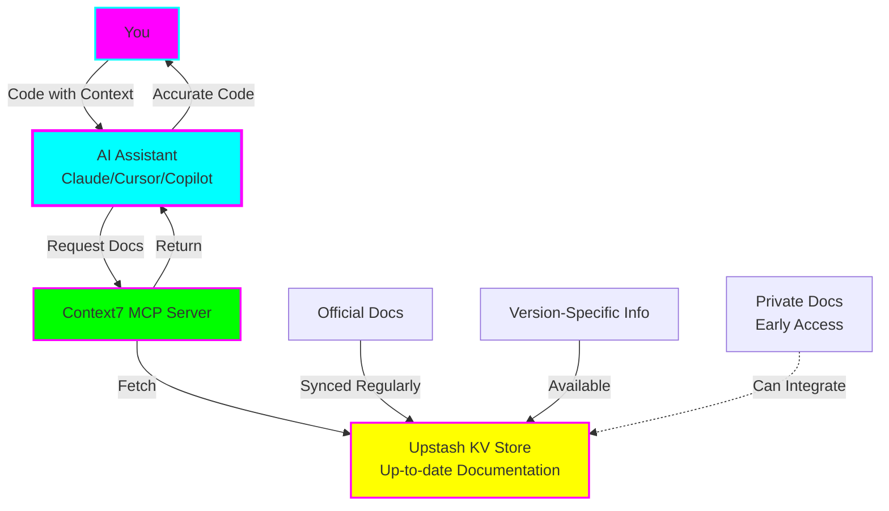
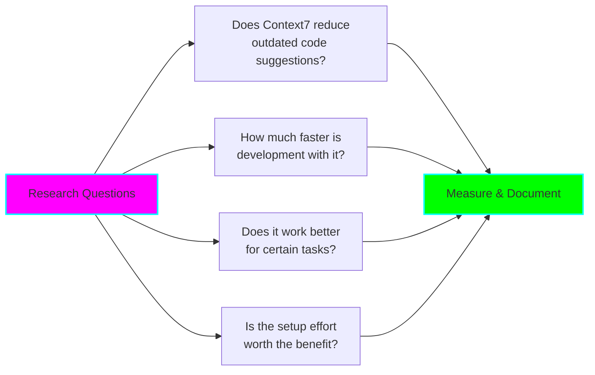
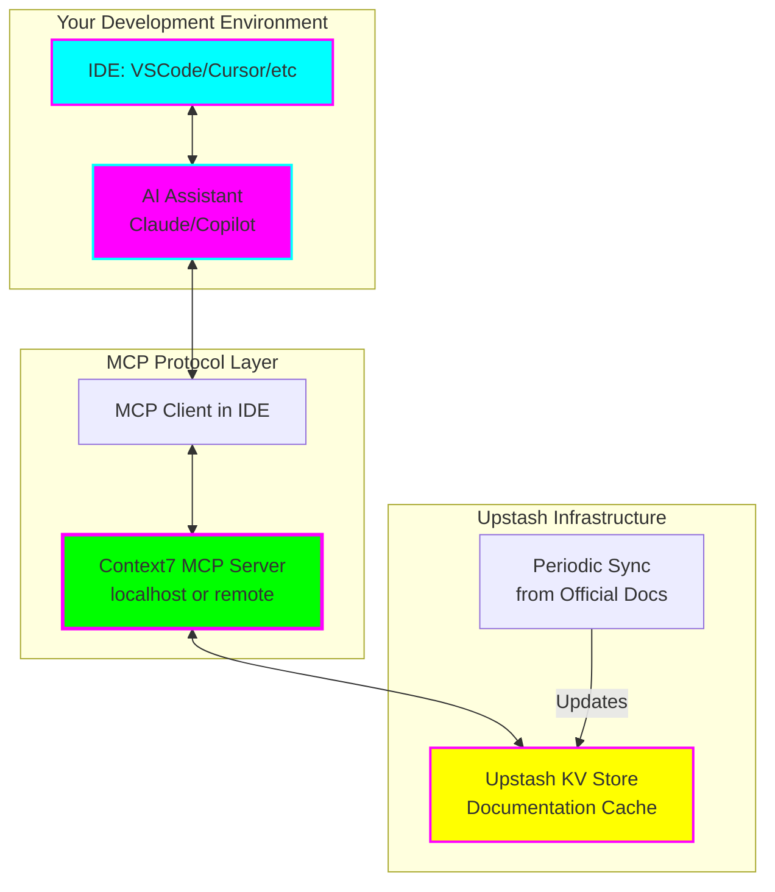
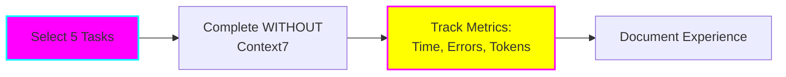
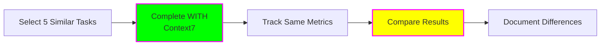
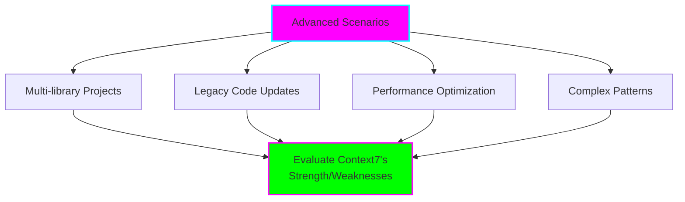

# 📚 Context7 MCP Server Experiment

**Status:** 🧪 Experimental
**Created:** 2025-11-05
**Tech Stack:** Context7 MCP Server, Claude Code/Cursor/VSCode, Node.js
**Goal:** Improve AI coding assistance by providing up-to-date library documentation and persistent context across sessions

---

## 📊 Experiment Overview

**Context7** is a specialized Model Context Protocol (MCP) server by Upstash that revolutionizes AI-assisted coding by solving a critical problem: **outdated documentation**.

Instead of relying on an AI's potentially stale training data, Context7 provides **real-time, version-specific documentation** directly to your AI coding assistant, reducing hallucinations and providing accurate, current code examples.



### Key Benefits

1. **No More Outdated Examples** - Documentation is kept current automatically
2. **Version-Specific Context** - Get docs for the exact version you're using
3. **Reduced Hallucinations** - AI grounded in factual, current information
4. **Persistent Memory** - Context retained across sessions (no re-explaining)
5. **Lower Token Costs** - Efficient context retrieval vs. repeated full context
6. **Multi-Library Support** - Works with any library/framework documentation

---

## 🎯 Experiment Goals & Parameters

### Primary Research Questions



### Experiment Parameters

| Parameter | Value | Why |
|-----------|-------|-----|
| **Duration** | 2 weeks minimum | Enough time to build habits and gather data |
| **Tasks** | 15+ coding tasks | Statistical significance |
| **Comparison** | With vs Without Context7 | A/B testing for real impact |
| **Libraries** | 3-5 libraries (e.g., React, Next.js, Tailwind) | Cover variety of documentation types |
| **AI Tools** | Claude Code, Cursor, or VS Code Copilot | Test with your primary workflow |
| **Metrics** | Accuracy, Speed, Token Usage, Satisfaction | Quantitative + Qualitative |

### Success Criteria

- [ ] Complete 15+ coding tasks across different libraries
- [ ] Document accuracy improvements (% fewer errors)
- [ ] Measure time savings (minutes saved per task)
- [ ] Track hallucination reduction (outdated suggestions)
- [ ] Assess setup complexity (1-10 scale)
- [ ] Evaluate ROI (benefits vs. setup/maintenance cost)
- [ ] Create optimized prompt library for Context7
- [ ] Identify ideal vs. poor use cases

---

## 🏗️ Architecture

### How Context7 Integrates with Your Workflow



### Data Flow

1. **You write code** and ask AI for help
2. **AI recognizes** it needs current library documentation
3. **MCP client** requests documentation from Context7 server
4. **Context7** retrieves up-to-date docs from Upstash KV store
5. **AI receives** accurate, current information
6. **AI generates** code using latest best practices
7. **Context persists** for future questions in the session

---

## 🚀 Setup Instructions

### Prerequisites

- [ ] Node.js 18+ installed
- [ ] npm or yarn package manager
- [ ] AI coding assistant (Claude Code, Cursor, or VS Code with Copilot)
- [ ] Upstash account (free tier available)

### Step 1: Create Upstash Account and Redis Instance

```bash
# 1. Go to https://upstash.com/
# 2. Sign up for free account
# 3. Create a new Redis database (free tier)
# 4. Copy your credentials:
#    - UPSTASH_REDIS_REST_URL
#    - UPSTASH_REDIS_REST_TOKEN
```

### Step 2: Install Context7 MCP Server

```bash
# Install Context7 globally
npm install -g @upstash/context7-mcp-server

# Or use npx (no installation needed)
npx @upstash/context7-mcp-server --help
```

### Step 3: Configure Environment

Create `.env` file in your project or add to your shell profile:

```bash
# Context7 Configuration
UPSTASH_REDIS_REST_URL="https://your-redis-url.upstash.io"
UPSTASH_REDIS_REST_TOKEN="your-token-here"

# Optional: Configure specific libraries to track
CONTEXT7_LIBRARIES="react,nextjs,tailwindcss,typescript"

# Optional: Set cache TTL (in seconds, default 3600)
CONTEXT7_CACHE_TTL=3600
```

### Step 4: Configure Your AI Assistant

#### For Claude Code

Add to your project's `.claude/config.json` or global Claude config:

```json
{
  "mcpServers": {
    "context7": {
      "command": "npx",
      "args": ["-y", "@upstash/context7-mcp-server"],
      "env": {
        "UPSTASH_REDIS_REST_URL": "${UPSTASH_REDIS_REST_URL}",
        "UPSTASH_REDIS_REST_TOKEN": "${UPSTASH_REDIS_REST_TOKEN}"
      }
    }
  }
}
```

#### For Cursor

Add to `~/.cursor/config.json`:

```json
{
  "mcp": {
    "servers": {
      "context7": {
        "command": "npx",
        "args": ["-y", "@upstash/context7-mcp-server"],
        "env": {
          "UPSTASH_REDIS_REST_URL": "your-url",
          "UPSTASH_REDIS_REST_TOKEN": "your-token"
        }
      }
    }
  }
}
```

#### For VS Code with Copilot

Install the MCP extension for VS Code and configure similarly:

```json
// settings.json
{
  "mcp.servers": [
    {
      "name": "context7",
      "command": "npx",
      "args": ["-y", "@upstash/context7-mcp-server"],
      "env": {
        "UPSTASH_REDIS_REST_URL": "your-url",
        "UPSTASH_REDIS_REST_TOKEN": "your-token"
      }
    }
  ]
}
```

### Step 5: Verify Installation

Test that Context7 is working:

```bash
# In your AI assistant, try a prompt like:
"Using the latest React documentation, show me how to use the new
'use' hook for data fetching introduced in React 18."

# Without Context7: Might hallucinate or use outdated patterns
# With Context7: Should reference current documentation accurately
```

---

## 📝 Experiment Methodology

### Phase 1: Baseline (Week 1, Days 1-3)

**Goal:** Establish baseline performance without Context7



**Tasks to Try:**
1. Build a React component using latest hooks
2. Set up Next.js 14 app router project
3. Implement Tailwind arbitrary variants
4. Create TypeScript generic utility types
5. Configure Vite with latest plugins

**Metrics to Record:**
- ⏱️ Time to completion
- ❌ Number of errors/iterations
- 📊 Token usage (if available)
- 🤔 Outdated suggestions count
- 😊 Frustration level (1-10)

### Phase 2: With Context7 (Week 1, Days 4-7)

**Goal:** Repeat similar tasks WITH Context7 enabled



**Tasks to Try:**
1. Build a Vue component using latest Composition API
2. Set up Remix project with latest routing
3. Implement DaisyUI components with Tailwind
4. Create Zod validation schemas
5. Configure Bun with latest features

**Look For:**
- ✅ More accurate suggestions
- 🚀 Faster completion times
- 📚 References to current docs
- 🎯 Version-specific recommendations
- 🧠 Better context retention

### Phase 3: Advanced Usage (Week 2)

**Goal:** Test advanced scenarios and edge cases



**Advanced Tasks:**
1. Migrate project from old to new library version
2. Combine multiple frameworks (React + Three.js)
3. Debug performance issues with current best practices
4. Implement cutting-edge features (React Server Components)
5. Refactor code using latest patterns

---

## 🎤 Optimized Prompts for Context7

### Context-Aware Development Prompts

```
🎯 BEST PRACTICE: Explicitly reference library versions and request latest docs

1. "Using Context7, fetch the latest React 18.3 documentation for the useTransition
   hook and show me a complete example with Suspense boundaries."

2. "Check the current Next.js 14 App Router documentation for data fetching patterns.
   Show me the recommended approach for server-side data fetching with caching."

3. "Query Context7 for the latest Tailwind CSS arbitrary values syntax and create
   a button component using them with hover states."

4. "Reference the most recent TypeScript 5.3 documentation on 'const' type parameters
   and refactor this generic function to use them."

5. "Get the latest Vite 5.0 configuration options for React and set up HMR with
   fast refresh correctly."
```

### Version Migration Prompts

```
6. "Using Context7, compare React 17 vs React 18 documentation for data fetching.
   Show me how to migrate this code from useEffect + fetch to Suspense + use()."

7. "Pull the latest Next.js migration guide from Context7 and help me upgrade
   this Pages Router code to App Router with the current recommended patterns."

8. "Check Context7 for the breaking changes between Tailwind CSS 3.0 and 4.0
   and update my config file accordingly."
```

### Library Comparison Prompts

```
9. "Using Context7, fetch docs for both Zod and Yup's latest versions. Compare
   their TypeScript inference capabilities and recommend which to use for this
   form validation."

10. "Query Context7 for current documentation on Vitest vs Jest. Show me the
    modern setup for component testing with each and compare developer experience."
```

### Debugging with Current Context

```
11. "This error suggests a deprecated API. Check Context7 for the latest docs
    on [library] and tell me what replaced this deprecated method."

12. "The build is failing with [error]. Query Context7 for the latest troubleshooting
    guide for [tool] and walk me through the current solutions."

13. "Performance is poor. Fetch the latest optimization guide from Context7 for
    [library] and suggest modern performance improvements."
```

### Pattern Discovery Prompts

```
14. "Search Context7 for the latest design patterns in React Server Components.
    Show me the current recommended patterns for data fetching and streaming."

15. "Query Context7 for modern state management patterns in 2025. Compare the
    latest approaches (Zustand, Jotai, Signals) with code examples."

16. "Check Context7 for the current best practices around error boundaries in
    React 18+ and implement a modern error handling strategy."
```

### Multi-Library Integration

```
17. "Using Context7, fetch docs for React 18, Three.js, and React Three Fiber.
    Show me how to integrate them using the latest recommended patterns for each."

18. "Query Context7 for Next.js 14 + Prisma 5 + tRPC 11. Show me the current
    recommended architecture for a full-stack TypeScript app."
```

### Documentation Quality Check

```
19. "I wrote this code following an online tutorial. Check Context7 to see if
    this matches current official documentation or if it's using outdated patterns."

20. "This StackOverflow answer is from 2022. Validate it against Context7's
    current documentation and update it if needed."
```

---

## 📏 Metrics & Tracking

### Quantitative Metrics Template

```markdown
## Task: [Task Description]
**Date:** YYYY-MM-DD
**Library:** [e.g., React 18.3]
**Context7:** ✅ Enabled / ❌ Disabled

### Metrics
- ⏱️ **Time:** ___ minutes
- ❌ **Errors:** ___ (code didn't work on first try)
- 🔄 **Iterations:** ___ (times I asked AI for corrections)
- 🪙 **Tokens:** ___ (if measurable)
- 📅 **Outdated Suggestions:** ___ (AI suggested deprecated/old patterns)
- 🎯 **Accuracy:** ___% (subjective, 0-100%)
- 😊 **Satisfaction:** ___/10

### Notes
[What went well, what didn't, specific examples]
```

### Qualitative Observations

Track these patterns in your experiment log:

- **Documentation Age**: Did AI reference current docs?
- **Context Retention**: Did AI remember details across questions?
- **Error Quality**: Were errors related to outdated info?
- **Learning Curve**: Did Context7 add complexity?
- **Token Efficiency**: Did you repeat context less?

### Comparison Dashboard

Create a simple comparison table:

| Metric | Without Context7 | With Context7 | Improvement |
|--------|------------------|---------------|-------------|
| Avg Time (min) | ___ | ___ | ___% |
| Avg Errors | ___ | ___ | ___% |
| Outdated Suggestions | ___ | ___ | ___% |
| Satisfaction | ___/10 | ___/10 | ___% |
| Token Usage | ___ | ___ | ___% |

---

## 🔬 Experiment Log Template

### Session 1: Setup & Verification
**Date:** _________
**Duration:** _________

**Tasks:**
- [ ] Create Upstash account and Redis instance
- [ ] Install Context7 MCP server
- [ ] Configure AI assistant (Claude/Cursor/VSCode)
- [ ] Test with simple verification prompt
- [ ] Confirm Context7 is responding correctly

**Configuration:**
```bash
# Record your actual configuration
UPSTASH_URL=_______________
Context7 Version=___________
AI Tool=___________________
```

**Notes:**

**Issues Encountered:**

---

### Session 2-4: Baseline Tasks (No Context7)
**Date:** _________
**Duration:** _________

**Task 1:** _______________________
- Time: ___ min
- Errors: ___
- Notes:

**Task 2:** _______________________
- Time: ___ min
- Errors: ___
- Notes:

**Task 3:** _______________________
- Time: ___ min
- Errors: ___
- Notes:

**Task 4:** _______________________
- Time: ___ min
- Errors: ___
- Notes:

**Task 5:** _______________________
- Time: ___ min
- Errors: ___
- Notes:

**Baseline Summary:**
- Total time: ___ min
- Total errors: ___
- Outdated suggestions: ___
- Average satisfaction: ___/10

---

### Session 5-8: With Context7 Enabled
**Date:** _________
**Duration:** _________

[Same format as baseline, but with Context7 enabled]

**Context7 Summary:**
- Total time: ___ min (___% improvement)
- Total errors: ___ (___% improvement)
- Outdated suggestions: ___ (___% improvement)
- Average satisfaction: ___/10 (___% improvement)

**Key Observations:**

---

### Session 9-12: Advanced Scenarios
**Date:** _________
**Duration:** _________

**Advanced Task 1:** Multi-library project
[Details]

**Advanced Task 2:** Version migration
[Details]

**Advanced Task 3:** Performance optimization
[Details]

**Advanced Task 4:** Complex pattern implementation
[Details]

**Advanced Task 5:** Debugging with current context
[Details]

---

## 🎓 Expected Learnings

### Questions to Answer

Throughout the experiment, actively seek answers to:

1. **Accuracy**: Does Context7 noticeably reduce outdated suggestions?
2. **Speed**: Am I completing tasks faster with accurate context?
3. **Libraries**: Which libraries benefit most from Context7?
4. **Tasks**: What types of tasks see the biggest improvement?
5. **Setup**: Was the setup complexity worth the benefits?
6. **Cost**: Does Context7 reduce token usage significantly?
7. **Workflow**: Does it integrate smoothly into my workflow?
8. **Limitations**: Where does Context7 struggle or not help?

### Common Pitfalls to Document

- Times when Context7 didn't have docs for a library
- Situations where cached docs were still outdated
- Performance issues with Context7 latency
- Configuration challenges or errors
- Libraries that don't work well with Context7

---

## 🚦 Graduation Criteria

Before graduating or archiving this experiment:

- [ ] Completed 15+ tasks with metrics tracked
- [ ] Documented clear ROI (time/money saved)
- [ ] Created library of optimized prompts
- [ ] Identified 5+ ideal use cases
- [ ] Identified 3+ poor use cases (where Context7 doesn't help)
- [ ] Tested with 3+ different libraries
- [ ] Evaluated token cost savings
- [ ] Created troubleshooting guide
- [ ] Decided: Worth keeping in workflow? (Yes/No + reasoning)
- [ ] Final recommendation: Adopt, Archive, or Graduate to full project

---

## 💡 ADHD-Friendly Tips

### Stay Focused

- ⏱️ **Time-box sessions**: 45 min max, then break
- ✅ **One task at a time**: Don't parallel test multiple things
- 📊 **Visual tracking**: Use checkboxes liberally
- 🎯 **Quick wins first**: Start with simple tasks for momentum

### Maintain Momentum

- 🔔 **Set reminders**: Review experiment log every 2-3 days
- 🎉 **Celebrate progress**: Mark completed tasks immediately
- 📸 **Document immediately**: Don't wait to "write it up later"
- 🚀 **Keep it simple**: Don't over-complicate metrics

### Combat Decision Fatigue

- 📋 **Pre-plan tasks**: List all 15 tasks at the start
- 🎲 **Remove choice**: Do tasks in order, don't pick
- ⏰ **Set deadlines**: "Complete baseline by Friday"
- 🧊 **Batch similar work**: All setup in one session, all testing in another

---

## 📚 Resources

### Official Documentation

- [Context7 by Upstash](https://upstash.com/docs/context7)
- [Model Context Protocol](https://modelcontextprotocol.io/)
- [MCP Servers Repository](https://github.com/modelcontextprotocol/servers)
- [Upstash Redis Documentation](https://upstash.com/docs/redis)

### Comparison Resources

- [Best MCP Servers 2025](https://www.pomerium.com/blog/best-model-context-protocol-mcp-servers-in-2025)
- [MCP FAQ Guide](https://www.marktechpost.com/2025/08/06/model-context-protocol-mcp-faqs/)
- [MCP Specification](https://modelcontextprotocol.io/specification/2025-03-26)

### Related Experiments

- [Goose Documentation Management](../goose-doc-management/) - Another MCP experiment
- [AI Kit Gamified Agents](../ai-kit-gamified-agents/) - AI agent exploration

---

## 🗺️ Next Steps

### Immediate (Today)
1. Create Upstash account
2. Install Context7
3. Configure one AI assistant
4. Run verification test

### This Week
1. Complete baseline tasks (no Context7)
2. Enable Context7
3. Complete comparison tasks
4. Start tracking metrics

### Next Week
1. Advanced scenario testing
2. Compile results
3. Create optimized prompt library
4. Write final conclusions

### Graduation Decision
1. Calculate ROI
2. Decide: Keep using Context7?
3. Document lessons learned
4. Archive or graduate experiment

---

## 💭 Final Notes

### Why This Experiment Matters

AI coding assistants are powerful but limited by their training data. By the time a model is trained, released, and you're using it, library documentation has often changed. Context7 addresses this fundamental problem by providing **real-time, accurate documentation** at the moment you need it.

This experiment will definitively answer: **Is the juice worth the squeeze?**

### Success Looks Like

- You have clear data on whether Context7 improves your workflow
- You've built a library of effective prompts
- You understand which use cases benefit most
- You can confidently recommend (or not) Context7 to others
- You've optimized your AI-assisted coding workflow

### Failure Looks Like

- You abandon the experiment halfway through (motivation loss)
- You don't track metrics consistently (missing data)
- You try too many things at once (confounded variables)
- You don't document learnings (wasted effort)

**Remember**: Even if Context7 doesn't help much, documenting that is valuable! Negative results are still results. 🧪

---

**Last Updated:** 2025-11-05
**Status:** Ready to begin experimentation 🚀
