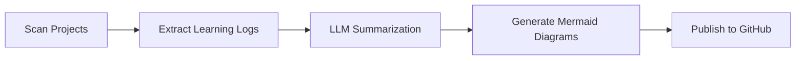

# 📰 Daily Learning Digest Generator

**Status:** 🧪 Experimental | **Tech:** Python + LLM | **Time:** 1 week

## Overview

Automatically consolidate scattered learning notes from all your projects into a beautiful daily digest with visualizations.



## Features

**Auto-Scanning:**
- Parse all README.md files
- Extract "Learning Log" sections
- Detect code changes
- Analyze commit messages

**AI Processing:**
- Summarize key insights
- Generate visual diagrams
- Categorize by topic
- Link related concepts

**Output Formats:**
- Daily markdown digest
- Weekly summary
- Monthly review
- GitHub Discussion post
- Standalone repository

## Quick Start

```bash
cd experiments/daily-learning-digest
uv venv && source .venv/bin/activate
uv pip install -e .

# Generate today's digest
python src/generate.py

# Output: output/digest-2024-01-15.md
```

## Example Output

```markdown
# Learning Digest - 2024-01-15

## Today's Focus
- WebAssembly integration
- Rust error handling
- FastAPI authentication

## Key Insights
- WASM reduces bundle size by 40%
- Result<T, E> forces error handling
- JWT tokens with refresh flow

## Visual Summary
[Mermaid mindmap of concepts]

## Next Steps
- Deep dive into WASM memory management
- Build production auth system
- Benchmark WASM vs JS performance
```

## Graduation Criteria

- [ ] Auto-run daily via GitHub Actions
- [ ] Publish to separate repo
- [ ] RSS feed generation
- [ ] Email digest option
