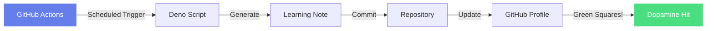
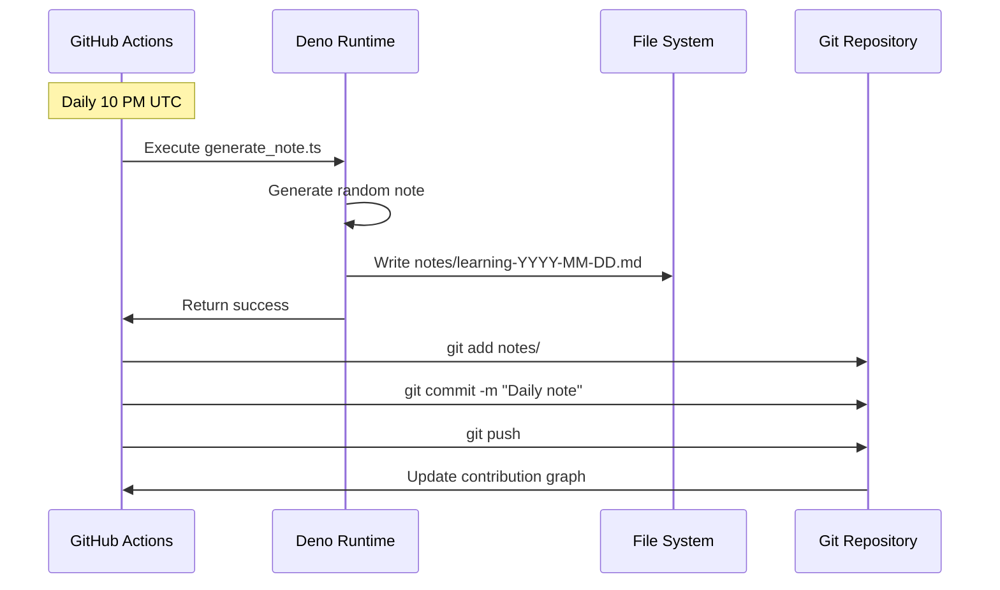
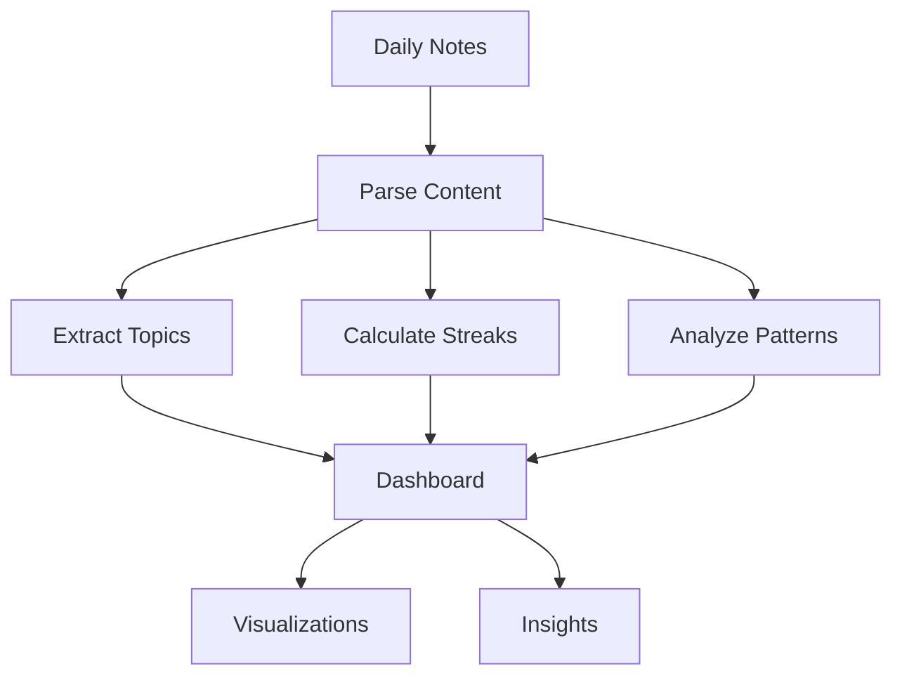

# 📈 GitHub Streak Saver Bot

**Status:** 🧪 Experimental
**Tech Stack:** Deno + GitHub Actions
**Time to Complete:** 4-6 hours
**Learning Focus:** Automation, CI/CD, Deno

## Overview

ADHD-friendly automation that maintains your GitHub contribution streak by automatically committing daily learning notes. No more broken streaks due to forgetfulness!



## Why This Experiment?

- **Streak Motivation:** Green squares = dopamine for ADHD brain
- **Automatic Documentation:** Capture learning without manual effort
- **Pattern Building:** Consistent daily commits build good habits
- **CI/CD Practice:** Learn GitHub Actions in a fun, practical way

## Features

✨ **Auto-Generated Notes**
- Daily markdown learning logs
- Randomized topics for variety
- Mood and focus level tracking
- Weekly summaries

⏰ **Scheduled Execution**
- Runs automatically via GitHub Actions
- Configurable time (default: 10 PM UTC)
- Manual trigger option

📊 **Streak Analytics**
- Track consecutive days
- Visualize learning patterns
- Weekly summary reports

## Architecture



## Environment Setup

This project uses Deno. Configuration is in `deno.json`.

### Prerequisites

```bash
# Install Deno
curl -fsSL https://deno.land/install.sh | sh

# Verify installation
deno --version
```

### Automatic Environment

The `deno.json` file configures:
- ✅ Task runners (`generate`, `test`, `dev`)
- ✅ Import maps for dependencies
- ✅ Strict TypeScript settings
- ✅ Code formatting and linting rules

## How to Run

### Local Testing

```bash
cd experiments/github-streak-saver

# Generate a note manually
deno task generate

# Watch mode (auto-regenerate on file changes)
deno task dev

# Run tests
deno task test

# Check the generated note
cat notes/learning-$(date +%Y-%m-%d).md
```

### GitHub Actions Setup

1. **Copy workflow file:**
   ```bash
   # If running in this repo, it's already set up!
   # Otherwise, copy .github/workflows/daily-note.yml to your repo
   ```

2. **Configure schedule (optional):**
   Edit `.github/workflows/daily-note.yml`:
   ```yaml
   schedule:
     - cron: '0 22 * * *'  # Change time here
   ```

   Cron format: `minute hour day month weekday`
   - `0 22 * * *` = 10 PM UTC daily
   - `0 14 * * *` = 2 PM UTC daily
   - Use [crontab.guru](https://crontab.guru/) to build custom schedules

3. **Enable GitHub Actions:**
   - Go to your repository → Settings → Actions → General
   - Enable "Read and write permissions"
   - Save

4. **Test manual run:**
   - Go to Actions tab
   - Select "Daily Learning Note" workflow
   - Click "Run workflow"

### Customization

**Add your own topics:**

Edit `src/generate_note.ts`:
```typescript
const TOPICS_POOL = [
  "Your custom topic 1",
  "Your custom topic 2",
  // ... add more
];
```

**Change note template:**

Modify the `formatNoteAsMarkdown()` function to match your style.

**Adjust mood tracking:**

Update `MOOD_EMOJIS` array with your preferred emojis.

## Usage Guide

### Daily Flow

1. **Automatic:** GitHub Actions runs at scheduled time
2. **Generate:** Deno script creates a daily note
3. **Commit:** Bot commits and pushes to repository
4. **Celebrate:** Your contribution graph stays green! 🎉

### Manual Notes

You can still create manual notes alongside the automated ones:

```bash
# Generate today's note
deno task generate

# Edit the file to add real content
vim notes/learning-$(date +%Y-%m-%d).md

# Commit manually
git add notes/
git commit -m "Added detailed learning notes"
git push
```

### Weekly Summaries

Every Sunday, the bot generates a weekly summary in `notes/week-N-summary.md`.

## Code Structure

```
github-streak-saver/
├── deno.json                      # Deno configuration
├── .github/
│   └── workflows/
│       └── daily-note.yml        # GitHub Actions workflow
├── src/
│   ├── generate_note.ts          # Main note generator
│   └── generate_note.test.ts     # Tests (to be added)
├── notes/                        # Generated notes (gitignored or committed)
│   ├── learning-2024-01-15.md
│   ├── learning-2024-01-16.md
│   └── week-52-summary.md
└── README.md                     # This file
```

### Key Components

**Note Generator (`src/generate_note.ts`):**
```typescript
interface LearningNote {
  date: string;
  dayOfWeek: string;
  topics: string[];
  insights: string[];
  nextSteps: string[];
  mood: string;
  focusLevel: number;
}
```

**GitHub Actions Workflow:**
- Scheduled trigger (cron)
- Deno environment setup
- Script execution
- Auto-commit and push

## Learning Log

### What You'll Learn

✅ **Deno Runtime**
- Modern JavaScript/TypeScript runtime
- Permission system
- Standard library modules
- Task runners

✅ **GitHub Actions**
- Workflow syntax (YAML)
- Scheduled jobs with cron
- Permissions and secrets
- CI/CD best practices

✅ **Automation Patterns**
- Idempotent scripts
- Error handling
- Git automation
- Content generation

### Challenges Encountered

**Challenge 1: Git Permissions**
- GitHub Actions needs write permissions
- Solution: Set `permissions: contents: write` in workflow
- Alternative: Use PAT token for advanced features

**Challenge 2: Timezone Confusion**
- Cron runs in UTC, not local time
- Solution: Convert desired time to UTC
- Example: 10 PM PST = 6 AM UTC next day

**Challenge 3: Duplicate Commits**
- Running twice a day creates conflicts
- Solution: Check if file exists before generating
- Use `git diff --staged --quiet` to detect changes

### Next Steps

- [ ] Add real learning content parsing from commit messages
- [ ] Integrate with TickTick or Notion for actual learning logs
- [ ] Generate monthly/yearly summaries
- [ ] Add streak statistics visualization
- [ ] Create a web dashboard showing streak history
- [ ] Integration with Obsidian or Logseq
- [ ] AI-powered insights from learning patterns

## Performance Metrics

**Execution Times:**
- Note generation: ~50ms
- Git operations: ~2-3 seconds
- Total workflow: ~30 seconds

**Resource Usage:**
- Deno runtime: ~50 MB memory
- Storage: ~1 KB per note (~365 KB/year)

## Graduation Criteria

Before moving this to its own repository:

- [x] Core auto-commit functionality working
- [x] GitHub Actions integration
- [ ] Unit tests with >70% coverage
- [ ] Multiple template options
- [ ] Streak statistics calculation
- [ ] Web dashboard for visualization
- [ ] Support for multiple repositories
- [ ] Published as a Deno module
- [ ] Used consistently for 30+ days

## Advanced Features (Future)

### Smart Content Generation

Instead of random topics, parse actual activity:
```typescript
// Analyze git commits from the day
const commits = await analyzeGitHistory();
const topics = extractTopicsFromCommits(commits);
```

### Integration with Development Tools

- **IDE Plugin:** Auto-capture learning moments
- **Terminal Integration:** Log insights via CLI
- **MCP Server:** Expose streak data to Claude

### Analytics Dashboard



## Troubleshooting

### Workflow Not Running

1. Check Actions are enabled in repo settings
2. Verify cron syntax is correct
3. Look for errors in Actions tab

### Permission Denied

1. Go to Settings → Actions → General
2. Set to "Read and write permissions"
3. Re-run workflow

### Wrong Timezone

Convert your local time to UTC:
```bash
# Example: 8 PM PST = 4 AM UTC (next day)
# Cron: '0 4 * * *'
```

## Resources

- [Deno Documentation](https://deno.land/manual)
- [GitHub Actions Docs](https://docs.github.com/en/actions)
- [Cron Expression Generator](https://crontab.guru/)
- [Deno Standard Library](https://deno.land/std)

## Contributing Ideas

If you fork this experiment:
- Add integration with actual note-taking apps
- Create browser extension for manual triggers
- Build analytics for learning patterns
- Multi-repository support
- Gamification with achievements

---

**Remember:** The goal is consistency, not perfection. Even an automated note is better than breaking your streak! 🚀

**ADHD Tip:** Use the green squares as visual positive reinforcement. Celebrate each day!
