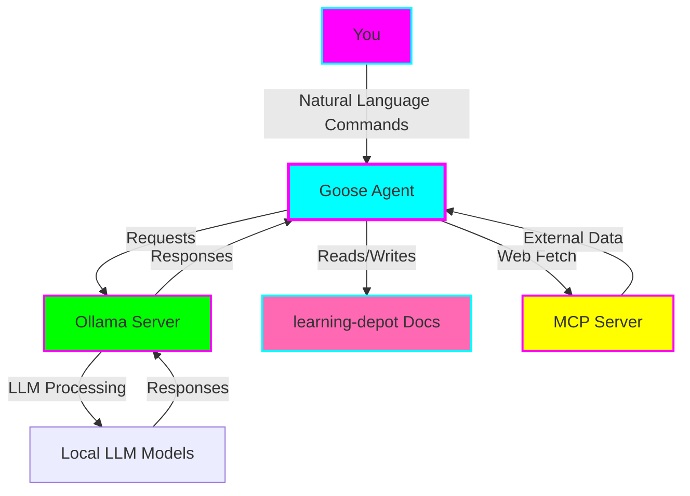
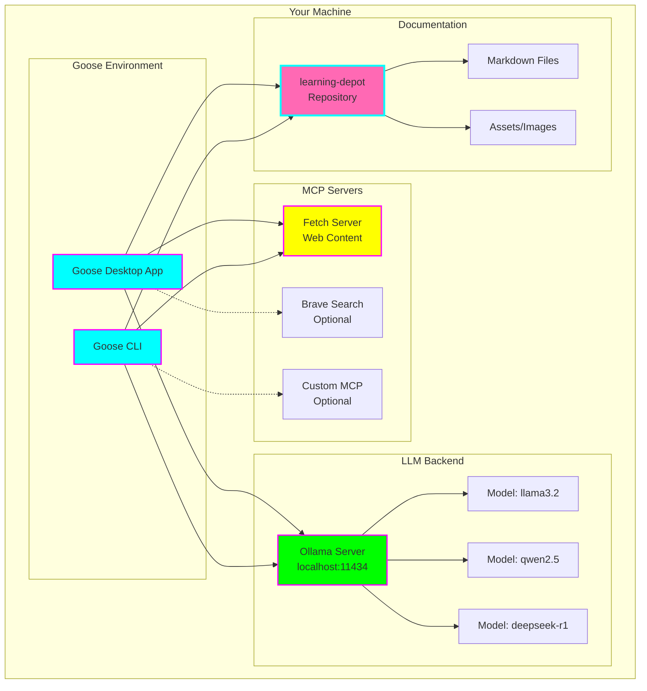
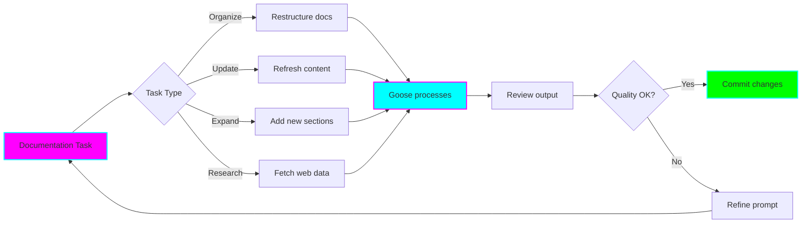

# 🦆 Goose Documentation Management Experiment

**Status:** 🧪 Experimental
**Created:** 2025-11-05
**Tech Stack:** Goose (Desktop + CLI), Ollama, MCP Servers
**Goal:** Experiment with Goose AI agent to manage, process, and update documentation from learning-depot repository

---

## 📊 Experiment Overview

This experiment explores using **Goose** (an on-machine AI agent) with **Ollama** (local LLM server) to manage and enhance documentation workflows. The focus is on testing whether Goose can effectively process, update, and manage documentation stored in a separate `learning-depot` repository.



---

## 🎯 Experiment Goals

### Primary Objectives
- ✅ Connect Goose to local Ollama server
- ✅ Configure MCP server for web fetching capabilities
- ✅ Test documentation management tasks (organize, update, expand)
- ✅ Evaluate Goose's ability to maintain documentation quality
- ✅ Assess workflow efficiency vs. manual documentation

### Success Criteria
- [ ] Successfully configure Goose + Ollama + MCP stack
- [ ] Complete at least 5 documentation tasks
- [ ] Document performance and quality metrics
- [ ] Identify optimal use cases
- [ ] Create reusable workflow patterns

---

## 🏗️ Architecture



---

## 🚀 Setup Instructions

### Prerequisites
- Node.js (for Goose)
- Python (for MCP servers)
- Ollama installed and running
- Git access to learning-depot repository

### Step 1: Install Ollama

```bash
# Install Ollama (Linux/Mac)
curl -fsSL https://ollama.com/install.sh | sh

# Start Ollama server
ollama serve

# Pull recommended models
ollama pull llama3.2
ollama pull qwen2.5-coder
ollama pull deepseek-r1:8b
```

### Step 2: Install Goose

```bash
# Install via npm (CLI)
npm install -g goose-ai

# Or download Goose Desktop from:
# https://github.com/block/goose/releases
```

### Step 3: Configure Goose with Ollama

Create or edit `~/.config/goose/config.yaml`:

```yaml
# Goose Configuration for Ollama
provider: ollama
model: llama3.2
host: http://localhost:11434

# Multi-model configuration (optional)
models:
  - provider: ollama
    model: llama3.2
    temperature: 0.7
  - provider: ollama
    model: qwen2.5-coder
    temperature: 0.3
  - provider: ollama
    model: deepseek-r1:8b
    temperature: 0.5

# MCP Servers
mcp_servers:
  - name: fetch
    path: python
    args: ["-m", "mcp_server_fetch"]
```

### Step 4: Setup MCP Server for Web Fetching

#### Option 1: Official Fetch Server (Recommended)

```bash
# Install the official Fetch MCP server
pip install mcp-server-fetch

# Add to Goose config (already shown above)
```

**Features:**
- ✅ HTML to Markdown conversion
- ✅ Optimized for LLM consumption
- ✅ Official MCP implementation
- ✅ Simple setup

#### Option 2: Brave Search MCP Server

```bash
# Install Brave Search MCP
npm install -g @modelcontextprotocol/server-brave-search

# Requires Brave API key (free tier available)
# Get key from: https://brave.com/search/api/
```

Add to `config.yaml`:
```yaml
mcp_servers:
  - name: brave-search
    command: npx
    args: ["-y", "@modelcontextprotocol/server-brave-search"]
    env:
      BRAVE_API_KEY: "your-api-key-here"
```

**Features:**
- ✅ Real-time web search
- ✅ Current events and updates
- ✅ Privacy-focused
- ⚠️ Requires API key

#### Option 3: Custom MCP Server

Build a custom MCP server for specific needs:

```bash
# Clone MCP server template
git clone https://github.com/modelcontextprotocol/create-server
cd create-server

# Implement custom tools
# - Documentation-specific fetchers
# - Learning-depot integrations
# - Custom markdown processors
```

**Use case:** Tailored specifically for your documentation workflow

---

## 📝 Experiment Tasks



### Task Categories

#### 1. Documentation Organization
- Reorganize file structures
- Create table of contents
- Add consistent headers
- Standardize formatting

#### 2. Content Updates
- Update outdated information
- Refresh code examples
- Add version notes
- Incorporate new learnings

#### 3. Content Expansion
- Fill documentation gaps
- Add examples and diagrams
- Create tutorials
- Write summaries

#### 4. Research Integration
- Fetch latest documentation from official sources
- Compare current docs with upstream changes
- Add external references
- Validate technical accuracy

---

## 🎤 Example Prompts for Goose

### Organization Prompts

```
1. "Scan my learning-depot/docs folder and create a comprehensive index.md
   with categorized links to all documentation files."

2. "Reorganize the scattered notes about [topic] into a single, well-structured
   markdown file with proper headings and sections."

3. "Review all markdown files and ensure they follow consistent formatting:
   - H1 for title
   - H2 for main sections
   - Code blocks with language tags
   - Links in reference style"
```

### Update Prompts

```
4. "Find all references to [deprecated technology] in learning-depot and
   update them to reflect the current best practices for [new technology]."

5. "Review the documentation for [tool/framework] and update version numbers,
   installation commands, and deprecated APIs."

6. "Go through my notes on [topic] and add a 'Last Updated' date stamp and
   'Current Status' section to each file."
```

### Expansion Prompts

```
7. "I have brief notes about [concept] in my learning-depot. Expand them into
   a comprehensive guide with:
   - Overview
   - Key concepts
   - Code examples
   - Common pitfalls
   - Additional resources"

8. "Create a tutorial for [task] based on the scattered notes I have. Include
   step-by-step instructions and explanations for someone learning this."

9. "Add a 'Quick Reference' section to my [topic] documentation with the most
   commonly used commands/patterns."
```

### Research-Enhanced Prompts

```
10. "Fetch the latest documentation for [library/framework] from its official
    website and compare it with my learning-depot notes. Highlight what's
    outdated and suggest updates."

11. "Search for the current best practices for [technique] and enhance my
    existing documentation with the latest recommendations."

12. "Find recent blog posts about [topic] and create a 'Recent Developments'
    section in my learning-depot documentation with summaries and links."

13. "Validate the technical accuracy of my notes on [subject] by checking
    against official documentation and recent articles. Flag any errors."
```

### Batch Processing Prompts

```
14. "Process all markdown files in learning-depot and:
    - Fix broken links
    - Add missing alt text to images
    - Ensure code blocks have language tags
    - Generate a report of changes"

15. "Create a weekly documentation review report showing:
    - Files not updated in 30+ days
    - Files with TODO comments
    - Missing documentation for recent topics
    - Suggested next documentation tasks"
```

---

## 📏 Metrics to Track

### Quantitative Metrics
- **Tasks completed:** ___ / 5 minimum
- **Time saved:** Compare task time vs. manual
- **Error rate:** Documentation errors introduced
- **Edit cycles:** Iterations needed for quality output

### Qualitative Metrics
- **Documentation quality:** Readability, completeness, accuracy
- **Workflow smoothness:** Integration with existing process
- **Learning curve:** Time to productive use
- **Use case fit:** Which tasks work best

---

## 🔬 Experiment Log

### Session 1: Initial Setup
**Date:** _________
**Duration:** _________
**Tasks:**
- [ ] Install Ollama and pull models
- [ ] Install Goose desktop and/or CLI
- [ ] Configure Goose to use Ollama
- [ ] Setup MCP server for web fetching
- [ ] Verify configuration with test prompt

**Notes:**

**Issues:**

---

### Session 2: First Documentation Tasks
**Date:** _________
**Duration:** _________
**Tasks:**
- [ ] Task 1: _____________
- [ ] Task 2: _____________
- [ ] Task 3: _____________

**Prompts Used:**

**Results:**

**Observations:**

---

### Session 3-5: (Add more as needed)

---

## 🎓 Learnings

### What Worked Well
-

### What Didn't Work
-

### Unexpected Discoveries
-

### Optimal Use Cases
-

### Avoid These Use Cases
-

---

## 🚦 Graduation Criteria

Before graduating this experiment to a full project:

- [ ] Successfully completed 10+ documentation tasks
- [ ] Identified 5+ optimal use cases
- [ ] Created reusable prompt templates
- [ ] Documented complete workflow
- [ ] Evaluated ROI (time saved vs. setup/maintenance)
- [ ] Tested with different LLM models
- [ ] Created troubleshooting guide
- [ ] Benchmarked quality metrics

---

## 📚 Resources

### Official Documentation
- [Goose GitHub](https://github.com/block/goose)
- [Goose Documentation](https://block.github.io/goose/)
- [Ollama Documentation](https://ollama.com/docs)
- [Model Context Protocol](https://modelcontextprotocol.io/)
- [MCP Servers Repository](https://github.com/modelcontextprotocol/servers)

### Useful Guides
- [Goose + Ollama Integration Guide](https://block.github.io/goose/blog/2025/03/14/goose-ollama/)
- [MCP Server Examples](https://modelcontextprotocol.io/examples)
- [Best MCP Servers 2025](https://www.pomerium.com/blog/best-model-context-protocol-mcp-servers-in-2025)

### Community
- Goose Discord: [Join community]
- Ollama Discord: [Join community]

---

## 🗺️ Next Steps

### Immediate (This Week)
1. Complete initial setup
2. Run 3-5 test tasks
3. Document first impressions

### Short-term (This Month)
1. Test all prompt categories
2. Compare different MCP server options
3. Experiment with different LLM models
4. Create prompt template library

### Long-term (Graduation)
1. Integrate into regular documentation workflow
2. Build custom MCP server if needed
3. Create automated documentation pipelines
4. Graduate to standalone project or archive learnings

---

## 💭 Reflection Notes

### ADHD-Friendly Tips
- ⏱️ **Time-box sessions:** 30-minute focused sprints
- ✅ **Quick wins first:** Start with simple organization tasks
- 📊 **Visual progress:** Track completed tasks visibly
- 🎯 **One task at a time:** Don't parallel process documentation tasks
- 🔔 **Set reminders:** Review experiment log weekly

### Questions to Answer
- Is Goose faster than manual documentation?
- What's the quality trade-off?
- Which tasks are best automated?
- What tasks require human review?
- Is local LLM performance sufficient?

---

**Last Updated:** 2025-11-05
**Status:** Ready to begin experimentation 🚀
