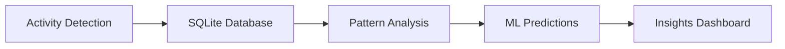

# ⏱️ Hyperfocus Tracker

**Status:** 🧪 Experimental | **Tech:** Python + SQLite | **Time:** 3-5 days

## Overview

Track what triggers your hyperfocus states! Collect data on coding sessions, correlate with external factors, and use ML to predict your best focus times.



## Data Points Tracked

- ⏰ Time of day, day of week
- 🎯 Task type (coding, research, debugging)
- 🎵 Music/ambient sound
- ⏳ Duration of hyperfocus
- 📊 Git activity correlation
- ☕ Caffeine intake (manual log)
- 💤 Sleep quality (manual log)
- 🌡️ Energy level (1-10 scale)

## Features

**Automatic Tracking:**
- Monitor IDE activity
- Git commit patterns
- Keyboard/mouse activity

**Manual Logging:**
- Focus level self-assessment
- Environmental factors
- Mood tracking

**Analytics:**
- Best focus times prediction
- Correlation heatmaps
- Weekly/monthly reports

## Quick Start

```bash
cd experiments/hyperfocus-tracker
uv venv && source .venv/bin/activate
uv pip install -e .

# Start tracking
python src/tracker.py start

# Log focus session
python src/log.py --duration 90 --quality 9 --task coding

# View analytics
python src/analytics.py
```

## Graduation Criteria

- [ ] Track data for 30+ days
- [ ] ML model with >70% prediction accuracy
- [ ] Web dashboard for visualization
- [ ] Mobile companion app
