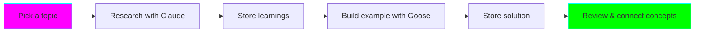

# 🚀 Quick Start Guide - Memory & Knowledge Graph MCP

**Time to setup:** ~15 minutes
**Difficulty:** Beginner-friendly

## TL;DR

```bash
# 1. Run setup
cd experiments/memory-knowledge-graph-learning
./setup.sh

# 2. Configure your primary agent (choose one)
# - Claude Desktop: Copy configs/claude-desktop-config.json to ~/.config/claude/
# - Goose: Copy configs/goose-config.yaml to ~/.config/goose/config.yaml
# - Aider: Copy configs/aider-config.yml to ~/.aider.conf.yml

# 3. Restart your agent and test
# Test prompt: "Store this learning note: Testing MCP integration"
```

## Step-by-Step Setup

### 1. Choose Your Primary Agent

Pick the agent you use most frequently as your starting point:

| Agent | Best For | Setup Difficulty |
|-------|----------|------------------|
| **Claude Code** | Research, design, documentation | Easy |
| **Goose** | Experimentation, local models | Easy |
| **Aider** | Fast code edits, git integration | Medium |
| **Copilot CLI** | Quick terminal assistance | Medium |

### 2. Install Prerequisites

```bash
# Check Node.js (required for MCP servers)
node --version
# Should be v18+

# If not installed:
curl -fsSL https://deb.nodesource.com/setup_lts.x | sudo -E bash -
sudo apt-get install -y nodejs
```

### 3. Run Setup Script

```bash
cd experiments/memory-knowledge-graph-learning
./setup.sh
```

This creates:
- Storage directory: `~/.local/share/ai-memory/`
- Backup of your existing configs
- Sample configuration files

### 4. Configure Your Agent

#### Option A: Claude Desktop (Recommended for beginners)

```bash
# Create config directory if it doesn't exist
mkdir -p ~/.config/claude

# Copy sample config
cp configs/claude-desktop-config.json ~/.config/claude/claude_desktop_config.json

# Edit if needed (optional)
nano ~/.config/claude/claude_desktop_config.json
```

#### Option B: Goose

```bash
# Create config directory
mkdir -p ~/.config/goose

# Copy sample config
cp configs/goose-config.yaml ~/.config/goose/config.yaml

# Important: Edit to set your preferred model
nano ~/.config/goose/config.yaml
# Change 'model:' line to your preferred LLM
```

#### Option C: Aider

```bash
# Copy to home directory
cp configs/aider-config.yml ~/.aider.conf.yml

# Edit to set your API keys and preferences
nano ~/.aider.conf.yml
```

### 5. Test the Setup

#### Test 1: Memory Storage

Open your configured agent and try:

```
Store this learning note: I successfully set up Memory and Knowledge Graph MCPs on [today's date]. These will help me maintain context across different AI agents.
Tags: mcp, setup, memory
```

Expected response: Confirmation that the note was stored.

#### Test 2: Memory Retrieval

```
What have I learned about MCP setup?
```

Expected response: Your previously stored note should be retrieved.

#### Test 3: Knowledge Graph

```
Add concept to knowledge graph:
Name: MCP (Model Context Protocol)
Type: protocol
Description: Protocol for sharing context between AI agents
Difficulty: intermediate
```

```
Link concepts:
From: MCP
To: Memory Server
Relationship: enables
```

### 6. First Real Use Case

Let's try a complete learning workflow:



**Example Topic: "REST API Error Handling"**

**Step 1:** (In Claude Code or your primary agent)
```
I want to learn REST API error handling best practices.
- Store this as my learning goal
- Create initial knowledge graph nodes
- Give me an overview
```

**Step 2:** Store the overview
```
Store these key concepts:
1. HTTP status codes (4xx client errors, 5xx server errors)
2. Error response format standardization
3. Error logging and monitoring
Tags: rest-api, error-handling, best-practices
```

**Step 3:** Build the graph
```
Add these concepts to knowledge graph:
- REST API Error Handling (parent concept)
- HTTP Status Codes (child, prerequisite)
- Error Response Format (child)
- Error Logging (child)

Link them with prerequisite relationships
```

**Step 4:** (Switch to Goose for experimentation)
```
Load my current learning goal about REST API error handling.
Help me build a simple example API with proper error handling.
```

**Step 5:** (Back in Claude for review)
```
Review my REST API error handling learning:
- What did I learn?
- What did I build?
- Update the knowledge graph with practical learnings
```

## Adding More Agents

Once your primary agent works, add others:

```bash
# Configure second agent
cp configs/aider-config.yml ~/.aider.conf.yml

# Test cross-agent context
# In Agent 1: Store a note
# In Agent 2: Retrieve the note
```

## Troubleshooting

### MCP servers not starting

```bash
# Check if storage directory exists
ls -la ~/.local/share/ai-memory/

# Check Node.js version
node --version  # Should be v18+

# Try running MCP server manually
npx -y @modelcontextprotocol/server-memory
```

### Can't retrieve stored memories

```bash
# Check if database exists
ls -la ~/.local/share/ai-memory/memory.db

# If empty or missing, stores haven't worked
# Try explicit storage command:
# "Store in memory: test note"
```

### Config not loading

```bash
# Check config file location
cat ~/.config/claude/claude_desktop_config.json
# OR
cat ~/.config/goose/config.yaml

# Verify JSON/YAML syntax
# Use online validator if unsure
```

## Next Steps

✅ Setup complete? Move on to:

1. **Read the full README.md** - Understand architecture and advanced patterns
2. **Check example-prompts.md** - Copy-paste effective prompts
3. **Start your first learning session** - Pick a topic and go!
4. **Configure additional agents** - Expand your multi-agent setup
5. **Build your knowledge graph** - Connect concepts as you learn

## Quick Reference

| What | Where |
|------|-------|
| Storage location | `~/.local/share/ai-memory/` |
| Memory database | `~/.local/share/ai-memory/memory.db` |
| Knowledge graph | `~/.local/share/ai-memory/knowledge-graph.json` |
| Claude config | `~/.config/claude/claude_desktop_config.json` |
| Goose config | `~/.config/goose/config.yaml` |
| Aider config | `~/.aider.conf.yml` |
| Example prompts | `example-prompts.md` |
| Full documentation | `README.md` |

## Common First-Time Questions

**Q: Do I need to configure all agents at once?**
A: No! Start with one agent, test it, then add others when ready.

**Q: Will this slow down my agents?**
A: Minimal impact. MCP servers are lightweight background processes.

**Q: Can I use different storage locations per agent?**
A: Yes, but not recommended. Using the same storage enables cross-agent context sharing.

**Q: What if I already have agent configs?**
A: The setup script backs them up. Manually merge the MCP sections into your existing configs.

**Q: Do I need internet for this?**
A: Only for initial MCP server installation. After that, works offline (except for LLM API calls).

**Q: Can I use this with local models?**
A: Yes! Goose supports Ollama. MCPs work with any model.

---

**You're ready!** 🎉 Start with a simple test, then dive into your first real learning session. Remember: the goal is accelerated learning through persistent context. Have fun! 🚀
