# 🧠 Memory & Knowledge Graph MCP Learning Accelerator

**Status:** 🧪 Experimental
**Created:** 2025-11-05
**Tech Stack:** MCP Servers (Memory, Knowledge Graph), Multiple AI Agents
**Purpose:** Create persistent context and knowledge connections across multiple AI agents

## The Problem

When using multiple AI agents (Claude Code, Goose, Aider, Copilot CLI, etc.), each conversation starts fresh. You lose:
- Context from previous sessions
- Connections between related concepts
- Learning progress tracking
- Cross-agent knowledge sharing

## The Solution

Use MCP (Model Context Protocol) servers to create a shared memory and knowledge layer:

```mermaid
graph TB
    subgraph "AI Agents Layer"
        A1[Claude Code]
        A2[Goose Desktop]
        A3[Goose CLI + Ollama]
        A4[Aider]
        A5[Copilot CLI]
        A6[Opencode]
    end

    subgraph "MCP Layer - Shared Context"
        M[Memory MCP<br/>💾 Session History<br/>📝 Notes<br/>🎯 Goals]
        K[Knowledge Graph MCP<br/>🔗 Concept Relations<br/>📚 Learning Paths<br/>🧩 Dependencies]
    end

    subgraph "Storage Layer"
        DB1[(Memory DB<br/>SQLite)]
        DB2[(Graph DB<br/>Neo4j/JSON)]
    end

    A1 <-->|Read/Write Context| M
    A2 <-->|Read/Write Context| M
    A3 <-->|Read/Write Context| M
    A4 <-->|Read/Write Context| M
    A5 <-->|Read/Write Context| M
    A6 <-->|Read/Write Context| M

    A1 <-->|Query/Update Graph| K
    A2 <-->|Query/Update Graph| K
    A3 <-->|Query/Update Graph| K
    A4 <-->|Query/Update Graph| K
    A5 <-->|Query/Update Graph| K
    A6 <-->|Query/Update Graph| K

    M -->|Persist| DB1
    K -->|Persist| DB2

    style M fill:#ff00ff,stroke:#00ffff,stroke-width:3px
    style K fill:#00ffff,stroke:#ff00ff,stroke-width:3px
    style DB1 fill:#9370db,stroke:#00ffff
    style DB2 fill:#9370db,stroke:#00ffff
```



## Architecture Components

### 1. Memory MCP Server

**Purpose:** Persistent session memory across all agents

**Capabilities:**
- Store conversation history
- Save code snippets and solutions
- Track learning goals and progress
- Remember user preferences and context
- Create searchable notes

**Data Structure:**
```json
{
  "memories": [
    {
      "id": "mem_001",
      "timestamp": "2025-11-05T10:30:00Z",
      "agent": "claude-code",
      "type": "learning_note",
      "content": "Learned about async/await in Rust - use tokio runtime",
      "tags": ["rust", "async", "concurrency"],
      "related_to": ["concept_rust_tokio", "mem_002"]
    }
  ]
}
```

### 2. Knowledge Graph MCP Server

**Purpose:** Map relationships between concepts you're learning

**Capabilities:**
- Create nodes for concepts, technologies, patterns
- Link related concepts with relationship types
- Track learning dependencies (must learn X before Y)
- Visualize your knowledge map
- Find gaps in understanding

**Graph Structure:**


## Example Workflow: Multi-Agent Learning Session


## Setup Instructions

### Step 1: Install MCP Servers

#### Memory MCP Server
```bash
# Install memory MCP server
npm install -g @modelcontextprotocol/server-memory
# OR with uvx for Python-based
uvx mcp-memory-server
```

#### Knowledge Graph MCP Server
```bash
# Install knowledge graph MCP server
npm install -g @modelcontextprotocol/server-knowledge-graph
# OR
uvx mcp-knowledge-graph
```

### Step 2: Configure Each Agent

#### Claude Code Configuration

Edit `~/.config/claude/claude_desktop_config.json`:

```json
{
  "mcpServers": {
    "memory": {
      "command": "npx",
      "args": ["-y", "@modelcontextprotocol/server-memory"],
      "env": {
        "MEMORY_DB_PATH": "/home/user/.local/share/ai-memory/memory.db"
      }
    },
    "knowledge-graph": {
      "command": "npx",
      "args": ["-y", "@modelcontextprotocol/server-knowledge-graph"],
      "env": {
        "GRAPH_DB_PATH": "/home/user/.local/share/ai-memory/knowledge-graph.json"
      }
    }
  }
}
```

#### Goose Configuration

Edit `~/.config/goose/config.yaml`:

```yaml
mcp_servers:
  - name: memory
    command: npx
    args:
      - "-y"
      - "@modelcontextprotocol/server-memory"
    env:
      MEMORY_DB_PATH: /home/user/.local/share/ai-memory/memory.db

  - name: knowledge-graph
    command: npx
    args:
      - "-y"
      - "@modelcontextprotocol/server-knowledge-graph"
    env:
      GRAPH_DB_PATH: /home/user/.local/share/ai-memory/knowledge-graph.json
```

#### Aider Configuration

Create `~/.aider.conf.yml`:

```yaml
mcp:
  servers:
    memory:
      command: "npx"
      args: ["-y", "@modelcontextprotocol/server-memory"]
      env:
        MEMORY_DB_PATH: "/home/user/.local/share/ai-memory/memory.db"

    knowledge-graph:
      command: "npx"
      args: ["-y", "@modelcontextprotocol/server-knowledge-graph"]
      env:
        GRAPH_DB_PATH: "/home/user/.local/share/ai-memory/knowledge-graph.json"
```

### Step 3: Create Shared Storage Directory

```bash
mkdir -p ~/.local/share/ai-memory
```

### Step 4: Test the Setup

#### Test Memory MCP
```bash
# In Claude Code, Goose, or any agent with MCP support
"Store this learning note: Learned how to use MCP servers for persistent context"

# Later, in a different agent
"What did I learn about MCP servers?"
```

#### Test Knowledge Graph
```bash
# Create a concept
"Add to knowledge graph: MCP (Model Context Protocol) is a protocol for AI context sharing"

# Create relationships
"Link concepts: MCP enables Memory Servers"
"Link concepts: MCP enables Knowledge Graphs"

# Query the graph
"Show me what I know about MCP and its relationships"
```

## Use Cases for Learning Acceleration

### 1. **Technology Deep Dive**


### 2. **Multi-Language Project**

When working on a project using multiple languages:
- **Memory:** Stores solutions, patterns, gotchas per language
- **Graph:** Maps how languages interact (e.g., Python API → Rust service → Go CLI)
- **Benefit:** Any agent can see the full picture

### 3. **Debugging Across Sessions**


### 4. **Learning Path Tracking**

Track your progress on learning goals:

```json
{
  "learning_goal": "Master Rust Web Development",
  "status": "in_progress",
  "completed": [
    "Rust basics",
    "Ownership model",
    "Tokio async runtime"
  ],
  "in_progress": [
    "Axum web framework"
  ],
  "next": [
    "Database integration with SQLx",
    "Authentication & authorization",
    "Deployment strategies"
  ]
}
```

## Advanced Patterns

### Pattern 1: Agent Specialization with Shared Context

```mermaid
graph TB
    subgraph "Specialized Agents"
        A1[Claude Code<br/>📝 Research & Design]
        A2[Aider<br/>⚡ Fast Edits]
        A3[Goose<br/>🧪 Experimentation]
        A4[Copilot<br/>💡 Quick Suggestions]
    end

    subgraph "Shared Knowledge"
        M[Memory MCP]
        K[Knowledge Graph]
    end

    A1 -->|Design decisions| M
    A1 -->|Architecture map| K

    M -->|Context| A2
    K -->|Dependencies| A2

    A2 -->|Code patterns| M

    M -->|Recent changes| A3
    K -->|Related concepts| A3

    A3 -->|Experiment results| M
    A3 -->|New connections| K

    K -->|Relevant patterns| A4
    M -->|Project history| A4

    style M fill:#ff00ff,stroke:#00ffff,stroke-width:3px
    style K fill:#00ffff,stroke:#ff00ff,stroke-width:3px
```



**Workflow:**
1. **Claude Code:** High-level design and architecture → Store in Memory + Map in Graph
2. **Aider:** Quick code changes based on stored decisions
3. **Goose:** Experimental features, stores results
4. **Copilot:** Quick lookups of established patterns

### Pattern 2: Learning Reinforcement Loop


### Pattern 3: Context-Aware Agent Switching

```bash
# Morning: Start research with Claude Code
"I want to learn about event-driven architecture"
# → Memory stores goal
# → Graph creates EDA node

# Afternoon: Switch to Goose for hands-on
"Build a simple event-driven system"
# → Goose reads Memory (knows the learning goal)
# → Goose queries Graph (understands EDA concepts)
# → Builds example with full context

# Evening: Review with Claude Code
"Review my event-driven code from today"
# → Retrieves Goose session from Memory
# → Uses Graph to suggest improvements
# → Stores learnings
```

## Graduation Criteria

This experiment is ready to graduate when:

- [ ] Successfully configured all agents with Memory + Knowledge Graph MCPs
- [ ] Completed 5+ multi-agent learning sessions with persistent context
- [ ] Built a knowledge graph with 50+ concept nodes and relationships
- [ ] Documented 10+ real-world use cases and workflows
- [ ] Created backup/export scripts for Memory and Graph databases
- [ ] Developed prompts library for effective Memory/Graph usage
- [ ] Measured learning acceleration (subjective improvement metric)

## Learning Log

### What I'm Learning

- [ ] How Memory MCP stores and retrieves context
- [ ] How Knowledge Graph MCP maps concept relationships
- [ ] Best practices for agent specialization
- [ ] Effective prompting for memory/graph updates
- [ ] When to use which agent for which task

### Challenges

- To be documented as we encounter them

### Next Steps

1. Set up Memory MCP server
2. Set up Knowledge Graph MCP server
3. Configure Claude Code first
4. Test basic memory storage/retrieval
5. Add Goose configuration
6. Test cross-agent context sharing
7. Build first knowledge graph (pick a learning topic)
8. Document learnings and iterate

## Resources

- [MCP Documentation](https://modelcontextprotocol.io/)
- [Memory MCP Server](https://github.com/modelcontextprotocol/servers/tree/main/src/memory)
- [Knowledge Graph concepts](https://en.wikipedia.org/wiki/Knowledge_graph)
- Local AI Memory storage: `~/.local/share/ai-memory/`

## Quick Commands

```bash
# Check Memory DB
sqlite3 ~/.local/share/ai-memory/memory.db "SELECT * FROM memories LIMIT 5;"

# View Knowledge Graph
cat ~/.local/share/ai-memory/knowledge-graph.json | jq '.nodes | length'

# Backup everything
tar -czf ai-memory-backup-$(date +%Y%m%d).tar.gz ~/.local/share/ai-memory/

# Export knowledge graph as DOT (for visualization)
# (Tool to be created)
```

---

**Remember:** The goal is accelerated learning through persistent context. Start simple, iterate fast! 🚀
