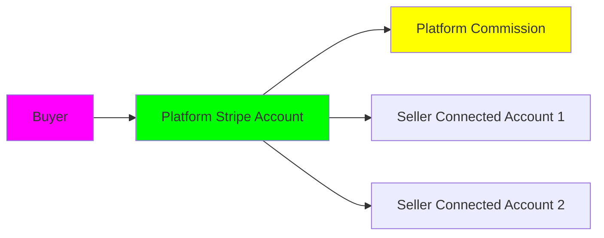

# Clarifications - E-Commerce Platform

## Purpose
This document resolves all ambiguities from the specification phase and documents critical design decisions for the e-commerce platform. Each decision includes the question, options considered, the chosen solution, rationale, and trade-offs.

## Critical Design Decisions

### 1. Microservices Architecture

**Question**: Should we use microservices or a monolithic architecture?

**Options Considered**:
- **Monolith**: Single codebase, shared database
- **Modular Monolith**: Single deployment, modular code structure
- **Microservices**: Separate services for each domain
- **Serverless**: FaaS-based architecture

**Decision**: **Microservices with Event-Driven Communication**

**Rationale**:
- **Scalability**: Each service (catalog, cart, checkout, etc.) scales independently
- **Team Autonomy**: Different teams can own different services
- **Technology Flexibility**: Can use different databases per service (polyglot persistence)
- **Fault Isolation**: Failure in one service doesn't bring down entire platform
- **Deployment Independence**: Deploy services without coordinating releases

**Trade-offs**:
- Increased operational complexity (more services to monitor)
- Network latency between services
- Distributed transaction complexity
- Higher initial development cost

**Service Boundaries**:
```
- api-gateway (entry point, routing, auth)
- user-service (accounts, authentication)
- seller-service (shops, seller profiles)
- catalog-service (products, categories, search)
- cart-service (shopping carts, sessions)
- checkout-service (checkout flow, order creation)
- payment-service (payment processing, Stripe integration)
- order-service (order management, fulfillment)
- inventory-service (stock tracking, reservations)
- shipping-service (shipping calculation, label generation)
- review-service (reviews, ratings)
- notification-service (emails, SMS, push notifications)
- admin-service (admin panel, moderation)
- analytics-service (metrics, reporting)
```

**Documented By**: Architecture planning
**Date**: 2025-11-05

---

### 2. Multi-Currency Strategy

**Question**: How should we handle multiple currencies and exchange rates?

**Options Considered**:
- **Single Currency (USD)**: Simplest, convert at checkout using buyer's bank
- **Display Currency Only**: Show prices in multiple currencies but charge in USD
- **Multi-Currency Support**: Accept payments in different currencies
- **Dynamic Currency Conversion**: Real-time conversion with live rates

**Decision**: **Multi-Currency Support with Daily Rate Updates**

**Rationale**:
- Better buyer experience (no surprise conversion fees from bank)
- Sellers can set prices in their local currency
- Platform can offer competitive exchange rates
- Required for global expansion

**Implementation Details**:
- **Supported Currencies** (v1.0): USD, EUR, GBP, CAD, AUD
- **Base Currency**: USD (all internal calculations)
- **Exchange Rates**: Updated daily from exchangerate-api.com
- **Rate Application**: Rate at time of order creation is locked for that order
- **Seller Payouts**: Sellers receive payouts in their chosen currency
- **Conversion Fees**: 1% markup on exchange rate (revenue stream)

**Pricing Strategy**:
- Sellers set prices in their preferred currency
- Prices converted to other currencies for display
- "Smart rounding" (e.g., $49.99 stays 49.99 EUR, not 45.67 EUR)
- Sellers can override auto-converted prices per currency

**Edge Cases**:
- Exchange rate changes between "add to cart" and checkout: Show updated price before payment
- Refunds: Refund in original currency and amount, even if exchange rate changed

**Documented By**: International expansion planning
**Date**: 2025-11-05

---

### 3. Shipping Calculator

**Question**: Should we build our own shipping calculator or integrate third-party?

**Options Considered**:
- **Third-Party (Shippo/EasyPost)**: Integrate shipping API for real-time rates
- **Custom Calculator**: Build rule-based calculator with seller-defined rates
- **Hybrid**: Use third-party for carrier rates, custom for seller-specific rules
- **Flat Rate**: Sellers set flat shipping rates per zone

**Decision**: **Hybrid Approach (Shippo + Custom Rules)**

**Rationale**:
- Sellers want flexibility (some use flat rates, others want real-time carrier rates)
- Shippo provides real-time rates from USPS, FedEx, UPS, DHL
- Custom rules allow for free shipping thresholds, local pickup, etc.
- Label generation integrated with shipping calculation

**Shipping Options for Sellers**:
1. **Real-Time Carrier Rates**: Connect to Shippo account, offer live rates to buyers
2. **Flat Rate Shipping**: Set fixed rates per shipping zone (domestic, international)
3. **Free Shipping**: Offer free shipping with minimum purchase amount
4. **Local Pickup**: Buyer picks up from seller location (no shipping cost)
5. **Custom Rates**: Table-rate shipping based on weight, price, or quantity

**Buyer Experience**:
- Shipping calculated at checkout based on cart items + destination
- Multiple shipping options shown (economy, standard, express)
- Estimated delivery dates for each option
- Shipping costs aggregated per seller (if multi-seller cart)

**Technical Integration**:
- Shippo SDK for rate fetching and label generation
- Webhook for tracking updates
- Shippo test mode for development/staging

**Cost**:
- Shippo: Free tier (1,000 labels/month), $0.05/label after
- Pass Shippo fee to sellers or absorb as platform cost: **Absorb in MVP, evaluate in v1.0**

**Documented By**: Logistics planning
**Date**: 2025-11-05

---

### 4. Search Engine

**Question**: Which search technology should power product search?

**Options Considered**:
- **PostgreSQL Full-Text Search**: Simple, no additional infrastructure
- **Elasticsearch**: Industry standard, powerful, feature-rich
- **AWS OpenSearch**: Managed Elasticsearch, less operational overhead
- **Algolia**: SaaS, excellent DX, expensive at scale
- **Typesense**: Open-source, typo-tolerant, simpler than Elasticsearch

**Decision**: **Elasticsearch (self-hosted initially, AWS OpenSearch for production)**

**Rationale**:
- **Scalability**: Handles millions of products effortlessly
- **Relevance Tuning**: Advanced scoring, boosting, synonyms
- **Faceted Search**: Built-in aggregations for filters
- **Analytics**: Search analytics and click-through tracking
- **Autocomplete**: Completion suggester for instant results
- **Cost**: Self-hosted is free, AWS OpenSearch scales with usage

**Index Structure**:
```json
{
  "product": {
    "id": "uuid",
    "name": "text with analyzers",
    "description": "text",
    "category": "keyword",
    "tags": ["keyword"],
    "price": "float",
    "currency": "keyword",
    "seller_id": "keyword",
    "seller_name": "keyword",
    "rating": "float",
    "review_count": "integer",
    "created_at": "date",
    "stock": "integer"
  }
}
```

**Search Features**:
- Full-text search with relevance scoring
- Fuzzy matching for typos (edit distance 2)
- Synonym expansion (e.g., "tee" → "t-shirt")
- Autocomplete with instant results
- Faceted filters (category, price, rating, seller)
- Sorting by price, date, popularity, rating
- Search result highlighting
- "Did you mean?" suggestions for zero-result queries

**Sync Strategy**:
- **Event-Driven**: Product changes trigger events consumed by search-sync service
- **Indexing**: New products indexed within 1 minute
- **Re-indexing**: Full re-index nightly to catch any drift
- **Backup**: Daily snapshots of index

**Documented By**: Search architecture
**Date**: 2025-11-05

---

### 5. Image Storage and CDN

**Question**: Where should product images be stored and how should they be served?

**Options Considered**:
- **AWS S3 + CloudFront**: S3 for storage, CloudFront CDN for delivery
- **Cloudinary**: Image management SaaS (storage + transformations + CDN)
- **Imgix**: Image optimization and delivery service
- **Self-Hosted + CloudFlare CDN**: Open-source storage, CloudFlare CDN

**Decision**: **AWS S3 + CloudFront + Image Optimization Lambda@Edge**

**Rationale**:
- **Cost**: S3 is cheapest for storage ($0.023/GB)
- **Scalability**: S3 scales infinitely
- **CDN**: CloudFront global distribution, low latency
- **Transformations**: Lambda@Edge for on-the-fly image resizing
- **Control**: Full control over image pipeline
- **Vendor Independence**: Can migrate to another S3-compatible storage

**Image Pipeline**:
1. **Upload**: Seller uploads image via API
2. **Validation**: Check size (max 10MB), format (JPEG, PNG, WebP), dimensions (max 5000x5000)
3. **Virus Scan**: ClamAV scan for malware
4. **Storage**: Original stored in S3 private bucket
5. **Processing**: Generate thumbnail and medium-size versions
6. **CDN**: Images served via CloudFront with Lambda@Edge transformations
7. **URL Format**: `https://cdn.example.com/{product-id}/{filename}?w=800&h=600&q=85`

**Image Transformations** (via Lambda@Edge):
- Resize (width, height, fit mode)
- Quality compression (optimize file size)
- Format conversion (auto WebP for supported browsers)
- Lazy loading (blur placeholders)

**Access Control**:
- Public products: Images publicly accessible
- Draft products: Signed URLs with expiration
- Deleted products: Images soft-deleted (kept 30 days for recovery)

**Costs** (estimated for 10,000 products with 5 images each):
- S3 storage: ~$1.15/month (50,000 images @ ~1MB each)
- CloudFront: ~$0.085/GB (first 10TB free tier)
- Lambda@Edge: ~$0.60 per 1M requests

**Documented By**: Media architecture
**Date**: 2025-11-05

---

### 6. Email Service Provider

**Question**: Which email service should handle transactional and marketing emails?

**Options Considered**:
- **AWS SES**: Cheapest ($0.10 per 1,000 emails), requires setup
- **SendGrid**: Popular, good DX, $19.95/month for 50k emails
- **Postmark**: Focused on transactional, excellent deliverability, $15/month for 10k
- **Mailgun**: Developer-friendly, $35/month for 50k

**Decision**: **Postmark for Transactional + SendGrid for Marketing**

**Rationale**:
- **Postmark**: Best deliverability for critical emails (order confirmations, password resets)
- **SendGrid**: Better tools for marketing emails (newsletters, promotions)
- **Separation**: Keeps transactional and marketing domains separate (better reputation)
- **Cost**: $15 + $20 = $35/month covers MVP needs

**Transactional Emails** (Postmark):
- Order confirmation
- Shipping notification
- Return confirmation
- Password reset
- Email verification
- Seller approval/rejection
- Payout notification
- Critical alerts

**Marketing Emails** (SendGrid):
- Welcome series
- Abandoned cart recovery
- Product recommendations
- Seller newsletters
- Platform updates
- Promotional campaigns

**Email Templates**:
- MJML for responsive email templates
- Template versioning in git
- Preview environment for testing
- A/B testing for marketing emails

**Deliverability Best Practices**:
- SPF, DKIM, DMARC configured
- Dedicated IP address (when sending > 100k emails/month)
- Monitor bounce and complaint rates
- Unsubscribe link in all marketing emails
- Double opt-in for marketing subscriptions

**Documented By**: Communication infrastructure
**Date**: 2025-11-05

---

### 7. Payment Processing

**Question**: Which payment processor(s) should we integrate?

**Options Considered**:
- **Stripe**: Best DX, comprehensive APIs, 2.9% + $0.30 per transaction
- **PayPal**: High trust, widely used, 3.49% + $0.49
- **Square**: Good for in-person, 2.9% + $0.30
- **Braintree**: Supports PayPal + cards, owned by PayPal

**Decision**: **Stripe as Primary + PayPal + Apple Pay/Google Pay**

**Rationale**:
- **Stripe**: Best API, excellent documentation, strong fraud detection (Stripe Radar)
- **PayPal**: Many buyers prefer PayPal (no card entry), increase conversion
- **Apple Pay/Google Pay**: Fast checkout, mobile convenience, handled by Stripe
- **PCI Compliance**: Stripe handles PCI compliance (Elements for card entry)

**Implementation**:
- **Primary Flow**: Stripe Checkout for card payments
- **PayPal**: Stripe supports PayPal as payment method
- **Apple Pay/Google Pay**: Stripe Payment Request API
- **Saved Cards**: Stripe's Payment Methods API for customer cards
- **Split Payments**: Stripe Connect for multi-seller payouts

**Stripe Connect Architecture**:


- **Connected Accounts**: Each seller has Stripe Connected Account
- **Payment Split**: Platform charges buyer, splits payment to sellers minus commission
- **Payout Schedule**: Sellers receive payouts based on their schedule (daily/weekly/monthly)
- **Refunds**: Platform can refund on behalf of seller

**Fees**:
- Stripe: 2.9% + $0.30 per transaction
- Platform commission: 8% of sale price (covers Stripe fee + platform costs + profit)
- Seller receives: 92% of sale price
- Example: $100 sale → $8 platform, $2.90 Stripe, $89.10 to seller

**Fraud Prevention**:
- Stripe Radar for fraud detection
- 3D Secure (SCA) for European cards
- Address Verification Service (AVS)
- CVC check
- Risk scoring for each transaction

**Documented By**: Payment architecture
**Date**: 2025-11-05

---

### 8. Database Strategy

**Question**: Which database(s) should we use and how should data be distributed?

**Options Considered**:
- **Single PostgreSQL**: Simple, ACID, relational
- **Microservice DB Pattern**: Each service owns its database
- **Polyglot Persistence**: Right database for each use case
- **Event Sourcing**: Store events as source of truth

**Decision**: **Polyglot Persistence with Microservice DB Pattern**

**Database Selection per Service**:

| Service | Database | Rationale |
|---------|----------|-----------|
| user-service | PostgreSQL | Relational user data, ACID for auth |
| seller-service | PostgreSQL | Relational shop data |
| catalog-service | PostgreSQL | Products with complex queries, joins |
| cart-service | Redis | Fast ephemeral data, TTL support |
| checkout-service | PostgreSQL | Transactional integrity critical |
| payment-service | PostgreSQL | Financial data requires ACID |
| order-service | PostgreSQL + Event Store | Orders + event sourcing for audit trail |
| inventory-service | PostgreSQL | Stock requires strong consistency |
| shipping-service | PostgreSQL | Shipping data and tracking |
| review-service | MongoDB | Flexible review schema, read-heavy |
| notification-service | PostgreSQL + Queue | Email queue and history |
| analytics-service | ClickHouse | Column-oriented for fast analytics |

**Data Ownership**:
- Each service owns its data schema
- No direct database access across services
- Communication via APIs or events

**Data Consistency**:
- **Strong Consistency**: Orders, payments, inventory (PostgreSQL transactions)
- **Eventual Consistency**: Product updates, reviews, analytics (event-driven)

**Event Sourcing for Orders**:
- Order events: OrderCreated, OrderConfirmed, OrderShipped, OrderDelivered, OrderCancelled
- Event store preserves complete order history
- Enables audit trail and replaying events
- Current order state derived from event stream

**Cross-Service Queries**:
- Avoid JOIN across services
- Use data duplication where needed (denormalization)
- API composition for aggregated views
- CQRS pattern for read-heavy services (separate read model)

**Backup and Recovery**:
- Automated daily backups (RDS snapshots for PostgreSQL)
- Point-in-time recovery (PITR) enabled
- Cross-region replication for disaster recovery
- 30-day backup retention

**Documented By**: Data architecture
**Date**: 2025-11-05

---

### 9. Commission Structure

**Question**: How should platform commission be calculated and charged?

**Options Considered**:
- **Flat Percentage**: Same rate for all sellers and categories
- **Tiered by Volume**: Lower rate for high-volume sellers
- **Tiered by Category**: Different rates per product category
- **Subscription + Lower Commission**: Monthly fee + reduced commission

**Decision**: **Tiered by Category with Volume Discounts**

**Base Commission Rates** (% of sale price):
| Category | Commission |
|----------|------------|
| Handmade Goods | 8% |
| Art & Collectibles | 10% |
| Electronics | 5% |
| Clothing & Accessories | 12% |
| Home & Living | 8% |
| Digital Products | 15% |

**Volume Discounts** (applied to all categories):
| Monthly Sales (GMV) | Discount |
|---------------------|----------|
| $0 - $5,000 | 0% (base rate) |
| $5,001 - $20,000 | -1% |
| $20,001 - $50,000 | -2% |
| $50,000+ | -3% |

**Example**:
- Seller sells handmade jewelry ($10,000 in sales this month)
- Base commission: 8%
- Volume discount: -1% (over $5,000)
- Final commission: 7%
- Platform fee: $700
- Seller receives: $9,300 (before Stripe fees)

**Rationale**:
- Category-based rates reflect different margins and competition
- Volume discounts incentivize growth and retain successful sellers
- Transparent: Sellers see exact commission on each sale
- Competitive: Lower than Etsy (6.5% + $0.20) for most categories

**Payment Timeline**:
- Commission deducted at point of sale
- Sellers see net amount in dashboard
- Detailed fee breakdown in financial reports

**Documented By**: Business model planning
**Date**: 2025-11-05

---

### 10. Seller Payout Schedule

**Question**: When and how should sellers receive payouts?

**Options Considered**:
- **Instant Payouts**: After order ships (risky for returns)
- **Daily Payouts**: Daily for all sellers
- **Weekly Payouts**: Once per week
- **Monthly Payouts**: Once per month
- **Configurable**: Seller chooses their schedule

**Decision**: **Configurable Payout Schedule with Holding Period**

**Payout Options for Sellers**:
1. **Daily**: Payout every business day (available for sellers with > 50 sales)
2. **Weekly**: Payout every Monday
3. **Bi-Weekly**: Payout every other Monday
4. **Monthly**: Payout on 1st of month

**Holding Period**:
- Orders are held for **7 days** after delivery before payout
- Reason: Protects against returns and chargebacks
- If return initiated within 7 days, payout is held until return resolved
- Sellers notified of "pending payout" vs. "available balance"

**Payout Dashboard**:
- **Pending Balance**: Orders within 7-day holding period
- **Available Balance**: Ready to payout
- **Next Payout Date**: Based on schedule
- **Payout History**: All past payouts with CSV export

**Payout Methods**:
- Bank transfer (ACH in US, SEPA in EU, BACS in UK)
- Stripe Connect handles international payouts
- Payout fee: Free for standard (2-3 business days), $2 for instant (< 24 hours)

**Edge Cases**:
- Partial refunds: Deducted from next payout
- Chargebacks: Deducted from available balance, negative balance must be settled
- Suspended sellers: Payouts held until investigation complete

**Documented By**: Financial operations
**Date**: 2025-11-05

---

### 11. Tax Calculation

**Question**: Should we handle sales tax calculation or integrate third-party?

**Options Considered**:
- **No Tax Handling**: Sellers responsible for their own taxes
- **Manual Entry**: Sellers set tax rates manually
- **Third-Party (TaxJar/Avalara)**: Automated tax calculation
- **Built-In**: Calculate tax based on nexus rules

**Decision**: **Avalara AvaTax Integration (API-based)**

**Rationale**:
- **Complexity**: US has 10,000+ tax jurisdictions with different rates
- **Nexus Rules**: Marketplace facilitator laws require platform to collect tax in many states
- **Compliance**: Avalara stays updated with tax law changes
- **International**: Supports VAT for EU, GST for other countries
- **Reporting**: Provides tax reports for filing

**Implementation**:
- Tax calculated at checkout based on buyer's shipping address
- Avalara API called with cart details (items, quantities, prices, addresses)
- Tax amount added to order total
- Platform responsible for remitting collected tax
- Avalara files returns automatically (premium tier)

**Costs**:
- Avalara AvaTax: $99/month + $0.35 per transaction (first 500 free)
- Alternative: TaxJar $19/month for basic (evaluate based on transaction volume)

**Tax Display**:
- US: Tax added at checkout (not included in product price)
- EU: Tax included in product price (VAT-inclusive pricing)
- Tax breakdown shown in order summary

**Product Tax Classes**:
- Standard (most products)
- Reduced (books, food in some states)
- Zero-rated (exported goods)
- Exempt (specific categories like prescription drugs)

**Documented By**: Tax compliance planning
**Date**: 2025-11-05

---

### 12. Fraud Detection

**Question**: How should we detect and prevent fraud?

**Options Considered**:
- **Stripe Radar Only**: Use Stripe's built-in fraud detection
- **Sift Science**: Third-party fraud platform
- **Custom ML Model**: Build in-house fraud detection
- **Hybrid**: Stripe Radar + custom rules

**Decision**: **Stripe Radar + Custom Rule Engine**

**Stripe Radar**:
- Machine learning model trained on billions of transactions
- Automatic blocking of high-risk payments
- 3D Secure for flagged transactions
- Risk score for each transaction (0-100)

**Custom Rules** (for our specific context):
- **Velocity Checks**:
  - More than 5 orders from same IP in 1 hour → Flag
  - More than 10 failed payment attempts in 1 day → Block
- **Account Behavior**:
  - New account with high-value order (> $500) → Require phone verification
  - Shipping address different from billing + new account → Flag
- **Seller Fraud**:
  - Seller ships to same address repeatedly (drop shipping abuse) → Investigate
  - Seller receives excessive chargebacks (> 1%) → Suspend pending review
- **Review Fraud**:
  - Multiple reviews from same IP → Flag as suspicious
  - Review text similarity across different products → Detect fake reviews

**Actions on Fraud Detection**:
- **Low Risk (0-30)**: Process normally
- **Medium Risk (31-60)**: Require 3D Secure authentication
- **High Risk (61-80)**: Manual review before shipping
- **Very High Risk (81-100)**: Block transaction, refund buyer

**Monitoring**:
- Dashboard with fraud metrics (fraud rate, chargeback rate)
- Alerts for unusual patterns
- Weekly fraud report for ops team

**Documented By**: Security planning
**Date**: 2025-11-05

---

## Assumptions Clarified

### Traffic and Scaling
- **Initial Traffic**: 10,000 monthly active users (MAU) at launch
- **Year 1 Target**: 100,000 MAU
- **Peak Traffic**: 10x average during Black Friday/Cyber Monday
- **Geographic Distribution**: 70% US, 20% EU, 10% other
- **Mobile vs. Desktop**: 60% mobile, 40% desktop

### Operational Assumptions
- **Support Team**: 2-person support team at launch (via email/tickets)
- **Moderation**: Manual moderation initially, automate as volume grows
- **Content Approval**: All new sellers and products reviewed within 24 hours
- **Response Time**: Customer support responds within 24 hours (business days)

### Financial Assumptions
- **Average Order Value (AOV)**: $65
- **Orders per Month**: 1,000 at launch, 10,000 by end of year 1
- **Gross Merchandise Value (GMV)**: $65k/month → $650k/month in year 1
- **Platform Revenue**: 8% commission + payment processing = ~10% of GMV
- **Monthly Revenue Target**: $5k → $65k in year 1

## Constraints Accepted

### Technical Debt
**Acknowledged**:
- Microservices add complexity that may not be needed at MVP scale
- Building for 100k users when starting with 10k is over-engineering

**Mitigation**:
- Start with fewer services, split as needed (catalog + cart can be one service initially)
- Use managed services to reduce ops burden (RDS, ElastiCache, AWS OpenSearch)
- Document decision points for when to split services (e.g., when RPS > 1000)

### Scalability Limits
**Acknowledged**:
- PostgreSQL may struggle with > 10M products without sharding
- Elasticsearch self-hosted requires manual scaling

**Mitigation**:
- Monitor database performance, add read replicas as needed
- Plan to migrate to Aurora PostgreSQL for better scaling
- Use AWS OpenSearch Serverless when reaching limits of self-hosted

### Feature Scope
**Acknowledged**:
- MVP will lack some features buyers expect (wishlists, advanced filtering)
- Mobile app not available at launch (mobile-responsive web only)

**Mitigation**:
- Fast iteration post-launch to add key features
- User feedback drives roadmap priorities
- Mobile web experience must be excellent (90+ Lighthouse score)

## Questions Deferred for Later

### Post-MVP Decisions
1. **Subscription Model**: Should we offer seller subscriptions (monthly fee + lower commission)?
2. **White-Label**: Allow top sellers to use custom domains?
3. **API for Sellers**: Public API for sellers to integrate with other tools?
4. **Seller Financing**: Offer early payouts for a fee?
5. **Advertising Platform**: Sponsored product listings for sellers?
6. **Seller Verification**: Blue checkmark for verified sellers?
7. **Seller Levels**: Gamification with levels and badges?

### Advanced Features
- **Internationalization**: Beyond top 5 currencies, support 20+ currencies?
- **Localization**: Full translations for 10+ languages?
- **B2B Wholesale**: Separate portal for wholesale buyers?
- **Dropshipping**: Allow dropshipping or ban it?
- **Crowdfunding**: Support pre-orders and crowdfunding campaigns?
- **Rental Products**: Support rentals (fashion, equipment)?
- **Personalization**: ML-powered product recommendations?

---

**Last Updated**: 2025-11-05
**Version**: 1.0.0
**Status**: 🧪 Experimental
**Next Review**: After MVP implementation begins
**Total Decisions Documented**: 12 major + multiple minor
**Open Questions Remaining**: 13 (deferred to post-MVP)
