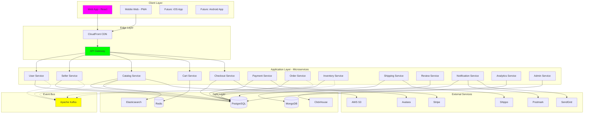
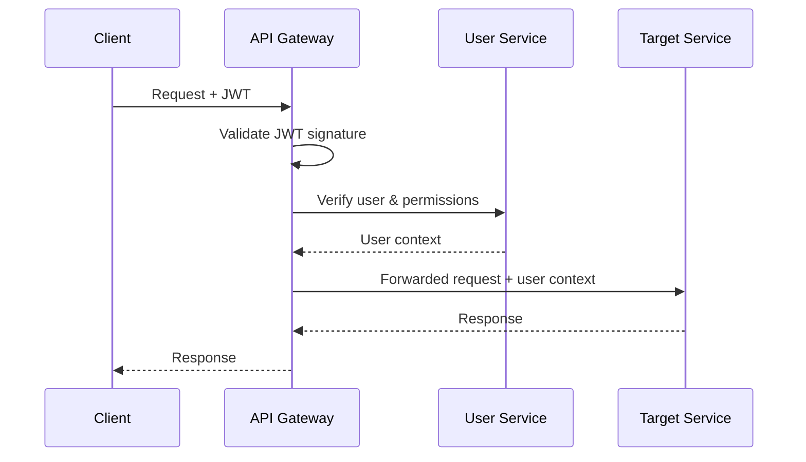
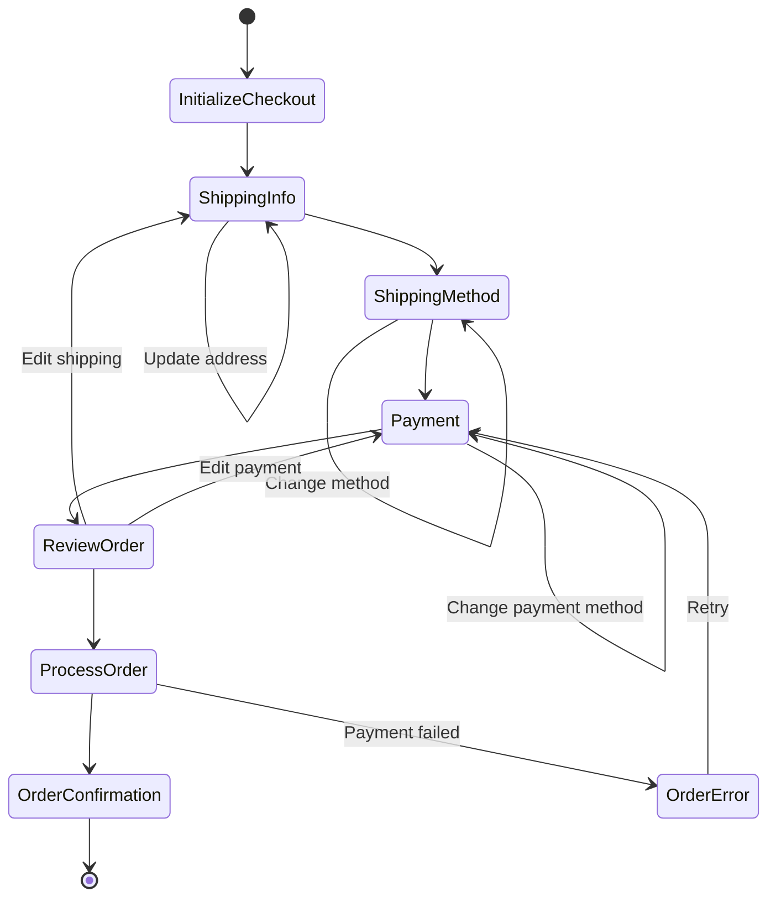
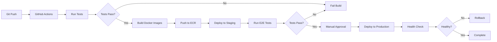

# Plan - E-Commerce Platform

## Purpose
This document provides the comprehensive technical architecture, implementation strategy, and detailed design for the e-commerce platform. It serves as the blueprint for engineering teams to implement the system.

## System Architecture Overview

### High-Level Architecture



## Technology Stack

### Frontend
- **Framework**: React 18 with TypeScript
- **State Management**: Zustand for global state, React Query for server state
- **Routing**: React Router v6
- **Styling**: Tailwind CSS + Headless UI components
- **Forms**: React Hook Form + Zod validation
- **Build Tool**: Vite
- **Testing**: Vitest + React Testing Library + Playwright

### Backend Services
- **Runtime**: Node.js 20 LTS
- **Language**: TypeScript 5.x
- **Framework**: Express.js (REST APIs) + Apollo Server (GraphQL)
- **API Gateway**: Kong or AWS API Gateway
- **Authentication**: Passport.js + JWT
- **ORM**: Prisma (PostgreSQL), Mongoose (MongoDB)
- **Validation**: Zod

### Databases
- **PostgreSQL 16**: Primary relational database
- **MongoDB 7**: Document store for reviews, flexible schemas
- **Redis 7**: Caching, sessions, cart storage
- **Elasticsearch 8**: Product search
- **ClickHouse**: Analytics and reporting

### Infrastructure
- **Cloud Provider**: AWS
- **Container Orchestration**: Amazon ECS with Fargate (serverless containers)
- **CI/CD**: GitHub Actions
- **Infrastructure as Code**: Terraform
- **Monitoring**: Datadog
- **Logging**: AWS CloudWatch + Datadog
- **Tracing**: OpenTelemetry + Datadog APM

### Message Queue
- **Apache Kafka**: Event streaming between services
- **AWS SQS**: Background job queues

## Service Definitions

### 1. API Gateway Service

**Responsibilities**:
- Single entry point for all client requests
- Authentication and authorization
- Rate limiting and throttling
- Request routing to appropriate services
- Response aggregation (for GraphQL)
- API versioning

**Technology**: Kong API Gateway

**Configuration**:
```yaml
routes:
  - name: catalog
    paths: ["/api/v1/products", "/api/v1/categories"]
    service: catalog-service
    plugins:
      - rate-limiting: 100 req/min
      - jwt-auth

  - name: cart
    paths: ["/api/v1/cart"]
    service: cart-service
    plugins:
      - session-auth
      - rate-limiting: 60 req/min
```

**Authentication Flow**:


---

### 2. User Service

**Responsibilities**:
- User registration and authentication
- Profile management
- Address book management
- Saved payment methods
- User preferences
- OAuth integration (Google, Apple)

**Database**: PostgreSQL

**Schema**:
```typescript
model User {
  id            String   @id @default(uuid())
  email         String   @unique
  passwordHash  String?  // null for OAuth users
  firstName     String
  lastName      String
  phone         String?
  avatar        String?
  emailVerified Boolean  @default(false)
  createdAt     DateTime @default(now())
  updatedAt     DateTime @updatedAt

  addresses     Address[]
  paymentMethods PaymentMethod[]
  orders        Order[]
  reviews       Review[]
  wishlists     Wishlist[]
  cart          Cart?
}

model Address {
  id          String  @id @default(uuid())
  userId      String
  label       String  // "Home", "Work", etc.
  firstName   String
  lastName    String
  line1       String
  line2       String?
  city        String
  state       String
  postalCode  String
  country     String
  phone       String
  isDefault   Boolean @default(false)

  user        User @relation(fields: [userId], references: [id])
}

model PaymentMethod {
  id            String  @id @default(uuid())
  userId        String
  type          String  // "card", "paypal"
  stripePaymentMethodId String  // Stripe token
  last4         String
  brand         String  // "visa", "mastercard"
  expiryMonth   Int
  expiryYear    Int
  isDefault     Boolean @default(false)

  user          User @relation(fields: [userId], references: [id])
}
```

**API Endpoints**:
```
POST   /api/v1/auth/register
POST   /api/v1/auth/login
POST   /api/v1/auth/logout
POST   /api/v1/auth/forgot-password
POST   /api/v1/auth/reset-password
GET    /api/v1/users/me
PATCH  /api/v1/users/me
GET    /api/v1/users/me/addresses
POST   /api/v1/users/me/addresses
PATCH  /api/v1/users/me/addresses/:id
DELETE /api/v1/users/me/addresses/:id
```

---

### 3. Seller Service

**Responsibilities**:
- Seller registration and onboarding
- Shop profile management
- Seller verification and approval
- Team member management
- Financial account setup (Stripe Connect)
- Seller analytics and reporting

**Database**: PostgreSQL

**Schema**:
```typescript
model Seller {
  id              String   @id @default(uuid())
  userId          String   @unique  // One-to-one with User
  shopName        String   @unique
  shopSlug        String   @unique
  description     String
  logo            String?
  banner          String?
  status          SellerStatus  @default(PENDING)
  verifiedAt      DateTime?
  createdAt       DateTime @default(now())
  updatedAt       DateTime @updatedAt

  businessInfo    BusinessInfo?
  products        Product[]
  orders          OrderItem[]
  reviews         Review[]
  payouts         Payout[]

  user            User @relation(fields: [userId], references: [id])
}

enum SellerStatus {
  PENDING    // Awaiting approval
  APPROVED   // Active seller
  SUSPENDED  // Temporarily suspended
  BANNED     // Permanently banned
}

model BusinessInfo {
  id              String @id @default(uuid())
  sellerId        String @unique
  businessType    String  // "individual", "llc", "corporation"
  taxId           String  @encrypted  // EIN or SSN
  businessAddress String
  phoneNumber     String
  stripeAccountId String  // Stripe Connect account
  payoutSchedule  String  // "daily", "weekly", "monthly"

  seller          Seller @relation(fields: [sellerId], references: [id])
}
```

**API Endpoints**:
```
POST   /api/v1/sellers/register
GET    /api/v1/sellers/:sellerId
PATCH  /api/v1/sellers/:sellerId
GET    /api/v1/sellers/:sellerId/products
GET    /api/v1/sellers/:sellerId/analytics
POST   /api/v1/sellers/:sellerId/team-members
```

---

### 4. Catalog Service

**Responsibilities**:
- Product CRUD operations
- Category and tag management
- Product search (Elasticsearch integration)
- Product recommendations
- Inventory synchronization

**Database**: PostgreSQL + Elasticsearch

**Schema**:
```typescript
model Product {
  id            String   @id @default(uuid())
  sellerId      String
  name          String
  slug          String   @unique
  description   String
  categoryId    String
  tags          String[]
  status        ProductStatus @default(DRAFT)
  createdAt     DateTime @default(now())
  updatedAt     DateTime @updatedAt
  publishedAt   DateTime?

  pricing       Pricing
  inventory     Inventory
  variants      Variant[]
  media         Media[]
  seo           SEO?

  seller        Seller @relation(fields: [sellerId], references: [id])
  category      Category @relation(fields: [categoryId], references: [id])
  reviews       Review[]
}

enum ProductStatus {
  DRAFT
  PUBLISHED
  ARCHIVED
}

model Pricing {
  id             String @id @default(uuid())
  productId      String @unique
  basePrice      Decimal
  compareAtPrice Decimal?
  currency       String @default("USD")
  costPerItem    Decimal?
  taxable        Boolean @default(true)
  taxClass       String @default("standard")

  product        Product @relation(fields: [productId], references: [id])
}

model Inventory {
  id                String @id @default(uuid())
  productId         String @unique
  sku               String @unique
  quantity          Int
  lowStockThreshold Int @default(10)
  trackQuantity     Boolean @default(true)
  allowBackorder    Boolean @default(false)
  weight            Decimal?
  weightUnit        String @default("lb")

  product           Product @relation(fields: [productId], references: [id])
}

model Variant {
  id          String @id @default(uuid())
  productId   String
  option1     String  // e.g., "Size: Large"
  option2     String?
  option3     String?
  sku         String @unique
  price       Decimal?  // Overrides base price
  quantity    Int
  imageUrl    String?

  product     Product @relation(fields: [productId], references: [id])
}

model Category {
  id          String @id @default(uuid())
  name        String
  slug        String @unique
  parentId    String?  // Self-referential for hierarchy
  description String?
  imageUrl    String?

  parent      Category? @relation("CategoryHierarchy", fields: [parentId], references: [id])
  children    Category[] @relation("CategoryHierarchy")
  products    Product[]
}
```

**Elasticsearch Index**:
```json
{
  "mappings": {
    "properties": {
      "id": { "type": "keyword" },
      "name": {
        "type": "text",
        "analyzer": "standard",
        "fields": {
          "keyword": { "type": "keyword" },
          "autocomplete": { "type": "search_as_you_type" }
        }
      },
      "description": { "type": "text" },
      "category": {
        "type": "nested",
        "properties": {
          "id": { "type": "keyword" },
          "name": { "type": "keyword" }
        }
      },
      "tags": { "type": "keyword" },
      "price": { "type": "scaled_float", "scaling_factor": 100 },
      "currency": { "type": "keyword" },
      "seller": {
        "type": "nested",
        "properties": {
          "id": { "type": "keyword" },
          "name": { "type": "text" },
          "rating": { "type": "float" }
        }
      },
      "rating": { "type": "float" },
      "reviewCount": { "type": "integer" },
      "stock": { "type": "integer" },
      "createdAt": { "type": "date" },
      "updatedAt": { "type": "date" }
    }
  }
}
```

**API Endpoints**:
```
GET    /api/v1/products              # Search & filter
GET    /api/v1/products/:id
POST   /api/v1/products              # Seller creates product
PATCH  /api/v1/products/:id
DELETE /api/v1/products/:id
GET    /api/v1/categories
GET    /api/v1/categories/:id/products
POST   /api/v1/products/:id/publish
POST   /api/v1/products/:id/archive
```

**Search Implementation**:
```typescript
async function searchProducts(query: string, filters: SearchFilters) {
  const esQuery = {
    query: {
      bool: {
        must: [
          {
            multi_match: {
              query,
              fields: ["name^3", "description", "tags^2"],
              fuzziness: "AUTO"
            }
          }
        ],
        filter: [
          { term: { status: "PUBLISHED" } },
          { range: { stock: { gte: 1 } } }
        ]
      }
    },
    aggs: {
      categories: { terms: { field: "category.id" } },
      price_ranges: {
        range: {
          field: "price",
          ranges: [
            { to: 25 },
            { from: 25, to: 50 },
            { from: 50, to: 100 },
            { from: 100 }
          ]
        }
      }
    },
    sort: [
      { _score: { order: "desc" } },
      { rating: { order: "desc" } }
    ]
  };

  // Apply filters
  if (filters.categoryId) {
    esQuery.query.bool.filter.push({
      term: { "category.id": filters.categoryId }
    });
  }

  if (filters.priceMin || filters.priceMax) {
    esQuery.query.bool.filter.push({
      range: {
        price: {
          gte: filters.priceMin,
          lte: filters.priceMax
        }
      }
    });
  }

  return await esClient.search({ index: "products", body: esQuery });
}
```

---

### 5. Cart Service

**Responsibilities**:
- Cart management (add, update, remove items)
- Cart persistence (anonymous and authenticated)
- Cart validation (stock availability, price changes)
- Cart merging on login

**Database**: Redis (primary), PostgreSQL (backup)

**Data Structure** (Redis):
```json
{
  "cart:{userId or sessionId}": {
    "items": [
      {
        "productId": "uuid",
        "variantId": "uuid",
        "quantity": 2,
        "price": 49.99,
        "addedAt": "2025-11-05T10:00:00Z"
      }
    ],
    "updatedAt": "2025-11-05T10:30:00Z",
    "expiresAt": "2025-12-05T10:00:00Z"
  }
}
```

**TTL**:
- Anonymous carts: 7 days
- Authenticated carts: 30 days

**API Endpoints**:
```
GET    /api/v1/cart
POST   /api/v1/cart/items
PATCH  /api/v1/cart/items/:itemId
DELETE /api/v1/cart/items/:itemId
DELETE /api/v1/cart
POST   /api/v1/cart/validate
```

**Cart Validation**:
```typescript
async function validateCart(cart: Cart) {
  const issues = [];

  for (const item of cart.items) {
    const product = await catalogService.getProduct(item.productId);

    // Check stock
    if (product.inventory.quantity < item.quantity) {
      issues.push({
        itemId: item.id,
        issue: "OUT_OF_STOCK",
        message: `Only ${product.inventory.quantity} available`
      });
    }

    // Check price change
    if (product.pricing.basePrice !== item.price) {
      issues.push({
        itemId: item.id,
        issue: "PRICE_CHANGED",
        oldPrice: item.price,
        newPrice: product.pricing.basePrice
      });
    }

    // Check product still published
    if (product.status !== "PUBLISHED") {
      issues.push({
        itemId: item.id,
        issue: "PRODUCT_UNAVAILABLE",
        message: "Product is no longer available"
      });
    }
  }

  return issues;
}
```

---

### 6. Checkout Service

**Responsibilities**:
- Checkout session management
- Shipping address validation
- Shipping rate calculation (Shippo integration)
- Tax calculation (Avalara integration)
- Order creation coordination
- Payment initiation

**Database**: PostgreSQL

**Checkout Flow State Machine**:


**Schema**:
```typescript
model CheckoutSession {
  id              String @id @default(uuid())
  userId          String?
  sessionId       String  // For anonymous users
  cartSnapshot    Json
  shippingAddress Json?
  billingAddress  Json?
  shippingMethod  Json?
  paymentMethod   Json?
  subtotal        Decimal
  shippingCost    Decimal @default(0)
  taxAmount       Decimal @default(0)
  total           Decimal
  expiresAt       DateTime
  createdAt       DateTime @default(now())
  updatedAt       DateTime @updatedAt

  orderId         String?  // Set when order created
  order           Order? @relation(fields: [orderId], references: [id])
}
```

**API Endpoints**:
```
POST   /api/v1/checkout/init
POST   /api/v1/checkout/:sessionId/shipping-address
POST   /api/v1/checkout/:sessionId/shipping-method
GET    /api/v1/checkout/:sessionId/shipping-rates
POST   /api/v1/checkout/:sessionId/payment-method
GET    /api/v1/checkout/:sessionId/summary
POST   /api/v1/checkout/:sessionId/complete
```

**Tax Calculation Integration**:
```typescript
async function calculateTax(checkout: CheckoutSession) {
  const avalaraRequest = {
    type: "SalesInvoice",
    companyCode: "DEFAULT",
    date: new Date().toISOString(),
    customerCode: checkout.userId || checkout.sessionId,
    addresses: {
      shipFrom: {
        // Platform address or seller warehouse
        line1: "123 Platform St",
        city: "Seattle",
        region: "WA",
        country: "US",
        postalCode: "98101"
      },
      shipTo: checkout.shippingAddress
    },
    lines: checkout.cartSnapshot.items.map((item, index) => ({
      number: index + 1,
      quantity: item.quantity,
      amount: item.price * item.quantity,
      taxCode: item.taxClass,
      itemCode: item.sku,
      description: item.name
    }))
  };

  const taxResult = await avalaraClient.createTransaction(avalaraRequest);
  return taxResult.totalTax;
}
```

---

### 7. Order Service

**Responsibilities**:
- Order creation and management
- Order status tracking
- Order fulfillment workflow
- Return and refund processing
- Event sourcing for order history

**Database**: PostgreSQL + Event Store

**Schema**:
```typescript
model Order {
  id                String @id @default(uuid())
  orderNumber       String @unique  // Human-readable (e.g., "ORD-2025-001234")
  userId            String
  status            OrderStatus @default(PENDING)
  subtotal          Decimal
  shippingCost      Decimal
  taxAmount         Decimal
  total             Decimal
  currency          String @default("USD")
  shippingAddress   Json
  billingAddress    Json
  createdAt         DateTime @default(now())
  updatedAt         DateTime @updatedAt

  user              User @relation(fields: [userId], references: [id])
  items             OrderItem[]
  payments          Payment[]
  shipments         Shipment[]
  events            OrderEvent[]
  refunds           Refund[]
}

enum OrderStatus {
  PENDING          // Payment being processed
  CONFIRMED        // Payment successful
  PROCESSING       // Being prepared for shipment
  SHIPPED          // All items shipped
  DELIVERED        // Confirmed delivered
  COMPLETED        // Past return window
  CANCELLED        // Order cancelled
  REFUNDED         // Fully refunded
}

model OrderItem {
  id            String @id @default(uuid())
  orderId       String
  sellerId      String
  productId     String
  variantId     String?
  name          String
  sku           String
  quantity      Int
  price         Decimal  // Price at time of order
  subtotal      Decimal
  status        OrderItemStatus @default(PENDING)

  order         Order @relation(fields: [orderId], references: [id])
  seller        Seller @relation(fields: [sellerId], references: [id])
  shipment      Shipment?
}

enum OrderItemStatus {
  PENDING
  CONFIRMED
  PROCESSING
  SHIPPED
  DELIVERED
  CANCELLED
  RETURNED
}

model OrderEvent {
  id          String @id @default(uuid())
  orderId     String
  type        String  // "CREATED", "PAYMENT_CONFIRMED", "SHIPPED", etc.
  payload     Json
  createdAt   DateTime @default(now())
  createdBy   String?  // User or system that triggered event

  order       Order @relation(fields: [orderId], references: [id])
}
```

**Event Sourcing**:
```typescript
// Order events as source of truth
type OrderEvent =
  | { type: "ORDER_CREATED"; payload: OrderData }
  | { type: "PAYMENT_AUTHORIZED"; payload: PaymentData }
  | { type: "PAYMENT_CONFIRMED"; payload: PaymentData }
  | { type: "ITEM_SHIPPED"; payload: ShipmentData }
  | { type: "ORDER_DELIVERED"; payload: DeliveryData }
  | { type: "RETURN_REQUESTED"; payload: ReturnData }
  | { type: "REFUND_ISSUED"; payload: RefundData };

// Rebuild order state from events
function replayOrderEvents(events: OrderEvent[]): OrderState {
  return events.reduce((state, event) => {
    switch (event.type) {
      case "ORDER_CREATED":
        return { ...event.payload, status: "PENDING" };
      case "PAYMENT_CONFIRMED":
        return { ...state, status: "CONFIRMED" };
      case "ITEM_SHIPPED":
        return { ...state, status: "SHIPPED" };
      // ... other event handlers
      default:
        return state;
    }
  }, {} as OrderState);
}
```

**API Endpoints**:
```
POST   /api/v1/orders
GET    /api/v1/orders/:id
GET    /api/v1/orders              # List user's orders
PATCH  /api/v1/orders/:id/cancel
POST   /api/v1/orders/:id/return
GET    /api/v1/orders/:id/tracking
```

---

### 8. Payment Service

**Responsibilities**:
- Payment processing via Stripe
- Stripe Connect account management for sellers
- Payment split to multiple sellers
- Refund processing
- Payout management

**Database**: PostgreSQL

**Schema**:
```typescript
model Payment {
  id                    String @id @default(uuid())
  orderId               String
  amount                Decimal
  currency              String
  status                PaymentStatus
  stripePaymentIntentId String @unique
  paymentMethodId       String
  failureReason         String?
  createdAt             DateTime @default(now())
  updatedAt             DateTime @updatedAt

  order                 Order @relation(fields: [orderId], references: [id])
  transfers             Transfer[]
}

enum PaymentStatus {
  PENDING
  AUTHORIZED
  CONFIRMED
  FAILED
  REFUNDED
}

model Transfer {
  id                  String @id @default(uuid())
  paymentId           String
  sellerId            String
  amount              Decimal
  platformCommission  Decimal
  stripeTransferId    String
  status              TransferStatus
  createdAt           DateTime @default(now())

  payment             Payment @relation(fields: [paymentId], references: [id])
  seller              Seller @relation(fields: [sellerId], references: [id])
}

model Payout {
  id                String @id @default(uuid())
  sellerId          String
  amount            Decimal
  currency          String
  status            PayoutStatus
  stripePayoutId    String
  arrivalDate       DateTime?
  createdAt         DateTime @default(now())

  seller            Seller @relation(fields: [sellerId], references: [id])
}
```

**Payment Flow**:
```typescript
async function processOrder(checkout: CheckoutSession) {
  // 1. Create Stripe Payment Intent
  const paymentIntent = await stripe.paymentIntents.create({
    amount: checkout.total * 100,  // Convert to cents
    currency: checkout.currency,
    payment_method: checkout.paymentMethod.stripePaymentMethodId,
    confirm: true,
    capture_method: "manual",  // Authorize but don't capture yet
    application_fee_amount: calculatePlatformFee(checkout),
    transfer_data: {
      destination: sellerStripeAccountId
    }
  });

  // 2. Create order if payment authorized
  if (paymentIntent.status === "requires_capture") {
    const order = await createOrder(checkout, paymentIntent.id);

    // 3. Capture payment after inventory reserved
    await stripe.paymentIntents.capture(paymentIntent.id);

    // 4. Create transfers to sellers
    await createSellerTransfers(order, paymentIntent);

    return order;
  } else {
    throw new Error("Payment authorization failed");
  }
}

function calculatePlatformFee(checkout: CheckoutSession) {
  // 8% commission on items
  const commission = checkout.subtotal * 0.08;
  return Math.round(commission * 100);  // Convert to cents
}
```

---

## Event-Driven Architecture

### Kafka Topics

```yaml
topics:
  - name: user-events
    partitions: 3
    events: [UserRegistered, UserUpdated, UserDeleted]

  - name: product-events
    partitions: 6
    events: [ProductCreated, ProductUpdated, ProductPublished, ProductArchived]

  - name: order-events
    partitions: 12
    events: [OrderCreated, OrderConfirmed, OrderShipped, OrderDelivered, OrderCancelled]

  - name: inventory-events
    partitions: 6
    events: [InventoryReserved, InventoryReleased, StockUpdated]

  - name: payment-events
    partitions: 6
    events: [PaymentAuthorized, PaymentConfirmed, PaymentFailed, RefundIssued]
```

### Event Schema (Example)

```typescript
interface OrderCreatedEvent {
  type: "OrderCreated";
  version: "1.0";
  timestamp: string;  // ISO 8601
  correlationId: string;  // Trace across services
  payload: {
    orderId: string;
    userId: string;
    items: Array<{
      productId: string;
      sellerId: string;
      quantity: number;
      price: number;
    }>;
    total: number;
    shippingAddress: Address;
  };
}
```

### Event Consumers

```typescript
// Inventory Service consumes OrderCreated to reserve stock
kafkaConsumer.on("OrderCreated", async (event) => {
  for (const item of event.payload.items) {
    await reserveInventory({
      productId: item.productId,
      quantity: item.quantity,
      orderId: event.payload.orderId
    });
  }
});

// Notification Service consumes OrderCreated to send confirmation email
kafkaConsumer.on("OrderCreated", async (event) => {
  await sendOrderConfirmationEmail({
    userId: event.payload.userId,
    orderId: event.payload.orderId,
    ...event.payload
  });
});

// Analytics Service consumes all events for reporting
kafkaConsumer.on("*", async (event) => {
  await storeEventForAnalytics(event);
});
```

## Frontend Architecture

### React Application Structure

```
web-app/
├── src/
│   ├── app/
│   │   ├── App.tsx
│   │   ├── routes.tsx
│   │   └── providers.tsx
│   │
│   ├── features/
│   │   ├── auth/
│   │   │   ├── components/
│   │   │   ├── hooks/
│   │   │   ├── api/
│   │   │   └── stores/
│   │   │
│   │   ├── catalog/
│   │   │   ├── components/
│   │   │   │   ├── ProductCard.tsx
│   │   │   │   ├── ProductDetail.tsx
│   │   │   │   └── ProductSearch.tsx
│   │   │   ├── hooks/
│   │   │   │   └── useProducts.ts
│   │   │   └── api/
│   │   │       └── productsApi.ts
│   │   │
│   │   ├── cart/
│   │   ├── checkout/
│   │   ├── orders/
│   │   └── seller/
│   │
│   ├── shared/
│   │   ├── components/
│   │   │   ├── Button.tsx
│   │   │   ├── Input.tsx
│   │   │   ├── Modal.tsx
│   │   │   └── Layout.tsx
│   │   ├── hooks/
│   │   ├── utils/
│   │   └── types/
│   │
│   ├── config/
│   │   ├── api.ts
│   │   └── constants.ts
│   │
│   └── main.tsx
│
├── public/
├── package.json
├── vite.config.ts
└── tsconfig.json
```

### State Management Strategy

```typescript
// Zustand for global UI state
import create from "zustand";

interface UIStore {
  sidebarOpen: boolean;
  theme: "light" | "dark";
  toggleSidebar: () => void;
  setTheme: (theme: "light" | "dark") => void;
}

export const useUIStore = create<UIStore>((set) => ({
  sidebarOpen: false,
  theme: "light",
  toggleSidebar: () => set((state) => ({ sidebarOpen: !state.sidebarOpen })),
  setTheme: (theme) => set({ theme })
}));

// React Query for server state
import { useQuery, useMutation } from "@tanstack/react-query";

function useProducts(filters: ProductFilters) {
  return useQuery({
    queryKey: ["products", filters],
    queryFn: () => api.products.search(filters),
    staleTime: 5 * 60 * 1000,  // 5 minutes
    cacheTime: 10 * 60 * 1000  // 10 minutes
  });
}

function useAddToCart() {
  const queryClient = useQueryClient();

  return useMutation({
    mutationFn: (item: CartItem) => api.cart.addItem(item),
    onSuccess: () => {
      queryClient.invalidateQueries(["cart"]);
    }
  });
}
```

## Deployment Architecture

### AWS Infrastructure

```
VPC (10.0.0.0/16)
├── Public Subnets (NAT, Load Balancers)
│   ├── 10.0.1.0/24 (us-east-1a)
│   └── 10.0.2.0/24 (us-east-1b)
│
├── Private Subnets (Application)
│   ├── 10.0.11.0/24 (us-east-1a)
│   └── 10.0.12.0/24 (us-east-1b)
│
└── Database Subnets
    ├── 10.0.21.0/24 (us-east-1a)
    └── 10.0.22.0/24 (us-east-1b)
```

### ECS Services

```yaml
services:
  - name: api-gateway
    cpu: 512
    memory: 1024
    desired_count: 2
    autoscaling:
      min: 2
      max: 10
      target_cpu: 70%

  - name: catalog-service
    cpu: 256
    memory: 512
    desired_count: 3
    autoscaling:
      min: 2
      max: 20
      target_cpu: 75%

  # ... other services
```

### CI/CD Pipeline



---

**Last Updated**: 2025-11-05
**Version**: 1.0.0
**Status**: 🧪 Experimental
**Estimated LOC**: ~150,000 lines
**Estimated Development Time**: 12-18 months with 6-person team
**Infrastructure Cost** (estimated monthly): $2,000-5,000 at 10k MAU
