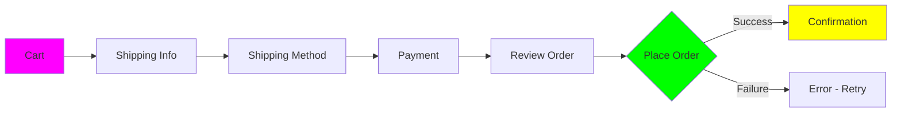
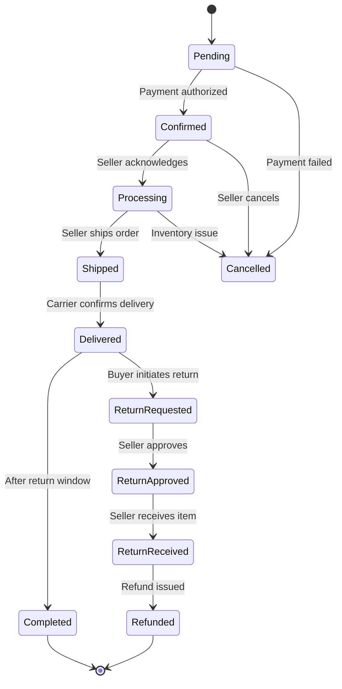
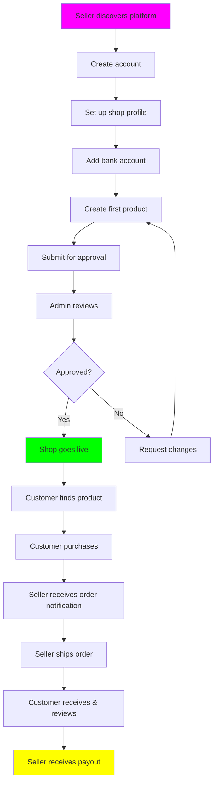
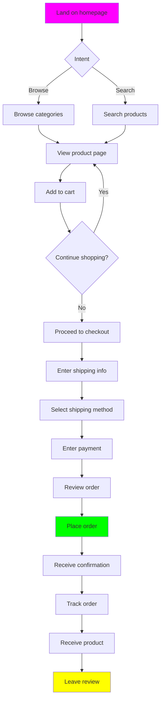
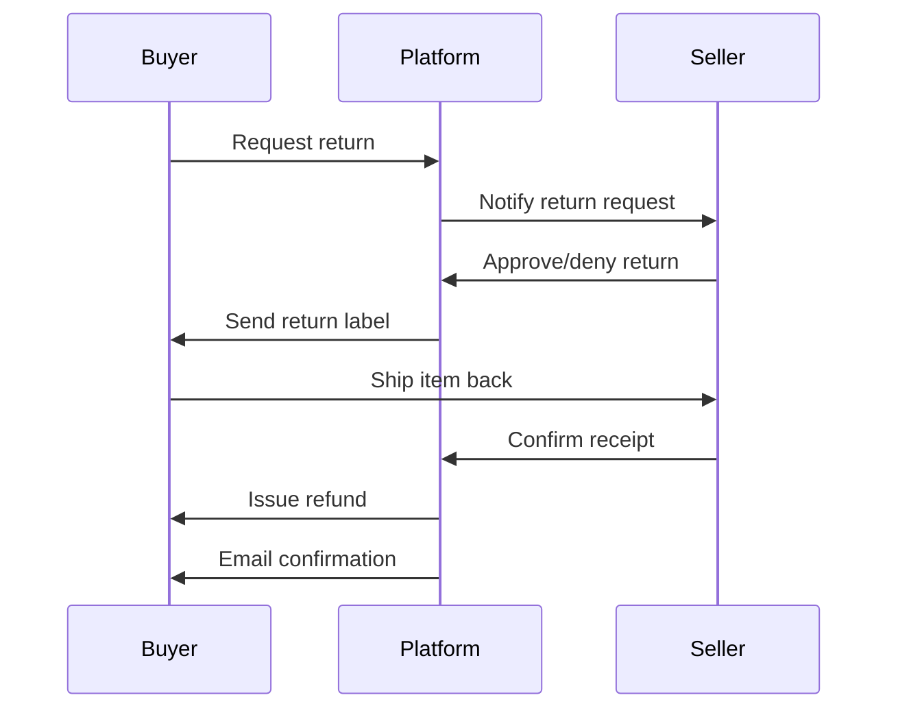

# Specification - E-Commerce Platform

## Vision
Build a world-class, multi-seller e-commerce platform that empowers independent sellers to reach global customers while providing buyers with a trustworthy, seamless shopping experience. Think Etsy meets Shopify's ease-of-use meets Amazon's reliability.

## Problem Statement
Current e-commerce solutions force sellers to choose between:
- **Marketplaces** (Etsy, Amazon): High traffic but high fees, limited control, restrictive policies
- **Self-hosted** (Shopify, WooCommerce): Full control but expensive, complex setup, requires marketing expertise

**Our Solution**: A marketplace platform that combines the best of both worlds:
- Low barrier to entry for sellers (set up shop in hours)
- Built-in traffic and discovery for new sellers
- Fair, transparent commission structure
- Seller-friendly tools and analytics
- Buyer trust through platform guarantees

## Target Audience

### Primary Personas

#### 1. The Independent Seller (Emma)
- **Age**: 28-45
- **Background**: Makes handmade jewelry, currently sells on Etsy
- **Pain Points**:
  - High Etsy fees eat into margins
  - Limited customization of her shop
  - Wants more control over customer relationships
  - Struggles with inventory management across multiple platforms
- **Goals**:
  - Increase profit margins
  - Build direct customer relationships
  - Simplify multi-channel selling
  - Access better analytics
- **Technical Comfort**: Moderate (can use Shopify but not a developer)

#### 2. The Value-Conscious Buyer (Marcus)
- **Age**: 25-55
- **Background**: Tech-savvy professional, shops online frequently
- **Pain Points**:
  - Tired of Amazon's sameness and fake reviews
  - Wants unique, quality products
  - Concerned about data privacy
  - Frustrated by hidden fees at checkout
- **Goals**:
  - Discover unique products from independent sellers
  - Support small businesses
  - Fast, reliable shipping
  - Easy returns and customer service
- **Technical Comfort**: High

#### 3. The Platform Admin (Sarah)
- **Role**: Operations manager
- **Responsibilities**:
  - Onboard new sellers
  - Handle disputes between buyers and sellers
  - Monitor platform health
  - Manage fraud and abuse
- **Goals**:
  - Efficient seller onboarding
  - Quick dispute resolution
  - Actionable insights into platform metrics
  - Fraud detection and prevention
- **Technical Comfort**: Moderate to high

## Core Features

### 1. Multi-Seller Marketplace

#### Seller Registration and Onboarding
**User Story**: As a seller, I want to create my shop quickly so I can start selling within hours.

**Requirements**:
- Self-service registration with email verification
- Shop setup wizard (shop name, description, logo, banner)
- Seller verification (business info, tax ID, bank account for payouts)
- Approval workflow for admin review
- Welcome email with onboarding checklist and resources

**Acceptance Criteria**:
- Seller can create account in < 5 minutes
- Full shop setup (without products) in < 30 minutes
- Automated emails guide seller through next steps

#### Seller Dashboard
**User Story**: As a seller, I want a comprehensive dashboard to manage my shop and track performance.

**Requirements**:
- **Analytics**:
  - Sales metrics (revenue, orders, average order value)
  - Traffic analytics (views, click-through rate, conversion rate)
  - Product performance (best sellers, low performers)
  - Customer demographics
  - Time-series charts (daily, weekly, monthly)
- **Order Management**:
  - Order list with filters (pending, processing, shipped, completed)
  - Order details (items, customer, shipping address, payment status)
  - Bulk actions (mark as shipped, print labels)
  - Order timeline/history
- **Inventory Management**:
  - Product list with stock levels
  - Low stock alerts
  - Bulk inventory updates
  - Inventory history/audit log
- **Financial Reports**:
  - Earnings summary (gross sales, fees, net earnings)
  - Payout schedule and history
  - Downloadable financial statements (CSV, PDF)
  - Tax documentation (1099 forms)

### 2. Product Catalog

#### Product Creation
**User Story**: As a seller, I want to create product listings with rich media and details so buyers can make informed decisions.

**Requirements**:
- **Basic Info**:
  - Product name (max 200 chars)
  - Description (rich text editor, max 5000 chars)
  - SKU (auto-generated or custom)
  - Category and subcategory selection (3-level hierarchy)
  - Tags for discoverability
- **Pricing**:
  - Base price
  - Compare-at price (for sale indicators)
  - Cost per item (for profit margin calculation)
  - Tax configuration (taxable or not, tax class)
- **Inventory**:
  - Stock quantity
  - SKU tracking
  - Low stock threshold
  - Backorder policy (allow, disallow, notify)
- **Variants**:
  - Multiple variants (e.g., size, color, material)
  - Variant-specific pricing, SKU, and stock
  - Up to 3 variant dimensions
  - Variant images
- **Media**:
  - Up to 10 images per product (JPEG, PNG, WebP)
  - Image reordering (drag and drop)
  - Alt text for accessibility
  - Video support (YouTube, Vimeo embeds)
- **Shipping**:
  - Weight and dimensions
  - Shipping class (standard, fragile, oversized)
  - Origin location (for shipping calculation)
- **SEO**:
  - Meta title and description
  - URL slug (auto-generated, editable)
  - Structured data for search engines

**Validation**:
- At least one image required
- Price must be > 0
- Category required
- Description minimum 50 characters

#### Product Search and Discovery
**User Story**: As a buyer, I want to find products easily using search and filters so I can quickly discover what I need.

**Requirements**:
- **Search**:
  - Full-text search across product names, descriptions, tags
  - Auto-complete suggestions
  - Search results ranking by relevance
  - Typo tolerance and fuzzy matching
  - Search analytics (popular searches, zero-result searches)
- **Filtering**:
  - Filter by category, price range, seller, rating, availability
  - Multi-select filters (combine multiple categories/tags)
  - Faceted search (show counts per filter option)
  - Applied filters visible and removable
- **Sorting**:
  - Relevance (default)
  - Price: low to high
  - Price: high to low
  - Newest arrivals
  - Best selling
  - Top rated
- **Pagination**:
  - Configurable items per page (24, 48, 96)
  - Infinite scroll option
  - Page number navigation

### 3. Shopping Cart and Checkout

#### Shopping Cart
**User Story**: As a buyer, I want a flexible cart that lets me review and modify my selections before purchasing.

**Requirements**:
- **Cart Management**:
  - Add items from product page
  - Update quantities in cart
  - Remove items
  - Save for later (move to wishlist)
  - Clear entire cart
- **Cart Persistence**:
  - Anonymous carts saved to localStorage (7 days)
  - Authenticated carts saved to database (30 days)
  - Merge anonymous cart with user cart on login
- **Cart Display**:
  - Product thumbnail, name, variant, price
  - Quantity selector
  - Subtotal per item
  - Cart total with tax estimate
  - Stock availability indicator
  - Seller grouping (items from same seller grouped)
- **Cart Notifications**:
  - Item price changed since added
  - Item out of stock
  - Item removed by seller
  - Low stock warning

#### Checkout Flow
**User Story**: As a buyer, I want a fast, secure checkout process so I can complete my purchase quickly.

**Flow Diagram**:

**Requirements**:

**Step 1: Shipping Information**
- Email address (for guest checkout)
- Shipping address (autocomplete with Google Places API)
- Address validation
- Save address to account option
- Multiple saved addresses for logged-in users

**Step 2: Shipping Method**
- Calculate shipping based on cart items, destination, seller location
- Multiple shipping options per seller (standard, expedited, overnight)
- Estimated delivery date range
- Shipping cost breakdown by seller
- Free shipping threshold indication

**Step 3: Payment**
- Payment methods: Credit card, PayPal, Apple Pay, Google Pay
- Stripe for payment processing
- Credit card tokenization (no card data stored)
- Billing address (same as shipping or different)
- Save payment method option
- PCI DSS compliant

**Step 4: Review Order**
- Complete order summary
- Editable sections (click to change shipping, payment)
- Terms of service and privacy policy checkboxes
- Promotional code application
- Gift options (message, gift wrap)

**Step 5: Place Order**
- Idempotent order creation (prevent double orders)
- Inventory reservation during checkout
- Payment authorization (not capture yet)
- Email confirmation sent immediately
- Redirect to order confirmation page

**Performance**:
- Checkout completion in < 3 minutes for average user
- No page refreshes during checkout (single-page flow)
- Auto-save progress in case of browser crash

### 4. Order Management

#### Order Processing Workflow

**User Story (Buyer)**: As a buyer, I want to track my order status and receive updates so I know when to expect delivery.

**Requirements**:
- Order confirmation email with order number
- Order status tracking page
- Email notifications on status changes
- Shipment tracking integration (FedEx, UPS, USPS)
- Estimated delivery date
- Order history page (all past orders)
- Reorder functionality (add all items to cart again)

**User Story (Seller)**: As a seller, I want to efficiently process orders so I can ship products quickly.

**Requirements**:
- New order notifications (email, dashboard badge)
- Order details with packing slip PDF
- Shipping label generation (via Shippo, EasyPost integration)
- Mark as shipped with tracking number
- Order notes for internal use
- Bulk order processing

#### Returns and Refunds
**User Story (Buyer)**: As a buyer, I want an easy return process so I can return items that don't meet my expectations.

**Requirements**:
- Return initiation within 30 days of delivery
- Return reason selection (wrong size, defective, not as described, etc.)
- Optional return comments
- Prepaid return label (if seller offers)
- Return status tracking
- Refund issued within 5 business days of return receipt

**User Story (Seller)**: As a seller, I want to manage returns fairly while protecting against fraud.

**Requirements**:
- Return approval/denial with reason
- Return condition documentation (photos, notes)
- Partial refunds option
- Return fraud detection (excessive returns flagged)
- Restocking fee option

### 5. Reviews and Ratings

#### Product Reviews
**User Story**: As a buyer, I want to read and write reviews so I can make informed decisions and share my experience.

**Requirements**:
- **Writing Reviews**:
  - Only verified purchasers can review
  - Star rating (1-5)
  - Written review (50-2000 characters)
  - Photo uploads (up to 5 photos)
  - Review submission after order completion
  - One review per product per customer
- **Reading Reviews**:
  - Average rating displayed on product page
  - Rating distribution histogram (5 stars: X%, 4 stars: Y%, etc.)
  - Verified purchase badge
  - Helpful votes (thumbs up/down)
  - Sort by: Most helpful, Newest, Highest rating, Lowest rating
  - Filter by rating (e.g., show only 4-5 star reviews)
  - Seller responses to reviews
- **Moderation**:
  - Automated spam detection
  - Seller can flag inappropriate reviews
  - Admin review queue for flagged content
  - Remove reviews violating terms (hate speech, personal info, etc.)

#### Seller Ratings
**User Story**: As a buyer, I want to see seller ratings so I can buy from trustworthy sellers.

**Requirements**:
- Seller overall rating (average of all order reviews)
- Rating breakdown by criteria:
  - Product quality
  - Shipping speed
  - Customer service
  - Accuracy of description
- Seller badges (Top Rated, Fast Shipper, Responsive, etc.)
- Number of sales and reviews visible

### 6. User Accounts

#### Buyer Accounts
**User Story**: As a buyer, I want an account to track orders, save preferences, and speed up checkout.

**Requirements**:
- **Registration**: Email/password, Google OAuth, Apple Sign In
- **Profile**: Name, email, phone, profile photo
- **Addresses**: Multiple saved shipping/billing addresses
- **Payment Methods**: Saved credit cards, PayPal accounts
- **Order History**: All orders with reorder option
- **Wishlist**: Save products for later, share wishlist
- **Notifications**: Email preferences, order updates, promotions
- **Data Export**: Download all personal data (GDPR)
- **Account Deletion**: Delete account and all data

#### Seller Accounts
**User Story**: As a seller, I want professional tools to manage my shop and brand.

**Requirements**:
- **Shop Profile**:
  - Shop name, logo, banner, description
  - About page with seller story
  - Shop policies (shipping, returns, privacy)
  - Social media links
  - Contact information
- **Business Info**:
  - Business type (sole proprietor, LLC, corporation)
  - Tax ID (EIN or SSN)
  - Bank account for payouts
  - Business address
- **Team Access**:
  - Add team members with specific permissions
  - Roles: Admin, Editor (manage products), Viewer (analytics only)
- **Notifications**:
  - New order alerts
  - Low stock alerts
  - Review notifications
  - Payout notifications

### 7. Admin Panel

**User Story**: As a platform admin, I want tools to manage the platform, onboard sellers, and handle disputes.

**Requirements**:
- **Dashboard**: Key metrics (GMV, active sellers, orders, users)
- **Seller Management**:
  - Approve/reject seller applications
  - Suspend/ban sellers
  - Edit seller information
  - Financial reconciliation
- **Order Management**:
  - View all orders across platform
  - Intervene in disputes
  - Issue refunds on behalf of sellers
- **Content Moderation**:
  - Review flagged products
  - Review flagged reviews
  - Content takedown for policy violations
- **Analytics**:
  - Platform-wide sales trends
  - Seller performance rankings
  - Category performance
  - Customer acquisition and retention
- **Configuration**:
  - Commission rates per category
  - Shipping settings
  - Tax settings
  - Email templates
  - Platform policies

## User Flows

### Flow 1: Seller Onboarding to First Sale

### Flow 2: Buyer Purchase Journey

### Flow 3: Return Process

## Success Criteria

### Minimum Viable Product (MVP)
- ✅ Seller registration and shop setup
- ✅ Product creation with images and variants
- ✅ Product search and browse
- ✅ Shopping cart
- ✅ Checkout with Stripe payment
- ✅ Order management for sellers
- ✅ Order tracking for buyers
- ✅ Basic seller dashboard (orders, products)
- ✅ Email notifications (order confirmation, shipping)
- ✅ Admin panel (seller approval, order oversight)

### Version 1.0 (Launch Ready)
- ✅ All MVP features
- ✅ Reviews and ratings
- ✅ Returns and refunds workflow
- ✅ Advanced search and filtering
- ✅ Seller analytics dashboard
- ✅ Multiple payment methods (PayPal, Apple Pay)
- ✅ Shipping label integration
- ✅ Wishlist
- ✅ Mobile-responsive design
- ✅ Multi-currency support (USD, EUR, GBP)

### Version 2.0 (Growth Phase)
- ✅ Mobile apps (iOS, Android)
- ✅ Seller promotional tools (discounts, coupons)
- ✅ Subscription products
- ✅ Digital product sales (downloads)
- ✅ Advanced fraud detection
- ✅ Seller financing (early payout options)
- ✅ Internationalization (10+ languages)
- ✅ Social shopping features (share to social media)

## Out of Scope

### Explicitly NOT Included (MVP/v1.0)
- ❌ Dropshipping support
- ❌ Print-on-demand integration
- ❌ Wholesale/B2B portal
- ❌ Auction-style listings
- ❌ Live chat support (use email/tickets initially)
- ❌ Loyalty/rewards program
- ❌ Affiliate marketing program
- ❌ Custom domain for individual sellers
- ❌ Physical POS integration
- ❌ Crowdfunding/pre-order campaigns

## Open Questions
(To be resolved in clarification.md)

1. **Multi-currency**: How to handle currency conversion? Real-time rates or fixed?
2. **Shipping**: Build own shipping calculator or use third-party (Shippo, EasyPost)?
3. **Search**: Elasticsearch self-hosted or managed (AWS OpenSearch, Elastic Cloud)?
4. **Image Storage**: S3, Cloudinary, or Imgix?
5. **Email**: Sendgrid, AWS SES, or Postmark?
6. **Analytics**: Build custom or integrate Google Analytics, Mixpanel?
7. **Fraud Detection**: Build ML model or use service (Stripe Radar, Sift Science)?
8. **Commission Structure**: Flat rate or tiered based on sales volume?
9. **Payout Schedule**: Daily, weekly, or monthly payouts to sellers?
10. **Tax Calculation**: Integrate with TaxJar, Avalara, or build custom?

## Assumptions

### Market Assumptions
- Target market: US, UK, EU initially
- Average order value: $50-100
- Seller count at launch: 50-100 sellers
- Product catalog: 5,000-10,000 products at launch
- Growth rate: 20% MoM in first year

### Technical Assumptions
- Users have modern browsers (last 2 versions)
- Mobile traffic: 60% of total traffic
- Average cart size: 2-3 items
- Checkout conversion: 25% of cart views
- Return rate: 10-15% of orders

---

**Last Updated**: 2025-11-05
**Version**: 1.0.0
**Status**: 🧪 Experimental
**Estimated Development Time**: 6-9 months for MVP, 12-18 months for v1.0
