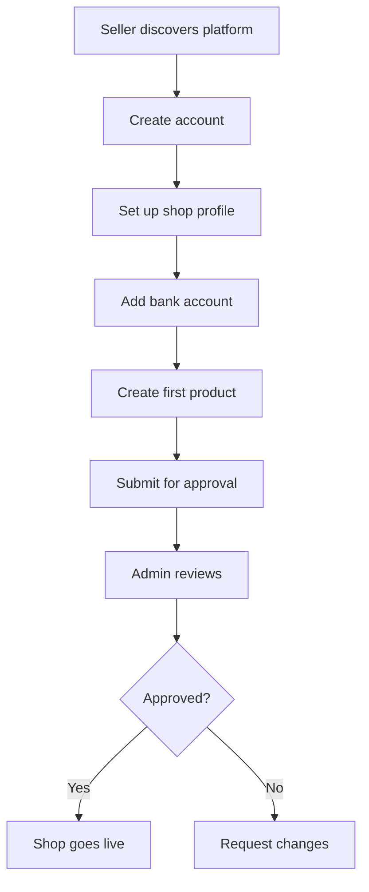

# SpecKit Complex E-Commerce - Advanced Learning Experiment

**Status**: 🧪 Experimental
**Created**: 2025-11-05
**Purpose**: Master advanced SpecKit patterns through a production-grade e-commerce platform
**Complexity**: Advanced

## Overview

This experiment demonstrates **advanced SpecKit specification-driven development** for a complex, multi-service e-commerce platform. It showcases enterprise-level architectural decisions, microservices patterns, event-driven architecture, and comprehensive system design—all defined through SpecKit artifacts before writing a single line of implementation code.

## What Makes This "Complex"?

Unlike the simple blog experiment, this e-commerce platform includes:

✅ **Microservices Architecture**: 14 independent services with clear boundaries
✅ **Event-Driven Communication**: Kafka-based async messaging between services
✅ **Polyglot Persistence**: Multiple database types (PostgreSQL, MongoDB, Redis, Elasticsearch, ClickHouse)
✅ **Multi-Tenant Model**: Platform hosts multiple sellers with data isolation
✅ **Complex Business Logic**: Checkout flow, payment splitting, inventory reservations
✅ **Third-Party Integrations**: Stripe, Shippo, Avalara, email services
✅ **Distributed Transactions**: Saga pattern for cross-service consistency
✅ **Event Sourcing**: Order history preserved as immutable event stream
✅ **Advanced Security**: OAuth, RBAC, PCI compliance, fraud detection
✅ **Global Scale**: Multi-currency, multi-region, CDN distribution

## Learning Objectives

By studying this experiment, you'll learn:

### Advanced SpecKit Techniques
- How to define complex system architecture in specifications
- Documenting intricate design decisions with trade-off analysis
- Planning microservices boundaries and communication patterns
- Specifying data schemas across multiple database systems
- Defining event schemas and async workflows
- Clarifying ambiguities in complex domains

### Software Architecture
- Microservices architecture principles
- Event-driven design patterns
- CQRS (Command Query Responsibility Segregation)
- Event sourcing for audit trails
- API Gateway patterns
- Service mesh considerations
- Distributed tracing and observability

### Domain-Driven Design
- Bounded contexts and service boundaries
- Aggregate roots and entities
- Domain events
- Anti-corruption layers
- Context mapping between services

### E-Commerce Specific
- Multi-seller marketplace architecture
- Payment processing and split payments (Stripe Connect)
- Inventory management and reservations
- Shipping calculation and label generation
- Tax calculation complexities
- Fraud detection patterns
- Order fulfillment workflows

## Experiment Structure

```
speckit-complex-ecommerce/
├── .specify/
│   └── memory/
│       ├── constitution.md      ← Enterprise-grade principles & standards (12 pages)
│       ├── specification.md     ← Complete feature specifications (18 pages)
│       ├── clarification.md     ← 12 major design decisions with trade-offs (14 pages)
│       └── plan.md             ← Detailed technical architecture (16 pages)
└── README.md                    ← This file

Total Specification: ~60 pages of comprehensive documentation
```

## Deep Dive: The Four Artifacts

### 1. Constitution (`constitution.md`) - The Platform's DNA

**Size**: ~4,000 words | **Reading Time**: 15 minutes

**Purpose**: Establishes non-negotiable principles for an enterprise e-commerce platform.

**Key Sections**:
- **Core Business Principles**: Customer trust, seller empowerment, platform reliability
- **Technical Excellence Standards**: Code quality metrics, testing requirements, documentation
- **Security Requirements**: Authentication, data protection, PCI compliance, vulnerability scanning
- **Performance Requirements**: Response time targets (P50/P95/P99), throughput goals
- **Architecture Principles**: Microservices boundaries, communication patterns, technology choices
- **Observability**: Logging, monitoring, alerting, distributed tracing standards
- **Development Workflow**: Version control, code review, CI/CD pipeline
- **Success Metrics**: Developer productivity, system reliability, business performance

**Advanced Patterns Demonstrated**:
- Performance budgets with percentile targets
- Security-first architecture (encryption, secrets management)
- Operational excellence (MTTR, change failure rate)
- Governance through Architectural Decision Records (ADRs)

**Example Excerpt**:
```markdown
### Performance Requirements

| Operation | P50 | P95 | P99 |
|-----------|-----|-----|-----|
| Product search | 100ms | 200ms | 500ms |
| Add to cart | 50ms | 100ms | 200ms |
| Payment processing | 1s | 2s | 3s |
```

---

### 2. Specification (`specification.md`) - The Product Vision

**Size**: ~5,500 words | **Reading Time**: 25 minutes

**Purpose**: Defines WHAT to build for a multi-seller marketplace.

**Key Sections**:
- **Vision & Problem Statement**: Why this platform exists
- **Target Audience**: 3 detailed personas (seller, buyer, admin) with pain points and goals
- **Core Features**: 7 major feature areas with user stories
  1. Multi-Seller Marketplace (seller onboarding, dashboard, analytics)
  2. Product Catalog (creation, search, discovery, Elasticsearch)
  3. Shopping Cart and Checkout (multi-step flow, validation)
  4. Order Management (workflows, returns, refunds)
  5. Reviews and Ratings (product + seller reviews)
  6. User Accounts (buyer + seller accounts with different capabilities)
  7. Admin Panel (platform management, moderation, analytics)
- **User Flows**: 3 comprehensive flows with Mermaid diagrams
- **Success Criteria**: MVP → v1.0 → v2.0 progression
- **Out of Scope**: Explicitly lists what won't be built
- **Open Questions**: 10 questions to be resolved in clarification phase

**Advanced Patterns Demonstrated**:
- Multiple user personas with conflicting needs
- Complex state machines (order lifecycle)
- Multi-step user flows with decision points
- Sequence diagrams for interactions
- Explicit scope management (in vs. out)

**Example User Flow**:


---

### 3. Clarification (`clarification.md`) - Design Decisions

**Size**: ~7,000 words | **Reading Time**: 30 minutes

**Purpose**: Resolves ALL ambiguities from specification with documented decisions.

**Key Sections**:
- **12 Major Design Decisions** including:
  1. **Microservices Architecture** vs. Monolith
  2. **Multi-Currency Strategy** (daily rate updates, smart rounding)
  3. **Shipping Calculator** (Shippo integration hybrid approach)
  4. **Search Engine** (Elasticsearch with AWS OpenSearch for production)
  5. **Image Storage** (S3 + CloudFront + Lambda@Edge)
  6. **Email Service** (Postmark + SendGrid split)
  7. **Payment Processing** (Stripe Connect architecture)
  8. **Database Strategy** (polyglot persistence per service)
  9. **Commission Structure** (tiered by category + volume)
  10. **Seller Payout Schedule** (configurable with holding period)
  11. **Tax Calculation** (Avalara AvaTax integration)
  12. **Fraud Detection** (Stripe Radar + custom rules)

**Decision Template**:
```markdown
### Decision Title

**Question**: What are we deciding?
**Options Considered**: Alternative A, B, C, D
**Decision**: Chosen option
**Rationale**: Why we chose it
**Trade-offs**: What we sacrificed
**Implementation Details**: How it works
**Costs**: Financial impact
**Edge Cases**: Special scenarios
```

**Advanced Patterns Demonstrated**:
- Trade-off analysis (benefits vs. costs)
- Cost modeling (infrastructure, third-party services)
- Edge case documentation
- Migration paths (technical debt management)
- Vendor evaluation criteria
- Risk acceptance with mitigation strategies

**Example Decision**:
```markdown
### Payment Processing

**Decision**: Stripe as Primary + PayPal + Apple Pay/Google Pay

**Stripe Connect Architecture**:
- Each seller has Stripe Connected Account
- Payment Split: Platform charges buyer, splits to sellers minus commission
- Payout Schedule: Sellers choose daily/weekly/monthly
- Refunds: Platform can refund on behalf of seller

**Fees**:
- Stripe: 2.9% + $0.30 per transaction
- Platform commission: 8% of sale price
- Seller receives: 92% of sale price
```

---

### 4. Plan (`plan.md`) - Technical Blueprint

**Size**: ~10,000 words | **Reading Time**: 45 minutes

**Purpose**: Complete technical architecture ready for implementation.

**Key Sections**:
- **System Architecture Overview**: High-level diagram with all services
- **Technology Stack**: Specific versions for all technologies
- **Service Definitions**: 8 detailed service specs including:
  - API Gateway (Kong configuration)
  - User Service (schema, APIs, auth flow)
  - Seller Service (onboarding, verification)
  - Catalog Service (PostgreSQL + Elasticsearch)
  - Cart Service (Redis data structures)
  - Checkout Service (state machine, tax/shipping integration)
  - Order Service (event sourcing implementation)
  - Payment Service (Stripe Connect flows)
- **Event-Driven Architecture**: Kafka topics, event schemas, consumers
- **Frontend Architecture**: React app structure, state management
- **Deployment Architecture**: AWS infrastructure, ECS services, CI/CD pipeline

**Advanced Patterns Demonstrated**:
- Microservices with clear responsibilities
- Database schema per service (Prisma models)
- API endpoint specifications
- Elasticsearch index mappings
- Event sourcing implementation
- Saga pattern for distributed transactions
- API Gateway configuration
- Infrastructure as code (Terraform)
- Container orchestration (ECS)
- Auto-scaling policies

**Example Service Definition**:
```typescript
model Product {
  id            String   @id @default(uuid())
  sellerId      String
  name          String
  slug          String   @unique
  description   String
  categoryId    String
  tags          String[]
  status        ProductStatus @default(DRAFT)

  pricing       Pricing
  inventory     Inventory
  variants      Variant[]
  media         Media[]
  seo           SEO?
}

// API Endpoints
GET    /api/v1/products              # Search & filter
GET    /api/v1/products/:id
POST   /api/v1/products              # Seller creates
PATCH  /api/v1/products/:id
DELETE /api/v1/products/:id
```

---

## Comparing Simple vs. Complex Experiments

| Aspect | Simple Blog | Complex E-Commerce |
|--------|-------------|-------------------|
| **Architecture** | Monolithic static site | Microservices with 14 services |
| **Databases** | None (markdown files) | 5 database types |
| **Users** | Single author | Buyers, sellers, admins |
| **Pages of Spec** | ~15 pages | ~60 pages |
| **Clarifications** | 9 decisions | 12 major decisions |
| **Services** | 1 static site generator | 14 backend services + frontend |
| **Integrations** | None | 6 third-party services |
| **Events** | None | Kafka event streaming |
| **Complexity Level** | Beginner | Advanced |
| **Implementation Time** | 2-3 weeks | 12-18 months |
| **Team Size** | 1 developer | 6-person team |

## Key Architectural Patterns Demonstrated

### 1. Bounded Contexts (DDD)

Each microservice represents a bounded context:
- **Catalog Context**: Products, categories, search
- **Order Context**: Orders, fulfillment, returns
- **Payment Context**: Transactions, payouts, refunds

### 2. CQRS (Command Query Responsibility Segregation)

- **Commands**: Modify state (create order, update inventory)
- **Queries**: Read state (search products, view order history)
- **Analytics Service**: Separate read model optimized for reporting (ClickHouse)

### 3. Event Sourcing

Order Service uses event sourcing:
```typescript
type OrderEvent =
  | { type: "ORDER_CREATED"; payload: OrderData }
  | { type: "PAYMENT_CONFIRMED"; payload: PaymentData }
  | { type: "ITEM_SHIPPED"; payload: ShipmentData }
  | { type: "ORDER_DELIVERED"; payload: DeliveryData }
```

Benefits:
- Complete audit trail
- Replay events to rebuild state
- Time-travel debugging
- Historical reporting

### 4. Saga Pattern (Distributed Transactions)

Checkout orchestration saga:
```
1. Reserve inventory
2. Authorize payment
3. Create order
4. Capture payment
5. Notify seller

If any step fails → Compensating transactions
```

### 5. API Gateway Pattern

Single entry point for clients:
- Authentication/authorization
- Rate limiting
- Request routing
- Response aggregation (GraphQL)
- SSL termination

### 6. Strangler Fig Pattern (for future migration)

Gradual microservices adoption:
- Start with modular monolith
- Extract services one-by-one
- API Gateway routes to old or new service
- Eventually replace entire monolith

## How to Use This Experiment

### For Learning Advanced Architecture

1. **Read in this order**:
   - Constitution → Understand principles first
   - Specification → Learn what we're building
   - Clarification → See how decisions are made
   - Plan → Study technical implementation

2. **Focus on patterns**:
   - How are service boundaries defined?
   - How do services communicate?
   - How is data consistency maintained?
   - How are errors handled across services?

3. **Compare with simple blog**:
   - What complexity did we add and why?
   - What trade-offs were made?
   - How do principles scale from simple to complex?

### For Designing Your Own System

1. **Use as a template**:
   - Copy the structure of decisions in clarification.md
   - Adapt service boundaries to your domain
   - Modify technology choices based on your constraints

2. **Apply patterns selectively**:
   - Don't cargo-cult microservices if you don't need them
   - Event sourcing adds complexity—use only where valuable
   - Choose managed services to reduce operational burden

3. **Start simple, evolve**:
   - Begin with fewer services
   - Add services as team/traffic grows
   - Document decision points for when to split

### For Implementing This Platform

If you want to build this e-commerce platform:

1. **Phase 1 - MVP (3 months)**:
   - Combine some services (catalog + inventory, user + seller)
   - Use simpler tech (PostgreSQL instead of Kafka initially)
   - Focus on core buyer/seller flows
   - Defer: Reviews, analytics, advanced fraud detection

2. **Phase 2 - v1.0 (6 months)**:
   - Split services as traffic grows
   - Add event streaming (Kafka)
   - Implement reviews and ratings
   - Enhanced analytics

3. **Phase 3 - Scale (9+ months)**:
   - Multi-region deployment
   - Advanced features (ML recommendations, etc.)
   - Mobile apps
   - International expansion

## Technical Complexity Highlights

### Distributed System Challenges

1. **Data Consistency**:
   - Strong consistency: Orders, payments (PostgreSQL transactions)
   - Eventual consistency: Product catalog, analytics (event-driven)

2. **Service Communication**:
   - Synchronous: REST for user-facing requests
   - Asynchronous: Kafka events for service-to-service

3. **Failure Handling**:
   - Circuit breakers for external services
   - Retry with exponential backoff
   - Dead letter queues for failed messages
   - Compensating transactions in sagas

4. **Observability**:
   - Distributed tracing (correlation IDs across services)
   - Centralized logging (structured JSON logs)
   - Metrics and alerts (Datadog)

### Security Considerations

- **Authentication**: OAuth 2.0 / OpenID Connect
- **Authorization**: RBAC with granular permissions
- **Data Encryption**: At rest (AES-256) and in transit (TLS 1.3)
- **PCI Compliance**: Stripe handles card data
- **Secrets Management**: AWS Secrets Manager
- **Rate Limiting**: Per-user and per-IP limits
- **Input Validation**: Zod schemas at API boundaries

### Performance Optimization

- **Caching**: Redis for carts, Elasticsearch for search
- **CDN**: CloudFront for static assets
- **Database**: Connection pooling, read replicas
- **Async Processing**: Kafka for non-blocking operations
- **Image Optimization**: Lambda@Edge for on-the-fly resizing

## Resources and References

### SpecKit Resources
- [SpecKit GitHub Repository](https://github.com/github/spec-kit)
- [Spec-Driven Development Blog](https://developer.microsoft.com/blog/spec-driven-development-spec-kit)

### Architecture Patterns
- [Microservices Patterns](https://microservices.io/patterns/) by Chris Richardson
- [Domain-Driven Design](https://www.dddcommunity.org/)
- [Event Sourcing](https://martinfowler.com/eaaDev/EventSourcing.html) by Martin Fowler
- [CQRS](https://martinfowler.com/bliki/CQRS.html)

### E-Commerce Specific
- [Stripe Connect Documentation](https://stripe.com/docs/connect)
- [Multi-Tenant Architecture](https://docs.aws.amazon.com/whitepapers/latest/saas-architecture-fundamentals/multi-tenant-architecture.html)

## Related Experiments

- `speckit-simple-blog/` - Start here for SpecKit fundamentals

---

**Tech Stack**: TypeScript, React, Node.js, PostgreSQL, MongoDB, Redis, Elasticsearch, Kafka, AWS
**Estimated Implementation**: 12-18 months with 6-person team
**Lines of Specification**: ~20,000 words
**Target Scale**: 100k MAU, 1k orders/sec
**Infrastructure Cost**: $2k-5k/month at 10k MAU
