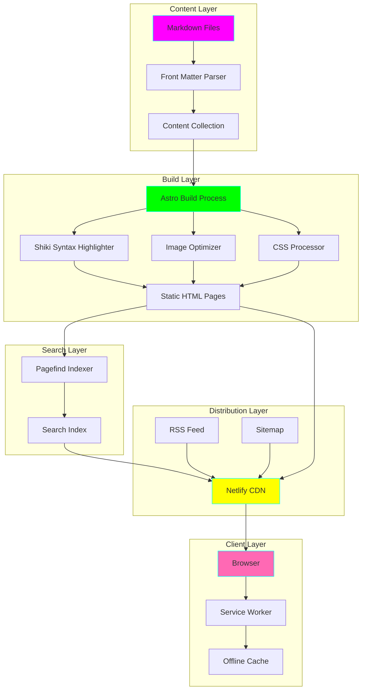
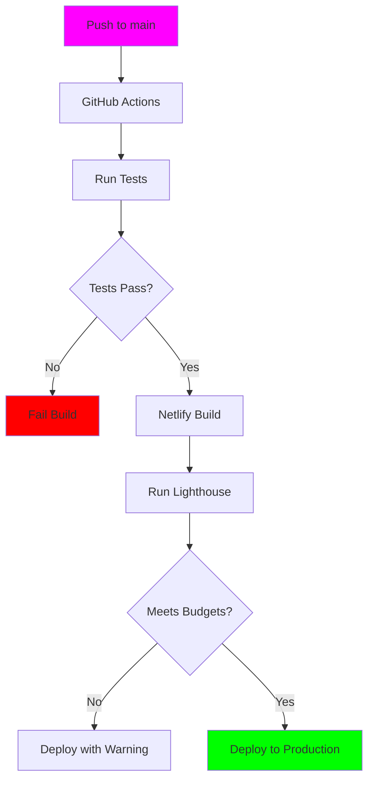

# Plan - Simple Blog Service

## Purpose
This document outlines the technical architecture and implementation strategy for the Simple Blog Service. It translates the specification into concrete technical decisions and actionable development steps.

## Architecture Overview



## Technology Stack

### Core Framework
- **Astro 4.x**: Static site generator
  - Reasoning: Best performance, TypeScript support, component flexibility
  - Version: Latest stable (4.x)
  - Build output: Static HTML

### Runtime & Language
- **Node.js 20 LTS**: Runtime environment
- **TypeScript 5.x**: Type safety and developer experience
  - Configuration: Strict mode enabled
  - Target: ES2022

### Styling
- **CSS Modules**: Component-scoped styles
  - Alternative considered: Tailwind (rejected for simplicity)
  - CSS Variables for theming
  - PostCSS for autoprefixing

### Content Processing
- **Gray Matter**: Front matter parsing
- **Shiki**: Syntax highlighting (build-time)
- **Rehype/Remark**: Markdown processing plugins
  - rehype-slug: Auto-generate heading IDs
  - rehype-autolink-headings: Add anchor links to headings
  - remark-reading-time: Calculate reading time

### Search
- **Pagefind**: Static search index
  - Generates search index post-build
  - ~10KB overhead per 100 pages

### Development Tools
- **Prettier**: Code formatting
- **ESLint**: Linting (astro-eslint-parser)
- **TypeScript**: Type checking
- **Vitest**: Unit testing
- **Playwright**: E2E testing

## Project Structure

```
speckit-simple-blog/
├── .specify/
│   └── memory/
│       ├── constitution.md
│       ├── specification.md
│       ├── clarification.md
│       └── plan.md
│
├── src/
│   ├── pages/
│   │   ├── index.astro              # Homepage (recent posts)
│   │   ├── blog/
│   │   │   ├── [slug].astro         # Individual blog post
│   │   │   └── tag/[tag].astro      # Tag filter page
│   │   ├── archive.astro            # Chronological archive
│   │   ├── search.astro             # Search page
│   │   ├── about.astro              # About page
│   │   └── rss.xml.ts               # RSS feed generator
│   │
│   ├── content/
│   │   ├── config.ts                # Content collections config
│   │   └── blog/
│   │       ├── 2025-01-01-first-post.md
│   │       └── ...
│   │
│   ├── components/
│   │   ├── Header.astro             # Site header with nav
│   │   ├── Footer.astro             # Site footer
│   │   ├── PostCard.astro           # Blog post preview card
│   │   ├── PostLayout.astro         # Blog post page layout
│   │   ├── TableOfContents.astro    # TOC component
│   │   ├── TagCloud.astro           # Tag visualization
│   │   ├── ThemeToggle.astro        # Dark mode toggle
│   │   ├── SearchBar.astro          # Search input
│   │   └── Pagination.astro         # Page navigation
│   │
│   ├── layouts/
│   │   └── BaseLayout.astro         # Base HTML layout
│   │
│   ├── styles/
│   │   ├── global.css               # Global styles & CSS vars
│   │   └── typography.css           # Typography system
│   │
│   └── utils/
│       ├── getReadingTime.ts        # Calculate reading time
│       ├── formatDate.ts            # Date formatting
│       └── generateExcerpt.ts       # Auto excerpt generation
│
├── public/
│   ├── images/
│   ├── favicon.ico
│   └── robots.txt
│
├── tests/
│   ├── unit/
│   │   └── utils.test.ts
│   └── e2e/
│       ├── homepage.spec.ts
│       ├── blog-post.spec.ts
│       └── search.spec.ts
│
├── astro.config.mjs                 # Astro configuration
├── tsconfig.json                    # TypeScript configuration
├── package.json
├── .nvmrc                           # Node version (20)
├── .prettierrc
├── .eslintrc.cjs
├── netlify.toml                     # Netlify deployment config
└── README.md
```

## Data Schema

### Blog Post Front Matter

```typescript
interface BlogPost {
  // Required fields
  title: string;              // Post title
  date: Date;                 // Publication date (YYYY-MM-DD)
  description: string;        // Meta description (150-160 chars)

  // Optional fields
  tags?: string[];            // Array of tag strings
  coverImage?: string;        // Path to cover image (relative to public/)
  coverImageAlt?: string;     // Alt text for cover image
  status?: 'draft' | 'published';  // Post status (default: published)
  updatedDate?: Date;         // Last update date
  author?: string;            // Author name (default: site author)

  // Computed fields (generated at build)
  slug: string;               // URL slug (from filename)
  readingTime: number;        // Minutes to read
  excerpt: string;            // First paragraph or custom
  wordCount: number;          // Total words
}
```

### Example Blog Post

```markdown
---
title: "Getting Started with SpecKit"
date: 2025-11-05
description: "Learn how to use GitHub's SpecKit for specification-driven development with AI coding assistants."
tags: ["speckit", "ai", "development", "tutorial"]
coverImage: "/images/speckit-intro.jpg"
coverImageAlt: "SpecKit logo with code in background"
status: published
---

# Getting Started with SpecKit

SpecKit is GitHub's toolkit for specification-driven development...

[Rest of content in Markdown]
```

## Component Architecture

### Page Components (Astro Pages)

#### Homepage (`src/pages/index.astro`)
```typescript
// Pseudo-code structure
import { getCollection } from 'astro:content';

const posts = await getCollection('blog', ({ data }) => {
  return data.status === 'published';
});

const recentPosts = posts
  .sort((a, b) => b.data.date - a.data.date)
  .slice(0, 10);
```

**Responsibilities**:
- Fetch published blog posts
- Sort by date descending
- Limit to 10 most recent
- Render PostCard for each
- Include pagination if > 10 posts

#### Blog Post Page (`src/pages/blog/[slug].astro`)
```typescript
// Pseudo-code structure
export async function getStaticPaths() {
  const posts = await getCollection('blog');
  return posts.map(post => ({
    params: { slug: post.slug },
    props: { post },
  }));
}

const { post } = Astro.props;
const { Content } = await post.render();
```

**Responsibilities**:
- Generate static page for each post
- Render markdown content
- Add table of contents
- Display metadata (date, tags, reading time)
- Show related posts
- Include SEO meta tags

### UI Components

#### PostCard (`src/components/PostCard.astro`)
```typescript
interface Props {
  title: string;
  date: Date;
  description: string;
  slug: string;
  tags: string[];
  readingTime: number;
  coverImage?: string;
}
```

**Renders**:
- Cover image (if provided)
- Post title (linked)
- Publication date
- Reading time estimate
- Excerpt/description
- Tag list

#### ThemeToggle (`src/components/ThemeToggle.astro`)
```typescript
// Client-side script
<script>
  const theme = localStorage.getItem('theme')
    || (window.matchMedia('(prefers-color-scheme: dark)').matches ? 'dark' : 'light');

  document.documentElement.setAttribute('data-theme', theme);

  function toggleTheme() {
    const current = document.documentElement.getAttribute('data-theme');
    const next = current === 'dark' ? 'light' : 'dark';
    document.documentElement.setAttribute('data-theme', next);
    localStorage.setItem('theme', next);
  }
</script>
```

## Styling System

### CSS Variables (src/styles/global.css)

```css
:root[data-theme="light"] {
  /* Colors */
  --color-bg: #ffffff;
  --color-bg-secondary: #f5f5f5;
  --color-text: #1a1a1a;
  --color-text-secondary: #666666;
  --color-accent: #0066cc;
  --color-accent-hover: #0052a3;
  --color-border: #e0e0e0;

  /* Typography */
  --font-base: -apple-system, BlinkMacSystemFont, 'Segoe UI', Roboto, sans-serif;
  --font-mono: 'SF Mono', Monaco, 'Cascadia Code', monospace;
  --font-size-base: 18px;
  --line-height-base: 1.7;
  --line-height-heading: 1.2;

  /* Spacing */
  --space-xs: 0.25rem;
  --space-sm: 0.5rem;
  --space-md: 1rem;
  --space-lg: 2rem;
  --space-xl: 4rem;

  /* Layout */
  --max-width-text: 700px;
  --max-width-layout: 1200px;
}

:root[data-theme="dark"] {
  --color-bg: #1a1a1a;
  --color-bg-secondary: #2a2a2a;
  --color-text: #e5e5e5;
  --color-text-secondary: #a0a0a0;
  --color-accent: #4da6ff;
  --color-accent-hover: #66b3ff;
  --color-border: #3a3a3a;
}
```

### Typography Scale

```css
/* Typography System */
.text-xs { font-size: 0.75rem; }      /* 12px */
.text-sm { font-size: 0.875rem; }     /* 14px */
.text-base { font-size: 1rem; }       /* 16px */
.text-lg { font-size: 1.125rem; }     /* 18px */
.text-xl { font-size: 1.25rem; }      /* 20px */
.text-2xl { font-size: 1.5rem; }      /* 24px */
.text-3xl { font-size: 1.875rem; }    /* 30px */
.text-4xl { font-size: 2.25rem; }     /* 36px */
```

## Build Process

### Build Pipeline

```mermaid
graph LR
    A[Source Files] --> B[TypeScript Check]
    B --> C[Astro Build]
    C --> D[Markdown Processing]
    D --> E[Image Optimization]
    E --> F[CSS Processing]
    F --> G[Static HTML Output]
    G --> H[Pagefind Indexing]
    H --> I[RSS Generation]
    I --> J[Sitemap Generation]
    J --> K[Build Complete]

    style A fill:#ff00ff
    style C fill:#00ff00
    style K fill:#ffff00
```



### Build Commands

```json
{
  "scripts": {
    "dev": "astro dev",
    "build": "astro check && astro build && pagefind --site dist",
    "preview": "astro preview",
    "test": "vitest run",
    "test:e2e": "playwright test",
    "lint": "eslint . && prettier --check .",
    "format": "prettier --write ."
  }
}
```

## Performance Optimizations

### 1. Image Optimization
- Astro's `<Image />` component for automatic optimization
- Generate multiple sizes for responsive images
- Lazy loading for images below fold
- WebP format with JPEG fallback

### 2. CSS Optimization
- Critical CSS inlined in `<head>`
- Non-critical CSS loaded asynchronously
- CSS purging of unused styles
- Minification in production

### 3. JavaScript Minimization
- Astro ships zero JS by default
- Only hydrate interactive components (search, theme toggle)
- Use `client:visible` directive for below-fold components
- Bundle size budget: < 100KB

### 4. Caching Strategy
```
# netlify.toml
[[headers]]
  for = "/*"
  [headers.values]
    Cache-Control = "public, max-age=0, must-revalidate"

[[headers]]
  for = "/assets/*"
  [headers.values]
    Cache-Control = "public, max-age=31536000, immutable"
```

## Testing Strategy

### Unit Tests (Vitest)
- Utility functions (date formatting, reading time, excerpt generation)
- Content parsing logic
- Data transformations

### Integration Tests
- Content collection queries
- RSS feed generation
- Sitemap generation

### E2E Tests (Playwright)
- Homepage loads and displays posts
- Blog post page renders correctly
- Navigation works
- Search functionality
- Dark mode toggle
- Mobile responsiveness

### Performance Tests
- Lighthouse CI in GitHub Actions
- Run on every PR
- Fail if scores below threshold:
  - Performance: 90+
  - Accessibility: 95+
  - SEO: 95+

## Deployment Strategy

### Netlify Configuration

```toml
# netlify.toml
[build]
  command = "npm run build"
  publish = "dist"

[build.environment]
  NODE_VERSION = "20"
  NPM_FLAGS = "--legacy-peer-deps"

[[plugins]]
  package = "@netlify/plugin-lighthouse"

  [plugins.inputs]
    performance_budget = 90
    accessibility_budget = 95
```

### Continuous Deployment Flow



## Security Considerations

### Content Security Policy
```html
<meta http-equiv="Content-Security-Policy"
      content="default-src 'self';
               script-src 'self' 'unsafe-inline';
               style-src 'self' 'unsafe-inline';
               img-src 'self' data: https:;">
```

### Dependency Security
- Dependabot enabled for automated updates
- `npm audit` in CI/CD pipeline
- Security patches applied within 48 hours

## Monitoring & Analytics

### Error Tracking
- Console errors logged in production
- Optional: Sentry integration for error reporting

### Analytics (Optional)
- Privacy-friendly analytics (Plausible or Fathom)
- Track: page views, popular posts, referrers
- No personal data collection

### Performance Monitoring
- Netlify Analytics for basic metrics
- Web Vitals tracking in production

## Migration & Content Management

### Content Creation Workflow
```bash
# Create new blog post
npm run new-post "My Post Title"

# This generates:
# src/content/blog/2025-11-05-my-post-title.md
# with pre-filled front matter template
```

### Content Editing Workflow
1. Edit Markdown file in `src/content/blog/`
2. Run `npm run dev` to preview
3. Commit changes to git
4. Push to main branch
5. Automatic deployment

## Risk Mitigation

### Risk: Build failures on deployment
**Mitigation**:
- Run full build in CI before deploying
- Keep Netlify deploy previews for testing

### Risk: Content errors (malformed front matter)
**Mitigation**:
- TypeScript content collection schema validates front matter
- Build fails if content doesn't match schema

### Risk: Performance regression
**Mitigation**:
- Lighthouse CI on every PR
- Performance budgets enforced

### Risk: SEO issues
**Mitigation**:
- Meta tag generation automated
- Sitemap auto-generated
- Structured data included

## Future Enhancements (Post-MVP)

### Phase 2 (v1.1)
- [ ] Comments via Giscus (GitHub Discussions)
- [ ] Newsletter signup integration
- [ ] Series/collections for multi-part posts
- [ ] Code block copy button

### Phase 3 (v1.2)
- [ ] Related posts with better algorithm
- [ ] Reading progress indicator
- [ ] Bookmark/save for later (localStorage)
- [ ] Print stylesheet improvements

### Phase 4 (v2.0)
- [ ] Multi-author support
- [ ] Guest post workflow
- [ ] Content versioning/history
- [ ] A/B testing for post titles

---

**Last Updated**: 2025-11-05
**Version**: 1.0.0
**Status**: 🧪 Experimental
**Ready for Implementation**: Yes
**Estimated Development Time**: 2-3 weeks for MVP
