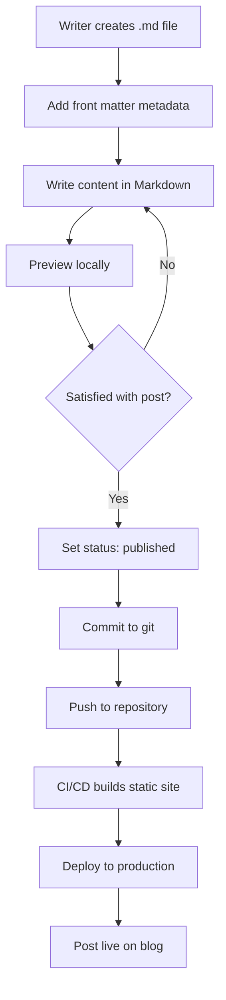
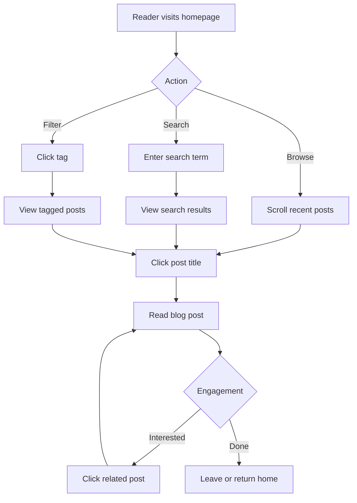

# Specification - Simple Blog Service

## Vision
Create a fast, accessible, and delightful reading experience for a personal blog. The blog should make it easy for writers to publish content and for readers to discover and engage with that content.

## Problem Statement
Many blog platforms are bloated with unnecessary features, slow to load, and difficult to maintain. Writers want to focus on writing, not fighting with complex CMS systems. Readers want fast, distraction-free reading experiences without ads, popups, or tracking scripts.

## Target Audience

### Primary: The Writer (Blog Owner)
- Comfortable with Markdown and basic git operations
- Values simplicity and control over their content
- Wants to focus on writing, not system maintenance
- Appreciates good design but isn't a designer
- May have ADHD or prefer streamlined workflows

### Secondary: The Reader
- Values fast-loading, clean reading experiences
- Reads on mobile devices frequently
- Appreciates good typography and readability
- May use screen readers or accessibility tools
- Wants to discover related content easily

## Core Features

### 1. Content Management

#### Blog Post Writing
**User Story**: As a writer, I want to write blog posts in Markdown so I can focus on content without formatting distractions.

**Requirements**:
- Support for standard Markdown syntax (headings, lists, links, images, code blocks)
- Syntax highlighting for code blocks with language detection
- Front matter support for metadata (title, date, tags, description, cover image)
- Draft and published states
- Automatic excerpt generation from first paragraph
- Support for internal links between posts

**Example Front Matter**:
```yaml
---
title: "Getting Started with SpecKit"
date: 2025-11-05
tags: [learning, speckit, documentation]
description: "A beginner's guide to specification-driven development"
coverImage: "/images/speckit-cover.jpg"
status: published
---
```

#### Content Organization
**User Story**: As a writer, I want to organize posts by tags and categories so readers can find related content.

**Requirements**:
- Tag-based categorization (many-to-many relationship)
- Automatic tag index pages
- Tag cloud visualization
- Chronological archive by year/month
- "Related posts" based on shared tags

### 2. Reading Experience

#### Blog Post Display
**User Story**: As a reader, I want to read blog posts with excellent typography so the content is comfortable to read.

**Requirements**:
- Responsive typography (fluid type scale)
- Optimal line length (45-75 characters per line)
- Sufficient contrast (WCAG AA minimum)
- Reading time estimate displayed
- Table of contents auto-generated from headings
- Smooth scrolling to headings
- Print-friendly stylesheet

#### Navigation
**User Story**: As a reader, I want to easily discover content so I can find posts that interest me.

**Requirements**:
- Homepage showing recent posts (latest 10)
- Pagination for older posts
- Search functionality (full-text search)
- Filter by tag
- Archive page organized by date
- Breadcrumb navigation
- Next/Previous post navigation

### 3. Performance Features

#### Static Generation
**User Story**: As a reader, I want pages to load instantly so I can start reading immediately.

**Requirements**:
- Static HTML generation for all blog posts
- Incremental builds (only regenerate changed content)
- Image optimization (automatic resizing, format conversion, lazy loading)
- CSS and JavaScript minification
- Critical CSS inlined in HTML
- Prefetching for linked pages on hover

#### Caching Strategy
**Requirements**:
- Service worker for offline reading
- CDN caching headers for static assets
- RSS feed for offline readers
- Sitemap generation for SEO

### 4. Accessibility Features

**User Story**: As a reader using assistive technology, I want full access to all content and functionality.

**Requirements**:
- Semantic HTML5 structure
- ARIA labels where appropriate
- Keyboard navigation support
- Skip to content link
- Focus indicators
- Alt text for all images
- Captions/transcripts for video/audio
- No flashing or auto-playing content

### 5. SEO and Discovery

**User Story**: As a writer, I want my posts to be discoverable via search engines.

**Requirements**:
- Open Graph meta tags for social sharing
- Twitter Card support
- Structured data (JSON-LD) for articles
- Automatic sitemap generation
- RSS/Atom feed
- Canonical URLs
- Descriptive meta descriptions

### 6. Developer Experience

**User Story**: As a developer, I want easy local development and deployment.

**Requirements**:
- Hot reload during development
- One-command setup (`npm install && npm start`)
- Environment-based configuration
- Easy deployment to static hosts (Netlify, Vercel, GitHub Pages)
- Clear error messages during build
- Development server with HTTPS support

## User Flows

### Flow 1: Publishing a New Post



### Flow 2: Reader Discovery Journey



## Success Criteria

### Minimum Viable Product (MVP)
- ✅ Write posts in Markdown with front matter
- ✅ Display posts with good typography
- ✅ Tag-based organization
- ✅ Homepage with recent posts
- ✅ Individual post pages
- ✅ Basic navigation (home, archive, tags)
- ✅ Mobile responsive design
- ✅ RSS feed generation

### Version 1.0
- ✅ All MVP features
- ✅ Full-text search
- ✅ Image optimization
- ✅ SEO optimization (meta tags, sitemap)
- ✅ Performance: 90+ Lighthouse score
- ✅ Accessibility: WCAG AA compliance
- ✅ Offline reading support
- ✅ Related posts recommendation

## Out of Scope

### Explicitly NOT Included
- ❌ User comments (can be added via third-party service if needed)
- ❌ User authentication/login
- ❌ Admin dashboard UI (content managed via files)
- ❌ Newsletter/email subscriptions (use third-party service)
- ❌ Analytics dashboard (use external analytics)
- ❌ Dynamic content (everything is static)
- ❌ Multi-language support (single language only)
- ❌ E-commerce/monetization features

## Technical Constraints

### Must Use
- TypeScript for type safety
- Markdown for content format
- Git for content versioning
- Static site generation (no server-side rendering)

### Must Avoid
- Complex CMS systems
- Database for content storage
- Server-side session management
- Client-side heavy JavaScript frameworks for content display

## Open Questions
(To be resolved in clarification.md)

1. Which static site generator should we use? (Next.js, Astro, Eleventy, etc.)
2. How should images be stored and served? (Git LFS, external CDN, etc.)
3. What search implementation? (Client-side index, Algolia, etc.)
4. Dark mode support?
5. Should there be a homepage hero section or just post list?
6. Code syntax highlighting library preference?

---

**Last Updated**: 2025-11-05
**Version**: 1.0.0
**Status**: 🧪 Experimental
