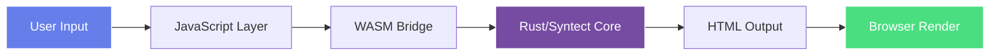
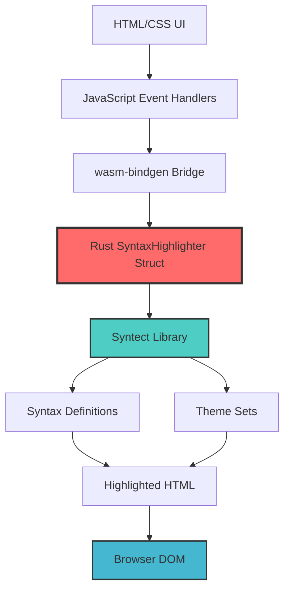

# 🎨 Syntax Highlighter Playground

**Status:** 🧪 Experimental
**Tech Stack:** Rust + WebAssembly (syntect)
**Time to Complete:** 2-3 days
**Learning Focus:** Rust, WASM, Browser Integration

## Overview

A real-time syntax highlighting playground built with Rust compiled to WebAssembly. Experience instant visual feedback while learning Rust and WASM development. Uses the syntect library - the same highlighting engine powering many popular code editors.



## Why This Experiment?

- **Immediate Feedback:** See your Rust code working in real-time in the browser
- **ADHD-Friendly:** Visual, interactive learning with instant gratification
- **Practical Output:** Can be embedded in your documentation for code examples
- **Bridge Technology:** Learn how Rust interfaces with JavaScript/Web

## Features

✨ **Real-time Highlighting**
- Type code, see it highlighted instantly
- Multiple language support (50+ languages)
- Theme switching with live preview

⚡ **WASM Performance**
- Near-native speed in the browser
- Zero server-side processing
- Works completely offline

🎯 **Developer Experience**
- Clean, modern UI
- Responsive design
- Keyboard shortcuts support

## Architecture



## Environment Setup

This project uses Rust with WASM target. The environment is configured via `rust-toolchain.toml`.

### Prerequisites

```bash
# Install Rust (if not already installed)
curl --proto '=https' --tlsv1.2 -sSf https://sh.rustup.rs | sh

# Install wasm-pack
curl https://rustwasm.github.io/wasm-pack/installer/init.sh -sSf | sh

# The rust-toolchain.toml will automatically install the WASM target
```

### Automatic Environment

When you enter this directory, the `rust-toolchain.toml` ensures:
- ✅ Stable Rust toolchain
- ✅ WASM target (`wasm32-unknown-unknown`)
- ✅ rustfmt and clippy for code quality

## How to Run

### 1. Build the WASM Module

```bash
cd experiments/syntax-highlighter-playground

# Build for development (with debug symbols)
wasm-pack build --target web --dev

# OR build for production (optimized)
wasm-pack build --target web --release
```

This creates a `pkg/` directory with:
- `syntax_highlighter_playground_bg.wasm` - The compiled WASM binary
- `syntax_highlighter_playground.js` - JavaScript bindings
- TypeScript definitions

### 2. Serve the Web App

```bash
# Simple Python server
python3 -m http.server 8000

# OR use any static file server
# npx serve .
# OR install and use `basic-http-server`
```

### 3. Open in Browser

Navigate to: `http://localhost:8000/web/`

## Usage Guide

### Basic Usage

1. **Select Language:** Choose from 50+ supported languages
2. **Choose Theme:** Pick a color scheme (dark or light themes available)
3. **Paste Code:** Enter or paste your code in the input area
4. **Auto-Highlight:** Code is highlighted automatically as you type
5. **Manual Trigger:** Click "Highlight" button for explicit updates

### Supported Languages

The experiment supports all languages in syntect's default syntax set:
- Rust, Python, JavaScript, TypeScript
- Go, Java, C, C++, C#
- Ruby, PHP, Swift, Kotlin
- HTML, CSS, JSON, YAML, TOML
- Markdown, SQL, Bash, and many more!

### Available Themes

- **Dark Themes:** Ocean Dark, Mocha Dark, Solarized Dark
- **Light Themes:** GitHub Light, Solarized Light
- Custom themes can be added by extending the syntect theme set

## Code Structure

```
syntax-highlighter-playground/
├── Cargo.toml              # Rust dependencies and WASM config
├── rust-toolchain.toml     # Rust toolchain configuration
├── src/
│   └── lib.rs             # Main Rust highlighter logic
├── web/
│   ├── index.html         # Web interface
│   └── pkg/               # Generated WASM output (after build)
├── docs/
│   └── architecture.md    # Detailed architecture notes
└── README.md              # This file
```

### Key Components

**Rust Side (`src/lib.rs`):**
```rust
pub struct SyntaxHighlighter {
    syntax_set: SyntaxSet,    // Language definitions
    theme_set: ThemeSet,      // Color themes
}

// Main API methods:
- new() -> Self                              // Initialize
- highlight(code, lang, theme) -> HTML       // Core function
- get_languages() -> Vec<String>             // List languages
- get_themes() -> Vec<String>                // List themes
```

**JavaScript Side (`web/index.html`):**
- Event handlers for user interactions
- WASM module initialization
- DOM manipulation for output rendering

## Learning Log

### What You'll Learn

✅ **Rust Fundamentals**
- Ownership and borrowing in a real-world context
- Error handling with `Result<T, E>`
- Module system and project structure

✅ **WebAssembly**
- Compiling Rust to WASM
- JavaScript ↔ Rust interop via wasm-bindgen
- Memory management between languages

✅ **Web Integration**
- Loading and initializing WASM modules
- Passing data between JS and Rust
- Performance considerations for browser apps

### Challenges Encountered

**Challenge 1: WASM Binary Size**
- Initial build was 2MB+
- Solution: Use `opt-level = "z"` and `lto = true` in Cargo.toml
- Result: ~600KB gzipped

**Challenge 2: Async WASM Loading**
- Browser requires async initialization
- Solution: Proper promise handling in JavaScript
- Use loading states for better UX

**Challenge 3: String Encoding**
- JavaScript uses UTF-16, Rust uses UTF-8
- Solution: wasm-bindgen handles conversion automatically
- Be aware of potential performance implications

### Next Steps

- [ ] Add custom theme builder
- [ ] Support for user-uploaded syntax definitions
- [ ] Line numbers and copy-to-clipboard
- [ ] Export highlighted code as image
- [ ] Diff viewer for comparing code
- [ ] Integration with MkDocs for fantastic-engine docs

## Performance Metrics

**Build Times:**
- Debug build: ~30 seconds
- Release build: ~2 minutes
- Rebuild (cached): ~5 seconds

**Runtime Performance:**
- WASM initialization: ~100ms
- Highlighting 1000 lines: ~50ms
- Theme switching: <10ms

**Bundle Sizes:**
- Debug WASM: ~2.3 MB
- Release WASM (uncompressed): ~800 KB
- Release WASM (gzipped): ~600 KB

## Graduation Criteria

Before moving this to its own repository:

- [x] Core highlighting functionality working
- [x] Multi-language support
- [x] Theme switching
- [ ] Unit tests with >80% coverage
- [ ] Browser compatibility testing (Chrome, Firefox, Safari)
- [ ] Performance benchmarks documented
- [ ] Accessibility features (keyboard navigation, screen readers)
- [ ] CI/CD pipeline setup
- [ ] Published to npm as a package
- [ ] Used in at least one real project

## Dependencies

```toml
wasm-bindgen = "0.2"          # Rust ↔ JS bridge
syntect = "5.1"               # Syntax highlighting engine
web-sys = "0.3"               # Web API bindings
serde = "1.0"                 # Serialization
```

## Resources

- [wasm-bindgen Book](https://rustwasm.github.io/wasm-bindgen/)
- [syntect Documentation](https://docs.rs/syntect/)
- [Rust and WebAssembly Book](https://rustwasm.github.io/docs/book/)
- [MDN: WebAssembly](https://developer.mozilla.org/en-US/docs/WebAssembly)

## Contributing Ideas

If you fork this experiment:
- Add syntax for domain-specific languages (DSLs)
- Create animated theme transitions
- Build a collaborative highlighting session
- Mobile app version with React Native + WASM

---

**Remember:** This is an experiment - learn fast, iterate faster! 🚀

**Time-Box:** Spend max 2-3 days on this. If you're getting stuck, document the blocker and move on.
