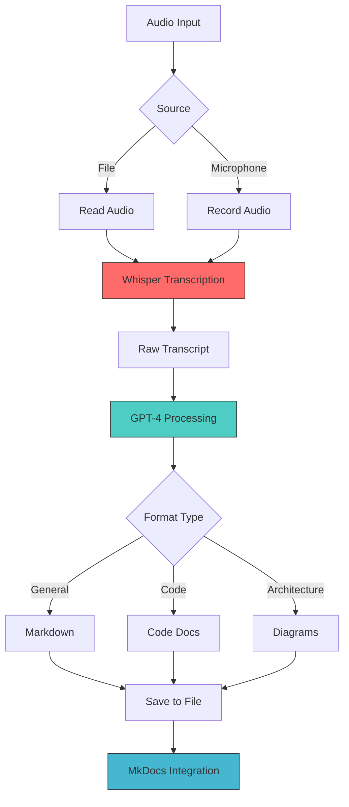

# 🎤 Voice-to-Documentation

**Status:** 🧪 Experimental
**Tech Stack:** Python + Whisper + GPT-4
**Time to Complete:** Weekend project (6-8 hours)
**Learning Focus:** AI APIs, Audio Processing, CLI Tools

## Overview

Document while coding without context switching! Record voice notes and automatically convert them into well-formatted markdown documentation.


## Why This Experiment?

- **ADHD-Friendly:** Document in the moment without breaking flow
- **No Context Switch:** Keep coding, just talk
- **Better Capture:** Voice is often clearer than typing scattered notes
- **Automatic Formatting:** AI transforms rambling into structured docs

## Features

✨ **Voice → Markdown**
- Record directly or upload existing audio
- Automatic transcription via Whisper
- AI-powered formatting via GPT-4
- Multiple documentation styles

📝 **Documentation Types**
- General documentation
- Code documentation
- Architecture diagrams (with Mermaid)
- API documentation
- Tutorial creation

🚀 **Developer Experience**
- Simple CLI interface
- Rich terminal output
- Quick mode for transcripts
- Direct MkDocs integration

## Architecture



## Environment Setup

This project uses Python 3.11+. Configuration is in `.python-version`.

### Prerequisites

```bash
# Install Python 3.11+ (using pyenv recommended)
pyenv install 3.11

# OR use uv (recommended)
curl -LsSf https://astral.sh/uv/install.sh | sh
```

### Installation

```bash
cd experiments/voice-to-documentation

# Create virtual environment
uv venv
source .venv/bin/activate

# Install dependencies
uv pip install -e ".[dev]"
```

### Configuration

Create `.env` file:
```bash
cp .env.example .env
# Edit .env and add your OpenAI API key
```

## How to Run

### Convert Existing Audio

```bash
# Basic conversion
voice2doc convert path/to/audio.mp3

# Specify output file
voice2doc convert audio.mp3 -o docs/my-feature.md

# Choose documentation type
voice2doc convert audio.mp3 --type architecture

# Add context for better formatting
voice2doc convert audio.mp3 --context "FastAPI authentication system"
```

### Record and Convert

```bash
# Record 60 seconds of audio
voice2doc record --duration 60

# Then convert
voice2doc convert recordings/recording.wav
```

### Quick Mode (Transcript Only)

```bash
# Just transcribe, copy to clipboard
voice2doc quick audio.mp3
```

## Usage Guide

### Workflow 1: Voice Notes While Coding

```bash
# While coding, explain what you're doing
voice2doc record -d 120 -o recordings/auth-feature.wav

# Convert to documentation
voice2doc convert recordings/auth-feature.wav \
  --type code \
  -o docs/features/authentication.md
```

### Workflow 2: Architecture Discussion

```bash
# Record team discussion or your thoughts
voice2doc record -d 300 -o recordings/architecture.wav

# Convert with architecture formatting
voice2doc convert recordings/architecture.wav \
  --type architecture \
  -o docs/architecture/system-design.md
```

### Workflow 3: Tutorial Creation

```bash
# Explain a concept out loud
voice2doc record -d 180 -o tutorials/react-hooks.wav

# Convert to tutorial format
voice2doc convert tutorials/react-hooks.wav \
  --type tutorial \
  -o docs/tutorials/react-hooks.md
```

## Documentation Types

### General (`--type general`)
Clean, structured markdown with proper sections.

### Code (`--type code`)
Formatted for code documentation with:
- Code blocks
- Function explanations
- Usage examples

### Architecture (`--type architecture`)
System design documentation with:
- Mermaid diagrams
- Component descriptions
- Data flow explanations

### API (`--type api`)
API documentation style with:
- Endpoint descriptions
- Request/response formats
- Examples

### Tutorial (`--type tutorial`)
Step-by-step guide format with:
- Numbered steps
- Code examples
- Learning objectives

## Example Voice → Documentation

**Voice Input:**
> "Okay so I just built this authentication system. It uses FastAPI and JWT tokens. When a user logs in, we validate their credentials against the database, then generate a JWT token with their user ID and roles. The token expires after 24 hours. We also have a refresh token flow for extending sessions."

**Generated Documentation:**
```markdown
# Authentication System

## Overview

This authentication system implements JWT-based authentication using FastAPI.

## Components

### Login Flow

1. User credentials validation against database
2. JWT token generation with user ID and roles
3. Token expiration: 24 hours

### Token Structure

```python
{
  "user_id": "...",
  "roles": ["..."],
  "exp": "..."
}
```

### Refresh Token Flow

Allows session extension without re-authentication.

## Architecture

[Mermaid diagram would be generated here]
```

## Code Structure

```
voice-to-documentation/
├── .python-version          # Python version
├── pyproject.toml          # Dependencies and config
├── .env.example            # Environment variables template
├── src/
│   ├── __init__.py
│   ├── main.py            # CLI interface
│   ├── transcribe.py      # Whisper integration
│   └── formatter.py       # GPT-4 formatting
├── recordings/            # Audio recordings
├── output/               # Generated documentation
├── tests/
│   └── test_main.py
└── README.md
```

## Learning Log

### What You'll Learn

✅ **OpenAI APIs**
- Whisper API for transcription
- GPT-4 API for text processing
- Prompt engineering for documentation

✅ **Audio Processing**
- PyAudio for recording
- Audio file format handling
- Streaming audio data

✅ **CLI Development**
- Click for command-line interfaces
- Rich for beautiful terminal output
- Progress bars and spinners

✅ **Python Best Practices**
- Type hints
- Environment configuration
- Package structure

### Challenges Encountered

**Challenge 1: Audio Format Compatibility**
- Whisper supports multiple formats
- Solution: Use pydub for format conversion
- Accepted: mp3, mp4, wav, webm, m4a

**Challenge 2: API Costs**
- Whisper: ~$0.006/minute
- GPT-4: ~$0.03/1K tokens
- Solution: Add cost estimation before processing

**Challenge 3: Transcription Accuracy**
- Background noise affects quality
- Solution: Record in quiet environment or use noise reduction
- Tips: Speak clearly, close to mic

**Challenge 4: Context for Formatting**
- AI needs context for best results
- Solution: Add `--context` flag
- Include project name, tech stack, purpose

### Next Steps

- [ ] Add noise reduction pre-processing
- [ ] Support for multiple speakers (meeting transcripts)
- [ ] Real-time transcription (stream audio)
- [ ] Integration with Obsidian/Notion
- [ ] Voice command shortcuts
- [ ] Language translation support
- [ ] Automatic topic extraction
- [ ] Cost tracking and budgets

## Performance Metrics

**API Call Times:**
- Whisper transcription: ~10-30s per minute of audio
- GPT-4 formatting: ~5-15s depending on length

**Costs (approximate):**
- 5-minute recording:
  - Whisper: ~$0.03
  - GPT-4: ~$0.10
  - Total: ~$0.13

**Accuracy:**
- Whisper: 95%+ with clear audio
- GPT-4 formatting: Excellent with good prompts

## Graduation Criteria

Before moving this to its own repository:

- [x] Core transcription working
- [x] GPT-4 formatting functional
- [x] CLI interface complete
- [ ] Unit tests with >70% coverage
- [ ] Support for all major audio formats
- [ ] Real-time recording mode
- [ ] Cost tracking feature
- [ ] MkDocs plugin
- [ ] Published to PyPI
- [ ] Used in production for 30 days

## Advanced Features (Future)

### Real-Time Transcription

Stream audio in chunks for live documentation:
```python
async def stream_transcribe(audio_stream):
    async for chunk in audio_stream:
        transcript = await whisper_api(chunk)
        yield transcript
```

### Multi-Speaker Support

Identify and separate different speakers in meetings:
```python
speakers = identify_speakers(audio)
for speaker, text in speakers:
    format_with_attribution(speaker, text)
```

### Integration with Development Tools

- **VS Code Extension:** Record from editor
- **Slack Bot:** Share voice notes → auto-document
- **MCP Server:** Expose to Claude Code

### Obsidian/Notion Integration

```python
# Auto-publish to Obsidian vault
publish_to_obsidian(
    documentation,
    vault_path="~/Documents/Obsidian",
    folder="Dev Notes"
)
```

## Tips for Best Results

**Recording Tips:**
1. Speak clearly and at moderate pace
2. Use good microphone (built-in laptop mic works)
3. Minimize background noise
4. Pause between topics for better segmentation

**Prompting Tips:**
1. Use `--context` flag liberally
2. Mention specific frameworks/libraries
3. State the intended audience
4. Reference related documentation

**Workflow Tips:**
1. Record immediately after implementing
2. Keep recordings under 5 minutes for focus
3. Review and edit AI output
4. Maintain a recordings archive

## Troubleshooting

### PyAudio Installation Issues

**macOS:**
```bash
brew install portaudio
pip install pyaudio
```

**Linux:**
```bash
sudo apt-get install portaudio19-dev
pip install pyaudio
```

**Windows:**
Download wheel from: https://www.lfd.uci.edu/~gohlke/pythonlibs/#pyaudio

### OpenAI API Errors

```bash
# Verify API key
echo $OPENAI_API_KEY

# Test connection
curl https://api.openai.com/v1/models \
  -H "Authorization: Bearer $OPENAI_API_KEY"
```

### Audio Format Not Supported

Convert using ffmpeg:
```bash
ffmpeg -i input.opus -acodec libmp3lame output.mp3
```

## Resources

- [OpenAI Whisper API](https://platform.openai.com/docs/guides/speech-to-text)
- [OpenAI GPT-4 API](https://platform.openai.com/docs/guides/gpt)
- [Click Documentation](https://click.palletsprojects.com/)
- [Rich Terminal Formatting](https://rich.readthedocs.io/)
- [PyAudio Documentation](https://people.csail.mit.edu/hubert/pyaudio/)

## Contributing Ideas

If you fork this experiment:
- Add video transcription support
- Build web interface
- Mobile app for on-the-go recording
- Team collaboration features
- Integrations with more platforms

---

**Remember:** Perfect is the enemy of done. Voice notes are always better than no notes! 🎙️

**ADHD Tip:** Keep a recording device/app easily accessible. The barrier to entry should be ONE tap/click.
