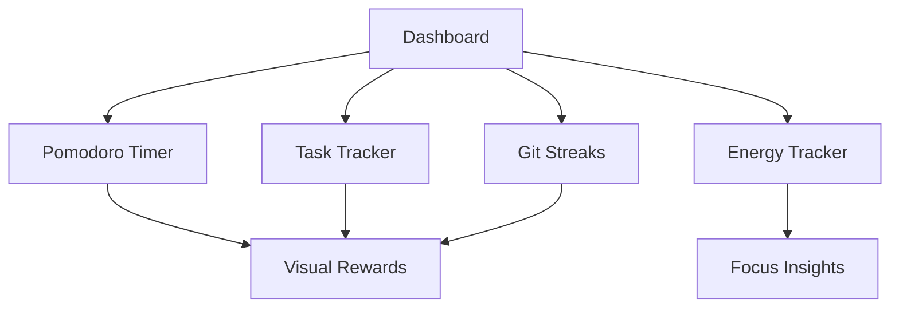
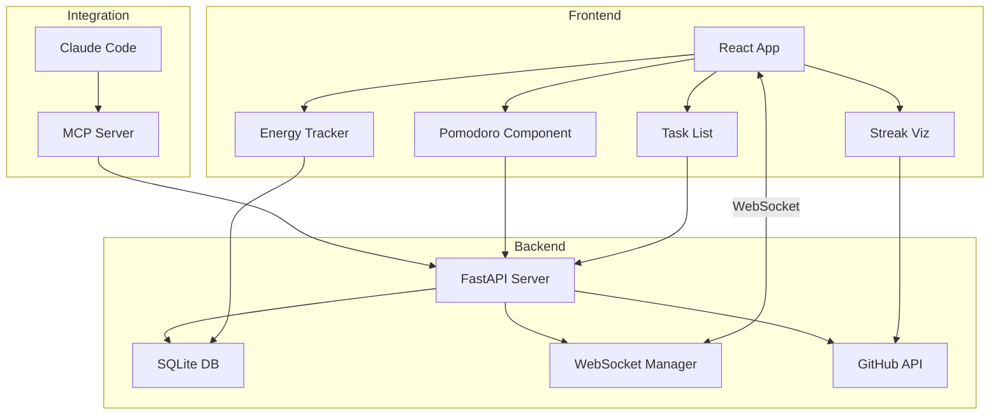

# 🎯 ADHD-Friendly Dev Dashboard

**Status:** 🚧 In Progress | **Tech:** Python/FastAPI + React | **Graduation:** 30 days daily use

## Overview

Visual task tracking, time-boxing timer, and dopamine-driven progress gamification designed specifically for ADHD developers.



## Features

### 🍅 Pomodoro Timer with Visual Rewards
- Customizable work/break intervals
- Animated progress rings
- Celebration animations on completion
- Break reminders with fun GIFs
- Daily streak counter

### 📊 Git Commit Streaks Visualization
- GitHub contribution graph
- Current streak highlighting
- Personal bests
- Commit heatmap
- Activity timeline

### ⚡ Daily Energy/Focus Level Tracker
- Hourly energy logging (1-10 scale)
- Correlation with productivity
- Best focus time identification
- Mood tracking integration

### 🎮 Gamification System
- XP points for task completion
- Levels and achievements
- Daily/weekly challenges
- Leaderboard (compete with yourself!)
- Unlockable themes

### 🔌 MCP Server Integration
- Expose dashboard data to Claude Code
- Voice commands for task management
- AI-powered task prioritization
- Context-aware break suggestions

## Tech Stack

**Backend:**
- FastAPI (Python 3.11+)
- SQLite for data persistence
- WebSockets for real-time updates
- MCP server for Claude integration

**Frontend:**
- React 18 + TypeScript
- Vite for build tooling
- TailwindCSS for styling
- Framer Motion for animations
- Recharts for visualizations

**Real-time:**
- WebSocket connections
- Live timers and notifications
- Collaborative features (future)

## Architecture



## Installation

### Backend Setup

```bash
cd projects/adhd-dev-dashboard/backend

# Create environment
uv venv
source .venv/bin/activate

# Install dependencies
uv pip install -e ".[dev]"

# Configure
cp .env.example .env
# Edit .env with your settings

# Run migrations
python -m alembic upgrade head

# Start server
uvicorn main:app --reload
```

### Frontend Setup

```bash
cd projects/adhd-dev-dashboard/frontend

# Install dependencies
npm install

# Start dev server
npm run dev
```

### MCP Server Setup

```bash
cd projects/adhd-dev-dashboard/mcp-server

# Install
npm install

# Configure Claude Code
# Add to ~/.config/claude-code/mcp.json
```

## Usage

### Starting Your Day

1. **Set Daily Goals**: Add 3-5 tasks in the dashboard
2. **Log Morning Energy**: Rate your energy level
3. **Start First Pomodoro**: 25-minute focus session
4. **Track Progress**: Visual updates as you work

### During Work

- **Timer Notifications**: Break reminders
- **Quick Task Add**: Capture thoughts without context switch
- **Energy Check-ins**: Log energy every 2 hours
- **Streak Maintenance**: Automatic git tracking

### End of Day

- **Review Accomplishments**: See XP earned
- **Check Streaks**: Maintain momentum
- **Tomorrow Planning**: Set next day's tasks
- **Export Summary**: Download daily report

## API Endpoints

### Tasks
- `POST /api/tasks` - Create task
- `GET /api/tasks` - List tasks
- `PUT /api/tasks/{id}` - Update task
- `DELETE /api/tasks/{id}` - Delete task
- `POST /api/tasks/{id}/complete` - Mark complete

### Pomodoro
- `POST /api/pomodoro/start` - Start timer
- `POST /api/pomodoro/pause` - Pause timer
- `POST /api/pomodoro/stop` - Stop timer
- `GET /api/pomodoro/stats` - Get statistics

### Energy Tracking
- `POST /api/energy` - Log energy level
- `GET /api/energy/today` - Today's levels
- `GET /api/energy/insights` - AI insights

### GitHub Integration
- `GET /api/github/streak` - Current streak
- `GET /api/github/contributions` - Contribution graph
- `GET /api/github/stats` - Overall stats

## MCP Server Commands

Expose to Claude Code:

```typescript
// Get current tasks
await mcp.callTool("adhd_dashboard", "get_tasks");

// Start pomodoro
await mcp.callTool("adhd_dashboard", "start_pomodoro", { duration: 25 });

// Log energy
await mcp.callTool("adhd_dashboard", "log_energy", { level: 8 });

// Get insights
await mcp.callTool("adhd_dashboard", "get_insights");
```

## Gamification System

### XP Rewards
- Complete task: 10 XP
- Finish pomodoro: 5 XP
- Maintain streak: 20 XP
- Daily goal hit: 50 XP
- Weekly goal hit: 200 XP

### Levels
- Level 1-5: Beginner (0-500 XP)
- Level 6-10: Intermediate (501-1500 XP)
- Level 11-20: Advanced (1501-5000 XP)
- Level 21+: Expert (5000+ XP)

### Achievements
- 🔥 "Week Warrior" - 7 day streak
- ⚡ "Focus Master" - 50 pomodoros
- 🎯 "Task Terminator" - 100 tasks completed
- 🌟 "Early Bird" - 30 morning starts
- 🦉 "Night Owl" - 30 evening sessions

## Customization

### Themes
- Cyberpunk (default)
- Forest Calm
- Ocean Breeze
- Sunset Vibes
- Monochrome Focus

### Timer Presets
- Classic: 25/5/15 (work/short break/long break)
- Short Sprint: 15/3/10
- Deep Work: 50/10/30
- Custom: Set your own intervals

### Notifications
- Browser notifications
- Sound alerts
- Visual flash
- Vibration (mobile)

## Graduation Criteria

- [x] Core functionality implemented
- [x] MCP server integration
- [ ] Used daily for 30 consecutive days
- [ ] Energy tracking insights accurate
- [ ] Mobile-responsive design
- [ ] Data export feature
- [ ] User testimonial
- [ ] Published to PyPI + npm

## Development Roadmap

**Phase 1: MVP** (Weeks 1-2)
- [ ] Basic task CRUD
- [ ] Pomodoro timer
- [ ] Simple gamification
- [ ] Basic visualizations

**Phase 2: Enhancement** (Weeks 3-4)
- [ ] Git integration
- [ ] Energy tracking
- [ ] Advanced visualizations
- [ ] Theme system

**Phase 3: Integration** (Weeks 5-6)
- [ ] MCP server
- [ ] Claude Code integration
- [ ] AI insights
- [ ] Data export

**Phase 4: Polish** (Weeks 7-8)
- [ ] Mobile optimization
- [ ] Performance tuning
- [ ] User testing
- [ ] Documentation

## Contributing

This is a personal project but ideas welcome!

## License

MIT

---

**Daily Checklist:**
- [ ] Use dashboard for all tasks
- [ ] Run at least 4 pomodoros
- [ ] Log energy 3+ times
- [ ] Review streaks
- [ ] Plan tomorrow

**Remember:** The goal is consistency, not perfection! 🎯
