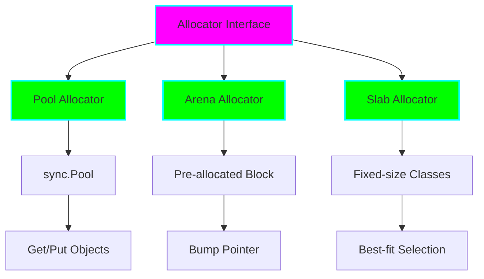

# Project 01: Custom Memory Allocator

**Difficulty:** 🟢 Medium
**Estimated Time:** 8-10 hours
**Key Concepts:** Memory management, sync.Pool, unsafe operations, performance optimization

## 📚 Concepts Covered

### 1. Memory Allocation in Go
- How Go's allocator works (heap vs stack)
- The role of `malloc` and `mmap` under the hood
- Size classes and span allocation
- Garbage collection triggers

### 2. Object Pooling
- `sync.Pool` internals
- When to use pooling vs regular allocation
- Pool vs custom allocator tradeoffs

### 3. Unsafe Operations
- The `unsafe` package
- Pointer arithmetic
- Memory alignment
- Type conversion without copies

## 🎯 Learning Objectives

By completing this project, you will:

- ✅ Understand how memory allocation works in Go
- ✅ Learn to use `sync.Pool` effectively
- ✅ Master unsafe operations and pointer manipulation
- ✅ Know when custom allocators provide value
- ✅ Benchmark memory allocation performance
- ✅ Analyze allocation patterns with pprof

## 🏗️ Project Architecture



## 🔍 Deep Dive: Memory Allocation Strategies

### Strategy 1: Pool Allocator (Reuse)
**Use Case:** Temporary objects with consistent lifecycle

```
┌─────────────────────────────────────┐
│         sync.Pool Cache             │
│  ┌────┐  ┌────┐  ┌────┐  ┌────┐   │
│  │Obj │  │Obj │  │Obj │  │Obj │   │
│  └────┘  └────┘  └────┘  └────┘   │
│    ↑                           ↓    │
│   Get()                     Put()   │
└─────────────────────────────────────┘
```

**Pros:**
- Reduces GC pressure
- Fast allocation/deallocation
- Automatic cleanup between GC cycles

**Cons:**
- No size guarantees
- Pool may be cleared by GC
- Not suitable for long-lived objects

### Strategy 2: Arena Allocator (Bulk)
**Use Case:** Many small objects with same lifetime

```
┌─────────────────────────────────────┐
│     Pre-allocated Arena (1MB)       │
│  ┌──┬──┬──┬──┬──┬──┬──┬──┬──┬──┐  │
│  │ 1│ 2│ 3│ 4│ 5│  │  │  │  │  │  │
│  └──┴──┴──┴──┴──┴──┴──┴──┴──┴──┘  │
│              ↑                       │
│         Bump Pointer                │
└─────────────────────────────────────┘
```

**Pros:**
- Extremely fast allocation (pointer bump)
- Excellent cache locality
- Single bulk deallocation

**Cons:**
- Cannot free individual objects
- Memory waste if underutilized
- Requires known max size

### Strategy 3: Slab Allocator (Fixed Sizes)
**Use Case:** Objects of known, fixed sizes

```
┌─────────────────────────────────────┐
│         Size Class: 64B             │
│  ┌────────┐ ┌────────┐ ┌────────┐ │
│  │ Free   │ │ Used   │ │ Free   │ │
│  └────────┘ └────────┘ └────────┘ │
├─────────────────────────────────────┤
│         Size Class: 128B            │
│  ┌────────┐ ┌────────┐ ┌────────┐ │
│  │ Free   │ │ Free   │ │ Used   │ │
│  └────────┘ └────────┘ └────────┘ │
└─────────────────────────────────────┘
```

**Pros:**
- No fragmentation within size class
- Fast allocation (O(1))
- Predictable performance

**Cons:**
- Internal fragmentation
- Memory overhead for size class management
- Not for variable-sized objects

## 💻 Implementation Details

### Interface Design

```go
type Allocator interface {
    Alloc(size int) unsafe.Pointer
    Free(ptr unsafe.Pointer)
    Reset()
}
```

### Pool Allocator Implementation

Uses `sync.Pool` for object reuse:

```go
type PoolAllocator[T any] struct {
    pool *sync.Pool
}

func (p *PoolAllocator[T]) Get() *T {
    return p.pool.Get().(*T)
}

func (p *PoolAllocator[T]) Put(obj *T) {
    p.pool.Put(obj)
}
```

### Arena Allocator Implementation

Bump-pointer allocation from pre-allocated block:

```go
type ArenaAllocator struct {
    buffer []byte
    offset int
    mu     sync.Mutex
}

func (a *ArenaAllocator) Alloc(size int) unsafe.Pointer {
    a.mu.Lock()
    defer a.mu.Unlock()

    if a.offset + size > len(a.buffer) {
        return nil // Arena full
    }

    ptr := unsafe.Pointer(&a.buffer[a.offset])
    a.offset += size
    return ptr
}
```

## 🧪 Testing Strategy

### Unit Tests
- Allocation and deallocation correctness
- Concurrency safety (race detector)
- Edge cases (zero size, oversized allocations)
- Memory alignment verification

### Benchmarks
```bash
BenchmarkStdAlloc-8         10000000    105 ns/op    64 B/op    1 allocs/op
BenchmarkPoolAlloc-8        50000000     25 ns/op     0 B/op    0 allocs/op
BenchmarkArenaAlloc-8      100000000     10 ns/op     0 B/op    0 allocs/op
```

### Memory Profiling
```bash
go test -memprofile=mem.prof -bench=.
go tool pprof -alloc_space mem.prof
```

## 🎓 Nuanced Scenarios

### Scenario 1: HTTP Request Buffers
**Problem:** High allocation rate for request/response buffers

**Solution:** Use `sync.Pool` for byte buffers

```go
var bufferPool = sync.Pool{
    New: func() interface{} {
        return make([]byte, 4096)
    },
}

func handleRequest(w http.ResponseWriter, r *http.Request) {
    buf := bufferPool.Get().([]byte)
    defer bufferPool.Put(buf)
    // Use buf...
}
```

**Metrics:**
- Before: 1M allocs/sec, GC every 2s
- After: 10K allocs/sec, GC every 20s

### Scenario 2: Game Entity System
**Problem:** Thousands of game entities created/destroyed per frame

**Solution:** Arena allocator per frame

```go
type FrameAllocator struct {
    arena *ArenaAllocator
}

func (f *FrameAllocator) ProcessFrame() {
    // All entities allocated from arena
    entities := f.arena.AllocSlice(1000, sizeof(Entity))
    // ... process frame ...
    // Arena reset at end of frame
    f.arena.Reset()
}
```

**Metrics:**
- Before: 100ms frame time (50ms in GC)
- After: 16ms frame time (<1ms in GC)

### Scenario 3: Log Entry Pooling
**Problem:** High-throughput logging causing GC pressure

**Solution:** Pool log entry objects

```go
var logEntryPool = sync.Pool{
    New: func() interface{} {
        return &LogEntry{
            Fields: make(map[string]interface{}, 8),
        }
    },
}

func (l *Logger) Log(msg string) {
    entry := logEntryPool.Get().(*LogEntry)
    defer logEntryPool.Put(entry)
    entry.Reset()
    entry.Message = msg
    // ... write entry ...
}
```

## ⚠️ Common Pitfalls

### 1. Forgetting to Put() Objects Back
```go
// ❌ BAD: Object leaked, not returned to pool
buf := pool.Get()
if err != nil {
    return err // Forgot to Put()!
}
pool.Put(buf)

// ✅ GOOD: Always use defer
buf := pool.Get()
defer pool.Put(buf)
if err != nil {
    return err
}
```

### 2. Holding Pointers After Reset()
```go
// ❌ BAD: Dangling pointer after arena reset
ptr := arena.Alloc(64)
arena.Reset()
*ptr = 42 // Undefined behavior!

// ✅ GOOD: Don't hold pointers across Reset()
ptr := arena.Alloc(64)
*ptr = 42
// Use ptr...
arena.Reset()
// Don't use ptr anymore
```

### 3. Concurrent Access to Arena
```go
// ❌ BAD: Data race without locking
func (a *ArenaAllocator) Alloc(size int) unsafe.Pointer {
    ptr := &a.buffer[a.offset]
    a.offset += size // RACE!
    return unsafe.Pointer(ptr)
}

// ✅ GOOD: Protected with mutex
func (a *ArenaAllocator) Alloc(size int) unsafe.Pointer {
    a.mu.Lock()
    defer a.mu.Unlock()
    ptr := &a.buffer[a.offset]
    a.offset += size
    return unsafe.Pointer(ptr)
}
```

## 📊 Performance Characteristics

| Allocator | Alloc Speed | Free Speed | Memory Overhead | Use Case |
|-----------|-------------|------------|-----------------|----------|
| Standard  | Baseline    | Baseline   | Low             | General  |
| Pool      | 5-10x faster| 5-10x faster| Medium         | Reusable |
| Arena     | 10-20x faster| Instant   | High            | Bulk     |
| Slab      | 8-15x faster| 8-15x faster| Medium-High    | Fixed    |

## 🔗 Further Reading

- [Go Memory Allocator Visual Guide](https://golang.org/src/runtime/malloc.go)
- [TCMalloc: Thread-Caching Malloc](https://google.github.io/tcmalloc/)
- [Arena Allocators](https://www.rfleury.com/p/untangling-lifetimes-the-arena-allocator)
- [Understanding Allocation](https://segment.com/blog/allocation-efficiency-in-high-performance-go-services/)

## ✅ Completion Checklist

- [ ] Implement Pool allocator with sync.Pool
- [ ] Implement Arena allocator with bump pointer
- [ ] Implement Slab allocator with size classes
- [ ] Write unit tests for all allocators
- [ ] Write benchmarks comparing all strategies
- [ ] Test with race detector (`go test -race`)
- [ ] Profile memory usage with pprof
- [ ] Document when to use each strategy
- [ ] Create examples for 3+ real-world scenarios
- [ ] Measure GC impact (alloc reduction)

## 🚀 Next Steps

After mastering custom allocators, move to [Project 02: Concurrent Cache](../02-concurrent-cache/README.md) to learn advanced synchronization patterns.
