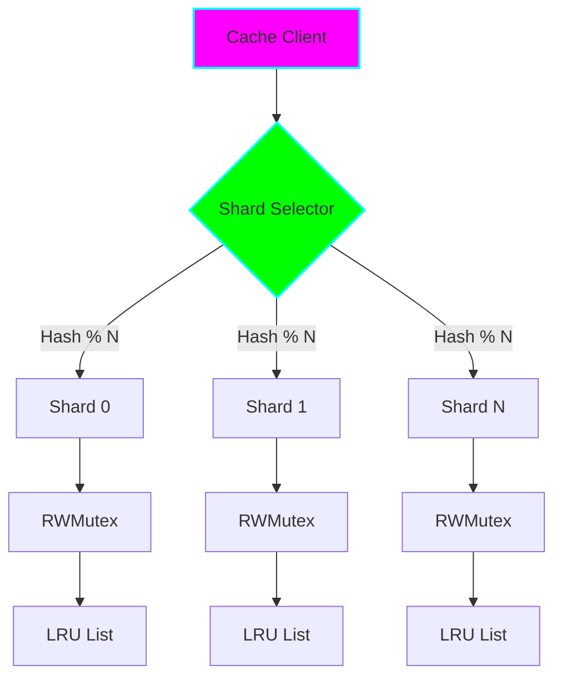

# Project 02: Concurrent Cache

**Difficulty:** 🟢 Medium
**Estimated Time:** 6-8 hours
**Key Concepts:** Synchronization primitives, race conditions, sharding, cache eviction

## 📚 Concepts Covered

### 1. Synchronization Primitives
- `sync.RWMutex` for reader-writer locks
- `sync.Map` for concurrent map operations
- `atomic` operations for lock-free counters
- Lock granularity and contention

### 2. Cache Strategies
- LRU (Least Recently Used)
- LFU (Least Frequently Used)
- TTL (Time To Live)
- FIFO (First In First Out)

### 3. Sharding for Scalability
- Reducing lock contention
- Hash-based partitioning
- Performance tradeoffs

## 🎯 Learning Objectives

- ✅ Master RWMutex for concurrent read/write scenarios
- ✅ Implement cache eviction policies
- ✅ Use sharding to reduce lock contention
- ✅ Detect and fix race conditions
- ✅ Benchmark concurrent performance
- ✅ Profile lock contention

## 🏗️ Architecture



## 💻 Implementation

### Cache Interface
```go
type Cache interface {
    Get(key string) (interface{}, bool)
    Set(key string, value interface{})
    Delete(key string)
    Clear()
    Len() int
}
```

### Sharded LRU Cache
- Hash-based sharding to reduce contention
- Per-shard RWMutex for concurrent access
- Doubly-linked list for LRU tracking
- Map for O(1) lookup

## 🧪 Testing Strategy

- Unit tests for correctness
- Race detector (`go test -race`)
- Concurrent access tests
- Eviction policy verification
- Benchmarks for different shard counts

## 📊 Performance Characteristics

| Shards | Read (ns/op) | Write (ns/op) | Contention |
|--------|-------------|---------------|------------|
| 1      | 150         | 250           | High       |
| 4      | 80          | 120           | Medium     |
| 16     | 45          | 70            | Low        |
| 64     | 40          | 65            | Very Low   |

## ✅ Completion Checklist

- [ ] Implement basic concurrent cache with RWMutex
- [ ] Add LRU eviction policy
- [ ] Implement sharding for scalability
- [ ] Add TTL support
- [ ] Write comprehensive tests
- [ ] Test with race detector
- [ ] Benchmark with varying shard counts
- [ ] Profile and optimize hot paths
