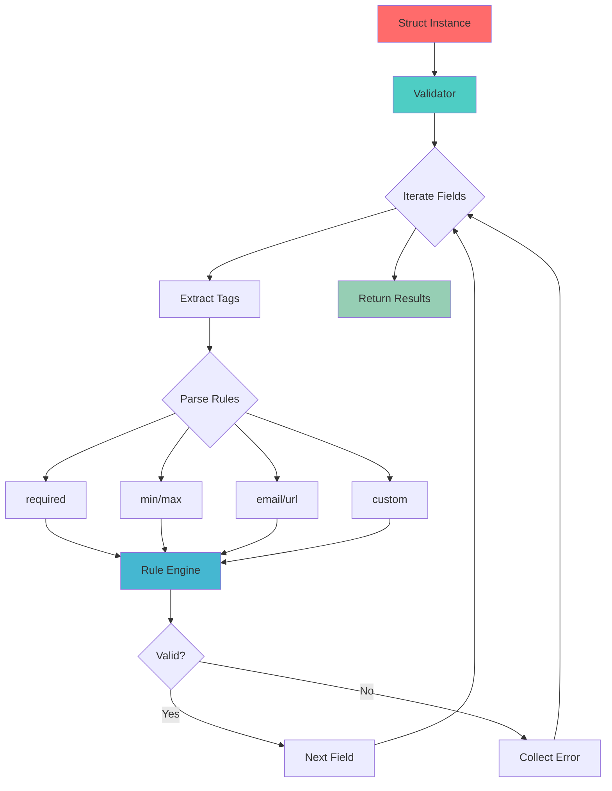
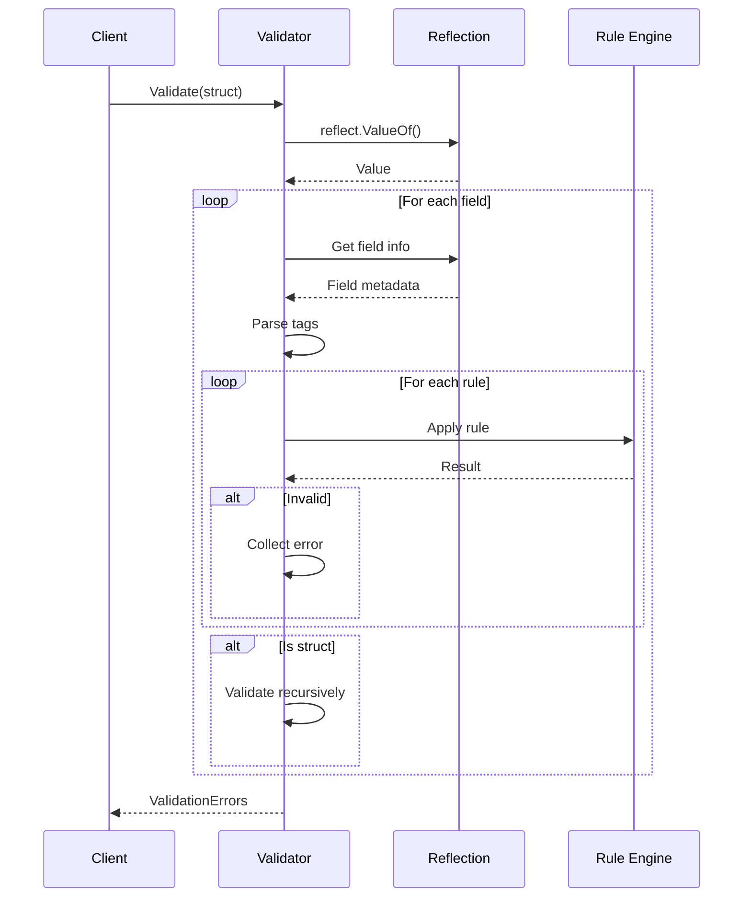
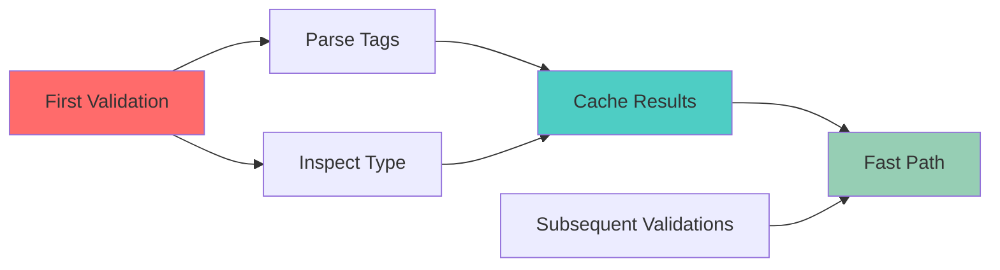

# 03 - Reflection-Based Validator

**Status:** 🧪 Educational Project
**Difficulty:** Intermediate
**Estimated Time:** 3-4 hours

## Overview

Build a comprehensive struct validation system using Go's reflection package. This project demonstrates advanced reflection techniques, struct tag parsing, and custom validation rules.

## Key Concepts Covered

- Go reflection API (`reflect` package)
- Struct tag parsing and interpretation
- Type introspection and manipulation
- Custom validation rules and error aggregation
- Interface-based extensibility
- Method value extraction

## Learning Objectives

After completing this project, you will understand:

1. How to use reflection to inspect struct fields and types
2. How to parse and interpret struct tags
3. How to implement a plugin-based validation system
4. How to aggregate and report validation errors
5. Best practices for reflection-based libraries
6. Performance considerations when using reflection

## Architecture



## Implementation Details

### 1. Core Validator

The validator uses reflection to:
- Traverse struct fields recursively
- Extract and parse validation tags
- Apply validation rules
- Aggregate errors

### 2. Validation Tags

Supported tag syntax:
```go
type User struct {
    Name  string `validate:"required,min=3,max=50"`
    Email string `validate:"required,email"`
    Age   int    `validate:"min=18,max=120"`
    URL   string `validate:"url,optional"`
}
```

### 3. Validation Rules

Built-in validators:
- `required` - field must not be zero value
- `min=N` - minimum value/length
- `max=N` - maximum value/length
- `email` - valid email format
- `url` - valid URL format
- `oneof=a,b,c` - value must be one of specified options
- `len=N` - exact length
- `gt=N`, `gte=N`, `lt=N`, `lte=N` - numeric comparisons

### 4. Custom Validators

Extensible through the `ValidatorFunc` interface:
```go
type ValidatorFunc func(field reflect.Value, param string) error
```

### 5. Nested Struct Validation

Recursively validates embedded and nested structs:
```go
type Address struct {
    Street string `validate:"required"`
    City   string `validate:"required"`
}

type User struct {
    Name    string  `validate:"required"`
    Address Address `validate:"required"`
}
```

## Validation Flow



## Testing Strategy

### Unit Tests
- Test each validation rule independently
- Test tag parsing logic
- Test nested struct validation
- Test custom validator registration

### Edge Cases
- Zero values vs explicitly set values
- Pointer fields (nil vs non-nil)
- Unexported fields (should be skipped)
- Invalid struct tags
- Circular references

### Benchmarks
- Simple struct validation
- Deeply nested struct validation
- Large struct with many fields
- Comparison with other validation libraries

## Real-World Scenarios

### 1. API Request Validation
```go
type CreateUserRequest struct {
    Username string `validate:"required,min=3,max=20"`
    Email    string `validate:"required,email"`
    Password string `validate:"required,min=8"`
}

func CreateUser(w http.ResponseWriter, r *http.Request) {
    var req CreateUserRequest
    json.NewDecoder(r.Body).Decode(&req)

    if errs := validator.Validate(req); errs != nil {
        http.Error(w, errs.Error(), http.StatusBadRequest)
        return
    }
    // Process request...
}
```

### 2. Configuration Validation
```go
type ServerConfig struct {
    Host     string `validate:"required"`
    Port     int    `validate:"required,min=1,max=65535"`
    Timeout  int    `validate:"min=1"`
    MaxConns int    `validate:"required,min=1"`
}
```

### 3. Database Model Validation
```go
type Product struct {
    ID    int     `validate:"required,min=1"`
    Name  string  `validate:"required,min=1,max=200"`
    Price float64 `validate:"required,gt=0"`
    Stock int     `validate:"gte=0"`
}
```

## Performance Considerations

### Optimization Techniques

1. **Tag Caching**: Cache parsed tags to avoid repeated parsing
2. **Type Caching**: Cache struct field metadata
3. **Lazy Validation**: Only validate changed fields when possible
4. **Compiled Validators**: Pre-compile validation rules

### Reflection Costs



## Advanced Features

### 1. Cross-Field Validation
```go
type PasswordChange struct {
    Password        string `validate:"required,min=8"`
    ConfirmPassword string `validate:"required,eqfield=Password"`
}
```

### 2. Conditional Validation
```go
type User struct {
    Type    string `validate:"required,oneof=person company"`
    Name    string `validate:"required_if=Type person"`
    Company string `validate:"required_if=Type company"`
}
```

### 3. Dive Validation (Slices/Maps)
```go
type Group struct {
    Name    string   `validate:"required"`
    Members []string `validate:"required,dive,email"`
}
```

## Common Pitfalls

1. **Unexported Fields**: Reflection cannot access unexported fields
2. **Performance**: Reflection is slower than type-safe code
3. **Type Safety**: Errors caught at runtime, not compile time
4. **Nil Pointers**: Always check for nil before dereferencing
5. **Deep Recursion**: Be careful with circular references

## Completion Checklist

- [ ] Implement core validator with reflection
- [ ] Parse and interpret struct tags
- [ ] Implement built-in validation rules (required, min, max, etc.)
- [ ] Add custom validator registration
- [ ] Support nested struct validation
- [ ] Implement error aggregation and reporting
- [ ] Add comprehensive unit tests
- [ ] Add benchmarks comparing with/without caching
- [ ] Test with realistic data structures
- [ ] Document all validation rules and tags
- [ ] Add examples for common use cases
- [ ] Test edge cases (nil pointers, zero values, etc.)

## Further Reading

- [Go Reflection Documentation](https://go.dev/blog/laws-of-reflection)
- [Struct Tags in Go](https://go.dev/wiki/Well-known-struct-tags)
- [go-playground/validator](https://github.com/go-playground/validator) - Popular validation library
- [Effective Go - Reflection](https://go.dev/doc/effective_go#reflection)

## Next Steps

After completing this project, consider:
1. Adding support for XML/JSON tag validation
2. Building a form validator for web applications
3. Creating a validator code generator for better performance
4. Implementing validation middleware for gRPC
