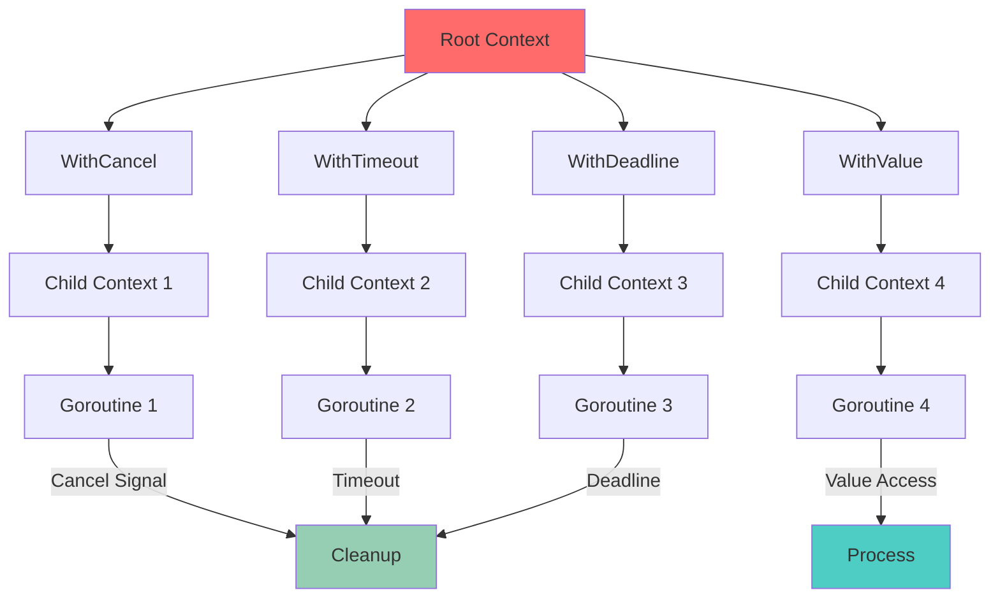
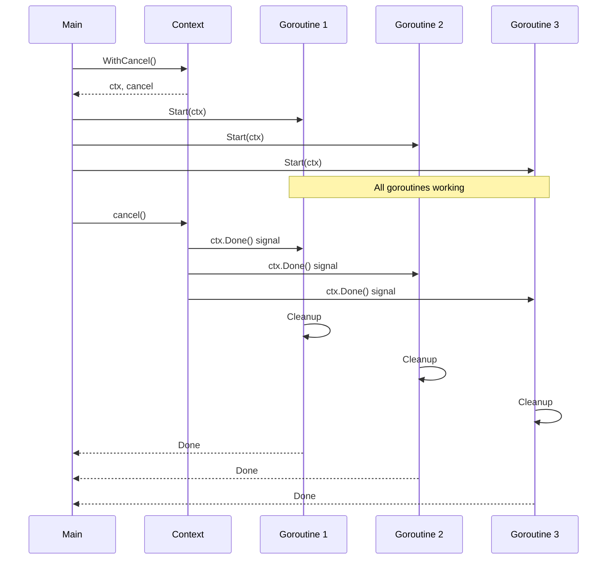
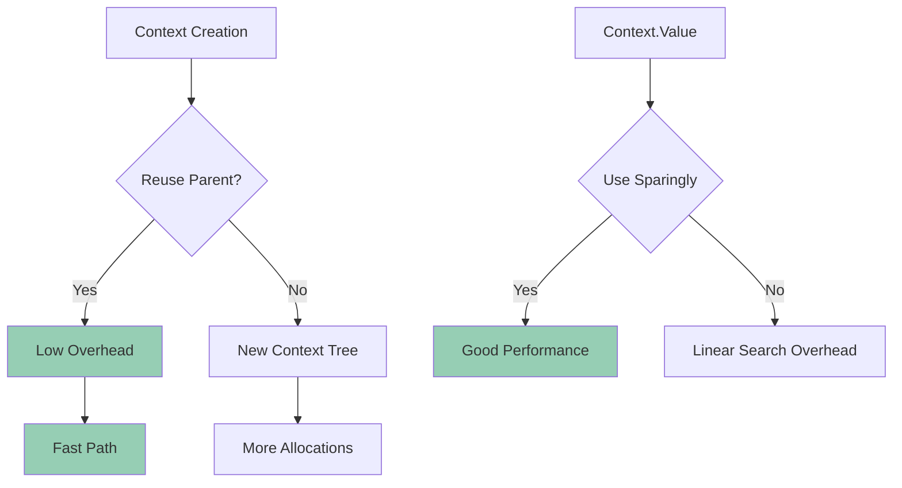

# 04 - Context Patterns

**Status:** 🧪 Educational Project
**Difficulty:** Intermediate
**Estimated Time:** 3-4 hours

## Overview

Master advanced context patterns in Go, including cancellation propagation, deadline management, value propagation, and common anti-patterns. This project demonstrates production-ready context usage patterns.

## Key Concepts Covered

- Context cancellation and propagation
- Timeout and deadline management
- Context value storage and retrieval
- Goroutine coordination with context
- Context best practices and anti-patterns
- Select statements with context
- Context-aware HTTP clients and servers

## Learning Objectives

After completing this project, you will understand:

1. How to use context for cancellation signals
2. When and how to set timeouts and deadlines
3. Best practices for context value storage
4. How to propagate context through function calls
5. Common context anti-patterns to avoid
6. Integration with HTTP and gRPC
7. Testing context-based code

## Architecture



## Context Patterns

### 1. Cancellation Pattern

```go
ctx, cancel := context.WithCancel(context.Background())
defer cancel()

go func(ctx context.Context) {
    select {
    case <-ctx.Done():
        // Handle cancellation
        return
    case <-time.After(time.Second):
        // Do work
    }
}(ctx)

// Cancel when done
cancel()
```

### 2. Timeout Pattern

```go
ctx, cancel := context.WithTimeout(context.Background(), 5*time.Second)
defer cancel()

result, err := DoWorkWithTimeout(ctx)
if err == context.DeadlineExceeded {
    // Handle timeout
}
```

### 3. Deadline Pattern

```go
deadline := time.Now().Add(10 * time.Second)
ctx, cancel := context.WithDeadline(context.Background(), deadline)
defer cancel()

select {
case <-ctx.Done():
    // Deadline exceeded or cancelled
case result := <-resultChan:
    // Work completed
}
```

### 4. Value Pattern

```go
type contextKey string

const requestIDKey contextKey = "requestID"

ctx := context.WithValue(context.Background(), requestIDKey, "12345")

// Later retrieve
if id, ok := ctx.Value(requestIDKey).(string); ok {
    log.Printf("Request ID: %s", id)
}
```

## Context Flow



## Implementation Details

### 1. Pipeline with Context

Chain operations with context propagation:
```go
func Pipeline(ctx context.Context, input <-chan int) <-chan int {
    output := make(chan int)
    go func() {
        defer close(output)
        for {
            select {
            case <-ctx.Done():
                return
            case val, ok := <-input:
                if !ok {
                    return
                }
                // Process and send
                select {
                case <-ctx.Done():
                    return
                case output <- val * 2:
                }
            }
        }
    }()
    return output
}
```

### 2. Fan-Out with Context

Distribute work across multiple goroutines:
```go
func FanOut(ctx context.Context, input <-chan int, workers int) []<-chan int {
    outputs := make([]<-chan int, workers)
    for i := 0; i < workers; i++ {
        outputs[i] = worker(ctx, input)
    }
    return outputs
}
```

### 3. Context-Aware HTTP Client

```go
func FetchWithContext(ctx context.Context, url string) (*Response, error) {
    req, err := http.NewRequestWithContext(ctx, "GET", url, nil)
    if err != nil {
        return nil, err
    }
    return http.DefaultClient.Do(req)
}
```

### 4. Context Value Best Practices

Only use for request-scoped data:
- Request IDs
- Authentication tokens
- Trace IDs
- User information

Never use for:
- Optional parameters
- Function dependencies
- Configuration

## Testing Strategy

### Unit Tests
- Test cancellation propagation
- Test timeout behavior
- Test deadline handling
- Test value storage/retrieval
- Test goroutine cleanup

### Integration Tests
- Test context with HTTP handlers
- Test context with database operations
- Test context with external APIs
- Test context with worker pools

### Race Condition Tests
```go
func TestContextRace(t *testing.T) {
    ctx, cancel := context.WithCancel(context.Background())
    var wg sync.WaitGroup

    for i := 0; i < 100; i++ {
        wg.Add(1)
        go func() {
            defer wg.Done()
            select {
            case <-ctx.Done():
                return
            case <-time.After(time.Millisecond):
            }
        }()
    }

    cancel()
    wg.Wait()
}
```

## Real-World Scenarios

### 1. HTTP Server with Timeout

```go
func handler(w http.ResponseWriter, r *http.Request) {
    ctx, cancel := context.WithTimeout(r.Context(), 5*time.Second)
    defer cancel()

    result, err := fetchData(ctx)
    if err == context.DeadlineExceeded {
        http.Error(w, "Request timeout", http.StatusRequestTimeout)
        return
    }

    json.NewEncoder(w).Encode(result)
}
```

### 2. Database Query with Cancellation

```go
func QueryUsers(ctx context.Context, db *sql.DB, name string) ([]User, error) {
    query := "SELECT id, name, email FROM users WHERE name LIKE ?"
    rows, err := db.QueryContext(ctx, query, name+"%")
    if err != nil {
        return nil, err
    }
    defer rows.Close()

    var users []User
    for rows.Next() {
        select {
        case <-ctx.Done():
            return nil, ctx.Err()
        default:
            var u User
            if err := rows.Scan(&u.ID, &u.Name, &u.Email); err != nil {
                return nil, err
            }
            users = append(users, u)
        }
    }
    return users, nil
}
```

### 3. Worker Pool with Context

```go
func WorkerPool(ctx context.Context, jobs <-chan Job, workers int) <-chan Result {
    results := make(chan Result)
    var wg sync.WaitGroup

    for i := 0; i < workers; i++ {
        wg.Add(1)
        go func() {
            defer wg.Done()
            for {
                select {
                case <-ctx.Done():
                    return
                case job, ok := <-jobs:
                    if !ok {
                        return
                    }
                    results <- processJob(job)
                }
            }
        }()
    }

    go func() {
        wg.Wait()
        close(results)
    }()

    return results
}
```

## Common Anti-Patterns

### 1. Storing Context in Struct
```go
// DON'T
type Server struct {
    ctx context.Context // Bad!
}

// DO
func (s *Server) Process(ctx context.Context) {
    // Pass context as parameter
}
```

### 2. Not Calling Cancel
```go
// DON'T
ctx, _ := context.WithTimeout(parent, time.Second)

// DO
ctx, cancel := context.WithTimeout(parent, time.Second)
defer cancel()
```

### 3. Ignoring ctx.Done()
```go
// DON'T
for {
    // Work without checking cancellation
}

// DO
for {
    select {
    case <-ctx.Done():
        return ctx.Err()
    default:
        // Do work
    }
}
```

### 4. Passing nil Context
```go
// DON'T
DoWork(nil)

// DO
DoWork(context.Background())
DoWork(context.TODO())
```

## Performance Considerations



## Completion Checklist

- [ ] Implement cancellation pattern examples
- [ ] Implement timeout and deadline patterns
- [ ] Create context value helpers with type safety
- [ ] Build context-aware pipeline
- [ ] Implement fan-out/fan-in with context
- [ ] Create context-aware HTTP client/server
- [ ] Add comprehensive unit tests
- [ ] Test cancellation propagation
- [ ] Test timeout and deadline behavior
- [ ] Add race condition tests
- [ ] Benchmark context creation and value access
- [ ] Document best practices and anti-patterns

## Further Reading

- [Go Context Package](https://pkg.go.dev/context)
- [Go Concurrency Patterns: Context](https://go.dev/blog/context)
- [Context Best Practices](https://go.dev/blog/context-and-structs)
- [Understanding Context Cancellation](https://www.digitalocean.com/community/tutorials/how-to-use-contexts-in-go)

## Next Steps

After completing this project, consider:
1. Implementing distributed tracing with context
2. Building context-aware middleware stack
3. Creating context monitoring and metrics
4. Integrating with OpenTelemetry
