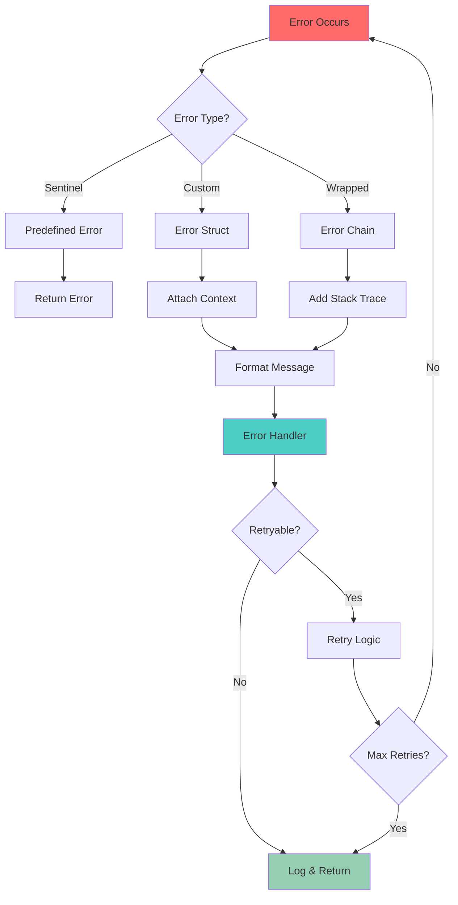
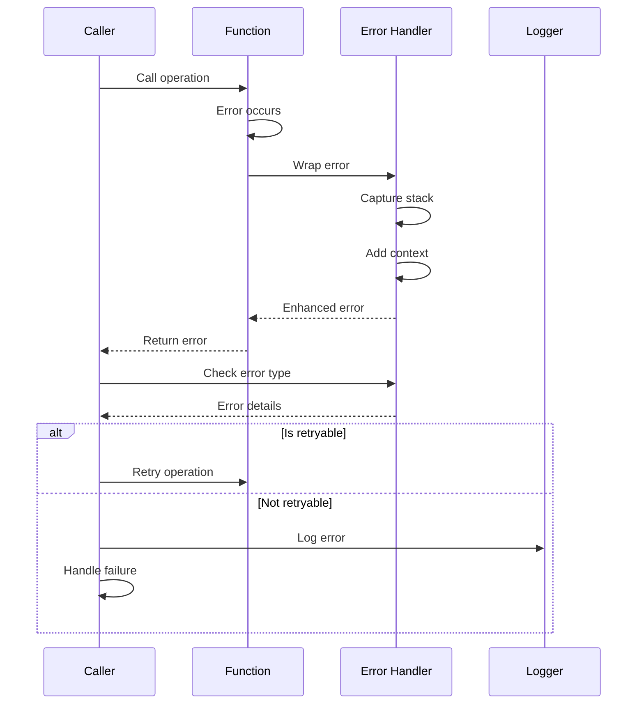
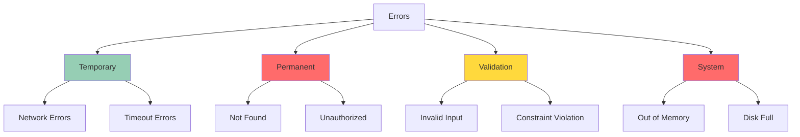
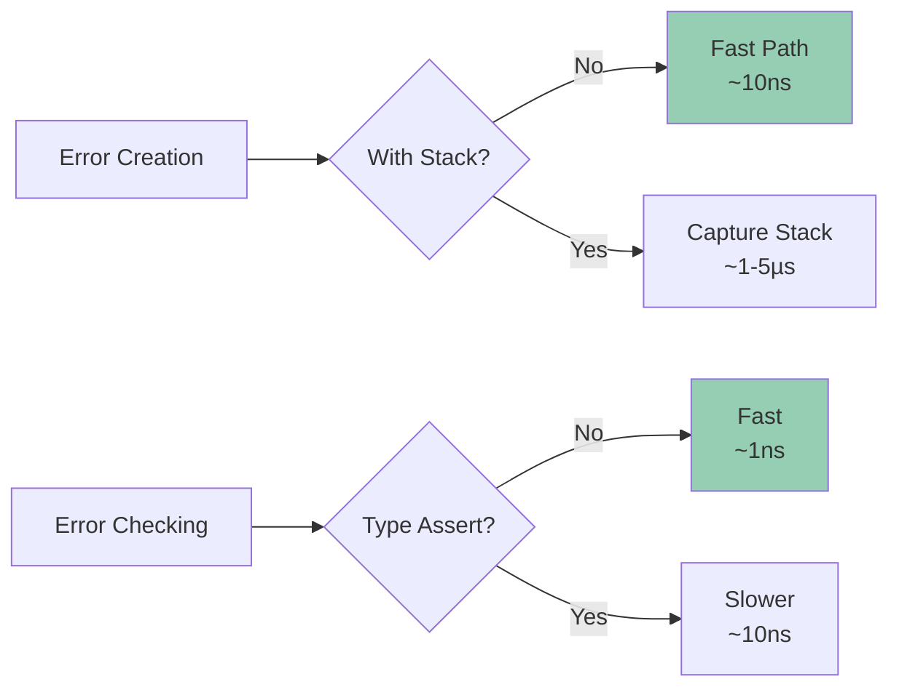

# 05 - Custom Error Handling

**Status:** 🧪 Educational Project
**Difficulty:** Intermediate
**Estimated Time:** 3-4 hours

## Overview

Build a comprehensive error handling system with stack traces, error wrapping, error types, and sentinel errors. Learn production-grade error management patterns used in large-scale Go applications.

## Key Concepts Covered

- Error wrapping with `errors.Wrap` and `fmt.Errorf`
- Stack trace capture and formatting
- Sentinel errors and error types
- Error chains and unwrapping
- Custom error types with context
- Error aggregation
- Retry logic with error analysis

## Learning Objectives

After completing this project, you will understand:

1. How to create informative custom error types
2. When to use sentinel errors vs error types
3. How to capture and format stack traces
4. Error wrapping best practices
5. How to build error chains
6. Testing error conditions effectively
7. Performance implications of error handling

## Architecture



## Error Types

### 1. Sentinel Errors

```go
var (
    ErrNotFound     = errors.New("resource not found")
    ErrUnauthorized = errors.New("unauthorized access")
    ErrTimeout      = errors.New("operation timed out")
)
```

### 2. Custom Error Types

```go
type ValidationError struct {
    Field   string
    Message string
    Value   interface{}
}

func (e *ValidationError) Error() string {
    return fmt.Sprintf("validation failed on field %s: %s", e.Field, e.Message)
}
```

### 3. Error with Stack Trace

```go
type ErrorWithStack struct {
    Err   error
    Stack []uintptr
    msg   string
}
```

## Error Flow



## Implementation Details

### 1. Stack Trace Capture

```go
func captureStackTrace(skip int) []uintptr {
    const depth = 32
    var pcs [depth]uintptr
    n := runtime.Callers(skip, pcs[:])
    return pcs[0:n]
}
```

### 2. Error Wrapping

```go
func Wrap(err error, message string) error {
    if err == nil {
        return nil
    }
    return &ErrorWithStack{
        Err:   err,
        msg:   message,
        Stack: captureStackTrace(2),
    }
}
```

### 3. Error Chain

```go
func (e *ErrorWithStack) Unwrap() error {
    return e.Err
}
```

### 4. Error Formatting

```go
func (e *ErrorWithStack) Format(s fmt.State, verb rune) {
    switch verb {
    case 'v':
        if s.Flag('+') {
            // Print full stack trace
        }
    case 's':
        // Simple string
    }
}
```

## Testing Strategy

### Unit Tests
- Test error creation and wrapping
- Test stack trace capture
- Test error unwrapping
- Test error type assertions
- Test error formatting

### Integration Tests
- Test error propagation through call stack
- Test retry logic with errors
- Test error logging
- Test error recovery

### Benchmarks
- Benchmark error creation
- Benchmark error wrapping
- Benchmark stack trace capture
- Compare with standard errors

## Real-World Scenarios

### 1. API Error Handling

```go
type APIError struct {
    StatusCode int
    Message    string
    Err        error
    RequestID  string
}

func (e *APIError) Error() string {
    return fmt.Sprintf("API error %d: %s (request: %s)",
        e.StatusCode, e.Message, e.RequestID)
}
```

### 2. Database Error Handling

```go
func GetUser(id int) (*User, error) {
    row := db.QueryRow("SELECT * FROM users WHERE id = ?", id)
    var u User
    err := row.Scan(&u.ID, &u.Name, &u.Email)
    if err == sql.ErrNoRows {
        return nil, Wrap(ErrNotFound, "user not found")
    }
    if err != nil {
        return nil, Wrap(err, "failed to query user")
    }
    return &u, nil
}
```

### 3. Retry with Error Analysis

```go
func RetryableOperation() error {
    return Retry(3, time.Second, func() error {
        err := DoOperation()
        if IsRetryable(err) {
            return err
        }
        return Permanent(err)
    })
}
```

## Error Categories



## Best Practices

### DO
- Return errors, don't panic
- Wrap errors with context
- Use sentinel errors for expected conditions
- Create custom error types for complex errors
- Check specific error types when needed
- Log errors at boundaries

### DON'T
- Ignore errors
- Use panic for regular error handling
- Store too much in error values
- Wrap errors multiple times unnecessarily
- Use errors for control flow
- Expose internal errors to users

## Performance Considerations



## Completion Checklist

- [ ] Implement basic error wrapping
- [ ] Add stack trace capture
- [ ] Create custom error types
- [ ] Implement error unwrapping
- [ ] Add formatted error output
- [ ] Create sentinel errors
- [ ] Implement error aggregation
- [ ] Add retry logic with error analysis
- [ ] Create comprehensive tests
- [ ] Add benchmarks
- [ ] Test error propagation
- [ ] Document error handling patterns

## Further Reading

- [Error Handling in Go](https://go.dev/blog/error-handling-and-go)
- [Working with Errors in Go 1.13](https://go.dev/blog/go1.13-errors)
- [pkg/errors](https://github.com/pkg/errors) - Popular error handling library
- [Error Handling Best Practices](https://dave.cheney.net/2016/04/27/dont-just-check-errors-handle-them-gracefully)

## Next Steps

After completing this project, consider:
1. Implementing structured logging with errors
2. Creating error metrics and monitoring
3. Building error aggregation for microservices
4. Implementing circuit breakers with error tracking
