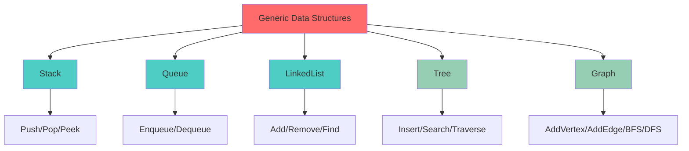

# 06 - Generics Data Structures

**Status:** 🧪 Educational Project
**Difficulty:** Intermediate-Advanced
**Estimated Time:** 4-5 hours

## Overview

Build type-safe generic data structures using Go 1.18+ generics. Implement Stack, Queue, LinkedList, Tree, and Graph with comprehensive operations and iterators.

## Key Concepts Covered

- Generic type parameters and constraints
- Type-safe collections without interface{}
- Iterator patterns with generics
- Comparable and Ordered constraints
- Generic algorithms (map, filter, reduce)
- Performance with generics vs interface{}

## Learning Objectives

1. Master Go generics syntax and constraints
2. Implement classic data structures with type safety
3. Create generic algorithms and functions
4. Understand when to use generics vs interfaces
5. Benchmark generic vs non-generic implementations
6. Design flexible and reusable APIs

## Architecture



## Implementation Highlights

### 1. Generic Stack
```go
type Stack[T any] struct {
    items []T
}

func (s *Stack[T]) Push(item T)
func (s *Stack[T]) Pop() (T, bool)
func (s *Stack[T]) Peek() (T, bool)
```

### 2. Generic Queue
```go
type Queue[T any] struct {
    items []T
}

func (q *Queue[T]) Enqueue(item T)
func (q *Queue[T]) Dequeue() (T, bool)
```

### 3. Generic Tree
```go
type TreeNode[T comparable] struct {
    Value T
    Left, Right *TreeNode[T]
}
```

### 4. Generic Algorithms
```go
func Map[T, U any](slice []T, fn func(T) U) []U
func Filter[T any](slice []T, predicate func(T) bool) []T
func Reduce[T, U any](slice []T, init U, fn func(U, T) U) U
```

## Completion Checklist

- [ ] Implement generic Stack with all operations
- [ ] Implement generic Queue (FIFO)
- [ ] Implement generic LinkedList
- [ ] Implement generic Binary Search Tree
- [ ] Implement generic Graph with BFS/DFS
- [ ] Create generic Map/Filter/Reduce functions
- [ ] Add iterator support
- [ ] Comprehensive unit tests for each structure
- [ ] Benchmarks: generic vs interface{} vs concrete types
- [ ] Thread-safety tests where applicable
