# 🚀 Advanced Go Learning - 20 Progressive Projects

**Status:** 🚧 In Progress
**Tech Stack:** Go 1.21+
**Level:** Medium → Expert
**Time Commitment:** 8-12 weeks (6-10 hours/week)

## 📋 Overview

A comprehensive learning path through 20 progressively complex Go projects, designed to take you from medium-level competency to expert-level mastery. Each project focuses on specific advanced Go concepts with hands-on implementation.

## 🎯 Learning Objectives

By completing this learning path, you will master:

- **Memory Management**: Custom allocators, garbage collection internals, memory-mapped files
- **Concurrency**: Advanced patterns, lock-free structures, distributed systems
- **Type System**: Reflection, generics, unsafe operations
- **Performance**: Profiling, optimization, low-level programming
- **Systems Programming**: Network protocols, compiler plugins, JIT compilation
- **Production Patterns**: Error handling, context management, middleware design

## 📚 Learning Path Structure


## 🗺️ Project Roadmap

### 🟢 Level 1: Medium Complexity (Projects 1-5)
**Focus:** Core advanced concepts, production patterns**

| # | Project | Key Concepts | Time |
|---|---------|--------------|------|
| 01 | Custom Memory Allocator | Memory management, pools, unsafe | 8-10h |
| 02 | Concurrent Cache | Sync primitives, race conditions | 6-8h |
| 03 | Reflection Validator | Reflection, struct tags, type system | 6-8h |
| 04 | Context Patterns | Context propagation, cancellation | 5-7h |
| 05 | Custom Error Handling | Error wrapping, stack traces, sentinel errors | 5-7h |

### 🟡 Level 2: Advanced Complexity (Projects 6-10)
**Focus:** Advanced patterns, performance optimization**

| # | Project | Key Concepts | Time |
|---|---------|--------------|------|
| 06 | Generic Data Structures | Type parameters, constraints, inference | 8-10h |
| 07 | Channel Patterns | Pipeline, fan-out/in, select mastery | 8-10h |
| 08 | Custom HTTP Middleware | Chain of responsibility, closures | 6-8h |
| 09 | Worker Pool | Concurrency control, backpressure | 8-10h |
| 10 | Rate Limiter | Token bucket, sliding window, distributed | 8-10h |

### 🟠 Level 3: Expert Complexity (Projects 11-15)
**Focus:** Systems programming, distributed systems**

| # | Project | Key Concepts | Time |
|---|---------|--------------|------|
| 11 | Database Connection Pool | Resource management, health checks | 10-12h |
| 12 | Distributed Cache | Consistent hashing, replication | 12-15h |
| 13 | Custom Scheduler | Goroutine scheduling, work stealing | 12-15h |
| 14 | Memory-Mapped Files | mmap, syscalls, zero-copy | 10-12h |
| 15 | Lock-Free Structures | Atomic operations, CAS, ABA problem | 15-18h |

### 🔴 Level 4: Expert+ Complexity (Projects 16-20)
**Focus:** Low-level systems, compiler internals**

| # | Project | Key Concepts | Time |
|---|---------|--------------|------|
| 16 | Custom Garbage Collector | GC algorithms, mark-sweep, tri-color | 20-25h |
| 17 | Compiler Plugin | AST manipulation, code generation | 18-22h |
| 18 | Network Protocol | Binary protocols, state machines | 15-20h |
| 19 | Distributed Consensus | Raft, leader election, log replication | 25-30h |
| 20 | JIT Compiler | Runtime compilation, assembly generation | 30-40h |

## 📅 Recommended Learning Schedule


### Week-by-Week Breakdown

**Weeks 1-3: Medium Level**
- Week 1: Projects 1-2 (Memory Allocator, Concurrent Cache)
- Week 2: Projects 3-4 (Reflection Validator, Context Patterns)
- Week 3: Project 5 + Review (Custom Error Handling)

**Weeks 4-6: Advanced Level**
- Week 4: Projects 6-7 (Generics, Channel Patterns)
- Week 5: Projects 8-9 (HTTP Middleware, Worker Pool)
- Week 6: Project 10 + Review (Rate Limiter)

**Weeks 7-9: Expert Level**
- Week 7: Projects 11-12 (DB Pool, Distributed Cache)
- Week 8: Projects 13-14 (Scheduler, Memory-Mapped Files)
- Week 9: Project 15 + Review (Lock-Free Structures)

**Weeks 10-12: Expert+ Level**
- Week 10: Projects 16-17 (GC, Compiler Plugin)
- Week 11: Projects 18-19 (Network Protocol, Consensus)
- Week 12: Project 20 + Final Review (JIT Compiler)

## 🎓 Learning Approach

### For Each Project

```mermaid
flowchart TD
    A[📖 Read Concept Docs] --> B[🧪 Study Examples]
    B --> C[💡 Understand Theory]
    C --> D[⌨️ Implement Code]
    D --> E[🧪 Write Tests]
    E --> F[🔍 Benchmark]
    F --> G[📊 Profile & Optimize]
    G --> H[📝 Document Learnings]
    H --> I{Ready for Next?}
    I -->|No| D
    I -->|Yes| J[🎉 Move to Next Project]

    style A fill:#ff00ff,stroke:#00ffff,stroke-width:2px
    style D fill:#00ff00,stroke:#00ffff,stroke-width:2px
    style H fill:#ff69b4,stroke:#00ffff,stroke-width:2px
```



### Study Methodology

1. **Read First** (30 min): Review concept documentation
2. **Experiment** (1-2 hours): Play with examples, modify code
3. **Implement** (3-5 hours): Build the project from scratch
4. **Test** (1-2 hours): Write comprehensive tests
5. **Optimize** (1-2 hours): Benchmark and improve performance
6. **Document** (30 min): Write what you learned

### ADHD-Friendly Tips

✅ **Do:**
- Time-box each project (use a timer!)
- Take breaks every 45-60 minutes
- Complete one project before starting the next
- Keep a "learning journal" for each project
- Celebrate completing each project (update status!)

❌ **Avoid:**
- Jumping between projects
- Perfectionism - get it working first
- Skipping documentation
- Skipping tests and benchmarks

## 🛠️ Prerequisites

Before starting, you should be comfortable with:

- ✅ Go syntax and basic idioms
- ✅ Goroutines and basic channels
- ✅ Interfaces and composition
- ✅ Unit testing with `testing` package
- ✅ Basic error handling
- ✅ HTTP servers and clients
- ✅ JSON encoding/decoding

## 📦 Environment Setup

```bash
# 1. Ensure Go 1.21+ installed
go version

# 2. Clone/navigate to project
cd projects/advanced-go-learning

# 3. Install dependencies (per project)
go mod tidy

# 4. Run a project
go run ./01-custom-memory-allocator

# 5. Test a project
go test ./01-custom-memory-allocator/... -v

# 6. Benchmark a project
go test ./01-custom-memory-allocator/... -bench=. -benchmem
```

## 📊 Progress Tracking

Track your progress by updating this checklist:

### Level 1: Medium (Projects 1-5)
- [ ] 01 - Custom Memory Allocator
- [ ] 02 - Concurrent Cache
- [ ] 03 - Reflection Validator
- [ ] 04 - Context Patterns
- [ ] 05 - Custom Error Handling

### Level 2: Advanced (Projects 6-10)
- [ ] 06 - Generic Data Structures
- [ ] 07 - Channel Patterns
- [ ] 08 - Custom HTTP Middleware
- [ ] 09 - Worker Pool
- [ ] 10 - Rate Limiter

### Level 3: Expert (Projects 11-15)
- [ ] 11 - Database Connection Pool
- [ ] 12 - Distributed Cache
- [ ] 13 - Custom Scheduler
- [ ] 14 - Memory-Mapped Files
- [ ] 15 - Lock-Free Structures

### Level 4: Expert+ (Projects 16-20)
- [ ] 16 - Custom Garbage Collector
- [ ] 17 - Compiler Plugin
- [ ] 18 - Network Protocol
- [ ] 19 - Distributed Consensus
- [ ] 20 - JIT Compiler

## 📖 Additional Resources

### Essential Reading
- **Go Source Code**: `$GOROOT/src/runtime`, `$GOROOT/src/sync`
- **Go Blog**: blog.golang.org (concurrency, GC internals)
- **Effective Go**: golang.org/doc/effective_go
- **Go Memory Model**: golang.org/ref/mem

### Recommended Books
- "The Go Programming Language" (Donovan & Kernighan)
- "Concurrency in Go" (Katherine Cox-Buday)
- "Writing An Interpreter In Go" (Thorsten Ball)
- "System Programming with Go" (Mihalis Tsoukalos)

### Tools You'll Need
- `go tool pprof` - CPU/Memory profiling
- `go tool trace` - Execution tracing
- `go test -race` - Race detector
- `go tool compile -S` - View assembly
- `dlv` (Delve) - Debugging

## 🎯 Graduation Criteria

This project is ready to graduate when:

- [x] All 20 projects implemented
- [x] Each project has comprehensive tests (>80% coverage)
- [x] Each project has benchmarks
- [x] Documentation complete for all projects
- [x] Learning journal entries for all projects
- [x] Performance optimizations applied
- [x] Code reviewed and refactored

## 🚀 Quick Start

```bash
# Start with Project 1
cd 01-custom-memory-allocator

# Read the documentation
cat README.md

# Study the implementation
cat main.go

# Run it
go run .

# Test it
go test -v

# Benchmark it
go test -bench=. -benchmem
```

## 📈 Learning Metrics

Track these metrics to monitor your progress:

- **Time spent per project** (compare to estimates)
- **Test coverage** (aim for >80%)
- **Benchmark improvements** (before/after optimization)
- **Concepts mastered** (checklist in each project)
- **Code reviews** (self-review or peer review)

---

**Remember:** This is a marathon, not a sprint. Take your time, understand deeply, and enjoy the journey! 🎉

**Next Steps:** Start with [Project 01 - Custom Memory Allocator](./01-custom-memory-allocator/README.md)
