# 🚀 Advanced Java Learning - 20 Projects Journey

**Status:** 🚧 In Progress
**Tech Stack:** Java 17+ (LTS), Maven/Gradle, JUnit 5
**Level:** Medium → Expert
**Time Commitment:** 8-12 weeks (20-30 hours/week)

## Overview

This comprehensive learning path takes you from medium-level Java knowledge to expert mastery through 20 progressively complex projects. Each project builds on previous concepts while introducing advanced techniques used in production systems.


## Prerequisites

Before starting, you should have:
- ✅ Solid understanding of Java basics (OOP, collections, exceptions)
- ✅ Experience with Java 8+ features (lambdas, streams, Optional)
- ✅ Familiarity with build tools (Maven or Gradle)
- ✅ Basic understanding of algorithms and data structures
- ✅ Command-line comfort

## Learning Plan

### Phase 1: Medium Level (Weeks 1-2)
**Goal:** Master Java core libraries and intermediate patterns

| # | Project | Key Concepts | Time |
|---|---------|--------------|------|
| 01 | Custom Collections Framework | Generic types, Iterators, Comparators | 4-6h |
| 02 | File I/O and NIO.2 Explorer | Path API, File watching, Memory-mapped files | 4-6h |
| 03 | Reflection and Annotations | Runtime type inspection, Custom annotations | 4-6h |
| 04 | Multithreading Basics | Thread pools, ExecutorService, Synchronization | 4-6h |
| 05 | Stream API Mastery | Advanced collectors, Parallel streams, Performance | 4-6h |

### Phase 2: Medium-Advanced (Weeks 3-4)
**Goal:** Deep dive into JVM internals and advanced concurrency

| # | Project | Key Concepts | Time |
|---|---------|--------------|------|
| 06 | Custom Serialization Engine | Object graphs, Versioning, Performance | 5-7h |
| 07 | Concurrent Data Structures | Lock-free algorithms, CAS, Memory ordering | 6-8h |
| 08 | Dynamic Proxy and AOP | Proxy patterns, Interceptors, Bytecode basics | 5-7h |
| 09 | Memory Management Deep Dive | GC tuning, Heap analysis, Memory leaks | 6-8h |
| 10 | CompletableFuture & Async | Async patterns, Reactive programming, Error handling | 5-7h |

### Phase 3: Advanced (Weeks 5-8)
**Goal:** Build production-grade systems and frameworks

| # | Project | Key Concepts | Time |
|---|---------|--------------|------|
| 11 | Custom DI Container | Dependency injection, Bean lifecycle, Scopes | 8-10h |
| 12 | JVM Bytecode Manipulation | ASM/ByteBuddy, Class loading, Runtime code gen | 8-10h |
| 13 | High-Performance Server | NIO selectors, Event loops, Protocol design | 10-12h |
| 14 | Distributed Cache System | Consistent hashing, Replication, Invalidation | 10-12h |
| 15 | Custom JVM Language | Parser, AST, Code generation, DSL design | 12-15h |

### Phase 4: Expert (Weeks 9-12)
**Goal:** Master cutting-edge Java techniques and distributed systems

| # | Project | Key Concepts | Time |
|---|---------|--------------|------|
| 16 | Lock-Free Algorithms | CAS loops, ABA problem, Memory barriers | 12-15h |
| 17 | JIT Compiler Integration | GraalVM, Native image, AOT compilation | 12-15h |
| 18 | Distributed Transactions | 2PC, Saga pattern, Compensation | 15-18h |
| 19 | Zero-Copy & Off-Heap | Direct buffers, sun.misc.Unsafe, mmap | 12-15h |
| 20 | Microservices Framework | Service mesh, Circuit breakers, Observability | 18-20h |

## Project Structure

```
advanced-java-learning/
├── 01-medium/               # Projects 1-5
│   ├── p01-custom-collections/
│   ├── p02-nio-explorer/
│   ├── p03-reflection/
│   ├── p04-multithreading/
│   └── p05-streams/
├── 02-medium-advanced/      # Projects 6-10
│   ├── p06-serialization/
│   ├── p07-concurrent-structures/
│   ├── p08-dynamic-proxy/
│   ├── p09-memory-management/
│   └── p10-async-programming/
├── 03-advanced/             # Projects 11-15
│   ├── p11-di-container/
│   ├── p12-bytecode/
│   ├── p13-nio-server/
│   ├── p14-distributed-cache/
│   └── p15-jvm-language/
├── 04-expert/               # Projects 16-20
│   ├── p16-lock-free/
│   ├── p17-graalvm/
│   ├── p18-distributed-tx/
│   ├── p19-zero-copy/
│   └── p20-microservices/
└── docs/                    # Comprehensive documentation
    ├── learning-path.md
    ├── medium/
    ├── medium-advanced/
    ├── advanced/
    └── expert/
```

## Environment Setup

### Required Software
```bash
# Java 17+ (LTS)
java -version  # Should show 17 or higher

# Maven (or Gradle)
mvn -version

# Git
git --version

# Optional but recommended
jps          # JDK process status tool
jstat        # JVM statistics
jmap         # Memory map
jstack       # Stack trace
jvisualvm    # Visual profiling tool
```

### IDE Setup
- **IntelliJ IDEA** (recommended) or Eclipse
- Enable annotation processing
- Install plugins: Lombok, Maven Helper, JProfiler (optional)

### JVM Configuration
Create a `.jvmopts` file in each project:
```
-XX:+UseG1GC
-XX:MaxGCPauseMillis=200
-Xms512m
-Xmx2g
-XX:+HeapDumpOnOutOfMemoryError
```

## Learning Resources

### Official Documentation
- [Java SE Documentation](https://docs.oracle.com/en/java/javase/17/)
- [Java Language Specification](https://docs.oracle.com/javase/specs/)
- [JVM Specification](https://docs.oracle.com/javase/specs/jvms/se17/html/)

### Essential Books
- **Java Concurrency in Practice** - Brian Goetz (must-read for projects 4-10)
- **Effective Java** (3rd Edition) - Joshua Bloch
- **Java Performance** - Scott Oaks
- **The Well-Grounded Java Developer** - Benjamin J. Evans

### Online Resources
- OpenJDK source code (for understanding internals)
- JEP (JDK Enhancement Proposals) - for latest features
- Baeldung - practical Java tutorials
- InfoQ Java articles - advanced topics

## Study Approach

### For Each Project

```mermaid
flowchart TD
    A[📚 Read Concept Guide] --> B[🎯 Review Learning Objectives]
    B --> C[💻 Study Code Examples]
    C --> D[🔨 Build Core Implementation]
    D --> E[🧪 Write Tests]
    E --> F[🚀 Extend with Challenges]
    F --> G[📝 Document Learnings]
    G --> H{Tests Pass?}
    H -->|Yes| I[✅ Move to Next]
    H -->|No| D

    style A fill:#ff00ff,stroke:#00ffff,stroke-width:2px
    style D fill:#00ff00,stroke:#00ffff,stroke-width:2px
    style I fill:#00ff00,stroke:#00ffff,stroke-width:2px
```



### ADHD-Friendly Tips
- ⏱️ **Time-box each session:** 25-minute Pomodoro sessions
- ✅ **Track progress:** Check off learning objectives
- 🎨 **Use visual aids:** Draw diagrams for complex concepts
- 🎯 **One project at a time:** Complete before moving on
- 🏆 **Celebrate wins:** Mark completed projects in this README
- 📝 **Document immediately:** Write notes while coding

## Progress Tracking

Mark your progress as you complete each project:

### Medium Level
- [ ] 01 - Custom Collections Framework
- [ ] 02 - File I/O and NIO.2 Explorer
- [ ] 03 - Reflection and Annotations
- [ ] 04 - Multithreading Basics
- [ ] 05 - Stream API Mastery

### Medium-Advanced
- [ ] 06 - Custom Serialization Engine
- [ ] 07 - Concurrent Data Structures
- [ ] 08 - Dynamic Proxy and AOP
- [ ] 09 - Memory Management Deep Dive
- [ ] 10 - CompletableFuture & Async Programming

### Advanced
- [ ] 11 - Custom DI Container
- [ ] 12 - JVM Bytecode Manipulation
- [ ] 13 - High-Performance NIO Server
- [ ] 14 - Distributed Cache System
- [ ] 15 - Custom JVM Language

### Expert
- [ ] 16 - Lock-Free Concurrent Algorithms
- [ ] 17 - JIT Compiler Integration (GraalVM)
- [ ] 18 - Distributed Transaction Manager
- [ ] 19 - Zero-Copy and Off-Heap Memory
- [ ] 20 - Full Microservices Framework

## Graduation Criteria

This project is ready to graduate when:
- ✅ All 20 projects completed with tests
- ✅ Can explain each concept without reference materials
- ✅ Successfully applied techniques in real project
- ✅ Contributed to open-source Java project
- ✅ Can architect production Java systems

## Architecture Philosophy


## Getting Started

1. **Set up your environment** (see Environment Setup above)
2. **Read the learning plan** for your current phase
3. **Start with Project 01** - don't skip ahead!
4. **Follow the study approach** for each project
5. **Track your progress** using the checkboxes
6. **Document your learnings** in a journal

## Support and Community

- **Questions?** Check the docs/ folder for detailed guides
- **Stuck?** Review the concept explanations and examples
- **Want more?** Each project has extension challenges

---

**Remember:** Expert-level Java mastery is a journey, not a destination. Take your time, understand deeply, and enjoy the process! 🚀

**Created:** 2025-11-09
**Last Updated:** 2025-11-09
**Estimated Completion:** 8-12 weeks
