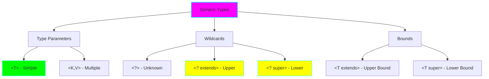
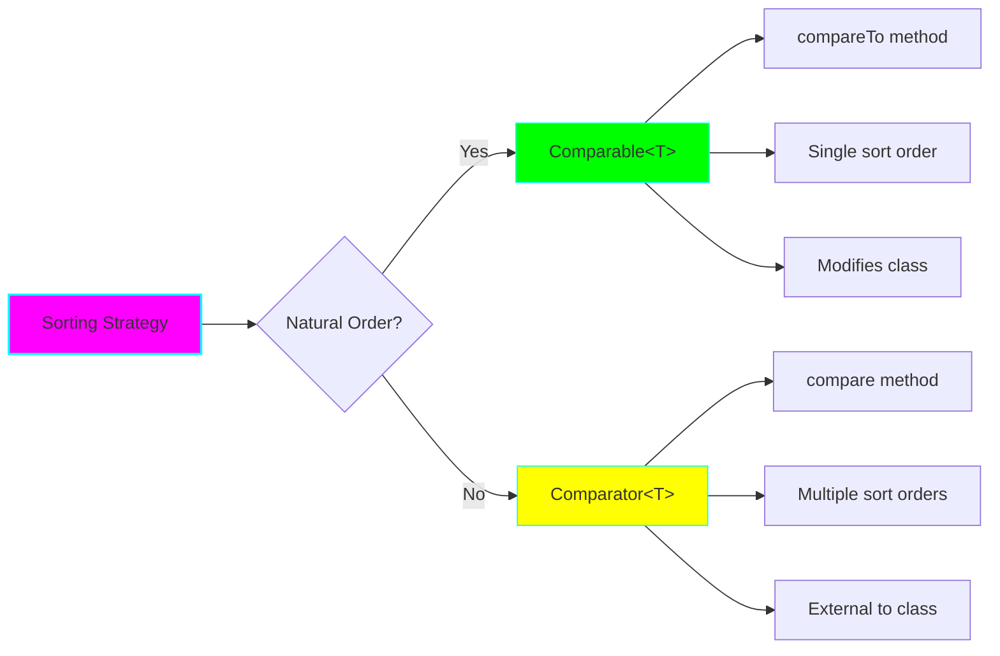
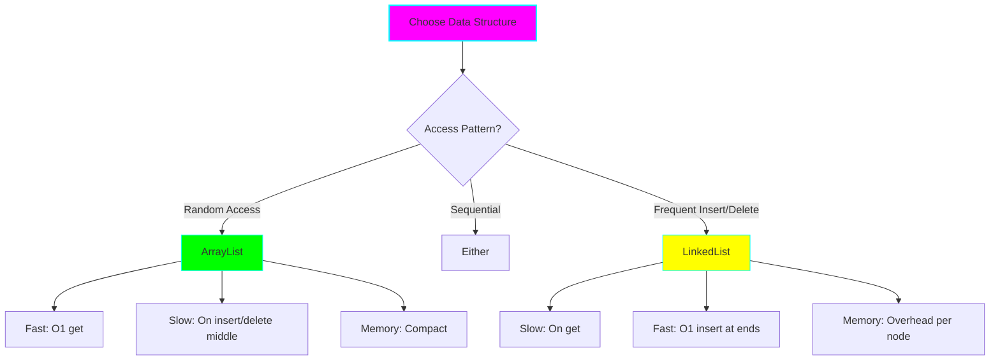

# Project 01: Custom Collections Framework

**Difficulty:** Medium ⭐⭐⭐
**Time:** 4-6 hours
**Prerequisites:** Java generics, OOP, basic data structures

## Learning Objectives

By completing this project, you will:
- ✅ Master Java generics including wildcards and bounded types
- ✅ Understand Iterator and Iterable patterns deeply
- ✅ Implement custom Comparators and Comparable
- ✅ Learn internal workings of Java Collections Framework
- ✅ Handle edge cases and null safety

## Core Concepts

### 1. Generic Type Parameters



**Why Generics Matter:**
- Type safety at compile time
- Eliminates casting
- Enables code reuse
- Foundation of Collections Framework

### 2. The Iterator Pattern

The Iterator pattern separates collection traversal from the collection itself.

```java
// The Iterator contract
public interface Iterator<E> {
    boolean hasNext();  // Are there more elements?
    E next();          // Get next element
    void remove();     // Remove current element (optional)
}

// The Iterable contract
public interface Iterable<T> {
    Iterator<T> iterator();  // Return an iterator
}
```

**Why It Matters:**
- Unified traversal API
- Multiple concurrent iterations
- Lazy evaluation possible
- Enhanced for-loop support

### 3. Comparable vs Comparator



## Implementation Guide

### Step 1: Custom ArrayList Implementation

Create a dynamic array that grows automatically.

```java
package com.learning.collections;

import java.util.*;

/**
 * Custom implementation of ArrayList to understand dynamic arrays.
 * This implementation focuses on educational value over optimization.
 *
 * Key Learning Points:
 * - Array resizing strategies
 * - Generic type handling
 * - Null safety
 * - Fail-fast iterators
 */
public class CustomArrayList<E> implements Iterable<E> {

    // Default initial capacity
    private static final int DEFAULT_CAPACITY = 10;

    // The underlying array (Object[] because of type erasure)
    private Object[] elements;

    // Current number of elements
    private int size;

    // Modification count for fail-fast behavior
    private int modCount;

    // Constructors
    public CustomArrayList() {
        this.elements = new Object[DEFAULT_CAPACITY];
        this.size = 0;
        this.modCount = 0;
    }

    public CustomArrayList(int initialCapacity) {
        if (initialCapacity < 0) {
            throw new IllegalArgumentException(
                "Initial capacity cannot be negative: " + initialCapacity
            );
        }
        this.elements = new Object[initialCapacity];
        this.size = 0;
        this.modCount = 0;
    }

    /**
     * Adds an element to the end of the list.
     * Time Complexity: O(1) amortized, O(n) worst case
     *
     * @param element the element to add (null allowed)
     * @return true (as per Collection contract)
     */
    public boolean add(E element) {
        ensureCapacity(size + 1);
        elements[size++] = element;
        modCount++;
        return true;
    }

    /**
     * Ensures the array has enough capacity.
     * Grows by 50% when full (growth factor = 1.5).
     *
     * Why 1.5x? Trade-off between:
     * - Memory waste (lower is better)
     * - Reallocation frequency (higher is better)
     *
     * @param minCapacity minimum required capacity
     */
    private void ensureCapacity(int minCapacity) {
        int currentCapacity = elements.length;

        if (minCapacity > currentCapacity) {
            // Calculate new capacity (1.5x growth)
            int newCapacity = currentCapacity + (currentCapacity >> 1);

            // Handle overflow and ensure minimum
            if (newCapacity < minCapacity) {
                newCapacity = minCapacity;
            }

            // Create new array and copy elements
            elements = Arrays.copyOf(elements, newCapacity);
        }
    }

    /**
     * Gets element at specified index.
     * Time Complexity: O(1)
     *
     * @param index the index
     * @return the element
     * @throws IndexOutOfBoundsException if index invalid
     */
    @SuppressWarnings("unchecked")
    public E get(int index) {
        checkIndex(index);
        return (E) elements[index];
    }

    /**
     * Sets element at specified index.
     * Time Complexity: O(1)
     *
     * @param index the index
     * @param element the new element
     * @return the previous element
     */
    @SuppressWarnings("unchecked")
    public E set(int index, E element) {
        checkIndex(index);
        E oldValue = (E) elements[index];
        elements[index] = element;
        modCount++;
        return oldValue;
    }

    /**
     * Removes element at specified index.
     * Time Complexity: O(n) - must shift elements
     *
     * @param index the index
     * @return the removed element
     */
    @SuppressWarnings("unchecked")
    public E remove(int index) {
        checkIndex(index);

        E oldValue = (E) elements[index];

        // Calculate how many elements to shift
        int numMoved = size - index - 1;

        if (numMoved > 0) {
            // Shift elements left
            System.arraycopy(elements, index + 1, elements, index, numMoved);
        }

        // Clear reference for GC
        elements[--size] = null;
        modCount++;

        return oldValue;
    }

    /**
     * Returns the number of elements.
     */
    public int size() {
        return size;
    }

    /**
     * Checks if list is empty.
     */
    public boolean isEmpty() {
        return size == 0;
    }

    /**
     * Validates index is within bounds.
     */
    private void checkIndex(int index) {
        if (index < 0 || index >= size) {
            throw new IndexOutOfBoundsException(
                "Index: " + index + ", Size: " + size
            );
        }
    }

    /**
     * Returns a fail-fast iterator.
     *
     * Fail-fast: Throws ConcurrentModificationException if
     * the list is modified while iterating (except via iterator.remove())
     */
    @Override
    public Iterator<E> iterator() {
        return new CustomIterator();
    }

    /**
     * Inner class for iterator implementation.
     * Uses modCount for fail-fast behavior.
     */
    private class CustomIterator implements Iterator<E> {
        private int cursor;              // Index of next element
        private int lastReturned = -1;   // Index of last returned element
        private int expectedModCount;    // For fail-fast

        CustomIterator() {
            this.cursor = 0;
            this.expectedModCount = modCount;
        }

        @Override
        public boolean hasNext() {
            return cursor < size;
        }

        @Override
        @SuppressWarnings("unchecked")
        public E next() {
            checkForComodification();

            if (cursor >= size) {
                throw new NoSuchElementException();
            }

            lastReturned = cursor;
            return (E) elements[cursor++];
        }

        @Override
        public void remove() {
            if (lastReturned < 0) {
                throw new IllegalStateException("next() not called yet");
            }

            checkForComodification();

            try {
                CustomArrayList.this.remove(lastReturned);
                cursor = lastReturned;
                lastReturned = -1;
                expectedModCount = modCount;  // Update expected count
            } catch (IndexOutOfBoundsException ex) {
                throw new ConcurrentModificationException();
            }
        }

        /**
         * Checks if list was modified externally.
         */
        private void checkForComodification() {
            if (modCount != expectedModCount) {
                throw new ConcurrentModificationException(
                    "List was modified during iteration"
                );
            }
        }
    }

    @Override
    public String toString() {
        if (size == 0) return "[]";

        StringBuilder sb = new StringBuilder("[");
        for (int i = 0; i < size; i++) {
            sb.append(elements[i]);
            if (i < size - 1) sb.append(", ");
        }
        sb.append("]");
        return sb.toString();
    }
}
```

### Step 2: Custom LinkedList Implementation

```java
package com.learning.collections;

import java.util.*;

/**
 * Custom doubly-linked list implementation.
 *
 * Key Learning Points:
 * - Node-based data structures
 * - Pointer manipulation
 * - Bidirectional traversal
 * - Memory overhead vs array
 */
public class CustomLinkedList<E> implements Iterable<E> {

    /**
     * Node class for doubly-linked list.
     * Package-private for testing access.
     */
    static class Node<E> {
        E data;
        Node<E> next;
        Node<E> prev;

        Node(Node<E> prev, E data, Node<E> next) {
            this.prev = prev;
            this.data = data;
            this.next = next;
        }
    }

    private Node<E> head;
    private Node<E> tail;
    private int size;
    private int modCount;

    public CustomLinkedList() {
        this.head = null;
        this.tail = null;
        this.size = 0;
        this.modCount = 0;
    }

    /**
     * Adds element to the end.
     * Time Complexity: O(1)
     */
    public boolean add(E element) {
        linkLast(element);
        return true;
    }

    /**
     * Links element as last element.
     */
    private void linkLast(E element) {
        final Node<E> oldTail = tail;
        final Node<E> newNode = new Node<>(oldTail, element, null);
        tail = newNode;

        if (oldTail == null) {
            // List was empty
            head = newNode;
        } else {
            oldTail.next = newNode;
        }

        size++;
        modCount++;
    }

    /**
     * Adds element to the beginning.
     * Time Complexity: O(1)
     */
    public void addFirst(E element) {
        final Node<E> oldHead = head;
        final Node<E> newNode = new Node<>(null, element, oldHead);
        head = newNode;

        if (oldHead == null) {
            tail = newNode;
        } else {
            oldHead.prev = newNode;
        }

        size++;
        modCount++;
    }

    /**
     * Gets element at index.
     * Time Complexity: O(n) - must traverse
     *
     * Optimization: Starts from head or tail depending on index.
     */
    public E get(int index) {
        checkIndex(index);
        return getNode(index).data;
    }

    /**
     * Gets node at index (internal method).
     * Optimized to search from nearest end.
     */
    private Node<E> getNode(int index) {
        // Optimization: search from closer end
        if (index < (size >> 1)) {
            // Search from head
            Node<E> current = head;
            for (int i = 0; i < index; i++) {
                current = current.next;
            }
            return current;
        } else {
            // Search from tail
            Node<E> current = tail;
            for (int i = size - 1; i > index; i--) {
                current = current.prev;
            }
            return current;
        }
    }

    /**
     * Removes element at index.
     * Time Complexity: O(n)
     */
    public E remove(int index) {
        checkIndex(index);
        return unlink(getNode(index));
    }

    /**
     * Unlinks a node from the list.
     */
    private E unlink(Node<E> node) {
        final E element = node.data;
        final Node<E> next = node.next;
        final Node<E> prev = node.prev;

        if (prev == null) {
            // Removing head
            head = next;
        } else {
            prev.next = next;
            node.prev = null;  // Help GC
        }

        if (next == null) {
            // Removing tail
            tail = prev;
        } else {
            next.prev = prev;
            node.next = null;  // Help GC
        }

        node.data = null;  // Help GC
        size--;
        modCount++;

        return element;
    }

    public int size() {
        return size;
    }

    private void checkIndex(int index) {
        if (index < 0 || index >= size) {
            throw new IndexOutOfBoundsException(
                "Index: " + index + ", Size: " + size
            );
        }
    }

    @Override
    public Iterator<E> iterator() {
        return new CustomIterator();
    }

    private class CustomIterator implements Iterator<E> {
        private Node<E> current = head;
        private Node<E> lastReturned = null;
        private int expectedModCount = modCount;

        @Override
        public boolean hasNext() {
            return current != null;
        }

        @Override
        public E next() {
            checkForComodification();

            if (current == null) {
                throw new NoSuchElementException();
            }

            lastReturned = current;
            current = current.next;
            return lastReturned.data;
        }

        @Override
        public void remove() {
            if (lastReturned == null) {
                throw new IllegalStateException();
            }

            checkForComodification();

            CustomLinkedList.this.unlink(lastReturned);
            lastReturned = null;
            expectedModCount = modCount;
        }

        private void checkForComodification() {
            if (modCount != expectedModCount) {
                throw new ConcurrentModificationException();
            }
        }
    }
}
```

## Nuanced Scenarios

### Scenario 1: Type Erasure Issues

**Problem:** Java generics use type erasure - generic type information is removed at runtime.

```java
// This won't work due to type erasure!
public class WrongArrayCreation<T> {
    private T[] elements;

    public WrongArrayCreation(int size) {
        // Compile error: Cannot create generic array
        // elements = new T[size];

        // Must use Object[] and cast
        elements = (T[]) new Object[size];  // Unchecked cast warning
    }
}
```

**Why It Happens:**
- JVM doesn't know about generic types at runtime
- Arrays are reified (retain type information)
- Generics are not reified (type erased)

**Solution:** Use `Object[]` internally and cast when needed.

### Scenario 2: Fail-Fast vs Fail-Safe

**Fail-Fast (our implementation):**
```java
CustomArrayList<String> list = new CustomArrayList<>();
list.add("A");
list.add("B");
list.add("C");

for (String item : list) {
    if (item.equals("B")) {
        list.remove(1);  // ConcurrentModificationException!
    }
}
```

**Why:** The iterator detects external modification and fails immediately.

**Solution:** Use iterator's remove method:
```java
Iterator<String> iter = list.iterator();
while (iter.hasNext()) {
    String item = iter.next();
    if (item.equals("B")) {
        iter.remove();  // Safe!
    }
}
```

### Scenario 3: ArrayList vs LinkedList Trade-offs



**Real-world Example:**
```java
// Use ArrayList for:
List<Customer> customers = new CustomArrayList<>();
customers.add(customer);  // Add at end: O(1)
Customer c = customers.get(100);  // Random access: O(1)

// Use LinkedList for:
Deque<Task> taskQueue = new CustomLinkedList<>();
taskQueue.addFirst(urgentTask);  // O(1)
taskQueue.addLast(normalTask);   // O(1)
```

### Scenario 4: Comparator Composition (Java 8+)

```java
public class Person {
    String name;
    int age;
    String city;

    // Constructor, getters...
}

// Old way: verbose
Comparator<Person> byAge = new Comparator<Person>() {
    public int compare(Person p1, Person p2) {
        return Integer.compare(p1.age, p2.age);
    }
};

// Modern way: composition
Comparator<Person> byAgeDesc = Comparator
    .comparing(Person::getAge)
    .reversed();

Comparator<Person> byAgeThenName = Comparator
    .comparing(Person::getAge)
    .thenComparing(Person::getName);

// Null-safe
Comparator<Person> safeByCity = Comparator
    .comparing(Person::getCity, Comparator.nullsLast(String::compareTo));
```

## Practice Exercises

### Exercise 1: Implement Custom HashSet
Build a hash table-based set that handles collisions with chaining.

**Requirements:**
- No duplicates allowed
- Use array of linked lists for buckets
- Implement proper `hashCode()` and `equals()`
- Handle load factor and resizing

### Exercise 2: Create a CircularBuffer
Implement a fixed-size circular buffer (ring buffer).

**Use Cases:**
- Audio/video streaming buffers
- Logging systems
- Event queues

### Exercise 3: Build a PriorityQueue
Implement using a binary heap.

**Requirements:**
- `add()` - O(log n)
- `poll()` - O(log n)
- `peek()` - O(1)

## Testing Strategies

```java
import org.junit.jupiter.api.Test;
import static org.junit.jupiter.api.Assertions.*;

class CustomArrayListTest {

    @Test
    void testAddAndGet() {
        CustomArrayList<String> list = new CustomArrayList<>();
        list.add("Hello");
        list.add("World");

        assertEquals(2, list.size());
        assertEquals("Hello", list.get(0));
        assertEquals("World", list.get(1));
    }

    @Test
    void testGrowth() {
        CustomArrayList<Integer> list = new CustomArrayList<>(2);

        // Add more than initial capacity
        for (int i = 0; i < 100; i++) {
            list.add(i);
        }

        assertEquals(100, list.size());
        assertEquals(99, list.get(99));
    }

    @Test
    void testRemove() {
        CustomArrayList<String> list = new CustomArrayList<>();
        list.add("A");
        list.add("B");
        list.add("C");

        String removed = list.remove(1);

        assertEquals("B", removed);
        assertEquals(2, list.size());
        assertEquals("C", list.get(1));
    }

    @Test
    void testIteratorFailFast() {
        CustomArrayList<String> list = new CustomArrayList<>();
        list.add("A");
        list.add("B");

        assertThrows(ConcurrentModificationException.class, () -> {
            for (String item : list) {
                list.add("C");  // Modify during iteration
            }
        });
    }

    @Test
    void testNullElements() {
        CustomArrayList<String> list = new CustomArrayList<>();
        list.add(null);
        list.add("Hello");
        list.add(null);

        assertNull(list.get(0));
        assertEquals("Hello", list.get(1));
        assertNull(list.get(2));
    }
}
```

## Performance Analysis

| Operation | ArrayList | LinkedList | Notes |
|-----------|-----------|------------|-------|
| `add(E)` | O(1) amortized | O(1) | ArrayList may resize |
| `add(i, E)` | O(n) | O(n) | LinkedList still must traverse |
| `get(i)` | O(1) | O(n) | Big difference! |
| `remove(i)` | O(n) | O(n) | Both must shift/traverse |
| `contains(E)` | O(n) | O(n) | Must search linearly |
| `iterator.remove()` | O(n) | O(1) | LinkedList advantage |

## Key Takeaways

1. **Type Erasure:** Generics are compile-time only; use `Object[]` internally
2. **Fail-Fast:** Detect concurrent modifications with `modCount`
3. **Growth Strategy:** 1.5x growth balances memory and performance
4. **Iterator Pattern:** Separates traversal from collection structure
5. **Trade-offs:** ArrayList for random access, LinkedList for frequent insertions at ends
6. **Null Safety:** Java collections allow null (unlike some languages)

## Next Steps

After mastering custom collections:
- Explore concurrent collections (Project 07)
- Study Java 8+ collection enhancements
- Profile memory usage of different implementations
- Read OpenJDK source code for `ArrayList` and `LinkedList`

## References

- [Java Collections Framework Overview](https://docs.oracle.com/en/java/javase/17/docs/api/java.base/java/util/doc-files/coll-overview.html)
- [Effective Java Item 28: Prefer lists to arrays](https://www.oreilly.com/library/view/effective-java/9780134686097/)
- [Java Generics FAQ](http://www.angelikalanger.com/GenericsFAQ/JavaGenericsFAQ.html)
