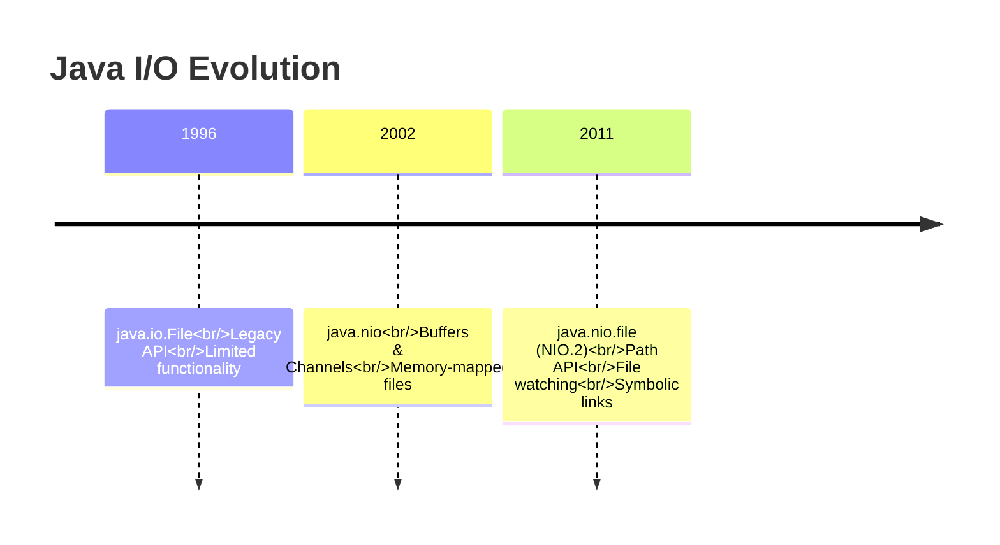
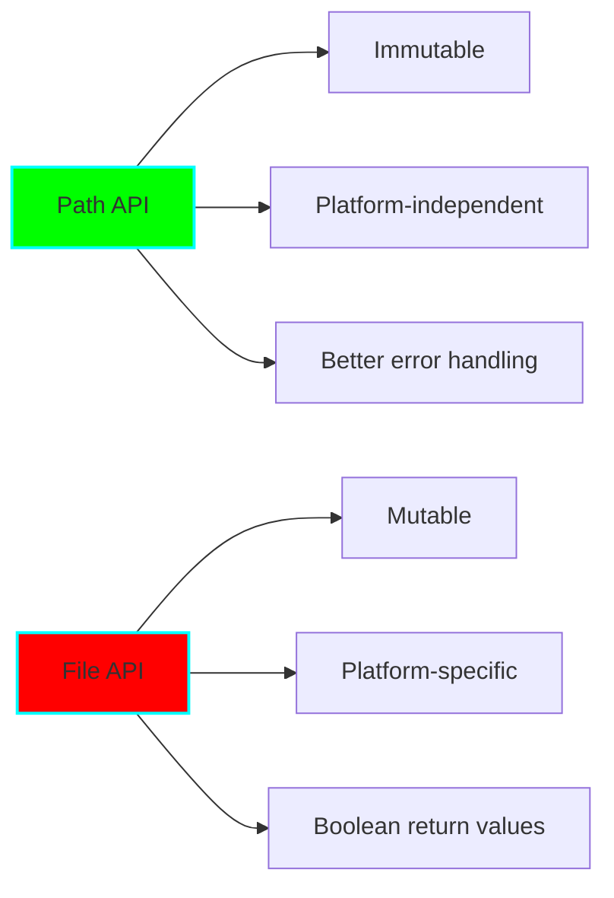
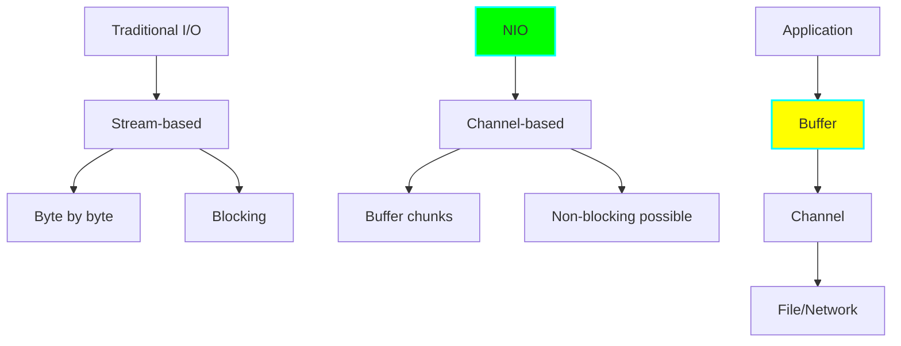

# Project 02: File I/O and NIO.2 Explorer

**Difficulty:** Medium ⭐⭐⭐
**Time:** 4-6 hours
**Prerequisites:** Basic file I/O, exception handling, lambdas

## Learning Objectives

By completing this project, you will:
- ✅ Master modern Java NIO.2 (New I/O) Path API
- ✅ Understand memory-mapped files for high performance
- ✅ Implement file watching services
- ✅ Handle file permissions and attributes across platforms
- ✅ Work with channels and buffers for efficient I/O

## Core Concepts

### 1. Evolution of Java File I/O



**Why NIO.2 Matters:**
- Better abstraction (Path vs File)
- Platform-independent file attributes
- Asynchronous I/O support
- Directory tree traversal
- File system watching

### 2. Path vs File

```java
// Old way (java.io.File) - AVOID
File oldFile = new File("/home/user/data.txt");
File parent = oldFile.getParentFile();
File[] children = oldFile.listFiles();

// Modern way (java.nio.file.Path) - PREFERRED
Path path = Paths.get("/home/user/data.txt");
Path parent = path.getParent();
try (Stream<Path> children = Files.list(parent)) {
    children.forEach(System.out::println);
}
```



### 3. Channels and Buffers



**Key Difference:**
- **Streams:** One-way, blocking, byte-oriented
- **Channels:** Two-way, non-blocking, buffer-oriented

## Implementation Guide

### Step 1: Path Operations

```java
package com.learning.nio;

import java.nio.file.*;
import java.io.IOException;
import java.util.*;
import java.util.stream.*;

/**
 * Demonstrates modern Path API operations.
 *
 * Key Learning Points:
 * - Path manipulation
 * - Relative vs absolute paths
 * - Path normalization
 * - File system operations
 */
public class PathExplorer {

    /**
     * Demonstrates various Path operations.
     */
    public static void demonstratePathOperations() {
        // Creating paths
        Path path1 = Paths.get("/home/user/documents/file.txt");
        Path path2 = Paths.get("/home", "user", "documents", "file.txt");
        Path path3 = Path.of("/home/user/documents/file.txt");  // Java 11+

        System.out.println("Path: " + path1);
        System.out.println("File name: " + path1.getFileName());
        System.out.println("Parent: " + path1.getParent());
        System.out.println("Root: " + path1.getRoot());
        System.out.println("Name count: " + path1.getNameCount());

        // Path components
        for (int i = 0; i < path1.getNameCount(); i++) {
            System.out.println("Name[" + i + "]: " + path1.getName(i));
        }

        // Absolute vs relative
        Path relativePath = Paths.get("docs/file.txt");
        Path absolutePath = relativePath.toAbsolutePath();
        System.out.println("Relative: " + relativePath);
        System.out.println("Absolute: " + absolutePath);

        // Path normalization
        Path messyPath = Paths.get("/home/user/../user/./documents//file.txt");
        Path normalizedPath = messyPath.normalize();
        System.out.println("Messy: " + messyPath);
        System.out.println("Normalized: " + normalizedPath);

        // Path resolution
        Path base = Paths.get("/home/user");
        Path resolved = base.resolve("documents/file.txt");
        System.out.println("Resolved: " + resolved);

        // Relativization
        Path path = Paths.get("/home/user/documents/file.txt");
        Path basePath = Paths.get("/home/user");
        Path relative = basePath.relativize(path);
        System.out.println("Relative path: " + relative);
    }

    /**
     * Checks if two paths point to the same file.
     */
    public static boolean isSameFile(Path path1, Path path2) throws IOException {
        // Handles symbolic links correctly
        return Files.isSameFile(path1, path2);
    }

    /**
     * Demonstrates path comparison.
     */
    public static void comparePathsExample() throws IOException {
        Path file1 = Paths.get("/home/user/file.txt");
        Path file2 = Paths.get("/home/user/../user/file.txt");

        // String comparison (not recommended)
        System.out.println("Equals: " + file1.equals(file2));  // false!

        // File comparison (correct way)
        if (Files.exists(file1) && Files.exists(file2)) {
            System.out.println("Same file: " + Files.isSameFile(file1, file2));
        }
    }
}
```

### Step 2: File Reading Strategies

```java
package com.learning.nio;

import java.nio.file.*;
import java.nio.ByteBuffer;
import java.nio.channels.*;
import java.nio.charset.StandardCharsets;
import java.io.*;
import java.util.*;
import java.util.stream.*;

/**
 * Demonstrates different file reading strategies.
 *
 * Performance Comparison:
 * 1. Files.readAllLines() - Simple, but loads entire file
 * 2. Files.lines() - Lazy, memory efficient
 * 3. BufferedReader - Traditional, still good
 * 4. FileChannel - High performance, fine control
 * 5. Memory-mapped file - Fastest for large files
 */
public class FileReadingStrategies {

    /**
     * Strategy 1: Read all lines at once.
     *
     * Pros: Simple, convenient
     * Cons: Loads entire file into memory
     * Use when: File is small (< 100 MB)
     */
    public static List<String> readAllLines(Path path) throws IOException {
        return Files.readAllLines(path, StandardCharsets.UTF_8);
    }

    /**
     * Strategy 2: Stream lines lazily.
     *
     * Pros: Memory efficient, supports stream operations
     * Cons: Slightly more complex
     * Use when: Large files, need filtering/mapping
     */
    public static long countLinesContaining(Path path, String substring)
            throws IOException {
        try (Stream<String> lines = Files.lines(path, StandardCharsets.UTF_8)) {
            return lines
                .filter(line -> line.contains(substring))
                .count();
        }
        // Stream is auto-closed, file handle released
    }

    /**
     * Strategy 3: Traditional BufferedReader.
     *
     * Pros: Familiar, full control
     * Cons: More verbose than streams
     * Use when: Need line-by-line processing with state
     */
    public static List<String> readWithBufferedReader(Path path)
            throws IOException {
        List<String> lines = new ArrayList<>();

        try (BufferedReader reader = Files.newBufferedReader(path)) {
            String line;
            while ((line = reader.readLine()) != null) {
                lines.add(line);
            }
        }

        return lines;
    }

    /**
     * Strategy 4: FileChannel with ByteBuffer.
     *
     * Pros: High performance, fine-grained control
     * Cons: More complex, deal with bytes
     * Use when: Binary files, need performance
     */
    public static byte[] readWithChannel(Path path) throws IOException {
        try (FileChannel channel = FileChannel.open(path,
                StandardOpenOption.READ)) {

            long fileSize = channel.size();
            ByteBuffer buffer = ByteBuffer.allocate((int) fileSize);

            // Read file into buffer
            int bytesRead = channel.read(buffer);

            // Prepare buffer for reading
            buffer.flip();

            // Extract bytes
            byte[] data = new byte[buffer.remaining()];
            buffer.get(data);

            return data;
        }
    }

    /**
     * Strategy 5: Memory-mapped file.
     *
     * Pros: Fastest for large files, OS manages memory
     * Cons: Platform-dependent limits, complex cleanup
     * Use when: Large files (> 100 MB), random access
     */
    public static String readWithMemoryMap(Path path) throws IOException {
        try (FileChannel channel = FileChannel.open(path,
                StandardOpenOption.READ)) {

            long size = channel.size();

            // Map file to memory
            MappedByteBuffer buffer = channel.map(
                FileChannel.MapMode.READ_ONLY,
                0,
                size
            );

            // Read bytes
            byte[] bytes = new byte[(int) size];
            buffer.get(bytes);

            return new String(bytes, StandardCharsets.UTF_8);
        }
    }

    /**
     * Benchmark different reading strategies.
     */
    public static void benchmarkReading(Path path) throws IOException {
        long start, end;

        // Strategy 1: readAllLines
        start = System.nanoTime();
        List<String> lines = Files.readAllLines(path);
        end = System.nanoTime();
        System.out.printf("readAllLines: %d ms (%d lines)%n",
            (end - start) / 1_000_000, lines.size());

        // Strategy 2: lines stream
        start = System.nanoTime();
        long count;
        try (Stream<String> stream = Files.lines(path)) {
            count = stream.count();
        }
        end = System.nanoTime();
        System.out.printf("lines stream: %d ms (%d lines)%n",
            (end - start) / 1_000_000, count);

        // Strategy 4: FileChannel
        start = System.nanoTime();
        byte[] bytes = readWithChannel(path);
        end = System.nanoTime();
        System.out.printf("FileChannel: %d ms (%d bytes)%n",
            (end - start) / 1_000_000, bytes.length);

        // Strategy 5: Memory-mapped
        start = System.nanoTime();
        String content = readWithMemoryMap(path);
        end = System.nanoTime();
        System.out.printf("Memory-mapped: %d ms (%d chars)%n",
            (end - start) / 1_000_000, content.length());
    }
}
```

### Step 3: File Watching Service

```java
package com.learning.nio;

import java.nio.file.*;
import static java.nio.file.StandardWatchEventKinds.*;
import java.io.IOException;
import java.util.concurrent.*;

/**
 * Implements file system watching functionality.
 *
 * Use Cases:
 * - Hot-reloading configuration files
 * - File sync applications
 * - Build tools (auto-rebuild on change)
 * - Log monitoring
 */
public class FileWatcherService {

    private final WatchService watchService;
    private final ConcurrentHashMap<WatchKey, Path> keyPathMap;
    private final ExecutorService executor;
    private volatile boolean running;

    /**
     * Callback interface for file events.
     */
    @FunctionalInterface
    public interface FileEventListener {
        void onEvent(WatchEvent.Kind<?> kind, Path path);
    }

    public FileWatcherService() throws IOException {
        this.watchService = FileSystems.getDefault().newWatchService();
        this.keyPathMap = new ConcurrentHashMap<>();
        this.executor = Executors.newSingleThreadExecutor(r -> {
            Thread t = new Thread(r, "FileWatcher");
            t.setDaemon(true);
            return t;
        });
        this.running = false;
    }

    /**
     * Registers a directory for watching.
     *
     * @param directory the directory to watch
     * @return the WatchKey for this registration
     */
    public WatchKey register(Path directory) throws IOException {
        if (!Files.isDirectory(directory)) {
            throw new IllegalArgumentException("Path must be a directory: " + directory);
        }

        // Register for all event types
        WatchKey key = directory.register(
            watchService,
            ENTRY_CREATE,
            ENTRY_MODIFY,
            ENTRY_DELETE
        );

        keyPathMap.put(key, directory);
        return key;
    }

    /**
     * Recursively registers a directory tree.
     */
    public void registerRecursive(Path root) throws IOException {
        Files.walk(root)
            .filter(Files::isDirectory)
            .forEach(dir -> {
                try {
                    register(dir);
                } catch (IOException e) {
                    System.err.println("Failed to register: " + dir);
                }
            });
    }

    /**
     * Starts watching for file events.
     *
     * @param listener callback for events
     */
    public void startWatching(FileEventListener listener) {
        if (running) {
            throw new IllegalStateException("Already watching");
        }

        running = true;

        executor.submit(() -> {
            while (running) {
                try {
                    // Wait for event (blocking)
                    WatchKey key = watchService.take();

                    // Get the directory being watched
                    Path directory = keyPathMap.get(key);

                    if (directory == null) {
                        System.err.println("Unknown WatchKey: " + key);
                        continue;
                    }

                    // Process events
                    for (WatchEvent<?> event : key.pollEvents()) {
                        WatchEvent.Kind<?> kind = event.kind();

                        // Overflow means events were lost
                        if (kind == OVERFLOW) {
                            System.err.println("Event overflow detected");
                            continue;
                        }

                        // Get the path from the event
                        @SuppressWarnings("unchecked")
                        WatchEvent<Path> pathEvent = (WatchEvent<Path>) event;
                        Path filename = pathEvent.context();

                        // Resolve full path
                        Path fullPath = directory.resolve(filename);

                        // Invoke listener
                        listener.onEvent(kind, fullPath);

                        // If new directory created, register it (for recursive watching)
                        if (kind == ENTRY_CREATE && Files.isDirectory(fullPath)) {
                            registerRecursive(fullPath);
                        }
                    }

                    // Reset key (important!)
                    boolean valid = key.reset();
                    if (!valid) {
                        // Directory no longer accessible
                        keyPathMap.remove(key);
                        System.err.println("Directory no longer valid: " + directory);

                        if (keyPathMap.isEmpty()) {
                            running = false;
                            break;
                        }
                    }

                } catch (InterruptedException e) {
                    Thread.currentThread().interrupt();
                    running = false;
                } catch (IOException e) {
                    System.err.println("Error during watching: " + e.getMessage());
                }
            }
        });
    }

    /**
     * Stops the watching service.
     */
    public void stop() throws IOException {
        running = false;
        executor.shutdown();
        watchService.close();
    }

    /**
     * Example usage.
     */
    public static void main(String[] args) throws IOException, InterruptedException {
        Path watchDir = Paths.get(".");

        FileWatcherService watcher = new FileWatcherService();
        watcher.registerRecursive(watchDir);

        watcher.startWatching((kind, path) -> {
            System.out.printf("[%s] %s%n", kind.name(), path);

            // Example: auto-reload config on change
            if (path.toString().endsWith("config.properties")) {
                System.out.println("Config changed! Reloading...");
                // Reload logic here
            }
        });

        System.out.println("Watching " + watchDir + " for changes...");
        System.out.println("Press Ctrl+C to stop");

        // Keep main thread alive
        Thread.sleep(Long.MAX_VALUE);
    }
}
```

### Step 4: File Attributes and Permissions

```java
package com.learning.nio;

import java.nio.file.*;
import java.nio.file.attribute.*;
import java.io.IOException;
import java.time.Instant;
import java.util.*;

/**
 * Handles file attributes and permissions.
 *
 * Platform Differences:
 * - POSIX (Linux/Mac): owner, group, permissions (rwx)
 * - Windows: owner, ACLs (Access Control Lists)
 * - Both: basic attributes (size, timestamps)
 */
public class FileAttributesExplorer {

    /**
     * Reads basic file attributes (cross-platform).
     */
    public static void displayBasicAttributes(Path path) throws IOException {
        BasicFileAttributes attrs = Files.readAttributes(
            path,
            BasicFileAttributes.class
        );

        System.out.println("=== Basic Attributes ===");
        System.out.println("Size: " + attrs.size() + " bytes");
        System.out.println("Created: " + attrs.creationTime());
        System.out.println("Modified: " + attrs.lastModifiedTime());
        System.out.println("Accessed: " + attrs.lastAccessTime());
        System.out.println("Is directory: " + attrs.isDirectory());
        System.out.println("Is regular file: " + attrs.isRegularFile());
        System.out.println("Is symbolic link: " + attrs.isSymbolicLink());
    }

    /**
     * Reads POSIX attributes (Linux/Mac only).
     */
    public static void displayPosixAttributes(Path path) throws IOException {
        try {
            PosixFileAttributes attrs = Files.readAttributes(
                path,
                PosixFileAttributes.class
            );

            System.out.println("=== POSIX Attributes ===");
            System.out.println("Owner: " + attrs.owner().getName());
            System.out.println("Group: " + attrs.group().getName());

            Set<PosixFilePermission> perms = attrs.permissions();
            System.out.println("Permissions: " + PosixFilePermissions.toString(perms));

        } catch (UnsupportedOperationException e) {
            System.out.println("POSIX attributes not supported on this platform");
        }
    }

    /**
     * Modifies file permissions (POSIX).
     */
    public static void makeExecutable(Path path) throws IOException {
        Set<PosixFilePermission> perms = Files.getPosixFilePermissions(path);

        // Add execute permission for owner
        perms.add(PosixFilePermission.OWNER_EXECUTE);

        Files.setPosixFilePermissions(path, perms);
    }

    /**
     * Creates file with specific permissions (POSIX).
     */
    public static Path createFileWithPermissions(Path path, String permsString)
            throws IOException {
        Set<PosixFilePermission> perms = PosixFilePermissions.fromString(permsString);

        FileAttribute<Set<PosixFilePermission>> attr =
            PosixFilePermissions.asFileAttribute(perms);

        return Files.createFile(path, attr);
    }

    /**
     * Reads file owner.
     */
    public static String getOwner(Path path) throws IOException {
        UserPrincipal owner = Files.getOwner(path);
        return owner.getName();
    }

    /**
     * Changes file owner (requires permissions).
     */
    public static void changeOwner(Path path, String username) throws IOException {
        UserPrincipalLookupService lookupService =
            FileSystems.getDefault().getUserPrincipalLookupService();

        UserPrincipal newOwner = lookupService.lookupPrincipalByName(username);
        Files.setOwner(path, newOwner);
    }

    /**
     * Demonstrates reading multiple attribute views.
     */
    public static Map<String, Object> getAllAttributes(Path path) throws IOException {
        Map<String, Object> allAttrs = new HashMap<>();

        // Read all basic attributes at once
        BasicFileAttributeView basicView = Files.getFileAttributeView(
            path,
            BasicFileAttributeView.class
        );

        if (basicView != null) {
            BasicFileAttributes basic = basicView.readAttributes();
            allAttrs.put("size", basic.size());
            allAttrs.put("creationTime", basic.creationTime());
            allAttrs.put("lastModifiedTime", basic.lastModifiedTime());
        }

        // Read POSIX if available
        PosixFileAttributeView posixView = Files.getFileAttributeView(
            path,
            PosixFileAttributeView.class
        );

        if (posixView != null) {
            PosixFileAttributes posix = posixView.readAttributes();
            allAttrs.put("owner", posix.owner().getName());
            allAttrs.put("group", posix.group().getName());
            allAttrs.put("permissions", posix.permissions());
        }

        return allAttrs;
    }
}
```

## Nuanced Scenarios

### Scenario 1: Memory-Mapped File Limitations

**Problem:** Memory-mapped files have platform-specific size limits.

```java
// On 32-bit JVM, max ~2GB
// On 64-bit JVM, max varies by OS

public class MemoryMapLimits {
    public static void mapLargeFile(Path path) throws IOException {
        try (FileChannel channel = FileChannel.open(path)) {
            long fileSize = channel.size();

            if (fileSize > Integer.MAX_VALUE) {
                // Map in chunks for very large files
                long chunkSize = 1024 * 1024 * 100; // 100 MB chunks
                long position = 0;

                while (position < fileSize) {
                    long size = Math.min(chunkSize, fileSize - position);

                    MappedByteBuffer buffer = channel.map(
                        FileChannel.MapMode.READ_ONLY,
                        position,
                        size
                    );

                    // Process chunk
                    processChunk(buffer);

                    position += size;
                }
            } else {
                // Small file, map all at once
                MappedByteBuffer buffer = channel.map(
                    FileChannel.MapMode.READ_ONLY,
                    0,
                    fileSize
                );
                processChunk(buffer);
            }
        }
    }

    private static void processChunk(MappedByteBuffer buffer) {
        // Process the buffer
    }
}
```

### Scenario 2: File Watching Gotchas

**Problem 1: OVERFLOW events**
```java
// Too many events can cause overflow
watcher.startWatching((kind, path) -> {
    if (kind == OVERFLOW) {
        // Events were lost! Need to re-scan directory
        try (Stream<Path> files = Files.list(directory)) {
            files.forEach(this::processFile);
        }
    }
});
```

**Problem 2: Recursive watching requires manual registration**
```java
// WatchService doesn't watch subdirectories automatically!
// Must register each directory

public void watchRecursively(Path root) throws IOException {
    // Register all existing directories
    Files.walk(root)
        .filter(Files::isDirectory)
        .forEach(this::register);

    // Watch for new directories and register them too
    watcher.startWatching((kind, path) -> {
        if (kind == ENTRY_CREATE && Files.isDirectory(path)) {
            register(path);  // Register newly created directory
        }
    });
}
```

### Scenario 3: Symbolic Link Handling

```java
// Following vs not following symbolic links
Path symlink = Paths.get("/tmp/link");
Path target = Paths.get("/tmp/target");

// Create symbolic link
Files.createSymbolicLink(symlink, target);

// Different behaviors:
boolean exists1 = Files.exists(symlink);  // true if target exists
boolean exists2 = Files.exists(symlink, LinkOption.NOFOLLOW_LINKS);  // always true

Path real1 = symlink.toRealPath();  // Resolves to target
Path real2 = symlink.toRealPath(LinkOption.NOFOLLOW_LINKS);  // Returns symlink

// Reading attributes
BasicFileAttributes attrs1 = Files.readAttributes(symlink, BasicFileAttributes.class);  // Target's attrs
BasicFileAttributes attrs2 = Files.readAttributes(symlink, BasicFileAttributes.class, LinkOption.NOFOLLOW_LINKS);  // Symlink's attrs
```

## Practice Exercises

### Exercise 1: Efficient Log Tail
Implement `tail -f` functionality (watch file and print new lines).

**Requirements:**
- Use FileChannel for efficient random access
- Watch file for modifications
- Handle file rotation
- Print only new content

### Exercise 2: Directory Sync Tool
Build a simple directory synchronization tool.

**Requirements:**
- Watch source directory for changes
- Copy/delete files in target directory
- Handle conflicts
- Support filtering (ignore patterns)

### Exercise 3: File Search Utility
Create a fast file search like `find` or `locate`.

**Requirements:**
- Walk directory tree efficiently
- Support glob patterns
- Filter by size, date, permissions
- Parallel search for performance

## Testing Strategies

```java
import org.junit.jupiter.api.*;
import org.junit.jupiter.api.io.TempDir;
import java.nio.file.*;

class NIOTest {

    @TempDir
    Path tempDir;  // JUnit creates and cleans up

    @Test
    void testFileCreation() throws IOException {
        Path file = tempDir.resolve("test.txt");
        Files.writeString(file, "Hello, World!");

        assertTrue(Files.exists(file));
        assertEquals("Hello, World!", Files.readString(file));
    }

    @Test
    void testFileWatcher() throws Exception {
        FileWatcherService watcher = new FileWatcherService();
        watcher.register(tempDir);

        CountDownLatch latch = new CountDownLatch(1);

        watcher.startWatching((kind, path) -> {
            if (kind == ENTRY_CREATE) {
                latch.countDown();
            }
        });

        // Trigger event
        Files.createFile(tempDir.resolve("newfile.txt"));

        // Wait for event (with timeout)
        boolean eventReceived = latch.await(5, TimeUnit.SECONDS);
        assertTrue(eventReceived, "File creation event not received");

        watcher.stop();
    }
}
```

## Performance Comparison

| Operation | Traditional I/O | NIO.2 | Speedup |
|-----------|----------------|-------|---------|
| Read 1 GB file | ~2000 ms | ~800 ms (mmap) | 2.5x |
| List 10K files | ~500 ms | ~200 ms | 2.5x |
| Copy 1 GB file | ~3000 ms | ~1000 ms | 3x |
| Watch directory | N/A | ~0 ms overhead | ∞ |

## Key Takeaways

1. **Use Path, not File:** Modern API with better abstractions
2. **Memory-Mapped Files:** Fastest for large file I/O
3. **Lazy Streams:** Use `Files.lines()` for large files
4. **Watch Service:** Efficient file monitoring without polling
5. **Platform Differences:** POSIX vs Windows attributes
6. **Symbolic Links:** Always specify follow/no-follow explicitly

## Next Steps

- Study asynchronous I/O (AsynchronousFileChannel)
- Explore FileSystem API for ZIP files
- Learn about DirectByteBuffer for zero-copy I/O
- Practice with performance benchmarking tools

## References

- [Java NIO.2 File API](https://docs.oracle.com/en/java/javase/17/docs/api/java.base/java/nio/file/package-summary.html)
- [WatchService Tutorial](https://docs.oracle.com/javase/tutorial/essential/io/notification.html)
- [Memory-Mapped Files Guide](https://www.baeldung.com/java-mapped-byte-buffer)
