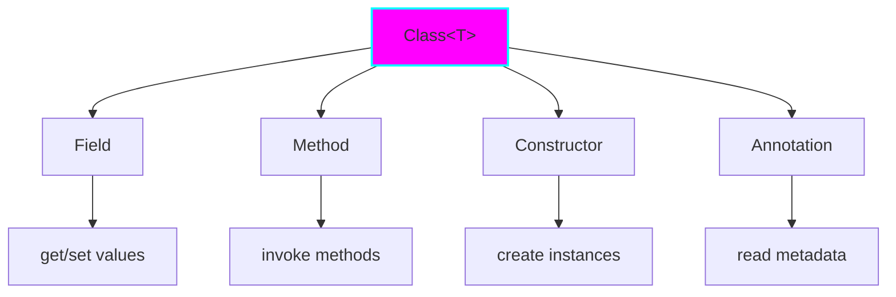

# Project 03: Reflection and Annotations

**Difficulty:** Medium ⭐⭐⭐
**Time:** 4-6 hours
**Prerequisites:** Annotations basics, generics, OOP

## Learning Objectives

- ✅ Master Java Reflection API for runtime type inspection
- ✅ Create custom annotations with different retention policies
- ✅ Build annotation processors for code generation
- ✅ Understand reflection performance implications
- ✅ Implement dependency injection framework basics

## Core Concepts

### 1. The Reflection API Hierarchy



### 2. Annotation Retention Policies

```java
// SOURCE: Discarded by compiler (e.g., @Override)
@Retention(RetentionPolicy.SOURCE)
@interface CompileTimeOnly { }

// CLASS: In bytecode but not at runtime (default)
@Retention(RetentionPolicy.CLASS)
@interface BytecodeOnly { }

// RUNTIME: Available via reflection
@Retention(RetentionPolicy.RUNTIME)
@interface RuntimeAvailable { }
```

## Implementation: Dependency Injection Framework

```java
package com.learning.reflection;

import java.lang.annotation.*;
import java.lang.reflect.*;
import java.util.*;
import java.util.concurrent.ConcurrentHashMap;

/**
 * Custom annotations for dependency injection
 */
@Retention(RetentionPolicy.RUNTIME)
@Target(ElementType.TYPE)
@interface Component {
    String value() default "";
}

@Retention(RetentionPolicy.RUNTIME)
@Target({ElementType.FIELD, ElementType.PARAMETER})
@interface Inject { }

@Retention(RetentionPolicy.RUNTIME)
@Target(ElementType.METHOD)
@interface PostConstruct { }

/**
 * Simple DI Container using reflection.
 *
 * Features:
 * - Constructor and field injection
 * - Singleton scope
 * - Post-construct callbacks
 * - Circular dependency detection
 */
public class SimpleDIContainer {

    private final Map<Class<?>, Object> singletons = new ConcurrentHashMap<>();
    private final Set<Class<?>> inProgress = new HashSet<>();
    private final Map<String, Class<?>> componentRegistry = new HashMap<>();

    /**
     * Scans package for @Component classes.
     */
    public void scan(String packageName) throws Exception {
        // In real implementation, use classpath scanning
        // For demo, manually register classes
        System.out.println("Scanning package: " + packageName);
    }

    /**
     * Registers a component class.
     */
    public void register(Class<?> clazz) {
        if (clazz.isAnnotationPresent(Component.class)) {
            Component component = clazz.getAnnotation(Component.class);
            String name = component.value().isEmpty() ?
                clazz.getSimpleName() : component.value();
            componentRegistry.put(name, clazz);
        }
    }

    /**
     * Gets or creates a bean instance.
     */
    @SuppressWarnings("unchecked")
    public <T> T getBean(Class<T> clazz) throws Exception {
        // Check if already created
        if (singletons.containsKey(clazz)) {
            return (T) singletons.get(clazz);
        }

        // Detect circular dependencies
        if (inProgress.contains(clazz)) {
            throw new IllegalStateException(
                "Circular dependency detected: " + clazz.getName()
            );
        }

        inProgress.add(clazz);

        try {
            // Create instance
            T instance = createInstance(clazz);

            // Inject fields
            injectFields(instance);

            // Call post-construct
            invokePostConstruct(instance);

            // Cache singleton
            singletons.put(clazz, instance);

            return instance;

        } finally {
            inProgress.remove(clazz);
        }
    }

    /**
     * Creates instance using constructor injection.
     */
    @SuppressWarnings("unchecked")
    private <T> T createInstance(Class<T> clazz) throws Exception {
        // Find @Inject constructor or default constructor
        Constructor<?>[] constructors = clazz.getDeclaredConstructors();

        Constructor<?> targetConstructor = null;

        // Look for @Inject constructor
        for (Constructor<?> constructor : constructors) {
            if (constructor.isAnnotationPresent(Inject.class)) {
                targetConstructor = constructor;
                break;
            }
        }

        // Fall back to default constructor
        if (targetConstructor == null) {
            try {
                targetConstructor = clazz.getDeclaredConstructor();
            } catch (NoSuchMethodException e) {
                throw new IllegalStateException(
                    "No suitable constructor found for " + clazz.getName()
                );
            }
        }

        // Resolve constructor parameters
        Class<?>[] paramTypes = targetConstructor.getParameterTypes();
        Object[] params = new Object[paramTypes.length];

        for (int i = 0; i < paramTypes.length; i++) {
            params[i] = getBean(paramTypes[i]);
        }

        // Make accessible if private
        targetConstructor.setAccessible(true);

        // Invoke constructor
        return (T) targetConstructor.newInstance(params);
    }

    /**
     * Injects fields annotated with @Inject.
     */
    private void injectFields(Object instance) throws Exception {
        Class<?> clazz = instance.getClass();

        for (Field field : clazz.getDeclaredFields()) {
            if (field.isAnnotationPresent(Inject.class)) {
                field.setAccessible(true);

                // Get dependency
                Object dependency = getBean(field.getType());

                // Inject
                field.set(instance, dependency);
            }
        }
    }

    /**
     * Invokes @PostConstruct methods.
     */
    private void invokePostConstruct(Object instance) throws Exception {
        Class<?> clazz = instance.getClass();

        for (Method method : clazz.getDeclaredMethods()) {
            if (method.isAnnotationPresent(PostConstruct.class)) {
                method.setAccessible(true);
                method.invoke(instance);
            }
        }
    }

    /**
     * Example usage
     */
    public static void main(String[] args) throws Exception {
        // Define components
        @Component
        class Database {
            public void connect() {
                System.out.println("Database connected");
            }
        }

        @Component
        class UserRepository {
            @Inject
            private Database database;

            @PostConstruct
            public void init() {
                System.out.println("UserRepository initialized");
                database.connect();
            }

            public void save(String user) {
                System.out.println("Saving user: " + user);
            }
        }

        @Component
        class UserService {
            private final UserRepository repository;

            @Inject
            public UserService(UserRepository repository) {
                this.repository = repository;
            }

            public void createUser(String name) {
                repository.save(name);
            }
        }

        // Create container
        SimpleDIContainer container = new SimpleDIContainer();
        container.register(Database.class);
        container.register(UserRepository.class);
        container.register(UserService.class);

        // Get bean
        UserService service = container.getBean(UserService.class);
        service.createUser("John");
    }
}
```

## Advanced: Annotation Processing

```java
package com.learning.reflection;

import java.lang.annotation.*;

/**
 * Validation annotations (runtime processing)
 */
@Retention(RetentionPolicy.RUNTIME)
@Target(ElementType.FIELD)
@interface NotNull { }

@Retention(RetentionPolicy.RUNTIME)
@Target(ElementType.FIELD)
@interface Min {
    int value();
}

@Retention(RetentionPolicy.RUNTIME)
@Target(ElementType.FIELD)
@interface Max {
    int value();
}

@Retention(RetentionPolicy.RUNTIME)
@Target(ElementType.FIELD)
@interface Pattern {
    String value();
}

/**
 * Bean validator using reflection
 */
public class BeanValidator {

    /**
     * Validates an object based on annotations.
     */
    public static <T> List<String> validate(T object) throws IllegalAccessException {
        List<String> errors = new ArrayList<>();
        Class<?> clazz = object.getClass();

        for (Field field : clazz.getDeclaredFields()) {
            field.setAccessible(true);
            Object value = field.get(object);

            // @NotNull validation
            if (field.isAnnotationPresent(NotNull.class)) {
                if (value == null) {
                    errors.add(field.getName() + " must not be null");
                }
            }

            // @Min validation
            if (field.isAnnotationPresent(Min.class)) {
                Min min = field.getAnnotation(Min.class);
                if (value instanceof Number) {
                    int intValue = ((Number) value).intValue();
                    if (intValue < min.value()) {
                        errors.add(field.getName() + " must be >= " + min.value());
                    }
                }
            }

            // @Max validation
            if (field.isAnnotationPresent(Max.class)) {
                Max max = field.getAnnotation(Max.class);
                if (value instanceof Number) {
                    int intValue = ((Number) value).intValue();
                    if (intValue > max.value()) {
                        errors.add(field.getName() + " must be <= " + max.value());
                    }
                }
            }

            // @Pattern validation
            if (field.isAnnotationPresent(Pattern.class)) {
                Pattern pattern = field.getAnnotation(Pattern.class);
                if (value instanceof String) {
                    if (!((String) value).matches(pattern.value())) {
                        errors.add(field.getName() + " must match pattern: " + pattern.value());
                    }
                }
            }
        }

        return errors;
    }

    /**
     * Example usage
     */
    public static class User {
        @NotNull
        private String username;

        @Min(18)
        @Max(120)
        private int age;

        @Pattern("[a-z0-9._%+-]+@[a-z0-9.-]+\\.[a-z]{2,}")
        private String email;

        // Constructors, getters, setters...
    }

    public static void main(String[] args) throws Exception {
        User user = new User();
        user.setAge(15);  // Invalid
        user.setEmail("invalid");  // Invalid

        List<String> errors = validate(user);
        errors.forEach(System.out::println);
    }
}
```

## Nuanced Scenarios

### Scenario 1: Performance Impact

```java
// Reflection is SLOW (~50-100x slower than direct access)

// Slow way:
Method method = obj.getClass().getMethod("getValue");
Object result = method.invoke(obj);  // ~1000ns

// Fast way (direct):
int result = obj.getValue();  // ~10ns

// Optimization: Cache reflection objects
private static final Map<String, Method> methodCache = new ConcurrentHashMap<>();

public static Method getCachedMethod(Class<?> clazz, String name) throws Exception {
    String key = clazz.getName() + "." + name;
    return methodCache.computeIfAbsent(key, k -> {
        try {
            Method m = clazz.getMethod(name);
            m.setAccessible(true);  // Bypass security check
            return m;
        } catch (Exception e) {
            throw new RuntimeException(e);
        }
    });
}
```

### Scenario 2: Generic Type Erasure

```java
// Type parameters are erased at runtime!

public class GenericClass<T> {
    private T value;

    // WRONG: Cannot get T at runtime
    public Class<T> getTypeWrong() {
        // return T.class;  // Compile error!
        return null;
    }

    // WORKAROUND: Pass Class<T> explicitly
    private final Class<T> type;

    public GenericClass(Class<T> type) {
        this.type = type;
    }

    public T createInstance() throws Exception {
        return type.getDeclaredConstructor().newInstance();
    }
}

// Usage:
GenericClass<String> gc = new GenericClass<>(String.class);
```

### Scenario 3: Accessing Private Members

```java
// Reflection can break encapsulation!

public class SecureClass {
    private String secret = "top-secret";

    private void privateMethod() {
        System.out.println("Private method called");
    }
}

// Break in:
SecureClass obj = new SecureClass();

// Access private field
Field field = SecureClass.class.getDeclaredField("secret");
field.setAccessible(true);  // Bypass private!
String secret = (String) field.get(obj);
System.out.println("Stolen secret: " + secret);

// Invoke private method
Method method = SecureClass.class.getDeclaredMethod("privateMethod");
method.setAccessible(true);
method.invoke(obj);

// Security Manager can prevent this (Java 17 modules)
```

## Practice Exercises

### Exercise 1: JSON Serializer
Build a simple JSON serializer using reflection.

```java
@Retention(RetentionPolicy.RUNTIME)
@interface JsonProperty {
    String value() default "";
}

public class JsonSerializer {
    public static String toJson(Object obj) {
        // Use reflection to read fields and build JSON
    }
}
```

### Exercise 2: Dynamic Proxy
Create method logging using dynamic proxies.

```java
public static <T> T createLoggingProxy(T target, Class<T> interfaceType) {
    return (T) Proxy.newProxyInstance(
        interfaceType.getClassLoader(),
        new Class<?>[] { interfaceType },
        (proxy, method, args) -> {
            System.out.println("Calling: " + method.getName());
            Object result = method.invoke(target, args);
            System.out.println("Result: " + result);
            return result;
        }
    );
}
```

### Exercise 3: ORM Framework
Implement basic Object-Relational Mapping.

```java
@interface Table {
    String value();
}

@interface Column {
    String value();
}

@interface Id { }

public class SimpleORM {
    public static void save(Object entity) {
        // Use reflection to build SQL INSERT
    }
}
```

## Key Takeaways

1. **Reflection is Powerful:** Runtime type inspection and manipulation
2. **Performance Cost:** 50-100x slower, cache reflection objects
3. **Type Erasure:** Generics removed at runtime, use Class<T> workaround
4. **Security:** Can break encapsulation, use security manager
5. **Annotations:** Runtime metadata for frameworks (DI, ORM, validation)
6. **Use Sparingly:** Only when dynamic behavior is essential

## Next Steps

- Study Java agents and bytecode manipulation (Project 12)
- Learn about MethodHandles (faster than reflection)
- Explore annotation processors (compile-time code generation)
- Research Java modules and reflection restrictions

## References

- [Reflection API](https://docs.oracle.com/en/java/javase/17/docs/api/java.base/java/lang/reflect/package-summary.html)
- [Annotations Tutorial](https://docs.oracle.com/javase/tutorial/java/annotations/)
- [Effective Java Item 65: Prefer interfaces to reflection](https://www.oreilly.com/library/view/effective-java/9780134686097/)
