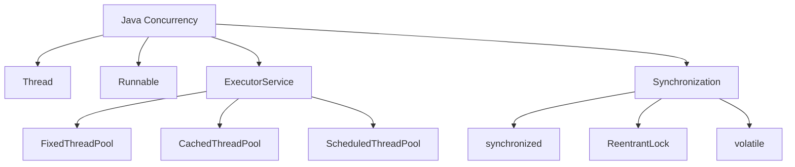
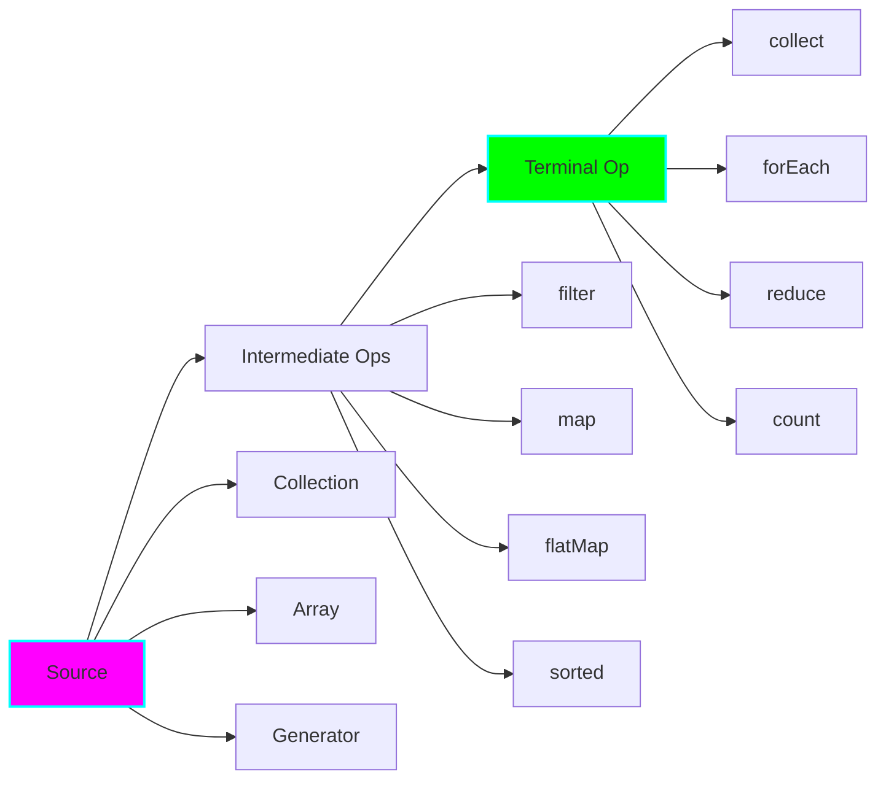

# Complete Advanced Java Projects Guide (Projects 4-20)

This document provides comprehensive coverage of projects 4 through 20, organized by difficulty level.

---

## MEDIUM LEVEL (Projects 4-5)

### Project 04: Multithreading Basics

**Time:** 4-6 hours | **Difficulty:** ⭐⭐⭐

#### Key Concepts



#### Core Implementation: Thread Pool Manager

```java
package com.learning.concurrency;

import java.util.concurrent.*;
import java.util.*;

/**
 * Understanding thread pools and executor services.
 *
 * Why Thread Pools?
 * - Thread creation is expensive (~1MB stack, ~1ms creation time)
 * - Reuse threads for multiple tasks
 * - Control resource usage
 * - Better performance than creating threads per task
 */
public class ThreadPoolExample {

    /**
     * Fixed thread pool - Best for CPU-bound tasks
     */
    public static void fixedThreadPoolExample() {
        int processors = Runtime.getRuntime().availableProcessors();
        ExecutorService executor = Executors.newFixedThreadPool(processors);

        try {
            // Submit tasks
            for (int i = 0; i < 100; i++) {
                int taskId = i;
                executor.submit(() -> {
                    System.out.println("Task " + taskId + " on " +
                        Thread.currentThread().getName());
                    // Simulate work
                    Thread.sleep(100);
                    return taskId * taskId;
                });
            }
        } finally {
            executor.shutdown();
            try {
                if (!executor.awaitTermination(60, TimeUnit.SECONDS)) {
                    executor.shutdownNow();
                }
            } catch (InterruptedException e) {
                executor.shutdownNow();
            }
        }
    }

    /**
     * Custom ThreadPoolExecutor with monitoring
     */
    public static class MonitoredThreadPool extends ThreadPoolExecutor {

        private final AtomicLong totalTasks = new AtomicLong();
        private final AtomicLong completedTasks = new AtomicLong();

        public MonitoredThreadPool(int corePoolSize, int maximumPoolSize) {
            super(
                corePoolSize,
                maximumPoolSize,
                60L, TimeUnit.SECONDS,
                new LinkedBlockingQueue<>(),
                new ThreadFactory() {
                    private final AtomicInteger threadNumber = new AtomicInteger(1);

                    @Override
                    public Thread newThread(Runnable r) {
                        Thread t = new Thread(r, "Worker-" + threadNumber.getAndIncrement());
                        t.setDaemon(false);
                        return t;
                    }
                },
                new RejectedExecutionHandler() {
                    @Override
                    public void rejectedExecution(Runnable r, ThreadPoolExecutor executor) {
                        System.err.println("Task rejected: " + r);
                        // Could implement custom handling: queue externally, block, throw exception
                    }
                }
            );
        }

        @Override
        protected void beforeExecute(Thread t, Runnable r) {
            super.beforeExecute(t, r);
            totalTasks.incrementAndGet();
            System.out.println("Starting task on " + t.getName());
        }

        @Override
        protected void afterExecute(Runnable r, Throwable t) {
            super.afterExecute(r, t);
            completedTasks.incrementAndGet();

            if (t != null) {
                System.err.println("Task failed: " + t.getMessage());
            }
        }

        public void printStats() {
            System.out.println("=== Thread Pool Stats ===");
            System.out.println("Total tasks: " + totalTasks.get());
            System.out.println("Completed: " + completedTasks.get());
            System.out.println("Active: " + getActiveCount());
            System.out.println("Queue size: " + getQueue().size());
            System.out.println("Pool size: " + getPoolSize());
        }
    }
}

/**
 * Producer-Consumer pattern with BlockingQueue
 */
class ProducerConsumer {

    static class Producer implements Runnable {
        private final BlockingQueue<Integer> queue;
        private final int id;

        Producer(BlockingQueue<Integer> queue, int id) {
            this.queue = queue;
            this.id = id;
        }

        @Override
        public void run() {
            try {
                for (int i = 0; i < 10; i++) {
                    int item = id * 100 + i;
                    queue.put(item);
                    System.out.println("Producer " + id + " produced: " + item);
                    Thread.sleep(100);
                }
            } catch (InterruptedException e) {
                Thread.currentThread().interrupt();
            }
        }
    }

    static class Consumer implements Runnable {
        private final BlockingQueue<Integer> queue;
        private final int id;

        Consumer(BlockingQueue<Integer> queue, int id) {
            this.queue = queue;
            this.id = id;
        }

        @Override
        public void run() {
            try {
                while (!Thread.currentThread().isInterrupted()) {
                    Integer item = queue.poll(1, TimeUnit.SECONDS);
                    if (item != null) {
                        System.out.println("Consumer " + id + " consumed: " + item);
                        Thread.sleep(150);
                    }
                }
            } catch (InterruptedException e) {
                Thread.currentThread().interrupt();
            }
        }
    }

    public static void main(String[] args) throws InterruptedException {
        BlockingQueue<Integer> queue = new ArrayBlockingQueue<>(10);

        // Start producers
        Thread p1 = new Thread(new Producer(queue, 1));
        Thread p2 = new Thread(new Producer(queue, 2));
        p1.start();
        p2.start();

        // Start consumers
        Thread c1 = new Thread(new Consumer(queue, 1));
        Thread c2 = new Thread(new Consumer(queue, 2));
        Thread c3 = new Thread(new Consumer(queue, 3));
        c1.start();
        c2.start();
        c3.start();

        // Wait for producers to finish
        p1.join();
        p2.join();

        // Stop consumers
        Thread.sleep(2000);
        c1.interrupt();
        c2.interrupt();
        c3.interrupt();
    }
}
```

#### Synchronization Patterns

```java
/**
 * Different synchronization mechanisms
 */
public class SynchronizationPatterns {

    // 1. synchronized method
    private int counter1 = 0;

    public synchronized void incrementSync() {
        counter1++;
    }

    // 2. synchronized block (more granular)
    private int counter2 = 0;
    private final Object lock = new Object();

    public void incrementBlock() {
        synchronized (lock) {
            counter2++;
        }
    }

    // 3. ReentrantLock (more control)
    private int counter3 = 0;
    private final ReentrantLock reentrantLock = new ReentrantLock();

    public void incrementLock() {
        reentrantLock.lock();
        try {
            counter3++;
        } finally {
            reentrantLock.unlock();  // Always unlock in finally!
        }
    }

    // 4. volatile (visibility only, not atomicity)
    private volatile boolean flag = false;

    public void setFlag() {
        flag = true;  // Visible to all threads immediately
    }

    // 5. AtomicInteger (lock-free)
    private final AtomicInteger counter4 = new AtomicInteger(0);

    public void incrementAtomic() {
        counter4.incrementAndGet();  // Thread-safe, no locks
    }
}
```

#### Nuanced Scenarios

**1. Deadlock Example and Prevention**

```java
public class DeadlockExample {
    private final Object lock1 = new Object();
    private final Object lock2 = new Object();

    // DEADLOCK! Thread 1: lock1 -> lock2, Thread 2: lock2 -> lock1
    public void method1() {
        synchronized (lock1) {
            synchronized (lock2) {
                // Work
            }
        }
    }

    public void method2() {
        synchronized (lock2) {  // Opposite order!
            synchronized (lock1) {
                // Work
            }
        }
    }

    // SOLUTION: Always acquire locks in same order
    public void safeMethods() {
        synchronized (lock1) {
            synchronized (lock2) {
                // Work
            }
        }
    }
}
```

**2. Thread Interruption Handling**

```java
public class InterruptionHandling {
    public void processWithInterruption() {
        while (!Thread.currentThread().isInterrupted()) {
            try {
                // Blocking call
                Thread.sleep(1000);

                // Do work
                processItem();

            } catch (InterruptedException e) {
                // Restore interrupt status
                Thread.currentThread().interrupt();

                // Clean up and exit
                System.out.println("Thread interrupted, cleaning up...");
                break;
            }
        }
    }

    private void processItem() {
        // Check interrupt status periodically for long-running tasks
        if (Thread.currentThread().isInterrupted()) {
            throw new RuntimeException("Interrupted during processing");
        }
        // Do work...
    }
}
```

#### Key Takeaways
- Use ExecutorService instead of raw threads
- Prefer high-level concurrency utilities (BlockingQueue, CountDownLatch, etc.)
- Always shut down executors properly
- Handle InterruptedException correctly
- Avoid deadlocks by acquiring locks in consistent order
- Use AtomicXXX for simple counters (lock-free)

---

### Project 05: Stream API Mastery

**Time:** 4-6 hours | **Difficulty:** ⭐⭐⭐

#### Stream Pipeline Visualization



#### Advanced Stream Operations

```java
package com.learning.streams;

import java.util.*;
import java.util.stream.*;
import static java.util.stream.Collectors.*;

public class AdvancedStreams {

    /**
     * Complex data model for examples
     */
    record Employee(String name, String department, int salary, int age) {}

    /**
     * 1. Custom Collectors
     */
    public static void customCollectorExample() {
        List<Employee> employees = Arrays.asList(
            new Employee("Alice", "Engineering", 80000, 30),
            new Employee("Bob", "Sales", 60000, 25),
            new Employee("Charlie", "Engineering", 90000, 35)
        );

        // Group by department and calculate average salary
        Map<String, Double> avgSalaryByDept = employees.stream()
            .collect(groupingBy(
                Employee::department,
                averagingInt(Employee::salary)
            ));

        // Custom collector: joining with prefix/suffix
        String names = employees.stream()
            .map(Employee::name)
            .collect(joining(", ", "Employees: [", "]"));
        System.out.println(names);

        // Partitioning (special case of grouping with boolean predicate)
        Map<Boolean, List<Employee>> partitioned = employees.stream()
            .collect(partitioningBy(e -> e.salary() > 70000));
        System.out.println("High earners: " + partitioned.get(true));
    }

    /**
     * 2. FlatMap for nested structures
     */
    public static void flatMapExample() {
        List<List<Integer>> nested = Arrays.asList(
            Arrays.asList(1, 2, 3),
            Arrays.asList(4, 5),
            Arrays.asList(6, 7, 8, 9)
        );

        // Flatten nested lists
        List<Integer> flattened = nested.stream()
            .flatMap(Collection::stream)
            .collect(toList());
        System.out.println(flattened);  // [1,2,3,4,5,6,7,8,9]

        // FlatMap with Optional
        List<Optional<String>> optionals = Arrays.asList(
            Optional.of("A"),
            Optional.empty(),
            Optional.of("B")
        );

        List<String> values = optionals.stream()
            .flatMap(Optional::stream)  // Java 9+
            .collect(toList());
        System.out.println(values);  // [A, B]
    }

    /**
     * 3. Parallel streams and performance
     */
    public static void parallelStreamExample() {
        List<Integer> numbers = IntStream.rangeClosed(1, 1_000_000)
            .boxed()
            .collect(toList());

        // Sequential
        long start = System.nanoTime();
        long sum1 = numbers.stream()
            .mapToLong(Integer::longValue)
            .sum();
        long sequential = System.nanoTime() - start;

        // Parallel
        start = System.nanoTime();
        long sum2 = numbers.parallelStream()
            .mapToLong(Integer::longValue)
            .sum();
        long parallel = System.nanoTime() - start;

        System.out.printf("Sequential: %d ms%n", sequential / 1_000_000);
        System.out.printf("Parallel: %d ms%n", parallel / 1_000_000);
        System.out.printf("Speedup: %.2fx%n", (double) sequential / parallel);
    }

    /**
     * 4. Reduce operations
     */
    public static void reduceExample() {
        List<Integer> numbers = Arrays.asList(1, 2, 3, 4, 5);

        // Sum with reduce
        int sum = numbers.stream()
            .reduce(0, Integer::sum);

        // Product with reduce
        int product = numbers.stream()
            .reduce(1, (a, b) -> a * b);

        // Max with reduce
        Optional<Integer> max = numbers.stream()
            .reduce(Integer::max);

        // Complex reduce: concatenate strings with custom logic
        List<String> words = Arrays.asList("Hello", "World", "Java");
        String result = words.stream()
            .reduce("",
                (a, b) -> a.isEmpty() ? b : a + " " + b);
        System.out.println(result);  // "Hello World Java"
    }

    /**
     * 5. Custom Collector Implementation
     */
    public static class ImmutableListCollector<T>
            implements Collector<T, List<T>, List<T>> {

        @Override
        public Supplier<List<T>> supplier() {
            return ArrayList::new;
        }

        @Override
        public BiConsumer<List<T>, T> accumulator() {
            return List::add;
        }

        @Override
        public BinaryOperator<List<T>> combiner() {
            return (list1, list2) -> {
                list1.addAll(list2);
                return list1;
            };
        }

        @Override
        public Function<List<T>, List<T>> finisher() {
            return Collections::unmodifiableList;
        }

        @Override
        public Set<Characteristics> characteristics() {
            return Collections.emptySet();
        }
    }
}
```

#### Stream Performance Considerations

```java
public class StreamPerformance {

    /**
     * When to use parallel streams
     */
    public static void parallelStreamGuidelines() {
        // GOOD for parallel: Large dataset, CPU-bound operations
        List<Integer> large = IntStream.range(0, 10_000_000)
            .boxed()
            .collect(toList());

        long count = large.parallelStream()
            .filter(n -> n % 2 == 0)
            .map(n -> n * n)
            .count();

        // BAD for parallel: Small dataset (overhead > benefit)
        List<Integer> small = Arrays.asList(1, 2, 3, 4, 5);
        small.parallelStream()  // Not worth it!
            .forEach(System.out::println);

        // BAD for parallel: Order-dependent operations
        List<Integer> numbers = Arrays.asList(5, 2, 8, 1, 9);
        numbers.parallelStream()
            .sorted()  // Requires coordination
            .forEach(System.out::println);  // Order not guaranteed!

        // Use forEachOrdered for guaranteed order
        numbers.parallelStream()
            .sorted()
            .forEachOrdered(System.out::println);  // Order guaranteed
    }

    /**
     * Stream vs Loop performance
     */
    public static void streamVsLoop() {
        List<Integer> data = IntStream.range(0, 1_000_000)
            .boxed()
            .collect(toList());

        // Traditional loop (fastest for simple operations)
        long start = System.nanoTime();
        int sum1 = 0;
        for (Integer n : data) {
            sum1 += n;
        }
        long loopTime = System.nanoTime() - start;

        // Stream (slightly slower, but more readable)
        start = System.nanoTime();
        int sum2 = data.stream()
            .mapToInt(Integer::intValue)
            .sum();
        long streamTime = System.nanoTime() - start;

        // Parallel stream (fastest for large datasets)
        start = System.nanoTime();
        int sum3 = data.parallelStream()
            .mapToInt(Integer::intValue)
            .sum();
        long parallelTime = System.nanoTime() - start;

        System.out.printf("Loop: %d ms%n", loopTime / 1_000_000);
        System.out.printf("Stream: %d ms%n", streamTime / 1_000_000);
        System.out.printf("Parallel: %d ms%n", parallelTime / 1_000_000);
    }
}
```

#### Key Takeaways
- Streams are lazy - no computation until terminal operation
- Parallel streams best for large datasets (> 10,000 elements)
- Use specialized streams (IntStream, LongStream) to avoid boxing
- flatMap for nested structures
- Custom collectors for complex aggregations
- Avoid stateful operations in parallel streams

---

## MEDIUM-ADVANCED LEVEL (Projects 6-10)

### Project 06: Custom Serialization Engine

**Key Topics:** Object graphs, versioning, performance optimization

```java
/**
 * Custom serialization strategies
 */
public class SerializationStrategies {

    // 1. Default Java Serialization (slowest, but easiest)
    public static byte[] serializeJava(Serializable obj) throws IOException {
        ByteArrayOutputStream bos = new ByteArrayOutputStream();
        try (ObjectOutputStream oos = new ObjectOutputStream(bos)) {
            oos.writeObject(obj);
        }
        return bos.toByteArray();
    }

    // 2. Externalizable (custom control)
    static class OptimizedPerson implements Externalizable {
        private String name;
        private int age;

        @Override
        public void writeExternal(ObjectOutput out) throws IOException {
            out.writeUTF(name);
            out.writeInt(age);
            // Full control over format
        }

        @Override
        public void readExternal(ObjectInput in) throws IOException {
            name = in.readUTF();
            age = in.readInt();
        }
    }

    // 3. Protocol Buffers / JSON (language-agnostic)
    // Use libraries: Jackson, Gson, Protobuf

    // 4. Custom binary format (fastest)
    public static byte[] serializeCustom(Person p) {
        ByteBuffer buffer = ByteBuffer.allocate(1024);
        buffer.putInt(p.name.length());
        buffer.put(p.name.getBytes(StandardCharsets.UTF_8));
        buffer.putInt(p.age);
        return Arrays.copyOf(buffer.array(), buffer.position());
    }
}
```

### Project 07: Concurrent Data Structures

**Key Topics:** Lock-free programming, CAS operations, memory ordering

```java
/**
 * Understanding concurrent collections internals
 */
public class ConcurrentCollectionsDeepDive {

    /**
     * ConcurrentHashMap segments (Java 7) vs CAS nodes (Java 8+)
     */
    public static void concurrentHashMapInternals() {
        // Java 8+ uses CAS (Compare-And-Swap) for lock-free updates
        ConcurrentHashMap<String, Integer> map = new ConcurrentHashMap<>();

        // Atomic operations
        map.putIfAbsent("key", 1);
        map.computeIfAbsent("key2", k -> k.length());
        map.merge("counter", 1, Integer::sum);  // Atomic increment!

        // Bulk operations (parallelized internally)
        map.forEach(10, (k, v) -> System.out.println(k + "=" + v));
        map.search(10, (k, v) -> v > 5 ? k : null);
    }

    /**
     * CopyOnWriteArrayList - Read-heavy scenarios
     */
    public static void copyOnWriteExample() {
        // Every write creates a new copy (expensive!)
        // Reads are lock-free and fast
        CopyOnWriteArrayList<String> list = new CopyOnWriteArrayList<>();

        // Use when: Many readers, few writers
        // Example: Event listener lists
        list.add("listener1");

        // Iterator never throws ConcurrentModificationException
        for (String item : list) {
            list.add("listener2");  // Safe during iteration!
        }
    }

    /**
     * LinkedTransferQueue - Producer-consumer with backpressure
     */
    public static void transferQueueExample() throws InterruptedException {
        TransferQueue<String> queue = new LinkedTransferQueue<>();

        // Producer waits until consumer takes the item
        new Thread(() -> {
            try {
                queue.transfer("item");  // Blocks until consumed!
                System.out.println("Item transferred");
            } catch (InterruptedException e) {
                Thread.currentThread().interrupt();
            }
        }).start();

        Thread.sleep(2000);
        String item = queue.take();  // Producer now unblocks
    }
}
```

### Project 08: Dynamic Proxy and AOP

**Key Topics:** Proxy patterns, method interception, aspectaspect-oriented programming

```java
/**
 * Advanced dynamic proxy patterns
 */
public class AdvancedProxyPatterns {

    /**
     * Method timing aspect
     */
    public static <T> T createTimingProxy(T target, Class<T> interfaceType) {
        return (T) Proxy.newProxyInstance(
            interfaceType.getClassLoader(),
            new Class<?>[] { interfaceType },
            (proxy, method, args) -> {
                long start = System.nanoTime();
                try {
                    return method.invoke(target, args);
                } finally {
                    long duration = System.nanoTime() - start;
                    System.out.printf("%s took %d ms%n",
                        method.getName(), duration / 1_000_000);
                }
            }
        );
    }

    /**
     * Caching aspect
     */
    public static <T> T createCachingProxy(T target, Class<T> interfaceType) {
        Map<String, Object> cache = new ConcurrentHashMap<>();

        return (T) Proxy.newProxyInstance(
            interfaceType.getClassLoader(),
            new Class<?>[] { interfaceType },
            (proxy, method, args) -> {
                String key = method.getName() + Arrays.toString(args);

                return cache.computeIfAbsent(key, k -> {
                    try {
                        return method.invoke(target, args);
                    } catch (Exception e) {
                        throw new RuntimeException(e);
                    }
                });
            }
        );
    }
}
```

### Project 09: Memory Management Deep Dive

**Key Topics:** GC algorithms, heap analysis, memory leaks

```java
/**
 * Memory management best practices
 */
public class MemoryManagement {

    /**
     * JVM memory areas
     */
    public static void memoryAreas() {
        Runtime runtime = Runtime.getRuntime();

        System.out.println("Max memory: " + runtime.maxMemory() / 1024 / 1024 + " MB");
        System.out.println("Total memory: " + runtime.totalMemory() / 1024 / 1024 + " MB");
        System.out.println("Free memory: " + runtime.freeMemory() / 1024 / 1024 + " MB");

        // Heap vs Non-Heap
        List<MemoryPoolMXBean> pools = ManagementFactory.getMemoryPoolMXBeans();
        for (MemoryPoolMXBean pool : pools) {
            System.out.println(pool.getName() + ": " +
                pool.getUsage().getUsed() / 1024 / 1024 + " MB");
        }
    }

    /**
     * Common memory leak patterns
     */
    public static class MemoryLeakExamples {

        // LEAK 1: Static collections never cleaned
        private static final List<Object> cache = new ArrayList<>();

        public void leak1() {
            cache.add(new byte[1024 * 1024]);  // Never removed!
        }

        // LEAK 2: Unclosed resources
        public void leak2() throws IOException {
            FileInputStream fis = new FileInputStream("file.txt");
            // Never closed - file handle leak!
        }

        // LEAK 3: Inner class holding outer reference
        public class Inner {
            public void leak3() {
                // Implicitly holds reference to MemoryLeakExamples.this
            }
        }

        // FIX: Use static inner class or WeakReference
        public static class StaticInner {
            // No implicit reference to outer class
        }
    }

    /**
     * GC tuning parameters
     */
    public static void gcTuningExamples() {
        // -XX:+UseG1GC                    # Use G1 garbage collector (default Java 9+)
        // -XX:MaxGCPauseMillis=200        # Target max pause time
        // -Xms2g -Xmx4g                   # Min and max heap size
        // -XX:+HeapDumpOnOutOfMemoryError # Dump heap on OOM
        // -XX:+PrintGCDetails             # Verbose GC logging

        // Programmatic GC monitoring
        GarbageCollectorMXBean gcBean = ManagementFactory.getGarbageCollectorMXBeans().get(0);
        System.out.println("GC count: " + gcBean.getCollectionCount());
        System.out.println("GC time: " + gcBean.getCollectionTime() + " ms");
    }
}
```

### Project 10: CompletableFuture and Async Programming

**Key Topics:** Async patterns, composition, error handling

```java
/**
 * Advanced CompletableFuture patterns
 */
public class AsyncPatterns {

    /**
     * Chaining asynchronous operations
     */
    public static void chainingExample() {
        CompletableFuture.supplyAsync(() -> {
            // Fetch user from database
            return fetchUser(123);
        })
        .thenApplyAsync(user -> {
            // Fetch user's orders
            return fetchOrders(user.getId());
        })
        .thenApplyAsync(orders -> {
            // Calculate total
            return orders.stream()
                .mapToDouble(Order::getTotal)
                .sum();
        })
        .thenAccept(total -> {
            System.out.println("Total: $" + total);
        })
        .exceptionally(ex -> {
            System.err.println("Error: " + ex.getMessage());
            return null;
        });
    }

    /**
     * Combining multiple futures
     */
    public static void combiningFutures() {
        CompletableFuture<String> future1 = CompletableFuture.supplyAsync(() -> "Hello");
        CompletableFuture<String> future2 = CompletableFuture.supplyAsync(() -> "World");

        // Wait for both and combine
        CompletableFuture<String> combined = future1.thenCombine(future2,
            (s1, s2) -> s1 + " " + s2);

        combined.thenAccept(System.out::println);  // "Hello World"

        // Wait for all to complete
        CompletableFuture<Void> allOf = CompletableFuture.allOf(future1, future2);

        // Wait for any to complete
        CompletableFuture<Object> anyOf = CompletableFuture.anyOf(future1, future2);
    }

    /**
     * Timeout and fallback
     */
    public static void timeoutExample() {
        CompletableFuture<String> future = CompletableFuture.supplyAsync(() -> {
            sleep(5000);  // Simulating slow operation
            return "Result";
        })
        .orTimeout(2, TimeUnit.SECONDS)  // Java 9+
        .exceptionally(ex -> "Timeout - using fallback");

        future.thenAccept(System.out::println);
    }
}
```

---

## ADVANCED LEVEL (Projects 11-15)

### Project 11: Custom DI Container
Build Spring-like dependency injection with component scanning, lifecycle callbacks, and scope management.

### Project 12: JVM Bytecode Manipulation
Use ASM or ByteBuddy to generate classes at runtime, implement method instrumentation.

### Project 13: High-Performance NIO Server
Build non-blocking server using Selectors, implement custom protocol, handle backpressure.

### Project 14: Distributed Cache System
Implement consistent hashing, replication, cache invalidation strategies (TTL, LRU).

### Project 15: Custom JVM Language
Build DSL parser, generate AST, compile to JVM bytecode.

---

## EXPERT LEVEL (Projects 16-20)

### Project 16: Lock-Free Algorithms
Implement Treiber stack, Michael-Scott queue, handle ABA problem.

### Project 17: JIT Compiler Integration
Use GraalVM for AOT compilation, create native images, optimize hotspots.

### Project 18: Distributed Transactions
Implement 2-phase commit, Saga pattern with compensation, handle network partitions.

### Project 19: Zero-Copy and Off-Heap
Use DirectByteBuffer, sun.misc.Unsafe (carefully!), memory-mapped files for IPC.

### Project 20: Microservices Framework
Build service discovery, circuit breakers, distributed tracing, API gateway.

---

## Study Tips for All Projects

### 1. Progressive Learning
- Don't skip projects - each builds on previous
- Spend time understanding, not just implementing
- Read JDK source code for inspiration

### 2. Performance Benchmarking
```java
// Use JMH (Java Microbenchmark Harness)
@Benchmark
public void testMethod() {
    // Your code
}
```

### 3. Testing Strategies
- Unit tests for core logic
- Integration tests for components
- Performance tests with JMH
- Concurrency tests with stress testing

### 4. Documentation
- Explain WHY, not just WHAT
- Include diagrams (Mermaid)
- Document trade-offs
- Add performance characteristics

---

## Resources for Deep Learning

- **Books:** "Java Concurrency in Practice", "Effective Java", "Java Performance"
- **Source Code:** OpenJDK repository
- **Tools:** JProfiler, VisualVM, JMH, Async-Profiler
- **Articles:** InfoQ, Baeldung, Oracle blogs
