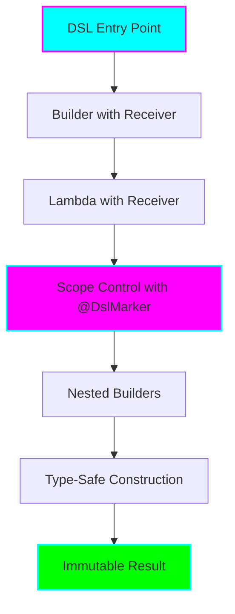

# Project 01: Type-Safe Builders

**Complexity:** ⭐⭐⭐ (Medium-Advanced)

**Duration:** 3-4 days

**Prerequisites:** Basic Kotlin syntax, lambda expressions, higher-order functions

## Overview

Learn to create elegant, type-safe Domain-Specific Languages (DSLs) using Kotlin's builder pattern. Type-safe builders are one of Kotlin's most powerful features, enabling you to create intuitive APIs that feel like natural language while maintaining compile-time safety.

## Learning Objectives

By completing this project, you will:

- ✅ Understand lambda with receiver pattern
- ✅ Master the `@DslMarker` annotation
- ✅ Build type-safe, readable DSLs
- ✅ Prevent scope leakage in nested builders
- ✅ Design fluent APIs
- ✅ Apply builder pattern in real-world scenarios

## Architecture



## What You'll Build

1. **HTML DSL** - Create a type-safe HTML builder
2. **Configuration DSL** - Build an application config DSL
3. **SQL Query DSL** - Design a type-safe SQL query builder
4. **Test DSL** - Create a BDD-style testing DSL

## Quick Start

```kotlin
// Example of what you'll be able to build:

html {
    head {
        title { +"Type-Safe Builders in Kotlin" }
    }
    body {
        h1 { +"Welcome to DSL Magic!" }
        p {
            +"This is a "
            b { +"type-safe" }
            +" HTML builder."
        }
        ul {
            li { +"Lambda with receiver" }
            li { +"@DslMarker annotation" }
            li { +"Scope control" }
        }
    }
}
```

## Project Structure

```
01-type-safe-builders/
├── README.md                          (this file)
├── docs/
│   ├── 01-concepts.md                 (Theoretical concepts)
│   ├── 02-usage.md                    (Practical usage patterns)
│   ├── 03-scenarios.md                (Nuanced scenarios)
│   └── 04-exercises.md                (Practice exercises)
├── src/main/kotlin/
│   ├── 01-basics/
│   │   ├── LambdaWithReceiver.kt      (Foundation concepts)
│   │   └── SimpleBuilder.kt           (Basic builder example)
│   ├── 02-html-dsl/
│   │   ├── HtmlElements.kt            (HTML element classes)
│   │   ├── HtmlBuilder.kt             (HTML DSL implementation)
│   │   └── Examples.kt                (Usage examples)
│   ├── 03-dsl-marker/
│   │   ├── WithoutDslMarker.kt        (Problems without @DslMarker)
│   │   └── WithDslMarker.kt           (Solution with @DslMarker)
│   ├── 04-advanced/
│   │   ├── ConfigDsl.kt               (Configuration DSL)
│   │   ├── SqlDsl.kt                  (SQL query builder)
│   │   └── TestDsl.kt                 (BDD test DSL)
│   └── 05-real-world/
│       ├── GradleDsl.kt               (Gradle-like build DSL)
│       └── RouterDsl.kt               (Web routing DSL)
├── src/test/kotlin/
│   └── BuilderTests.kt
└── solutions/
    └── exercises/                      (Solutions to exercises)
```

## Key Concepts Covered

### 1. Lambda with Receiver
Learn how `Type.(params) -> ReturnType` enables DSL creation

### 2. Extension Lambda
Understand the difference between regular lambdas and extension lambdas

### 3. @DslMarker
Prevent implicit receiver scope leakage in nested builders

### 4. Type-Safe Builders
Ensure compile-time safety while maintaining readability

### 5. Fluent APIs
Design intuitive, chainable interfaces

## Documentation

- 📖 [**Concepts**](docs/01-concepts.md) - Deep dive into theoretical foundations
- 💡 [**Usage**](docs/02-usage.md) - Practical patterns and best practices
- 🎯 [**Scenarios**](docs/03-scenarios.md) - Real-world scenarios and edge cases
- ✏️ [**Exercises**](docs/04-exercises.md) - Hands-on practice problems

## Success Criteria

You've mastered this project when you can:

- [ ] Explain lambda with receiver to someone else
- [ ] Create a type-safe DSL from scratch
- [ ] Use `@DslMarker` appropriately
- [ ] Design fluent, intuitive APIs
- [ ] Handle nested builders correctly
- [ ] Complete all exercises

## Next Steps

After completing this project:
1. Move to **Project 02: Coroutines & Flow Advanced**
2. Consider building a real DSL for your own use case
3. Explore Kotlin's standard library DSLs (e.g., `buildString`, `sequence`)

## Resources

- [Kotlin DSL Documentation](https://kotlinlang.org/docs/type-safe-builders.html)
- [Domain-Specific Languages (Book)](https://martinfowler.com/books/dsl.html) - Martin Fowler
- [KotlinConf: DSLs in Kotlin](https://www.youtube.com/watch?v=fKf3VlnQ0nM)

---

**Ready to start?** Begin with [docs/01-concepts.md](docs/01-concepts.md)!
