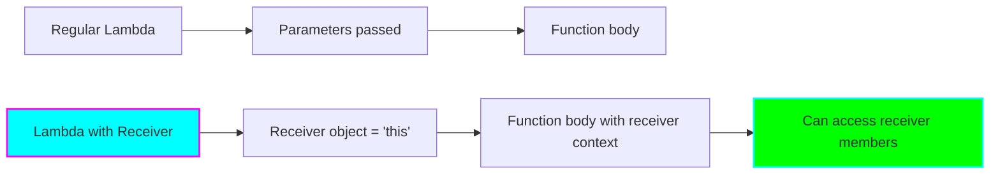
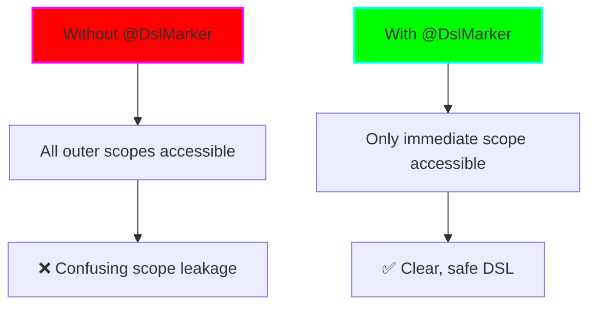

# Concepts: Type-Safe Builders

## Introduction

Type-safe builders are Kotlin's answer to creating Domain-Specific Languages (DSLs) that are both elegant and safe. Unlike runtime DSLs in languages like Ruby or Groovy, Kotlin's DSLs maintain full compile-time type safety.

## Core Concepts

### 1. Lambda with Receiver

The foundation of type-safe builders is the **lambda with receiver** pattern.

#### Regular Lambda

```kotlin
// Regular lambda: (String) -> Unit
val regularLambda: (String) -> Unit = { message ->
    println(message)
}

regularLambda("Hello") // Call it
```

#### Lambda with Receiver

```kotlin
// Lambda with receiver: String.() -> Unit
val lambdaWithReceiver: String.() -> Unit = {
    // 'this' is String
    println(this.uppercase()) // Can call String methods directly
    println(length)            // Can access String properties
}

"hello".lambdaWithReceiver() // Call it on a String instance
```

**Key Difference:**
- Regular lambda receives parameters
- Lambda with receiver executes **in the context** of a receiver object



### 2. Function Types with Receiver

```kotlin
// Function type with receiver
// Receiver.() -> ReturnType

// Examples:
val builder: StringBuilder.() -> Unit = {
    append("Hello")
    append(" ")
    append("World")
}

val result = StringBuilder().apply(builder)
println(result) // "Hello World"
```

### 3. Extension Functions vs Lambda with Receiver

```kotlin
// Extension function
fun String.shout(): String {
    return this.uppercase() + "!"
}

// Lambda with receiver (stored in variable)
val shoutLambda: String.() -> String = {
    this.uppercase() + "!"
}

// Usage
"hello".shout()        // Extension function
"hello".shoutLambda()  // Lambda with receiver
```

**Similarity:** Both have a receiver (`this`)
**Difference:** Extension functions are declared at compile time; lambdas can be passed around

### 4. Building a Simple DSL

Let's build a simple HTML DSL step by step.

#### Step 1: Basic Structure

```kotlin
class HTML {
    private val children = mutableListOf<String>()

    fun body(content: String) {
        children.add("<body>$content</body>")
    }

    override fun toString() = children.joinToString("\n")
}

// Usage
val html = HTML()
html.body("Hello")
println(html) // <body>Hello</body>
```

#### Step 2: Add Lambda with Receiver

```kotlin
class HTML {
    private val children = mutableListOf<Element>()

    // Lambda with receiver parameter
    fun body(init: Body.() -> Unit) {
        val body = Body()
        body.init()  // Execute lambda in Body context
        children.add(body)
    }
}

class Body : Element {
    private val children = mutableListOf<Element>()

    fun p(text: String) {
        children.add(P(text))
    }
}

// Usage
html {
    body {
        p("Hello World") // Called in Body context
    }
}
```

#### Step 3: Make it More Fluent

```kotlin
fun html(init: HTML.() -> Unit): HTML {
    val html = HTML()
    html.init()
    return html
}

// Now we can write:
val page = html {
    body {
        p("Hello World")
    }
}
```

### 5. The `@DslMarker` Annotation

**Problem:** Without `@DslMarker`, nested builders can access outer scopes:

```kotlin
html {
    body {
        div {
            // Without @DslMarker, all these are accessible:
            body { }   // ❌ Shouldn't be able to nest body in div!
            html { }   // ❌ Shouldn't access outer html!
            div { }    // ✅ This is OK
        }
    }
}
```

**Solution:** Use `@DslMarker` to prevent implicit scope access:

```kotlin
@DslMarker
annotation class HtmlTagMarker

@HtmlTagMarker
abstract class Tag(val name: String) {
    // ...
}

@HtmlTagMarker
class HTML : Tag("html") {
    fun body(init: Body.() -> Unit) { /* ... */ }
}

@HtmlTagMarker
class Body : Tag("body") {
    fun div(init: Div.() -> Unit) { /* ... */ }
}

// Now this won't compile:
html {
    body {
        div {
            body { }  // ❌ Compilation error!
        }
    }
}
```



### 6. Type-Safe Builder Pattern

Complete pattern:

```kotlin
@DslMarker
annotation class MyDslMarker

@MyDslMarker
class OuterBuilder {
    private val items = mutableListOf<Item>()

    // Lambda with receiver for nested builder
    fun item(init: ItemBuilder.() -> Unit) {
        val builder = ItemBuilder()
        builder.init()  // Execute in ItemBuilder context
        items.add(builder.build())
    }

    fun build(): Outer = Outer(items)
}

@MyDslMarker
class ItemBuilder {
    var name: String = ""
    var value: Int = 0

    fun build(): Item = Item(name, value)
}

// Top-level DSL entry point
fun outer(init: OuterBuilder.() -> Unit): Outer {
    val builder = OuterBuilder()
    builder.init()
    return builder.build()
}

// Usage
val result = outer {
    item {
        name = "First"
        value = 42
    }
    item {
        name = "Second"
        value = 100
    }
}
```

## How It Works: Deep Dive

### Implicit Receivers

When you use a lambda with receiver, the receiver becomes the **implicit this**:

```kotlin
class Builder {
    var property: String = ""

    fun method() {
        println("Called!")
    }
}

fun build(init: Builder.() -> Unit): Builder {
    val builder = Builder()
    builder.init()  // 'builder' becomes 'this' inside lambda
    return builder
}

// Usage
val result = build {
    property = "Value"    // Equivalent to: this.property = "Value"
    method()              // Equivalent to: this.method()

    // 'this' refers to Builder instance
    println(this::class.simpleName) // "Builder"
}
```

### Scope Control

```mermaid
flowchart TD
    A[Outer Builder] --> B{Lambda with Receiver}
    B --> C[New Scope Created]
    C --> D[Inner Builder = 'this']
    D --> E{@DslMarker Present?}
    E -->|No| F[Can access outer scopes]
    E -->|Yes| G[Only inner scope accessible]
    F --> H[❌ Potential confusion]
    G --> I[✅ Clear DSL]

    style E fill:#ff00ff,stroke:#00ffff,stroke-width:2px
    style I fill:#00ff00,stroke:#00ffff,stroke-width:2px
```

## Advanced Concepts

### 1. Multiple Receivers

You can have multiple levels of receivers:

```kotlin
class Outer {
    fun middle(init: Middle.() -> Unit) {
        Middle().init()
    }
}

class Middle {
    fun inner(init: Inner.() -> Unit) {
        Inner().init()
    }
}

class Inner {
    fun doSomething() {}
}

// Usage
Outer().middle {
    // 'this' is Middle
    inner {
        // 'this' is Inner
        doSomething()
    }
}
```

### 2. Combining with Extension Functions

```kotlin
@DslMarker
annotation class ConfigMarker

@ConfigMarker
class Config {
    private val properties = mutableMapOf<String, Any>()

    // Extension function with lambda receiver
    fun String.to(value: Any) {
        properties[this] = value
    }

    infix fun String.set(value: Any) {
        properties[this] = value
    }
}

// Usage
val config = config {
    "database.host" to "localhost"
    "database.port" to 5432
    "database.user" set "admin"
}
```

### 3. Operator Overloading in DSLs

```kotlin
@DslMarker
annotation class MathDslMarker

@MathDslMarker
class Expression {
    operator fun String.unaryPlus() {
        // Add text
    }

    operator fun Int.times(unit: String): Measurement {
        return Measurement(this, unit)
    }
}

// Usage
expression {
    +"Result: "
    5 * "meters"
}
```

## Comparison with Other Patterns

### Builder Pattern (Java-style)

```kotlin
// Traditional builder
class PersonBuilder {
    private var name: String = ""
    private var age: Int = 0

    fun setName(name: String): PersonBuilder {
        this.name = name
        return this
    }

    fun setAge(age: Int): PersonBuilder {
        this.age = age
        return this
    }

    fun build(): Person = Person(name, age)
}

// Usage
val person = PersonBuilder()
    .setName("John")
    .setAge(30)
    .build()
```

### Type-Safe Builder (Kotlin DSL)

```kotlin
// Kotlin DSL builder
class PersonBuilder {
    var name: String = ""
    var age: Int = 0

    fun build(): Person = Person(name, age)
}

fun person(init: PersonBuilder.() -> Unit): Person {
    val builder = PersonBuilder()
    builder.init()
    return builder.build()
}

// Usage
val person = person {
    name = "John"
    age = 30
}
```

**Advantages of Kotlin DSL:**
- More concise
- No need for `return this`
- Feels like configuration, not code
- Type-safe

## Real-World Examples

### Gradle Kotlin DSL

```kotlin
plugins {
    kotlin("jvm") version "1.9.20"
}

dependencies {
    implementation("org.jetbrains.kotlinx:kotlinx-coroutines-core:1.7.3")
    testImplementation("org.junit.jupiter:junit-jupiter:5.10.0")
}
```

### Ktor Routing DSL

```kotlin
routing {
    get("/") {
        call.respondText("Hello!")
    }

    post("/users") {
        val user = call.receive<User>()
        // ...
    }
}
```

### Exposed SQL DSL

```kotlin
transaction {
    Users.select { Users.age greater 18 }
        .map { it[Users.name] }
}
```

## Key Takeaways

1. **Lambda with receiver** (`Type.() -> ReturnType`) is the foundation
2. **@DslMarker** prevents scope leakage in nested builders
3. Type-safe builders maintain compile-time safety
4. DSLs should feel natural and intuitive
5. Implicit receivers make code read like configuration

## Practice Questions

1. What's the difference between `(T) -> Unit` and `T.() -> Unit`?
2. Why do we need `@DslMarker`?
3. How do implicit receivers work?
4. When should you create a DSL vs using a regular API?

---

**Next:** [Usage Patterns →](02-usage.md)
