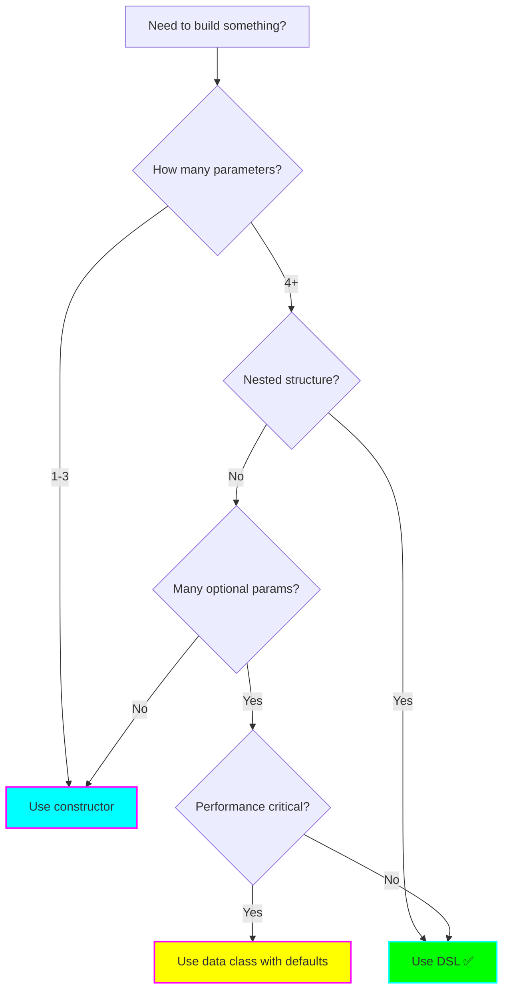

# Usage: Type-Safe Builders

**Focus:** Practical patterns, best practices, and real-world implementation strategies

## Table of Contents

- [Quick Reference](#quick-reference)
- [Basic Usage Patterns](#basic-usage-patterns)
- [HTML DSL Examples](#html-dsl-examples)
- [Configuration DSL Patterns](#configuration-dsl-patterns)
- [Nested Builder Patterns](#nested-builder-patterns)
- [Property Delegation in Builders](#property-delegation-in-builders)
- [Best Practices](#best-practices)
- [Common Pitfalls](#common-pitfalls)
- [Performance Considerations](#performance-considerations)
- [When to Use vs When Not to Use](#when-to-use-vs-when-not-to-use)
- [Migration Strategies](#migration-strategies)

---

## Quick Reference

### DSL Creation Checklist

```
✅ Define a @DslMarker annotation
✅ Create builder classes marked with your @DslMarker
✅ Use lambda with receiver for nested scopes
✅ Provide a top-level entry function
✅ Use immutable results when possible
✅ Test scope isolation
```

### Basic Template

```kotlin
@DslMarker
annotation class MyDslMarker

@MyDslMarker
class MyBuilder {
    // Properties and nested builders here

    fun build(): Result = Result(/* ... */)
}

fun myDsl(init: MyBuilder.() -> Unit): Result {
    return MyBuilder().apply(init).build()
}
```

---

## Basic Usage Patterns

### Pattern 1: Simple Property Configuration

```kotlin
@DslMarker
annotation class ServerConfigMarker

@ServerConfigMarker
class ServerConfig {
    var host: String = "localhost"
    var port: Int = 8080
    var timeout: Long = 5000
    var ssl: Boolean = false

    fun build(): Server = Server(host, port, timeout, ssl)
}

fun server(init: ServerConfig.() -> Unit): Server {
    return ServerConfig().apply(init).build()
}

// Usage
val myServer = server {
    host = "api.example.com"
    port = 443
    ssl = true
    timeout = 10000
}
```

### Pattern 2: Collection Building

```kotlin
@DslMarker
annotation class MenuMarker

@MenuMarker
class Menu {
    private val items = mutableListOf<MenuItem>()

    fun item(name: String, price: Double) {
        items.add(MenuItem(name, price))
    }

    // Overload with lambda for complex items
    fun item(name: String, init: MenuItemBuilder.() -> Unit) {
        items.add(MenuItemBuilder(name).apply(init).build())
    }

    fun build(): List<MenuItem> = items.toList()
}

@MenuMarker
class MenuItemBuilder(private val name: String) {
    var price: Double = 0.0
    var description: String = ""
    var category: String = "General"

    fun build() = MenuItem(name, price, description, category)
}

fun menu(init: Menu.() -> Unit): List<MenuItem> {
    return Menu().apply(init).build()
}

// Usage
val restaurantMenu = menu {
    item("Burger", 12.99)

    item("Pasta") {
        price = 15.50
        description = "Homemade pasta with fresh ingredients"
        category = "Main Course"
    }

    item("Salad") {
        price = 8.99
        category = "Appetizer"
    }
}
```

### Pattern 3: Hierarchical Structure

```kotlin
@DslMarker
annotation class OrgMarker

@OrgMarker
class Organization(val name: String) {
    private val departments = mutableListOf<Department>()

    fun department(name: String, init: Department.() -> Unit) {
        departments.add(Department(name).apply(init))
    }

    fun getDepartments() = departments.toList()
}

@OrgMarker
class Department(val name: String) {
    private val employees = mutableListOf<Employee>()

    fun employee(name: String, role: String) {
        employees.add(Employee(name, role))
    }

    fun getEmployees() = employees.toList()
}

fun organization(name: String, init: Organization.() -> Unit): Organization {
    return Organization(name).apply(init)
}

// Usage
val company = organization("TechCorp") {
    department("Engineering") {
        employee("Alice", "Senior Developer")
        employee("Bob", "DevOps Engineer")
    }

    department("Marketing") {
        employee("Carol", "Marketing Manager")
        employee("Dave", "Content Specialist")
    }
}
```

---

## HTML DSL Examples

### Complete HTML DSL Implementation

```kotlin
@DslMarker
annotation class HtmlTagMarker

// Base class for all HTML elements
@HtmlTagMarker
abstract class Element(val name: String) {
    protected val children = mutableListOf<Element>()
    protected val attributes = mutableMapOf<String, String>()

    // Add text content
    operator fun String.unaryPlus() {
        children.add(TextElement(this))
    }

    fun render(builder: StringBuilder, indent: String = ""): String {
        builder.append("$indent<$name")

        // Add attributes
        if (attributes.isNotEmpty()) {
            attributes.forEach { (key, value) ->
                builder.append(" $key=\"$value\"")
            }
        }

        if (children.isEmpty()) {
            builder.append(" />")
        } else {
            builder.append(">")

            // Check if we need newlines
            val hasNonTextChildren = children.any { it !is TextElement }

            children.forEach { child ->
                if (hasNonTextChildren && child !is TextElement) {
                    builder.append("\n")
                }
                child.render(builder, if (hasNonTextChildren) "$indent  " else "")
            }

            if (hasNonTextChildren) {
                builder.append("\n$indent")
            }
            builder.append("</$name>")
        }

        return builder.toString()
    }

    override fun toString() = render(StringBuilder()).toString()
}

// Text element (not a tag)
class TextElement(val text: String) : Element("") {
    override fun render(builder: StringBuilder, indent: String): String {
        builder.append(text)
        return builder.toString()
    }
}

// HTML root element
@HtmlTagMarker
class HTML : Element("html") {
    fun head(init: Head.() -> Unit) {
        val head = Head()
        head.init()
        children.add(head)
    }

    fun body(init: Body.() -> Unit) {
        val body = Body()
        body.init()
        children.add(body)
    }
}

@HtmlTagMarker
class Head : Element("head") {
    fun title(init: Title.() -> Unit) {
        val title = Title()
        title.init()
        children.add(title)
    }

    fun meta(charset: String) {
        val meta = Meta()
        meta.attributes["charset"] = charset
        children.add(meta)
    }
}

@HtmlTagMarker
class Title : Element("title")

@HtmlTagMarker
class Meta : Element("meta")

@HtmlTagMarker
class Body : Element("body") {
    fun h1(init: H1.() -> Unit) {
        children.add(H1().apply(init))
    }

    fun h2(init: H2.() -> Unit) {
        children.add(H2().apply(init))
    }

    fun p(init: P.() -> Unit) {
        children.add(P().apply(init))
    }

    fun div(cssClass: String? = null, init: Div.() -> Unit) {
        val div = Div()
        cssClass?.let { div.attributes["class"] = it }
        div.init()
        children.add(div)
    }

    fun ul(init: UL.() -> Unit) {
        children.add(UL().apply(init))
    }

    fun a(href: String, init: A.() -> Unit) {
        val link = A()
        link.attributes["href"] = href
        link.init()
        children.add(link)
    }
}

@HtmlTagMarker
class H1 : Element("h1") {
    fun b(init: B.() -> Unit) {
        children.add(B().apply(init))
    }
}

@HtmlTagMarker
class H2 : Element("h2")

@HtmlTagMarker
class P : Element("p") {
    fun b(init: B.() -> Unit) {
        children.add(B().apply(init))
    }

    fun i(init: I.() -> Unit) {
        children.add(I().apply(init))
    }

    fun a(href: String, init: A.() -> Unit) {
        val link = A()
        link.attributes["href"] = href
        link.init()
        children.add(link)
    }
}

@HtmlTagMarker
class Div : Element("div") {
    fun p(init: P.() -> Unit) {
        children.add(P().apply(init))
    }

    fun h2(init: H2.() -> Unit) {
        children.add(H2().apply(init))
    }

    fun div(cssClass: String? = null, init: Div.() -> Unit) {
        val div = Div()
        cssClass?.let { div.attributes["class"] = it }
        div.init()
        children.add(div)
    }
}

@HtmlTagMarker
class UL : Element("ul") {
    fun li(init: LI.() -> Unit) {
        children.add(LI().apply(init))
    }
}

@HtmlTagMarker
class LI : Element("li")

@HtmlTagMarker
class A : Element("a")

@HtmlTagMarker
class B : Element("b")

@HtmlTagMarker
class I : Element("i")

// Top-level DSL function
fun html(init: HTML.() -> Unit): HTML {
    return HTML().apply(init)
}

// Usage Examples
fun main() {
    // Example 1: Simple page
    val page = html {
        head {
            title { +"My Website" }
            meta("UTF-8")
        }
        body {
            h1 { +"Welcome!" }
            p { +"This is a paragraph." }
        }
    }

    println(page)

    // Example 2: Complex page with nested elements
    val complexPage = html {
        head {
            title { +"Type-Safe Builders in Kotlin" }
            meta("UTF-8")
        }
        body {
            h1 {
                +"Learning "
                b { +"Type-Safe Builders" }
            }

            div("container") {
                h2 { +"What You'll Learn" }
                p {
                    +"Type-safe builders allow you to create "
                    b { +"elegant DSLs" }
                    +" in Kotlin."
                }

                ul {
                    li { +"Lambda with receiver" }
                    li { +"@DslMarker annotation" }
                    li { +"Scope control" }
                    li { +"Best practices" }
                }
            }

            div("footer") {
                p {
                    +"Check out the "
                    a("https://kotlinlang.org") {
                        +"official documentation"
                    }
                }
            }
        }
    }

    println(complexPage)
}
```

---

## Configuration DSL Patterns

### Pattern 1: Application Configuration

```kotlin
@DslMarker
annotation class ConfigMarker

@ConfigMarker
class AppConfig {
    lateinit var name: String
    lateinit var version: String

    private var databaseConfig: DatabaseConfig? = null
    private var serverConfig: ServerConfig? = null
    private val features = mutableListOf<Feature>()

    fun database(init: DatabaseConfig.() -> Unit) {
        databaseConfig = DatabaseConfig().apply(init)
    }

    fun server(init: ServerConfig.() -> Unit) {
        serverConfig = ServerConfig().apply(init)
    }

    fun feature(name: String, enabled: Boolean = true) {
        features.add(Feature(name, enabled))
    }

    fun build(): Application {
        require(::name.isInitialized) { "Application name is required" }
        require(::version.isInitialized) { "Application version is required" }

        return Application(
            name = name,
            version = version,
            database = databaseConfig?.build(),
            server = serverConfig?.build() ?: ServerConfig().build(),
            features = features.toList()
        )
    }
}

@ConfigMarker
class DatabaseConfig {
    var driver: String = "postgresql"
    var host: String = "localhost"
    var port: Int = 5432
    var database: String = "mydb"
    var username: String = ""
    var password: String = ""

    private var poolConfig: PoolConfig? = null

    fun pool(init: PoolConfig.() -> Unit) {
        poolConfig = PoolConfig().apply(init)
    }

    fun build() = Database(driver, host, port, database, username, password, poolConfig?.build())
}

@ConfigMarker
class PoolConfig {
    var minConnections: Int = 5
    var maxConnections: Int = 20
    var connectionTimeout: Long = 30000

    fun build() = Pool(minConnections, maxConnections, connectionTimeout)
}

@ConfigMarker
class ServerConfig {
    var host: String = "0.0.0.0"
    var port: Int = 8080
    var ssl: Boolean = false

    private var sslConfig: SslConfig? = null

    fun ssl(init: SslConfig.() -> Unit) {
        ssl = true
        sslConfig = SslConfig().apply(init)
    }

    fun build() = Server(host, port, ssl, sslConfig?.build())
}

@ConfigMarker
class SslConfig {
    lateinit var keyStore: String
    lateinit var keyStorePassword: String
    var protocol: String = "TLS"

    fun build(): Ssl {
        require(::keyStore.isInitialized) { "SSL keyStore is required" }
        require(::keyStorePassword.isInitialized) { "SSL keyStorePassword is required" }
        return Ssl(keyStore, keyStorePassword, protocol)
    }
}

// Data classes for the built configuration
data class Application(
    val name: String,
    val version: String,
    val database: Database?,
    val server: Server,
    val features: List<Feature>
)
data class Database(
    val driver: String,
    val host: String,
    val port: Int,
    val database: String,
    val username: String,
    val password: String,
    val pool: Pool?
)
data class Pool(val minConnections: Int, val maxConnections: Int, val connectionTimeout: Long)
data class Server(val host: String, val port: Int, val ssl: Boolean, val sslConfig: Ssl?)
data class Ssl(val keyStore: String, val keyStorePassword: String, val protocol: String)
data class Feature(val name: String, val enabled: Boolean)

// Top-level DSL function
fun application(init: AppConfig.() -> Unit): Application {
    return AppConfig().apply(init).build()
}

// Usage
val app = application {
    name = "MyApp"
    version = "1.0.0"

    database {
        driver = "postgresql"
        host = "db.example.com"
        port = 5432
        database = "production_db"
        username = "admin"
        password = "secret"

        pool {
            minConnections = 10
            maxConnections = 50
            connectionTimeout = 60000
        }
    }

    server {
        host = "0.0.0.0"
        port = 443

        ssl {
            keyStore = "/path/to/keystore.jks"
            keyStorePassword = "keystorepass"
            protocol = "TLSv1.3"
        }
    }

    feature("authentication", enabled = true)
    feature("caching", enabled = true)
    feature("analytics", enabled = false)
}
```

### Pattern 2: Type-Safe Configuration with Validation

```kotlin
@DslMarker
annotation class ValidatedConfigMarker

@ValidatedConfigMarker
class ValidatedServerConfig {
    private var _host: String? = null
    private var _port: Int? = null

    var host: String
        get() = _host ?: throw IllegalStateException("Host must be set")
        set(value) {
            require(value.isNotBlank()) { "Host cannot be blank" }
            _host = value
        }

    var port: Int
        get() = _port ?: 8080
        set(value) {
            require(value in 1..65535) { "Port must be between 1 and 65535" }
            _port = value
        }

    var workers: Int = Runtime.getRuntime().availableProcessors()
        set(value) {
            require(value > 0) { "Workers must be positive" }
            field = value
        }

    fun validate() {
        host // Triggers validation
    }

    fun build(): ValidatedServer {
        validate()
        return ValidatedServer(host, port, workers)
    }
}

data class ValidatedServer(val host: String, val port: Int, val workers: Int)

fun validatedServer(init: ValidatedServerConfig.() -> Unit): ValidatedServer {
    return ValidatedServerConfig().apply(init).build()
}

// Usage with validation
val server = validatedServer {
    host = "api.example.com"
    port = 8443
    workers = 8
}

// This would throw an exception:
// val invalidServer = validatedServer {
//     host = ""  // IllegalArgumentException: Host cannot be blank
// }
```

---

## Nested Builder Patterns

### Pattern 1: Multi-Level Nesting

```kotlin
@DslMarker
annotation class UiMarker

@UiMarker
class Window(val title: String) {
    private val panels = mutableListOf<Panel>()

    fun panel(name: String, init: Panel.() -> Unit) {
        panels.add(Panel(name).apply(init))
    }

    fun render(): String {
        return buildString {
            appendLine("Window: $title")
            panels.forEach { panel ->
                appendLine(panel.render("  "))
            }
        }
    }
}

@UiMarker
class Panel(val name: String) {
    private val widgets = mutableListOf<Widget>()

    fun button(text: String, init: Button.() -> Unit = {}) {
        widgets.add(Button(text).apply(init))
    }

    fun textField(label: String, init: TextField.() -> Unit = {}) {
        widgets.add(TextField(label).apply(init))
    }

    fun container(init: Container.() -> Unit) {
        widgets.add(Container().apply(init))
    }

    fun render(indent: String): String {
        return buildString {
            appendLine("${indent}Panel: $name")
            widgets.forEach { widget ->
                appendLine(widget.render("$indent  "))
            }
        }
    }
}

@UiMarker
sealed class Widget {
    abstract fun render(indent: String): String
}

@UiMarker
class Button(val text: String) : Widget() {
    var onClick: (() -> Unit)? = null
    var enabled: Boolean = true

    override fun render(indent: String) = "${indent}Button: $text (enabled=$enabled)"
}

@UiMarker
class TextField(val label: String) : Widget() {
    var placeholder: String = ""
    var maxLength: Int = 100

    override fun render(indent: String) =
        "${indent}TextField: $label (placeholder='$placeholder', maxLength=$maxLength)"
}

@UiMarker
class Container : Widget() {
    private val children = mutableListOf<Widget>()

    fun button(text: String, init: Button.() -> Unit = {}) {
        children.add(Button(text).apply(init))
    }

    fun textField(label: String, init: TextField.() -> Unit = {}) {
        children.add(TextField(label).apply(init))
    }

    override fun render(indent: String): String {
        return buildString {
            appendLine("${indent}Container:")
            children.forEach { child ->
                appendLine(child.render("$indent  "))
            }
        }
    }
}

fun window(title: String, init: Window.() -> Unit): Window {
    return Window(title).apply(init)
}

// Usage
val ui = window("User Registration") {
    panel("Login Form") {
        textField("Username") {
            placeholder = "Enter username"
            maxLength = 50
        }

        textField("Password") {
            placeholder = "Enter password"
            maxLength = 100
        }

        button("Login") {
            enabled = true
            onClick = { println("Login clicked!") }
        }
    }

    panel("Options") {
        container {
            button("Remember me")
            button("Forgot password") {
                enabled = false
            }
        }
    }
}

println(ui.render())
```

### Pattern 2: Scope Isolation with @DslMarker

```kotlin
@DslMarker
annotation class QueryMarker

@QueryMarker
class Query {
    private val selects = mutableListOf<String>()
    private var fromClause: String? = null
    private var whereClause: WhereClause? = null
    private var orderByClause: String? = null

    fun select(vararg columns: String) {
        selects.addAll(columns)
    }

    fun from(table: String) {
        fromClause = table
    }

    fun where(init: WhereClause.() -> Unit) {
        whereClause = WhereClause().apply(init)
    }

    fun orderBy(column: String) {
        orderByClause = column
    }

    fun build(): String {
        require(selects.isNotEmpty()) { "SELECT columns are required" }
        require(fromClause != null) { "FROM clause is required" }

        return buildString {
            append("SELECT ${selects.joinToString(", ")}")
            append(" FROM $fromClause")
            whereClause?.let { append(" WHERE ${it.build()}") }
            orderByClause?.let { append(" ORDER BY $it") }
        }
    }
}

@QueryMarker
class WhereClause {
    private val conditions = mutableListOf<String>()

    infix fun String.eq(value: Any) {
        conditions.add("$this = ${formatValue(value)}")
    }

    infix fun String.gt(value: Any) {
        conditions.add("$this > ${formatValue(value)}")
    }

    infix fun String.lt(value: Any) {
        conditions.add("$this < ${formatValue(value)}")
    }

    fun and(init: WhereClause.() -> Unit) {
        val nested = WhereClause().apply(init)
        conditions.add("(${nested.build()})")
    }

    fun or(init: WhereClause.() -> Unit) {
        val nested = WhereClause().apply(init)
        conditions.add("OR (${nested.build()})")
    }

    private fun formatValue(value: Any): String {
        return when (value) {
            is String -> "'$value'"
            else -> value.toString()
        }
    }

    fun build(): String = conditions.joinToString(" AND ")
}

fun query(init: Query.() -> Unit): String {
    return Query().apply(init).build()
}

// Usage - @DslMarker prevents calling outer scope methods
val sql = query {
    select("id", "name", "age")
    from("users")
    where {
        "age" gt 18
        "status" eq "active"

        // Without @DslMarker, you could accidentally call:
        // select("email")  // ❌ Compilation error - can't access outer scope

        and {
            "country" eq "USA"
            "verified" eq true
        }
    }
    orderBy("name")
}

println(sql)
// Output: SELECT id, name, age FROM users WHERE age > 18 AND status = 'active' AND (country = 'USA' AND verified = true) ORDER BY name
```

---

## Property Delegation in Builders

### Pattern 1: Lazy Initialization with Delegation

```kotlin
@DslMarker
annotation class ResourceMarker

@ResourceMarker
class ResourceBuilder {
    // Lazy property delegation
    val config: Config by lazy {
        loadConfigFromFile()
    }

    // Observable property
    var resourceName: String by observable("default") { _, old, new ->
        println("Resource name changed from $old to $new")
    }

    // Custom delegation
    var timeout: Int by validatedInt(1000, 1..60000)

    fun build(): Resource {
        return Resource(resourceName, timeout, config)
    }

    private fun loadConfigFromFile(): Config {
        println("Loading config...")
        return Config("production")
    }
}

// Custom delegate with validation
class ValidatedInt(private val initial: Int, private val range: IntRange) {
    private var value: Int = initial

    operator fun getValue(thisRef: Any?, property: kotlin.reflect.KProperty<*>): Int {
        return value
    }

    operator fun setValue(thisRef: Any?, property: kotlin.reflect.KProperty<*>, value: Int) {
        require(value in range) { "${property.name} must be in range $range" }
        this.value = value
    }
}

fun validatedInt(initial: Int, range: IntRange) = ValidatedInt(initial, range)

data class Config(val environment: String)
data class Resource(val name: String, val timeout: Int, val config: Config)

fun resource(init: ResourceBuilder.() -> Unit): Resource {
    return ResourceBuilder().apply(init).build()
}

// Usage
val myResource = resource {
    resourceName = "DatabaseConnection"
    timeout = 5000
    // config is loaded lazily on first access
}
```

### Pattern 2: Delegated Properties for Computed Values

```kotlin
@DslMarker
annotation class FormMarker

@FormMarker
class Form {
    private val fields = mutableMapOf<String, FormField>()

    fun field(name: String, init: FormField.() -> Unit) {
        fields[name] = FormField(name).apply(init)
    }

    // Computed property using delegation
    val isValid: Boolean by lazy {
        fields.values.all { it.validate() }
    }

    val summary: String by lazy {
        buildString {
            appendLine("Form Summary:")
            fields.values.forEach { field ->
                appendLine("  ${field.name}: ${field.value} (valid: ${field.validate()})")
            }
        }
    }

    fun build(): Map<String, FormField> = fields.toMap()
}

@FormMarker
class FormField(val name: String) {
    var value: String = ""
    var required: Boolean = false
    var minLength: Int = 0
    var maxLength: Int = 100
    var pattern: Regex? = null

    fun validate(): Boolean {
        if (required && value.isBlank()) return false
        if (value.length < minLength) return false
        if (value.length > maxLength) return false
        if (pattern != null && !pattern!!.matches(value)) return false
        return true
    }
}

fun form(init: Form.() -> Unit): Form {
    return Form().apply(init)
}

// Usage
val registrationForm = form {
    field("email") {
        required = true
        pattern = Regex("^[A-Za-z0-9+_.-]+@(.+)$")
        value = "user@example.com"
    }

    field("username") {
        required = true
        minLength = 3
        maxLength = 20
        value = "john_doe"
    }

    field("bio") {
        required = false
        maxLength = 500
        value = "Software developer"
    }
}

println(registrationForm.summary)
println("Form is valid: ${registrationForm.isValid}")
```

---

## Best Practices

### 1. Always Use @DslMarker

```kotlin
// ❌ BAD: Without @DslMarker
class Outer {
    fun inner(init: Inner.() -> Unit) {
        Inner().init()
    }
}

class Inner {
    fun doSomething() {}
}

fun outer(init: Outer.() -> Unit): Outer = Outer().apply(init)

// Problem: Can access outer scope
outer {
    inner {
        doSomething() // ✅ OK
        inner {       // ❌ Confusing - calling outer scope method
            doSomething()
        }
    }
}

// ✅ GOOD: With @DslMarker
@DslMarker
annotation class BuilderMarker

@BuilderMarker
class SafeOuter {
    fun inner(init: SafeInner.() -> Unit) {
        SafeInner().init()
    }
}

@BuilderMarker
class SafeInner {
    fun doSomething() {}
}

fun safeOuter(init: SafeOuter.() -> Unit): SafeOuter = SafeOuter().apply(init)

safeOuter {
    inner {
        doSomething() // ✅ OK
        // inner { }  // ❌ Compilation error - good!
    }
}
```

### 2. Provide Sensible Defaults

```kotlin
// ✅ GOOD: Sensible defaults
@DslMarker
annotation class HttpMarker

@HttpMarker
class HttpClient {
    var timeout: Long = 30000  // 30 seconds default
    var retries: Int = 3       // 3 retries default
    var followRedirects: Boolean = true
    var userAgent: String = "MyApp/1.0"

    fun build(): Client = Client(timeout, retries, followRedirects, userAgent)
}

// Usage - only configure what's different
val client = httpClient {
    timeout = 60000  // Only change timeout
    // Other values use defaults
}

// ❌ BAD: Force users to set everything
@HttpMarker
class BadHttpClient {
    lateinit var timeout: Long
    lateinit var retries: Int
    // User must set everything!
}
```

### 3. Make Immutable Results

```kotlin
// ✅ GOOD: Return immutable result
@DslMarker
annotation class ListMarker

@ListMarker
class ListBuilder<T> {
    private val items = mutableListOf<T>()

    fun add(item: T) {
        items.add(item)
    }

    // Return immutable list
    fun build(): List<T> = items.toList()
}

fun <T> buildList(init: ListBuilder<T>.() -> Unit): List<T> {
    return ListBuilder<T>().apply(init).build()
}

// ❌ BAD: Return mutable result
@ListMarker
class BadListBuilder<T> {
    val items = mutableListOf<T>()  // Exposed as mutable
}

// Problem: Users can modify after creation
val list = BadListBuilder<String>().apply {
    items.add("one")
}.items

list.add("two")  // Unexpected mutation!
```

### 4. Validate Early

```kotlin
// ✅ GOOD: Validate in build()
@DslMarker
annotation class UserMarker

@UserMarker
class UserBuilder {
    var name: String = ""
    var email: String = ""
    var age: Int = 0

    fun build(): User {
        require(name.isNotBlank()) { "Name is required" }
        require(email.contains("@")) { "Valid email is required" }
        require(age >= 0) { "Age must be non-negative" }

        return User(name, email, age)
    }
}

data class User(val name: String, val email: String, val age: Int)

fun user(init: UserBuilder.() -> Unit): User {
    return UserBuilder().apply(init).build()
}

// Validation happens at build time
// val invalidUser = user {
//     name = ""
//     email = "invalid"
// }  // throws IllegalArgumentException
```

### 5. Use Descriptive Function Names

```kotlin
// ✅ GOOD: Clear, descriptive names
@DslMarker
annotation class DocMarker

@DocMarker
class Document {
    fun paragraph(text: String) {}
    fun heading(level: Int, text: String) {}
    fun bulletList(items: List<String>) {}
    fun image(url: String, alt: String) {}
}

// ❌ BAD: Unclear names
@DocMarker
class BadDocument {
    fun p(t: String) {}      // What's p? What's t?
    fun h(l: Int, t: String) {}  // Cryptic
    fun bl(i: List<String>) {}   // Abbreviations
}
```

### 6. Scope Functions vs Custom DSL

```kotlin
// ✅ GOOD: Use scope functions for simple cases
data class Person(var name: String = "", var age: Int = 0)

val person = Person().apply {
    name = "John"
    age = 30
}

// ✅ GOOD: Use DSL for complex hierarchies
@DslMarker
annotation class OrgMarker

@OrgMarker
class Company {
    fun department(name: String, init: Department.() -> Unit) {}
}

@OrgMarker
class Department {
    fun team(name: String, init: Team.() -> Unit) {}
}

@OrgMarker
class Team {
    fun member(name: String) {}
}
```

---

## Common Pitfalls

### Pitfall 1: Forgetting @DslMarker

**Problem:**
```kotlin
// Without @DslMarker
class Outer {
    fun middle(init: Middle.() -> Unit) {
        Middle().init()
    }
}

class Middle {
    fun inner(init: Inner.() -> Unit) {
        Inner().init()
    }
}

class Inner {
    fun action() {}
}

// Can accidentally call wrong scope
Outer().middle {
    inner {
        middle {  // ❌ Confusing! Accessing outer scope
            inner {
                action()
            }
        }
    }
}
```

**Solution:**
```kotlin
@DslMarker
annotation class ScopeMarker

@ScopeMarker
class SafeOuter { /*...*/ }

@ScopeMarker
class SafeMiddle { /*...*/ }

@ScopeMarker
class SafeInner { /*...*/ }

// Now outer scope is not accessible - compile error
```

### Pitfall 2: Mutable State Leakage

**Problem:**
```kotlin
// ❌ BAD: Exposed mutable state
class Builder {
    val items = mutableListOf<String>()  // Public mutable list

    fun add(item: String) {
        items.add(item)
    }
}

val builder = Builder()
builder.add("one")
builder.items.clear()  // ❌ Can be modified externally!
```

**Solution:**
```kotlin
// ✅ GOOD: Encapsulated state
class SafeBuilder {
    private val items = mutableListOf<String>()

    fun add(item: String) {
        items.add(item)
    }

    fun build(): List<String> = items.toList()  // Return immutable copy
}
```

### Pitfall 3: Deep Nesting Without Structure

**Problem:**
```kotlin
// ❌ BAD: Too deeply nested, hard to read
config {
    section("database") {
        subsection("connection") {
            property("host") {
                value("localhost") {
                    validation {
                        rule("not-empty") {
                            message("Host cannot be empty") {
                                // Too deep!
                            }
                        }
                    }
                }
            }
        }
    }
}
```

**Solution:**
```kotlin
// ✅ GOOD: Flatten the structure
config {
    database {
        host = "localhost"  // Simple property
        validation {
            notEmpty("host", "Host cannot be empty")
        }
    }
}
```

### Pitfall 4: No Validation

**Problem:**
```kotlin
// ❌ BAD: No validation
class ServerBuilder {
    var port: Int = 0

    fun build() = Server(port)
}

// Can create invalid server
val server = server {
    port = -1  // Invalid but accepted!
}
```

**Solution:**
```kotlin
// ✅ GOOD: Validate in setter or build()
class ValidatedServerBuilder {
    var port: Int = 8080
        set(value) {
            require(value in 1..65535) { "Invalid port: $value" }
            field = value
        }

    fun build() = Server(port)
}
```

### Pitfall 5: Overusing DSLs

**Problem:**
```kotlin
// ❌ BAD: DSL for simple data
val point = point {
    x = 10
    y = 20
}

// This is overkill for simple data
```

**Solution:**
```kotlin
// ✅ GOOD: Use constructor or data class
data class Point(val x: Int, val y: Int)
val point = Point(10, 20)  // Much simpler!

// Use DSL only when there's real complexity
val ui = window {
    panel {
        button("Click me")
        textField("Enter text")
    }
}
```

---

## Performance Considerations

### 1. Avoid Unnecessary Object Creation

```kotlin
// ❌ LESS EFFICIENT: Creates intermediate objects
fun build(init: Builder.() -> Unit): Result {
    val builder = Builder()
    builder.init()
    return builder.build()
}

// ✅ MORE EFFICIENT: Use apply
fun build(init: Builder.() -> Unit): Result {
    return Builder().apply(init).build()
}
```

### 2. Lazy Initialization for Expensive Operations

```kotlin
@DslMarker
annotation class AppMarker

@AppMarker
class AppBuilder {
    // ❌ BAD: Eager initialization
    val database = connectToDatabase()  // Connects even if not used

    // ✅ GOOD: Lazy initialization
    val database by lazy { connectToDatabase() }  // Only connects when accessed

    fun build(): App = App(database)
}

fun connectToDatabase(): Database {
    println("Connecting to database...")
    return Database()
}
```

### 3. Reuse Builders for Similar Objects

```kotlin
// For creating many similar objects
class ProductBuilder {
    var name: String = ""
    var price: Double = 0.0
    var category: String = ""

    fun build() = Product(name, price, category)

    fun reset() {
        name = ""
        price = 0.0
        category = ""
    }
}

// Reuse builder instance
val builder = ProductBuilder()

val products = listOf(
    builder.apply {
        name = "Laptop"
        price = 999.99
        category = "Electronics"
    }.build().also { builder.reset() },

    builder.apply {
        name = "Mouse"
        price = 29.99
        category = "Electronics"
    }.build()
)
```

### 4. Collection Capacity Hints

```kotlin
@DslMarker
annotation class CollectionMarker

@CollectionMarker
class ListBuilder<T>(initialCapacity: Int = 10) {
    private val items = ArrayList<T>(initialCapacity)  // Hint capacity

    fun add(item: T) {
        items.add(item)
    }

    fun build(): List<T> = items
}

// Better performance when you know approximate size
fun <T> buildList(capacity: Int = 10, init: ListBuilder<T>.() -> Unit): List<T> {
    return ListBuilder<T>(capacity).apply(init).build()
}

val largeList = buildList(1000) {  // Hint: ~1000 items
    repeat(1000) { add(it) }
}
```

### 5. Inline Functions for DSL Entry Points

```kotlin
// ✅ GOOD: Inline for better performance
inline fun <T> buildList(init: ListBuilder<T>.() -> Unit): List<T> {
    return ListBuilder<T>().apply(init).build()
}

// The lambda gets inlined at call site - no extra object allocation
```

---

## When to Use vs When Not to Use

### ✅ Use Type-Safe Builders When:

1. **Building Complex Hierarchies**
   ```kotlin
   // Perfect use case: nested structure
   html {
       body {
           div {
               p { +"Text" }
           }
       }
   }
   ```

2. **Configuration with Many Optional Parameters**
   ```kotlin
   // Good: Many optional settings
   server {
       port = 8080
       timeout = 5000
       ssl {
           enabled = true
           keyStore = "/path/to/key"
       }
   }
   ```

3. **Domain-Specific Languages**
   ```kotlin
   // Perfect: SQL-like DSL
   query {
       select("name", "age")
       from("users")
       where { "age" gt 18 }
   }
   ```

4. **Test Specifications**
   ```kotlin
   // Good: BDD-style tests
   spec {
       describe("Calculator") {
           it("should add numbers") {
               expect(calculator.add(2, 3)).toBe(5)
           }
       }
   }
   ```

### ❌ Don't Use Type-Safe Builders When:

1. **Simple Data Classes**
   ```kotlin
   // ❌ Overkill
   val person = person {
       name = "John"
       age = 30
   }

   // ✅ Better: Use constructor
   val person = Person("John", 30)
   ```

2. **Few Parameters**
   ```kotlin
   // ❌ Unnecessary
   val point = point {
       x = 10
       y = 20
   }

   // ✅ Better: Simple constructor
   val point = Point(10, 20)
   ```

3. **No Nesting or Hierarchy**
   ```kotlin
   // ❌ No benefit
   val config = config {
       value1 = "a"
       value2 = "b"
       value3 = "c"
   }

   // ✅ Better: Use map or data class
   val config = mapOf(
       "value1" to "a",
       "value2" to "b",
       "value3" to "c"
   )
   ```

4. **Performance-Critical Code**
   ```kotlin
   // ❌ Overhead in tight loops
   repeat(1_000_000) {
       val obj = dsl {
           property = value
       }
   }

   // ✅ Better: Direct construction
   repeat(1_000_000) {
       val obj = MyClass(value)
   }
   ```

### Decision Matrix



---

## Migration Strategies

### Strategy 1: Gradual Migration from Java Builders

**Before (Java-style builder):**
```kotlin
class Person(
    val name: String,
    val age: Int,
    val email: String,
    val phone: String
)

class PersonBuilder {
    private var name: String = ""
    private var age: Int = 0
    private var email: String = ""
    private var phone: String = ""

    fun setName(name: String): PersonBuilder {
        this.name = name
        return this
    }

    fun setAge(age: Int): PersonBuilder {
        this.age = age
        return this
    }

    fun setEmail(email: String): PersonBuilder {
        this.email = email
        return this
    }

    fun setPhone(phone: String): PersonBuilder {
        this.phone = phone
        return this
    }

    fun build(): Person = Person(name, age, email, phone)
}

// Usage
val person = PersonBuilder()
    .setName("John")
    .setAge(30)
    .setEmail("john@example.com")
    .setPhone("555-1234")
    .build()
```

**After (Type-safe builder):**
```kotlin
@DslMarker
annotation class PersonMarker

@PersonMarker
class PersonBuilder {
    var name: String = ""
    var age: Int = 0
    var email: String = ""
    var phone: String = ""

    fun build() = Person(name, age, email, phone)
}

fun person(init: PersonBuilder.() -> Unit): Person {
    return PersonBuilder().apply(init).build()
}

// Usage
val person = person {
    name = "John"
    age = 30
    email = "john@example.com"
    phone = "555-1234"
}
```

### Strategy 2: Maintain Backward Compatibility

```kotlin
// Support both styles during migration
@PersonMarker
class HybridPersonBuilder {
    var name: String = ""
    var age: Int = 0
    var email: String = ""
    var phone: String = ""

    // Old style (chainable)
    fun setName(name: String): HybridPersonBuilder {
        this.name = name
        return this
    }

    fun setAge(age: Int): HybridPersonBuilder {
        this.age = age
        return this
    }

    fun setEmail(email: String): HybridPersonBuilder {
        this.email = email
        return this
    }

    fun setPhone(phone: String): HybridPersonBuilder {
        this.phone = phone
        return this
    }

    fun build() = Person(name, age, email, phone)
}

fun person(init: HybridPersonBuilder.() -> Unit): Person {
    return HybridPersonBuilder().apply(init).build()
}

// Old style still works
val person1 = HybridPersonBuilder()
    .setName("John")
    .setAge(30)
    .build()

// New DSL style also works
val person2 = person {
    name = "Jane"
    age = 25
}
```

### Strategy 3: Extension Functions for Smooth Transition

```kotlin
// Existing builder
class LegacyBuilder {
    private var value: String = ""

    fun setValue(value: String): LegacyBuilder {
        this.value = value
        return this
    }

    fun build(): Result = Result(value)
}

// Add DSL extensions
fun LegacyBuilder.dsl(init: LegacyBuilderDsl.() -> Unit): Result {
    return LegacyBuilderDsl(this).apply(init).build()
}

class LegacyBuilderDsl(private val legacy: LegacyBuilder) {
    var value: String = ""
        set(v) {
            field = v
            legacy.setValue(v)
        }

    fun build() = legacy.build()
}

// Both styles work
val result1 = LegacyBuilder().setValue("test").build()
val result2 = LegacyBuilder().dsl { value = "test" }
```

### Strategy 4: Migration Checklist

```
Migration Steps:
□ Identify complex builders worth migrating
□ Create @DslMarker annotation
□ Convert builder methods to properties
□ Add lambda with receiver parameter
□ Test with existing use cases
□ Maintain old API if needed (deprecated)
□ Update documentation
□ Migrate tests
□ Update client code gradually
□ Remove deprecated API after migration period
```

### Example: Complete Migration

```kotlin
// Phase 1: Original builder
class ConfigBuilder {
    private var host: String = "localhost"
    private var port: Int = 8080

    fun setHost(host: String): ConfigBuilder {
        this.host = host
        return this
    }

    fun setPort(port: Int): ConfigBuilder {
        this.port = port
        return this
    }

    fun build() = Config(host, port)
}

// Phase 2: Add DSL support (both work)
@DslMarker
annotation class ConfigMarker

@ConfigMarker
class ConfigBuilder {
    var host: String = "localhost"
    var port: Int = 8080

    @Deprecated("Use property assignment", ReplaceWith("host = value"))
    fun setHost(host: String): ConfigBuilder {
        this.host = host
        return this
    }

    @Deprecated("Use property assignment", ReplaceWith("port = value"))
    fun setPort(port: Int): ConfigBuilder {
        this.port = port
        return this
    }

    fun build() = Config(host, port)
}

fun config(init: ConfigBuilder.() -> Unit): Config {
    return ConfigBuilder().apply(init).build()
}

// Phase 3: Migrate all usage
// Old (still works but deprecated)
val config1 = ConfigBuilder()
    .setHost("api.example.com")
    .setPort(443)
    .build()

// New (encouraged)
val config2 = config {
    host = "api.example.com"
    port = 443
}

// Phase 4: Remove deprecated methods after transition
@ConfigMarker
class FinalConfigBuilder {
    var host: String = "localhost"
    var port: Int = 8080

    fun build() = Config(host, port)
}
```

---

## Summary

Type-safe builders in Kotlin provide:

✅ **Type safety** - Compile-time checking
✅ **Readability** - Code that reads like configuration
✅ **Scoping** - Controlled with @DslMarker
✅ **Flexibility** - Easy to extend and modify
✅ **IDE Support** - Autocomplete and refactoring

**Key Reminders:**
- Always use `@DslMarker` for nested DSLs
- Validate inputs in `build()` methods
- Return immutable results
- Use descriptive function names
- Don't overuse - simple cases don't need DSLs
- Inline DSL entry points for performance

**Next Steps:**
- Read [Scenarios →](03-scenarios.md) for advanced use cases
- Try [Exercises →](04-exercises.md) to practice
- Build your own DSL for a real project

---
