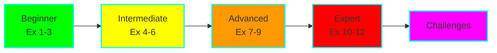
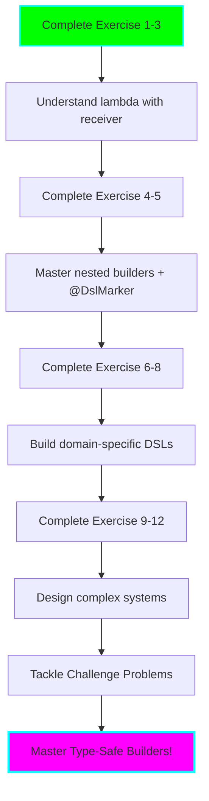

# Exercises: Type-Safe Builders

## Introduction

These exercises will take you from basic lambda with receiver concepts to building advanced, production-ready DSLs. Complete them in order, as each builds on concepts from the previous ones.

**Time estimate:** 6-8 hours total



---

## Exercise 1: Understanding Lambda with Receiver

**Difficulty:** ⭐ Beginner

**Objective:** Understand the difference between regular lambdas and lambdas with receiver.

### Task

Create two functions:

1. `applyOperation` - takes a regular lambda `(Int) -> Int` and applies it to a number
2. `applyExtensionOperation` - takes a lambda with receiver `Int.() -> Int` and applies it to a number

### Starter Code

```kotlin
// Regular lambda version
fun applyOperation(value: Int, operation: (Int) -> Unit) {
    // TODO: Apply the operation to value
}

// Lambda with receiver version
fun applyExtensionOperation(value: Int, operation: Int.() -> Unit) {
    // TODO: Apply the operation to value
}

fun main() {
    // Test regular lambda
    applyOperation(5) { num ->
        println("Regular: $num * 2 = ${num * 2}")
    }

    // Test lambda with receiver
    applyExtensionOperation(5) {
        // TODO: Access 'this' directly
        println("Extension: $this * 2 = ${this * 2}")
    }
}
```

### Expected Output

```
Regular: 5 * 2 = 10
Extension: 5 * 2 = 10
```

### Hints

1. For regular lambdas, pass the value as a parameter
2. For lambda with receiver, call `operation()` on the value using `.`
3. Inside lambda with receiver, `this` refers to the receiver object

### Learning Goals

- Understand implicit `this` in lambda with receiver
- See the difference in syntax between the two approaches
- Recognize when to use each pattern

**Solution:** See `/solutions/exercises/Exercise01.kt`

---

## Exercise 2: Simple String Builder

**Difficulty:** ⭐ Beginner

**Objective:** Create a basic DSL for building formatted strings.

### Task

Create a `TextBuilder` class that allows building text with formatting:

```kotlin
val text = buildText {
    line("Hello World")
    line("This is a test")
    emptyLine()
    line("Goodbye!")
}

println(text)
// Output:
// Hello World
// This is a test
//
// Goodbye!
```

### Requirements

1. Create a `TextBuilder` class with:
   - `line(text: String)` - adds a line
   - `emptyLine()` - adds an empty line
   - `build()` - returns the final string
2. Create a `buildText` function that takes a lambda with receiver
3. Each line should end with a newline character

### Starter Code

```kotlin
class TextBuilder {
    // TODO: Add implementation
}

fun buildText(init: TextBuilder.() -> Unit): String {
    // TODO: Add implementation
}
```

### Hints

1. Use a `StringBuilder` or `MutableList<String>` internally
2. The `buildText` function creates a `TextBuilder`, applies the lambda, and returns the result
3. Don't forget to join lines with newlines in `build()`

### Learning Goals

- Practice creating a builder class
- Implement a top-level DSL entry point function
- Understand how `init: TextBuilder.() -> Unit` works

**Solution:** See `/solutions/exercises/Exercise02.kt`

---

## Exercise 3: Configuration DSL

**Difficulty:** ⭐⭐ Intermediate

**Objective:** Build a type-safe configuration DSL.

### Task

Create a DSL for application configuration:

```kotlin
val config = configuration {
    server {
        host = "localhost"
        port = 8080
        ssl = true
    }

    database {
        host = "db.example.com"
        port = 5432
        name = "myapp"
        username = "admin"
    }
}

println(config.server.host)     // localhost
println(config.database.name)   // myapp
```

### Requirements

1. Create `Configuration`, `ServerConfig`, and `DatabaseConfig` classes
2. Support nested configuration blocks
3. Use properties (not functions) for setting values
4. Make the result immutable (return data classes or read-only properties)

### Starter Code

```kotlin
data class ServerConfig(
    val host: String,
    val port: Int,
    val ssl: Boolean
)

data class DatabaseConfig(
    val host: String,
    val port: Int,
    val name: String,
    val username: String
)

data class Configuration(
    val server: ServerConfig,
    val database: DatabaseConfig
)

// TODO: Create builder classes
// TODO: Create configuration function
```

### Hints

1. Create separate builder classes for each config section
2. Use `lateinit var` or nullable vars with default values
3. The `configuration` function should create a builder, apply the lambda, and build the result
4. Think about validation (e.g., ensure all required properties are set)

### Learning Goals

- Create nested builders
- Manage mutable state during building, immutable result after
- Design a practical DSL

**Solution:** See `/solutions/exercises/Exercise03.kt`

---

## Exercise 4: HTML DSL - Basic Elements

**Difficulty:** ⭐⭐ Intermediate

**Objective:** Create a simple HTML builder with basic tags.

### Task

Build an HTML DSL that supports basic tags:

```kotlin
val page = html {
    head {
        title { +"My Page" }
    }
    body {
        h1 { +"Welcome" }
        p { +"This is a paragraph" }
        p {
            +"Text with "
            b { +"bold" }
            +" content"
        }
    }
}

println(page.render())
```

### Expected Output

```html
<html>
  <head>
    <title>My Page</title>
  </head>
  <body>
    <h1>Welcome</h1>
    <p>This is a paragraph</p>
    <p>Text with <b>bold</b> content</p>
  </body>
</html>
```

### Requirements

1. Support tags: `html`, `head`, `body`, `title`, `h1`, `p`, `b`
2. Support text content using `unaryPlus` operator (the `+` prefix)
3. Proper nesting structure
4. `render()` function produces formatted HTML

### Starter Code

```kotlin
abstract class Tag(val name: String) {
    protected val children = mutableListOf<Tag>()
    protected val textContent = StringBuilder()

    operator fun String.unaryPlus() {
        // TODO: Add text content
    }

    fun render(indent: Int = 0): String {
        // TODO: Render tag with children
    }
}

class HTML : Tag("html") {
    fun head(init: Head.() -> Unit) {
        // TODO: Add head tag
    }

    fun body(init: Body.() -> Unit) {
        // TODO: Add body tag
    }
}

// TODO: Create Head, Body, Title, H1, P, B classes

fun html(init: HTML.() -> Unit): HTML {
    // TODO: Implementation
}
```

### Hints

1. Each tag class should extend `Tag`
2. Use `children.add()` to add nested tags
3. In `render()`, handle both text content and child tags
4. The `unaryPlus` operator should append to `textContent`
5. Create instances of nested builders and add them to children

### Learning Goals

- Build a hierarchical DSL
- Use operator overloading (`unaryPlus`)
- Manage parent-child relationships
- Format output with indentation

**Solution:** See `/solutions/exercises/Exercise04.kt`

---

## Exercise 5: @DslMarker Introduction

**Difficulty:** ⭐⭐ Intermediate

**Objective:** Understand and prevent scope leakage using `@DslMarker`.

### Task

First, create an HTML DSL **without** `@DslMarker` and observe the problem:

```kotlin
val problematic = html {
    body {
        div {
            // This shouldn't compile but it does!
            body {  // ❌ Nested body in div
                p { +"Wrong!" }
            }
        }
    }
}
```

Then fix it by adding `@DslMarker`.

### Requirements

1. Create a simple HTML DSL (just `html`, `body`, `div`, `p`)
2. First version: without `@DslMarker` (show the problem)
3. Second version: with `@DslMarker` (prevent the problem)
4. Document what changes when you add `@DslMarker`

### Starter Code

```kotlin
// Version 1: Without @DslMarker
class HTML_V1 {
    fun body(init: Body_V1.() -> Unit) { /* ... */ }
}

class Body_V1 {
    fun div(init: Div_V1.() -> Unit) { /* ... */ }
}

class Div_V1 {
    fun p(text: String) { /* ... */ }
}

// Version 2: With @DslMarker
// TODO: Add @DslMarker annotation

// TODO: Mark classes with the marker

// Test both versions
fun testWithoutMarker() {
    // TODO: Show problematic nesting
}

fun testWithMarker() {
    // TODO: Show it prevents problematic nesting
}
```

### Expected Behavior

- Version 1: Compiles even with incorrect nesting
- Version 2: Compilation error for incorrect nesting
- You can still explicitly use outer scopes with `this@HTML`

### Hints

1. Create a custom annotation with `@DslMarker`
2. Apply your annotation to all builder classes
3. Try accessing outer scopes both implicitly and explicitly
4. Use `this@ClassName` to explicitly access outer scopes if needed

### Learning Goals

- Understand implicit receiver scope
- Recognize scope leakage problems
- Use `@DslMarker` to prevent unintended nesting
- Learn explicit receiver syntax (`this@ClassName`)

**Solution:** See `/solutions/exercises/Exercise05.kt`

---

## Exercise 6: SQL Query Builder

**Difficulty:** ⭐⭐⭐ Intermediate-Advanced

**Objective:** Create a type-safe SQL SELECT query builder.

### Task

Build a DSL for constructing SQL queries:

```kotlin
val query = select {
    from("users")

    columns {
        +"id"
        +"name"
        +"email"
    }

    where {
        "age" greaterThan 18
        "status" equalTo "active"
    }

    orderBy("name", ascending = true)
    limit(10)
}

println(query.toSQL())
// SELECT id, name, email FROM users WHERE age > 18 AND status = 'active' ORDER BY name ASC LIMIT 10
```

### Requirements

1. Support `SELECT`, `FROM`, `WHERE`, `ORDER BY`, `LIMIT`
2. Type-safe column selection
3. Type-safe WHERE conditions with operators:
   - `equalTo`, `greaterThan`, `lessThan`, `like`
4. Generate valid SQL string
5. Use `@DslMarker` to prevent scope leakage

### Starter Code

```kotlin
@DslMarker
annotation class SqlDslMarker

data class Query(
    val columns: List<String>,
    val table: String,
    val conditions: List<Condition>,
    val orderBy: OrderBy?,
    val limit: Int?
) {
    fun toSQL(): String {
        // TODO: Generate SQL string
    }
}

data class Condition(val column: String, val operator: String, val value: Any)
data class OrderBy(val column: String, val ascending: Boolean)

@SqlDslMarker
class QueryBuilder {
    // TODO: Implementation
}

@SqlDslMarker
class ColumnsBuilder {
    // TODO: Implementation
}

@SqlDslMarker
class WhereBuilder {
    // TODO: Implementation
}

fun select(init: QueryBuilder.() -> Unit): Query {
    // TODO: Implementation
}
```

### Hints

1. Use separate builders for columns and where clauses
2. Implement infix functions for operators (e.g., `infix fun String.equalTo(value: Any)`)
3. Store conditions in a list during building
4. Generate SQL in `toSQL()` by joining parts
5. Handle string values with quotes, numbers without

### Learning Goals

- Create multiple nested builder contexts
- Use infix functions for natural syntax
- Generate structured output (SQL)
- Apply `@DslMarker` in a real scenario
- Handle type-safe operations

**Solution:** See `/solutions/exercises/Exercise06.kt`

---

## Exercise 7: Test DSL (BDD Style)

**Difficulty:** ⭐⭐⭐ Intermediate-Advanced

**Objective:** Create a Behavior-Driven Development (BDD) style test DSL.

### Task

Build a testing DSL similar to Kotest or Spek:

```kotlin
describe("Calculator") {
    val calculator = Calculator()

    context("addition") {
        it("should add two positive numbers") {
            val result = calculator.add(2, 3)
            result shouldBe 5
        }

        it("should handle negative numbers") {
            val result = calculator.add(-2, 3)
            result shouldBe 1
        }
    }

    context("division") {
        it("should divide numbers") {
            val result = calculator.divide(10, 2)
            result shouldBe 5
        }

        it("should throw on division by zero") {
            shouldThrow<ArithmeticException> {
                calculator.divide(10, 0)
            }
        }
    }
}
```

### Requirements

1. Support `describe`, `context`, and `it` blocks
2. Implement `shouldBe` assertion (infix function)
3. Implement `shouldThrow` for exception testing
4. Execute all tests and report results
5. Support nested contexts
6. Use `@DslMarker`

### Starter Code

```kotlin
@DslMarker
annotation class TestDslMarker

@TestDslMarker
class DescribeScope(val description: String) {
    private val contexts = mutableListOf<ContextScope>()

    fun context(description: String, init: ContextScope.() -> Unit) {
        // TODO: Implementation
    }

    fun run() {
        // TODO: Execute all contexts and tests
    }
}

@TestDslMarker
class ContextScope(val description: String) {
    private val tests = mutableListOf<TestCase>()

    fun it(description: String, test: () -> Unit) {
        // TODO: Implementation
    }

    fun run() {
        // TODO: Execute all tests
    }
}

data class TestCase(val description: String, val test: () -> Unit)

// Assertion functions
infix fun <T> T.shouldBe(expected: T) {
    // TODO: Implementation
}

inline fun <reified T : Throwable> shouldThrow(block: () -> Unit) {
    // TODO: Implementation
}

fun describe(description: String, init: DescribeScope.() -> Unit) {
    // TODO: Implementation
}
```

### Hints

1. Store test cases in lists during DSL building phase
2. Execute tests in the `run()` methods
3. Use `try-catch` to handle test failures
4. For `shouldThrow`, use `try-catch` and verify exception type
5. Print results with indentation for nested contexts
6. Use colors or symbols for pass/fail (✓/✗)

### Learning Goals

- Create a multi-level nested DSL
- Separate building phase from execution phase
- Implement custom assertions
- Use reified type parameters
- Design an intuitive testing API

**Solution:** See `/solutions/exercises/Exercise07.kt`

---

## Exercise 8: Advanced HTML - Attributes and Classes

**Difficulty:** ⭐⭐⭐ Advanced

**Objective:** Extend the HTML DSL with attributes and CSS classes.

### Task

Enhance the HTML DSL from Exercise 4 to support attributes:

```kotlin
val page = html {
    head {
        title { +"Advanced HTML" }
    }
    body {
        div {
            id = "main"
            classes = listOf("container", "highlight")

            h1 {
                style = "color: blue;"
                +"Welcome"
            }

            a {
                href = "https://example.com"
                target = "_blank"
                +"Click here"
            }

            img {
                src = "image.jpg"
                alt = "Description"
            }
        }
    }
}

println(page.render())
```

### Expected Output

```html
<html>
  <head>
    <title>Advanced HTML</title>
  </head>
  <body>
    <div id="main" class="container highlight">
      <h1 style="color: blue;">Welcome</h1>
      <a href="https://example.com" target="_blank">Click here</a>
      
    </div>
  </body>
</html>
```

### Requirements

1. Support common attributes: `id`, `class`, `style`, `href`, `src`, `alt`, `target`
2. Support CSS classes as a list
3. Self-closing tags (``, `<br />`)
4. Attributes rendered in opening tag
5. Use `@DslMarker`

### Starter Code

```kotlin
@DslMarker
annotation class HtmlDslMarker

@HtmlDslMarker
abstract class Tag(val name: String, val selfClosing: Boolean = false) {
    protected val children = mutableListOf<Tag>()
    protected val textContent = StringBuilder()
    protected val attributes = mutableMapOf<String, String>()

    var id: String?
        get() = attributes["id"]
        set(value) { value?.let { attributes["id"] = it } }

    var classes: List<String> = emptyList()
        set(value) {
            field = value
            if (value.isNotEmpty()) {
                attributes["class"] = value.joinToString(" ")
            }
        }

    // TODO: Add more common attributes

    operator fun String.unaryPlus() {
        textContent.append(this)
    }

    open fun render(indent: Int = 0): String {
        // TODO: Render with attributes
    }
}

// TODO: Implement specific tag classes
```

### Hints

1. Use property delegates or custom setters for attributes
2. Render attributes in the opening tag: `<div id="main" class="container">`
3. Self-closing tags: `` vs `<div></div>`
4. Handle `class` attribute specially (it's a list)
5. Don't render empty attributes

### Learning Goals

- Extend existing DSL functionality
- Work with attributes and properties
- Handle special cases (self-closing tags, class lists)
- Maintain backwards compatibility

**Solution:** See `/solutions/exercises/Exercise08.kt`

---

## Exercise 9: Gradle-like Build DSL

**Difficulty:** ⭐⭐⭐⭐ Advanced

**Objective:** Create a simplified Gradle-like build configuration DSL.

### Task

Build a DSL for project build configuration:

```kotlin
project {
    name = "my-app"
    version = "1.0.0"

    plugins {
        kotlin("jvm") version "1.9.20"
        id("application")
    }

    dependencies {
        implementation("org.jetbrains.kotlinx:kotlinx-coroutines-core:1.7.3")
        testImplementation("org.junit.jupiter:junit-jupiter:5.10.0")

        implementation(group = "com.google.guava", name = "guava", version = "32.1.0")
    }

    tasks {
        task("hello") {
            doLast {
                println("Hello from task!")
            }
        }

        task("build") {
            dependsOn("hello")
            doLast {
                println("Building project...")
            }
        }
    }
}
```

### Requirements

1. Support project properties: `name`, `version`
2. Plugin DSL with string shortcuts and version
3. Dependencies with scopes (`implementation`, `testImplementation`)
4. Dependencies with both string and named parameter syntax
5. Tasks with `dependsOn` and `doLast`
6. Use `@DslMarker`
7. Be able to execute tasks in dependency order

### Starter Code

```kotlin
@DslMarker
annotation class BuildDslMarker

data class Dependency(
    val configuration: String,
    val group: String?,
    val name: String,
    val version: String
)

data class Plugin(
    val id: String,
    val version: String?
)

data class Task(
    val name: String,
    val dependencies: List<String>,
    val actions: List<() -> Unit>
)

@BuildDslMarker
class ProjectBuilder {
    // TODO: Implementation
}

@BuildDslMarker
class PluginsBuilder {
    // TODO: Implementation
}

@BuildDslMarker
class DependenciesBuilder {
    // TODO: Implementation
}

@BuildDslMarker
class TasksBuilder {
    // TODO: Implementation
}

@BuildDslMarker
class TaskBuilder(val name: String) {
    // TODO: Implementation
}

fun project(init: ProjectBuilder.() -> Unit) {
    // TODO: Implementation
}
```

### Hints

1. For plugin shortcuts like `kotlin("jvm")`, create extension functions
2. Parse dependency strings (format: "group:name:version")
3. For task execution, use topological sort for dependencies
4. Support both `infix` and regular function syntax where appropriate
5. Store actions in a list and execute them in `doLast`

### Learning Goals

- Create complex, multi-level DSLs
- Support multiple syntax styles (string vs named parameters)
- Parse and validate configuration
- Implement dependency resolution
- Design flexible, user-friendly APIs

**Solution:** See `/solutions/exercises/Exercise09.kt`

---

## Exercise 10: Router DSL (Ktor-style)

**Difficulty:** ⭐⭐⭐⭐ Advanced

**Objective:** Create a web routing DSL similar to Ktor.

### Task

Build a type-safe routing DSL:

```kotlin
routing {
    route("/api") {
        get("/users") {
            // Handle GET /api/users
            respond(200, "List of users")
        }

        post("/users") {
            val body = request.body
            // Handle POST /api/users
            respond(201, "User created")
        }

        route("/users/{id}") {
            get {
                val userId = parameters["id"]
                respond(200, "User $userId")
            }

            delete {
                val userId = parameters["id"]
                respond(204, "User $userId deleted")
            }
        }
    }

    route("/admin") {
        intercept {
            // Authentication check
            if (!request.headers["Authorization"].isAuthorized()) {
                respond(401, "Unauthorized")
                return@intercept
            }
        }

        get("/dashboard") {
            respond(200, "Admin dashboard")
        }
    }
}
```

### Requirements

1. Support HTTP methods: `get`, `post`, `put`, `delete`, `patch`
2. Nested routes that concatenate paths
3. Path parameters (`{id}`)
4. Interceptors (middleware)
5. Request and response objects
6. Method to match and execute routes
7. Use `@DslMarker`

### Starter Code

```kotlin
@DslMarker
annotation class RoutingDslMarker

data class Request(
    val method: String,
    val path: String,
    val headers: Map<String, String>,
    val body: String,
    val parameters: Map<String, String>
)

data class Response(
    val status: Int,
    val body: String
)

@RoutingDslMarker
class RouteContext(val request: Request) {
    var response: Response? = null

    val parameters: Map<String, String>
        get() = request.parameters

    fun respond(status: Int, body: String) {
        response = Response(status, body)
    }
}

@RoutingDslMarker
class RouteBuilder(val path: String = "") {
    // TODO: Implementation
}

fun routing(init: RouteBuilder.() -> Unit): Router {
    // TODO: Implementation
}

class Router {
    // TODO: Implementation

    fun handle(request: Request): Response? {
        // TODO: Match routes and execute handler
    }
}
```

### Hints

1. Store routes in a tree structure
2. For path parameters, use regex to match and extract values
3. Concatenate parent and child paths in nested routes
4. Execute interceptors before route handlers
5. Match routes by both method and path
6. Convert path patterns like `/users/{id}` to regex

### Learning Goals

- Build production-like DSLs
- Handle pattern matching
- Implement middleware/interceptor pattern
- Design composable route structures
- Work with request/response abstractions

**Solution:** See `/solutions/exercises/Exercise10.kt`

---

## Exercise 11: JSON Builder DSL

**Difficulty:** ⭐⭐⭐⭐ Advanced

**Objective:** Create a type-safe JSON builder.

### Task

Build a DSL for constructing JSON:

```kotlin
val json = json {
    "name" to "John Doe"
    "age" to 30
    "active" to true

    "address" to obj {
        "street" to "123 Main St"
        "city" to "Springfield"
        "zipCode" to "12345"
    }

    "hobbies" to array {
        +"reading"
        +"coding"
        +"gaming"
    }

    "projects" to array {
        obj {
            "name" to "Project A"
            "status" to "active"
        }
        obj {
            "name" to "Project B"
            "status" to "completed"
        }
    }
}

println(json.toJsonString())
```

### Expected Output

```json
{
  "name": "John Doe",
  "age": 30,
  "active": true,
  "address": {
    "street": "123 Main St",
    "city": "Springfield",
    "zipCode": "12345"
  },
  "hobbies": ["reading", "coding", "gaming"],
  "projects": [
    {
      "name": "Project A",
      "status": "active"
    },
    {
      "name": "Project B",
      "status": "completed"
    }
  ]
}
```

### Requirements

1. Support objects, arrays, and primitives (string, number, boolean, null)
2. Type-safe key-value pairs
3. Nested objects and arrays
4. Pretty-printed JSON output with indentation
5. Proper JSON escaping for strings
6. Use `@DslMarker`

### Starter Code

```kotlin
@DslMarker
annotation class JsonDslMarker

sealed class JsonElement {
    data class JsonString(val value: String) : JsonElement()
    data class JsonNumber(val value: Number) : JsonElement()
    data class JsonBoolean(val value: Boolean) : JsonElement()
    object JsonNull : JsonElement()
    data class JsonObject(val properties: Map<String, JsonElement>) : JsonElement()
    data class JsonArray(val elements: List<JsonElement>) : JsonElement()

    fun toJsonString(indent: Int = 0): String {
        // TODO: Convert to JSON string with proper formatting
    }
}

@JsonDslMarker
class JsonObjectBuilder {
    // TODO: Implementation
}

@JsonDslMarker
class JsonArrayBuilder {
    // TODO: Implementation
}

fun json(init: JsonObjectBuilder.() -> Unit): JsonElement.JsonObject {
    // TODO: Implementation
}

fun obj(init: JsonObjectBuilder.() -> Unit): JsonElement.JsonObject {
    // TODO: Implementation
}

fun array(init: JsonArrayBuilder.() -> Unit): JsonElement.JsonArray {
    // TODO: Implementation
}
```

### Hints

1. Use `infix fun String.to(value: Any)` for key-value pairs
2. Handle type conversion (Int, Long, Double, String, Boolean)
3. For arrays, use `unaryPlus` to add elements
4. Escape special characters in strings: `"`, `\`, `/`, `\n`, `\t`, etc.
5. Implement pretty-printing with proper indentation

### Learning Goals

- Work with sealed classes for type safety
- Handle multiple value types
- Implement formatting and escaping
- Create intuitive syntax for structured data
- Build composable data structures

**Solution:** See `/solutions/exercises/Exercise11.kt`

---

## Exercise 12: Advanced - Combined DSL

**Difficulty:** ⭐⭐⭐⭐⭐ Expert

**Objective:** Combine multiple DSLs into a unified system.

### Task

Create a comprehensive application configuration DSL that combines multiple domains:

```kotlin
application {
    name = "My Web App"
    version = "2.0.0"

    server {
        host = "0.0.0.0"
        port = 8080

        routing {
            route("/api") {
                get("/health") {
                    json {
                        "status" to "healthy"
                        "uptime" to 12345
                    }
                }

                route("/users") {
                    get {
                        database {
                            select {
                                from("users")
                                columns { +"id"; +"name"; +"email" }
                                where { "active" equalTo true }
                            }
                        }
                    }
                }
            }
        }
    }

    database {
        host = "localhost"
        port = 5432
        name = "myapp_db"
    }

    logging {
        level = "INFO"
        format = "json"

        outputs {
            console {
                enabled = true
                colorize = true
            }
            file {
                enabled = true
                path = "/var/log/app.log"
                maxSize = 10_000_000 // 10MB
            }
        }
    }
}
```

### Requirements

1. Combine server, database, routing, and logging DSLs
2. Each sub-DSL should be independently usable
3. Sub-DSLs should interact (e.g., routing can use database)
4. Use proper `@DslMarker` for each domain
5. Generate configuration object that can be serialized
6. Validate configuration (required fields, value ranges)
7. Support configuration inheritance/defaults

### Starter Code

```kotlin
// Define your own structure based on previous exercises
// Combine concepts from:
// - Configuration DSL (Exercise 3)
// - SQL Builder (Exercise 6)
// - Router DSL (Exercise 10)
// - JSON Builder (Exercise 11)

// TODO: Design and implement the combined DSL
```

### Hints

1. Each domain should have its own `@DslMarker` annotation
2. Use composition to combine DSLs
3. Consider using a context object that's accessible across DSLs
4. Implement validation in a separate step after building
5. Think about how sub-DSLs communicate (e.g., shared context)

### Learning Goals

- Design large-scale DSL systems
- Manage multiple DSL markers
- Handle cross-domain interactions
- Implement comprehensive validation
- Create production-ready configuration systems

**Solution:** See `/solutions/exercises/Exercise12.kt`

---

## Challenge Problems

### Challenge 1: Type-Safe CSS DSL

Create a DSL for building CSS:

```kotlin
val styles = css {
    rule(".container") {
        display = "flex"
        flexDirection = "column"
        padding = 20.px

        rule(":hover") {
            backgroundColor = Color.rgb(200, 200, 200)
        }
    }

    rule("#main-header") {
        fontSize = 24.px
        fontWeight = "bold"
        color = Color.hex("#333333")
    }

    mediaQuery("(max-width: 768px)") {
        rule(".container") {
            flexDirection = "column"
            padding = 10.px
        }
    }
}
```

**Requirements:**
- Type-safe property names and values
- Support for units (px, em, rem, %, etc.)
- Color helpers (rgb, hex, named colors)
- Media queries
- Pseudo-selectors
- Nested rules

### Challenge 2: Diagram DSL

Create a DSL for defining diagrams (similar to Mermaid):

```kotlin
val diagram = flowchart {
    node("A") {
        text = "Start"
        shape = Shape.RoundedRect
    }

    node("B") {
        text = "Process"
        shape = Shape.Rectangle
    }

    node("C") {
        text = "Decision"
        shape = Shape.Diamond
    }

    edge("A" to "B") {
        label = "Next"
    }

    edge("B" to "C") {
        style = LineStyle.Dashed
    }
}

println(diagram.toMermaid())
println(diagram.toSvg())
```

**Requirements:**
- Define nodes with different shapes
- Connect nodes with edges
- Support labels and styles
- Export to different formats (Mermaid, SVG, DOT)
- Validate graph structure (no dangling edges)

### Challenge 3: State Machine DSL

Create a type-safe state machine DSL:

```kotlin
val machine = stateMachine<DoorState, DoorEvent> {
    initialState = DoorState.Closed

    state(DoorState.Closed) {
        on(DoorEvent.Open) {
            transitionTo(DoorState.Open)
            action { println("Opening door") }
        }
    }

    state(DoorState.Open) {
        on(DoorEvent.Close) {
            transitionTo(DoorState.Closed)
            action { println("Closing door") }
        }
    }

    onTransition { from, to ->
        println("Transitioning from $from to $to")
    }
}

machine.send(DoorEvent.Open)  // Opening door, Transitioning from Closed to Open
machine.send(DoorEvent.Close) // Closing door, Transitioning from Open to Closed
```

**Requirements:**
- Type-safe states and events (use sealed classes/enums)
- Define allowed transitions
- Actions on transitions
- Guards (conditional transitions)
- Global transition listeners
- Prevent invalid transitions (compile-time or runtime)

### Challenge 4: Form Validation DSL

Create a declarative form validation DSL:

```kotlin
val validator = form<UserRegistration> {
    field(UserRegistration::email) {
        required { "Email is required" }
        email { "Invalid email format" }
        custom { email ->
            if (email.endsWith("@temp-mail.com")) {
                "Temporary emails not allowed"
            } else null
        }
    }

    field(UserRegistration::password) {
        required { "Password is required" }
        minLength(8) { "Password must be at least 8 characters" }
        matches(Regex(".*[A-Z].*")) { "Must contain uppercase letter" }
        matches(Regex(".*[0-9].*")) { "Must contain number" }
    }

    field(UserRegistration::age) {
        required { "Age is required" }
        range(18..120) { "Age must be between 18 and 120" }
    }

    validate { user ->
        if (user.password == user.email) {
            ValidationError.global("Password cannot be the same as email")
        } else null
    }
}

val errors = validator.validate(userInput)
```

**Requirements:**
- Type-safe field references (use KProperty)
- Built-in validators (required, email, minLength, etc.)
- Custom validators
- Field-level and form-level validation
- Composable validators
- Clear error messages

---

## Testing Your Solutions

### Unit Tests Template

Create tests for your DSL:

```kotlin
import org.junit.jupiter.api.Test
import org.junit.jupiter.api.assertThrows
import kotlin.test.assertEquals

class Exercise01Test {
    @Test
    fun `test regular lambda`() {
        var result = 0
        applyOperation(5) { num ->
            result = num * 2
        }
        assertEquals(10, result)
    }

    @Test
    fun `test lambda with receiver`() {
        var result = 0
        applyExtensionOperation(5) {
            result = this * 2
        }
        assertEquals(10, result)
    }
}
```

### Best Practices for Testing DSLs

1. **Test the building phase** - Ensure the DSL builds correct structures
2. **Test the output** - Verify the rendered/generated output is correct
3. **Test validation** - Ensure invalid configurations are caught
4. **Test scope isolation** - Verify `@DslMarker` works correctly
5. **Test edge cases** - Empty builders, null values, deeply nested structures

---

## Solutions Location

All solutions are available in:

```
/solutions/exercises/
├── Exercise01.kt
├── Exercise02.kt
├── Exercise03.kt
├── Exercise04.kt
├── Exercise05.kt
├── Exercise06.kt
├── Exercise07.kt
├── Exercise08.kt
├── Exercise09.kt
├── Exercise10.kt
├── Exercise11.kt
├── Exercise12.kt
├── Challenge01_CSS.kt
├── Challenge02_Diagram.kt
├── Challenge03_StateMachine.kt
└── Challenge04_FormValidation.kt
```

**Important:** Try to solve each exercise yourself before looking at the solutions. Struggling with the problem is part of the learning process!

---

## Tips for Success

### General Approach

1. **Start Simple** - Begin with the minimal working version
2. **Iterate** - Add features incrementally
3. **Test Frequently** - Test after each small change
4. **Refactor** - Clean up once it works

### Debugging DSLs

1. **Print intermediate state** - Add logging to see what's being built
2. **Check receiver context** - Print `this::class` to verify context
3. **Examine scope** - Use explicit receivers (`this@ClassName`) to understand scope
4. **Break it down** - Test individual components before combining

### Common Pitfalls

1. **Forgetting to call init()** - Remember to execute the lambda: `builder.init()`
2. **Wrong scope** - Ensure you're in the right receiver context
3. **Missing @DslMarker** - Always use `@DslMarker` for nested builders
4. **Mutable state leaking** - Return immutable results from builders
5. **Not validating input** - Add validation for required fields

---

## Learning Path



---

## Next Steps

After completing these exercises:

1. Review the [Concepts](01-concepts.md) doc to reinforce theory
2. Study [Real-World Scenarios](03-scenarios.md) for practical applications
3. Build your own DSL for a domain you work with
4. Explore Kotlin's standard library DSLs:
   - `buildString`
   - `sequence`
   - `buildList`, `buildMap`, `buildSet`
5. Study popular Kotlin DSLs:
   - Gradle Kotlin DSL
   - Ktor
   - Exposed
   - kotlinx.html
   - Kotest

---

**Ready to start?** Begin with [Exercise 1](#exercise-1-understanding-lambda-with-receiver) and work your way up!
