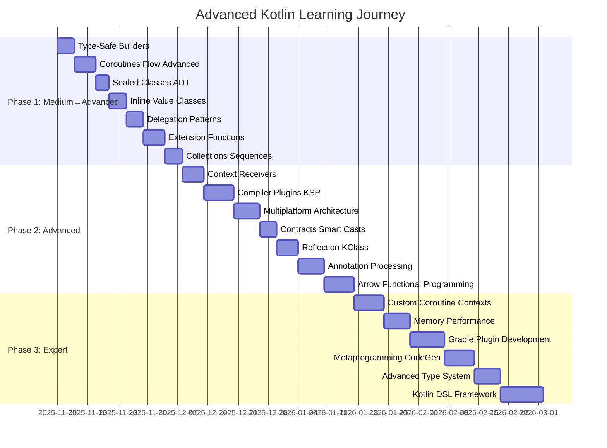
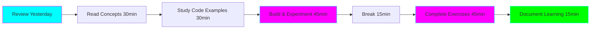
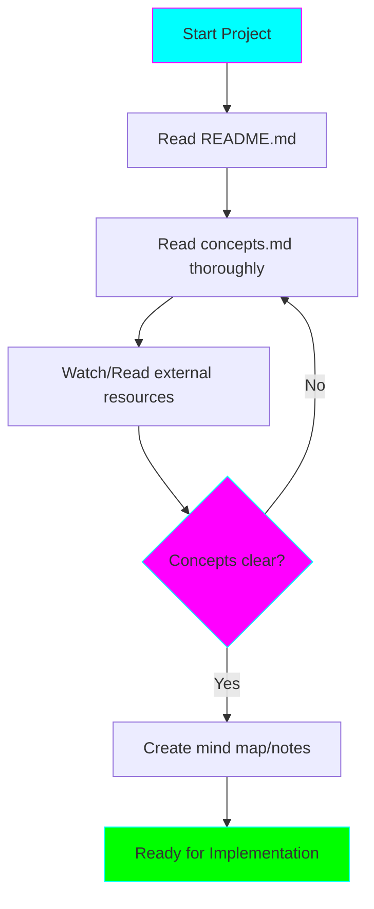
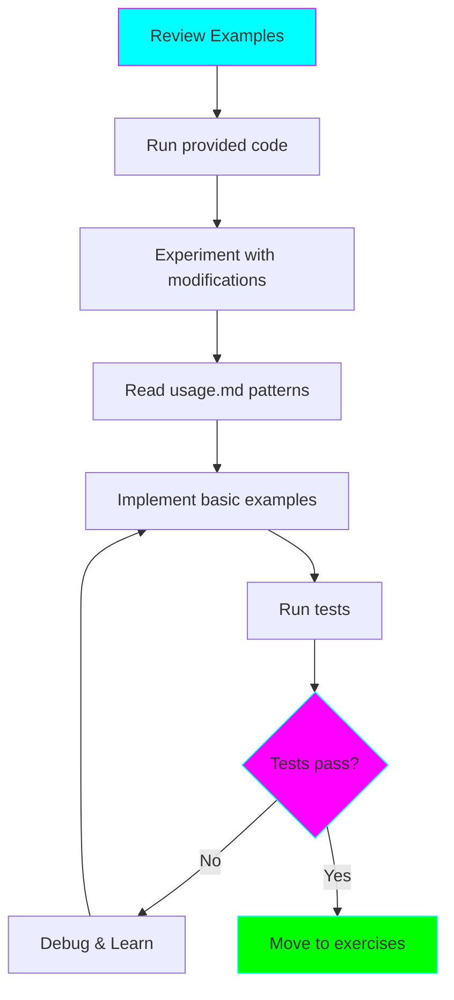
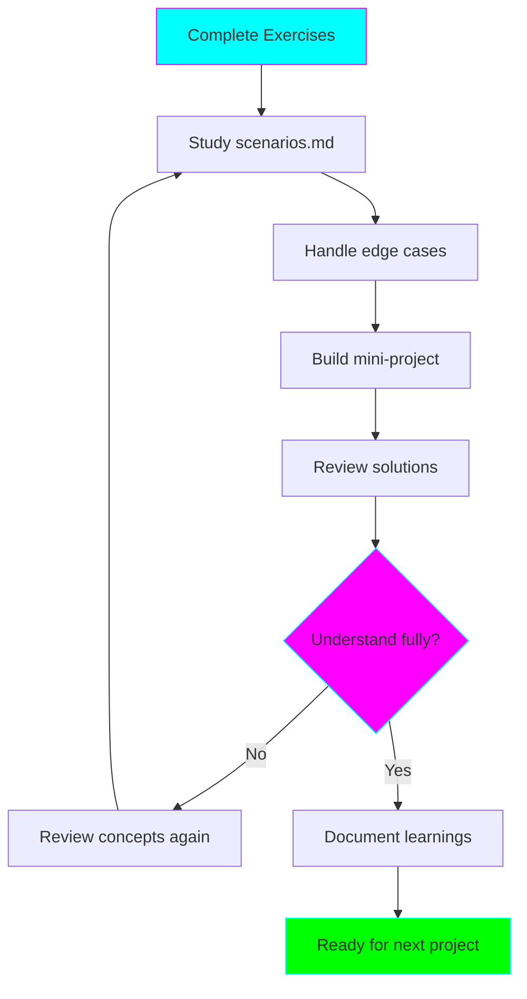

# Advanced Kotlin Learning Plan

## 🎯 Learning Objectives

By completing this learning path, you will:

1. **Master Advanced Language Features** - Deep understanding of Kotlin's type system, DSLs, and language constructs
2. **Understand Coroutines at Expert Level** - Build custom contexts, interceptors, and advanced concurrency patterns
3. **Build Production-Grade Tools** - Create compiler plugins, Gradle plugins, and code generation tools
4. **Apply Functional Programming** - Use Arrow and FP patterns effectively in real-world scenarios
5. **Optimize Performance** - Profile, benchmark, and optimize Kotlin applications
6. **Design Type-Safe APIs** - Create elegant, type-safe DSLs and frameworks

## 📅 Learning Timeline

### Overview Timeline (14-18 Weeks)

### Phase 1: Advanced Language Features (4-5 Weeks)

**Goal:** Master Kotlin's advanced language features and patterns

| Week | Projects | Focus Areas | Deliverables |
|------|----------|-------------|--------------|
| **Week 1** | 01-02 | Type-Safe Builders, Coroutines/Flow | Working DSL, Flow implementation |
| **Week 2** | 03-04 | Sealed Classes, Inline/Value Classes | ADT implementation, Performance tests |
| **Week 3** | 05-06 | Delegation, Extension Functions | Custom delegates, Receiver patterns |
| **Week 4** | 07 | Collections & Sequences | Optimized data processing pipeline |
| **Week 5** | - | Review & Build Phase 1 Project | Real-world application using Phase 1 concepts |

**Milestones:**
- ✅ Can design and implement type-safe DSLs
- ✅ Expert-level understanding of coroutines and Flow
- ✅ Optimize collection operations effectively
- ✅ Use delegation patterns appropriately

### Phase 2: Advanced Patterns & Tools (5-6 Weeks)

**Goal:** Master advanced tooling, metaprogramming, and architectural patterns

| Week | Projects | Focus Areas | Deliverables |
|------|----------|-------------|--------------|
| **Week 6** | 08-09 | Context Receivers, Compiler Plugins | Working KSP processor |
| **Week 7** | 09-10 | KSP (cont.), Multiplatform | Cross-platform library |
| **Week 8** | 11-12 | Contracts, Reflection | Smart cast utilities, Reflection framework |
| **Week 9** | 13-14 | Annotation Processing, Arrow | Annotation processor, FP patterns |
| **Week 10** | 14 | Arrow (cont.) | Complete FP application |
| **Week 11** | - | Review & Build Phase 2 Project | KSP-based code generator or library |

**Milestones:**
- ✅ Build working compiler plugins with KSP
- ✅ Create multiplatform libraries
- ✅ Apply functional programming patterns
- ✅ Generate code using annotations

### Phase 3: Expert Mastery (5-7 Weeks)

**Goal:** Achieve expert-level mastery in advanced topics

| Week | Projects | Focus Areas | Deliverables |
|------|----------|-------------|--------------|
| **Week 12** | 15-16 | Custom Coroutines, Performance | Custom dispatcher, Benchmarks |
| **Week 13** | 16-17 | Performance, Gradle Plugins | Gradle plugin |
| **Week 14** | 17-18 | Gradle (cont.), Metaprogramming | Working build plugin, Code generator |
| **Week 15** | 19 | Advanced Type System | Type-safe API |
| **Week 16-17** | 20 | Complete DSL Framework | Production-ready DSL |
| **Week 18** | - | Final Project & Review | Capstone project using all concepts |

**Milestones:**
- ✅ Build custom coroutine dispatchers
- ✅ Create production-grade Gradle plugins
- ✅ Master Kotlin's type system
- ✅ Design complete DSL frameworks

## 📚 Daily Learning Routine

### Recommended Daily Schedule (2-3 hours/day)

**Morning Session (1.5 hours):**
1. **Review (10 min)** - Review yesterday's notes and code
2. **Concepts (30 min)** - Read and understand new concepts
3. **Code Study (30 min)** - Analyze provided examples
4. **Experiment (20 min)** - Modify examples, try variations

**Evening Session (1-1.5 hours):**
1. **Build (30-45 min)** - Work on exercises
2. **Test (15-20 min)** - Run tests, debug issues
3. **Document (10-15 min)** - Write down learnings, questions

### Weekend Deep Dive (4-5 hours)

- **Build a mini-project** using the week's concepts
- **Review all exercises** from the week
- **Prepare questions** for community/forums
- **Read additional resources** and blog posts

## 🎓 Learning Methodology

### For Each Project (3-10 days depending on complexity)

#### Day 1-2: Understanding Phase

**Activities:**
- Read all documentation files
- Create conceptual mind maps
- Watch related videos/talks
- Read official Kotlin docs on the topic

#### Day 2-4: Implementation Phase

**Activities:**
- Run all provided examples
- Modify code to understand behavior
- Implement practice exercises
- Write tests for your code

#### Day 4-7: Mastery Phase

**Activities:**
- Complete all exercises
- Study nuanced scenarios
- Build a mini-project using concepts
- Compare your solutions with provided ones
- Document insights and gotchas

## 🎯 Milestones & Checkpoints

### After Every 5 Projects: Mini-Review

**Activities:**
1. Review notes from all 5 projects
2. Build a project combining all 5 concepts
3. Write a blog post or teach someone
4. Identify weak areas and review them

### End of Phase Reviews

#### Phase 1 Review Project Ideas:
- Build a type-safe SQL DSL using builders and delegation
- Create a reactive data pipeline with Flow and sequences
- Design a configuration DSL with extension functions

#### Phase 2 Review Project Ideas:
- Build a multiplatform logging library with KSP
- Create a functional validation framework with Arrow
- Design an annotation-based dependency injection framework

#### Phase 3 Review Project Ideas:
- Build a complete testing DSL framework
- Create a Gradle plugin for code generation
- Design a high-performance reactive framework

## 📊 Progress Tracking

### Weekly Self-Assessment

Rate yourself (1-5) on:
- **Understanding** - Do I understand the concepts?
- **Application** - Can I apply them in code?
- **Debugging** - Can I debug issues effectively?
- **Teaching** - Can I explain to others?

| Week | Project(s) | Understanding | Application | Debugging | Teaching | Notes |
|------|------------|---------------|-------------|-----------|----------|-------|
| 1 | 01-02 | | | | | |
| 2 | 03-04 | | | | | |
| ... | | | | | | |

### Monthly Review Questions

**End of Month 1:**
- What was the most challenging concept?
- Which project was most valuable?
- What do I need to review?
- How confident do I feel about Phase 1 concepts?

**End of Month 2:**
- Can I build compiler plugins?
- Do I understand functional programming in Kotlin?
- What patterns am I using in real projects?

**End of Month 3:**
- Can I design production-grade DSLs?
- Am I comfortable with advanced type system features?
- What expert topics need more practice?

## 🚀 Accelerated Learning Tips

### For Fast Learners (Complete in 10-12 weeks)

If you have 4-5 hours/day:
- Combine related projects (e.g., 01-02 in same week)
- Skip some exercises if concepts are clear
- Build larger integration projects
- Contribute to open-source Kotlin projects

### For Thorough Learners (Complete in 18-24 weeks)

If you have 1-2 hours/day:
- Take 2 weeks per difficult project
- Do all exercises thoroughly
- Read all external resources
- Build extensive mini-projects
- Participate actively in Kotlin community

## 🎯 Success Criteria

You've mastered Advanced Kotlin when you can:

### Technical Skills
- [ ] Design and implement production-grade DSLs
- [ ] Build compiler plugins using KSP
- [ ] Create multiplatform libraries
- [ ] Optimize code using performance profiling
- [ ] Apply functional programming patterns effectively
- [ ] Design type-safe APIs with advanced type features
- [ ] Build custom coroutine dispatchers
- [ ] Create Gradle plugins
- [ ] Generate code programmatically

### Practical Skills
- [ ] Explain advanced concepts to junior developers
- [ ] Make architectural decisions using advanced features
- [ ] Debug complex type system issues
- [ ] Contribute to advanced Kotlin libraries
- [ ] Write idiomatic, performant Kotlin code
- [ ] Choose appropriate patterns for different scenarios

### Professional Skills
- [ ] Read and understand advanced Kotlin library code
- [ ] Review code effectively for advanced patterns
- [ ] Mentor others on Kotlin best practices
- [ ] Participate in Kotlin community discussions
- [ ] Build tools that improve developer productivity

## 📖 Supplementary Learning

### Recommended Reading Order

1. **Start:** Kotlin official docs on current topic
2. **During:** "Kotlin in Action" relevant chapters
3. **Advanced:** Specific topic blog posts and talks
4. **Expert:** Read library source code (Arrow, Ktor, etc.)

### Community Engagement

- **Week 1:** Join Kotlin Slack
- **Week 4:** Ask first question in forums
- **Week 8:** Answer questions from beginners
- **Week 12:** Write first blog post
- **Week 16:** Give a talk or presentation
- **Week 18:** Contribute to open-source Kotlin project

## 🔄 Continuous Improvement

### After Completing All 20 Projects

1. **Build a Capstone Project** (2-4 weeks)
   - Combines multiple advanced concepts
   - Solves a real-world problem
   - Published as open-source

2. **Contribute to Kotlin Ecosystem**
   - Submit PRs to Kotlin libraries
   - Build useful tools/libraries
   - Help others learn

3. **Stay Updated**
   - Follow Kotlin blog
   - Watch KotlinConf talks
   - Try new language features
   - Participate in KEEP discussions

## 🎉 Celebration Milestones

- ✨ **After Project 5:** You're advanced! Treat yourself.
- 🎊 **After Project 10:** You're crushing it! Take a weekend break.
- 🏆 **After Project 15:** Expert territory! Share your journey.
- 🌟 **After Project 20:** EXPERT ACHIEVED! You're a Kotlin master!

---

**Remember:** Learning is a journey, not a race. Focus on deep understanding over speed. You've got this! 🚀
