# Advanced Kotlin Learning - 20 Progressive Projects

**Status:** 🚧 In Progress

**Tech Stack:** Kotlin 1.9+, Gradle 8.x, JVM 17+

**Started:** 2025-11-09

## Overview

A comprehensive learning path covering advanced Kotlin concepts through 20 progressively complex projects. Each project builds on previous knowledge, taking you from medium-level expertise to expert mastery of Kotlin's most powerful features.

## Learning Path Architecture

```mermaid
graph TB
    Start[Medium Expertise] --> Phase1[Phase 1: Advanced Language Features]
    Phase1 --> P1[01. Type-Safe Builders]
    Phase1 --> P2[02. Coroutines & Flow Advanced]
    Phase1 --> P3[03. Sealed Classes & ADT]
    Phase1 --> P4[04. Inline & Value Classes]
    Phase1 --> P5[05. Delegation Patterns]
    Phase1 --> P6[06. Extension Functions]
    Phase1 --> P7[07. Collections & Sequences]

    Phase1 --> Phase2[Phase 2: Advanced Patterns & Tools]
    Phase2 --> P8[08. Context Receivers]
    Phase2 --> P9[09. Compiler Plugins & KSP]
    Phase2 --> P10[10. Multiplatform Architecture]
    Phase2 --> P11[11. Contracts & Smart Casts]
    Phase2 --> P12[12. Reflection & KClass]
    Phase2 --> P13[13. Annotation Processing]
    Phase2 --> P14[14. Arrow FP]

    Phase2 --> Phase3[Phase 3: Expert Mastery]
    Phase3 --> P15[15. Custom Coroutine Contexts]
    Phase3 --> P16[16. Memory & Performance]
    Phase3 --> P17[17. Gradle Plugin Dev]
    Phase3 --> P18[18. Metaprogramming]
    Phase3 --> P19[19. Advanced Type System]
    Phase3 --> P20[20. DSL Framework]

    Phase3 --> Expert[Expert Level Achieved! 🎓]

    style Start fill:#00ffff,stroke:#ff00ff,stroke-width:2px
    style Phase1 fill:#ff00ff,stroke:#00ffff,stroke-width:2px
    style Phase2 fill:#ff00ff,stroke:#00ffff,stroke-width:2px
    style Phase3 fill:#ff00ff,stroke:#00ffff,stroke-width:2px
    style Expert fill:#00ff00,stroke:#00ffff,stroke-width:3px
```



## Projects Overview

### 📘 Phase 1: Advanced Language Features (Medium → Advanced)

| # | Project | Complexity | Key Concepts | Duration |
|---|---------|-----------|--------------|----------|
| 01 | [Type-Safe Builders](01-type-safe-builders/) | ⭐⭐⭐ | DSL, Lambda with Receiver, @DslMarker | 3-4 days |
| 02 | [Coroutines & Flow Advanced](02-coroutines-flow-advanced/) | ⭐⭐⭐ | StateFlow, SharedFlow, Channel, Select | 4-5 days |
| 03 | [Sealed Classes & ADT](03-sealed-classes-adt/) | ⭐⭐⭐ | Algebraic Data Types, Exhaustive When | 2-3 days |
| 04 | [Inline & Value Classes](04-inline-value-classes/) | ⭐⭐⭐ | Zero-cost Abstractions, Performance | 3-4 days |
| 05 | [Delegation Patterns](05-delegation-patterns/) | ⭐⭐⭐ | Class/Property Delegation, Lazy, Observable | 3-4 days |
| 06 | [Extension Functions & Receivers](06-extension-functions-receivers/) | ⭐⭐⭐⭐ | Scope Functions, Context, Dispatch vs Extension | 4-5 days |
| 07 | [Collections & Sequences](07-collections-sequences/) | ⭐⭐⭐⭐ | Lazy Evaluation, Performance Optimization | 3-4 days |

### 📗 Phase 2: Advanced Patterns & Tools (Advanced)

| # | Project | Complexity | Key Concepts | Duration |
|---|---------|-----------|--------------|----------|
| 08 | [Context Receivers](08-context-receivers/) | ⭐⭐⭐⭐ | Multiple Receivers, Dependency Injection | 4-5 days |
| 09 | [Compiler Plugins & KSP](09-compiler-plugins-ksp/) | ⭐⭐⭐⭐⭐ | Symbol Processing, Code Generation | 5-7 days |
| 10 | [Multiplatform Architecture](10-multiplatform-architecture/) | ⭐⭐⭐⭐ | expect/actual, Platform-specific Code | 5-6 days |
| 11 | [Contracts & Smart Casts](11-contracts-smart-casts/) | ⭐⭐⭐⭐ | Compiler Contracts, Type Inference | 3-4 days |
| 12 | [Reflection & KClass](12-reflection-kclass/) | ⭐⭐⭐⭐ | Runtime Type Info, Meta-programming | 4-5 days |
| 13 | [Annotation Processing](13-annotation-processing/) | ⭐⭐⭐⭐⭐ | KAPT, Custom Annotations, Code Gen | 5-6 days |
| 14 | [Arrow Functional Programming](14-arrow-functional-programming/) | ⭐⭐⭐⭐⭐ | Either, Option, Validated, IO Monad | 6-7 days |

### 📕 Phase 3: Expert Mastery (Expert)

| # | Project | Complexity | Key Concepts | Duration |
|---|---------|-----------|--------------|----------|
| 15 | [Custom Coroutine Contexts](15-custom-coroutine-contexts/) | ⭐⭐⭐⭐⭐ | Dispatchers, Interceptors, Continuations | 6-7 days |
| 16 | [Memory & Performance](16-memory-performance/) | ⭐⭐⭐⭐⭐ | JVM Optimization, Profiling, Benchmarking | 5-6 days |
| 17 | [Gradle Plugin Development](17-gradle-plugin-development/) | ⭐⭐⭐⭐⭐ | Build System, Plugin API, Task Configuration | 7-8 days |
| 18 | [Metaprogramming & Code Generation](18-metaprogramming-codegen/) | ⭐⭐⭐⭐⭐ | KotlinPoet, AST Manipulation | 6-7 days |
| 19 | [Advanced Type System](19-advanced-type-system/) | ⭐⭐⭐⭐⭐ | Variance, Projections, PECS, Phantom Types | 5-6 days |
| 20 | [Kotlin DSL Framework](20-kotlin-dsl-framework/) | ⭐⭐⭐⭐⭐ | Complete DSL Design, Type-Safety, Builder Pattern | 7-10 days |

**Total Learning Time:** 14-18 weeks (3-4 months) at steady pace

## Environment Setup

This project uses the following environment configuration:

- **Language/Runtime:** Kotlin/JVM
- **Kotlin Version:** 1.9.20+
- **JDK Version:** 17+
- **Build Tool:** Gradle 8.5+
- **Environment Files:** `.java-version`, `gradle.properties`

### Quick Start

```bash
# Navigate to project
cd projects/advanced-kotlin-learning

# Check Java version (should be 17+)
java -version

# Each sub-project can be built independently
cd 01-type-safe-builders
./gradlew build

# Or use the root build configuration (will be created)
cd ..
./gradlew build
```

### Prerequisites

- **Required:**
  - JDK 17 or higher
  - Gradle 8.5+ (or use wrapper)
  - IntelliJ IDEA 2023.2+ (recommended) or VS Code with Kotlin plugin

- **Recommended:**
  - Git for version control
  - Docker (for some advanced projects)
  - Basic understanding of Kotlin fundamentals

## Learning Strategy


### ADHD-Friendly Learning Tips

✅ **Do:**
- Complete one project at a time (don't skip ahead)
- Take breaks every 45-60 minutes
- Document what you learn immediately
- Use the provided code examples as starting points
- Celebrate completing each project!

❌ **Avoid:**
- Starting multiple projects simultaneously
- Rushing through concepts to "finish faster"
- Skipping the exercises
- Moving on without understanding current project

## Project Structure

Each sub-project contains:

```
XX-project-name/
├── README.md              # Comprehensive documentation
├── build.gradle.kts       # Kotlin DSL build configuration
├── src/
│   ├── main/kotlin/       # Implementation examples
│   ├── test/kotlin/       # Unit tests
│   └── examples/          # Runnable examples
├── docs/
│   ├── concepts.md        # Detailed concept explanations
│   ├── usage.md           # How to use the features
│   ├── scenarios.md       # Nuanced real-world scenarios
│   └── exercises.md       # Practice exercises
└── solutions/             # Exercise solutions (try first!)
```

## Documentation Structure

Each project includes:

1. **README.md** - Quick overview and setup
2. **concepts.md** - Deep dive into theoretical concepts
3. **usage.md** - Practical usage patterns and best practices
4. **scenarios.md** - Nuanced scenarios, edge cases, gotchas
5. **exercises.md** - Hands-on practice problems
6. **solutions/** - Solutions to exercises (peek only after trying!)

## Progress Tracking

Track your progress through the 20 projects:

- [x] Phase 1: Advanced Language Features (0/7)
  - [ ] 01. Type-Safe Builders
  - [ ] 02. Coroutines & Flow Advanced
  - [ ] 03. Sealed Classes & ADT
  - [ ] 04. Inline & Value Classes
  - [ ] 05. Delegation Patterns
  - [ ] 06. Extension Functions & Receivers
  - [ ] 07. Collections & Sequences

- [ ] Phase 2: Advanced Patterns & Tools (0/7)
  - [ ] 08. Context Receivers
  - [ ] 09. Compiler Plugins & KSP
  - [ ] 10. Multiplatform Architecture
  - [ ] 11. Contracts & Smart Casts
  - [ ] 12. Reflection & KClass
  - [ ] 13. Annotation Processing
  - [ ] 14. Arrow Functional Programming

- [ ] Phase 3: Expert Mastery (0/6)
  - [ ] 15. Custom Coroutine Contexts
  - [ ] 16. Memory & Performance
  - [ ] 17. Gradle Plugin Development
  - [ ] 18. Metaprogramming & Code Generation
  - [ ] 19. Advanced Type System
  - [ ] 20. Kotlin DSL Framework

## Learning Log

### What I'm Learning

- Track insights and "aha!" moments here
- Note which projects were most valuable
- Record questions and their answers

### Challenges

- Document difficulties encountered
- Track solutions to problems
- Note resources that helped

### Next Steps

- Plan your learning schedule
- Set milestones for completion
- Identify areas for deeper exploration

## Graduation Criteria

This project is "complete" when:
- [ ] All 20 projects understood and completed
- [ ] All exercises solved
- [ ] Can explain concepts to others clearly
- [ ] Built at least 2 real-world applications using these concepts
- [ ] Ready to contribute to advanced Kotlin projects

## Additional Resources

### Official Documentation
- [Kotlin Language Reference](https://kotlinlang.org/docs/reference/)
- [Kotlin Coroutines Guide](https://kotlinlang.org/docs/coroutines-guide.html)
- [KSP Documentation](https://kotlinlang.org/docs/ksp-overview.html)

### Books
- "Kotlin in Action" (2nd Edition) - Dmitry Jemerov & Svetlana Isakova
- "Advanced Kotlin Programming" - Raul-Gabriel Urma & Mario Fusco
- "Functional Programming in Kotlin" - Marco Vermeulen, Rúnar Bjarnason, Paul Chiusano

### Community
- [Kotlin Slack](https://surveys.jetbrains.com/s3/kotlin-slack-sign-up)
- [r/Kotlin](https://reddit.com/r/Kotlin)
- [Kotlin Forums](https://discuss.kotlinlang.org/)

## Contributing to Your Learning

As you progress:
1. Update progress checkboxes
2. Add notes to Learning Log
3. Document "gotchas" you discover
4. Share insights with the community
5. Build your own projects using these concepts

---

**Remember:** Mastery takes time. Focus on understanding over speed. Each project builds on the last - take your time! 🚀
