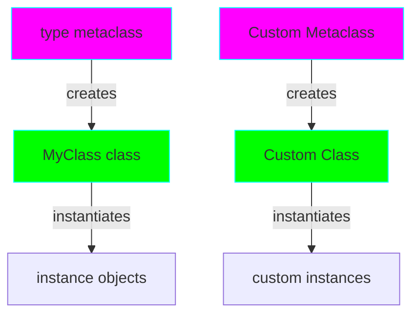

# Project 01: Metaclasses - The Class Factory

**Difficulty:** Intermediate ⭐⭐⭐

## Core Concepts

Metaclasses are the "classes of classes" - they define how classes behave. When you create a class, Python uses a metaclass to construct it.



### The Metaclass Hierarchy

```python
# Everything in Python follows this pattern:
type(5)           # <class 'int'>
type(int)         # <class 'type'>
type(type)        # <class 'type'>  # type is its own metaclass!

class MyClass:
    pass

type(MyClass)     # <class 'type'>  # type is the default metaclass
```

## When to Use Metaclasses

1. **API Design**: Enforce class structure across libraries
2. **Auto-registration**: Register classes automatically (e.g., plugins)
3. **Validation**: Ensure classes meet specific requirements
4. **ORM Implementation**: Database models (like Django/SQLAlchemy)

## Implementation Examples

### Example 1: Singleton Metaclass

```python
class SingletonMeta(type):
    """Ensures only one instance of a class exists."""
    _instances = {}

    def __call__(cls, *args, **kwargs):
        if cls not in cls._instances:
            cls._instances[cls] = super().__call__(*args, **kwargs)
        return cls._instances[cls]

class Database(metaclass=SingletonMeta):
    def __init__(self):
        self.connection = "Connected"

# Usage
db1 = Database()
db2 = Database()
assert db1 is db2  # Same instance!
```

### Example 2: Auto-Registration Metaclass

```python
class PluginRegistry(type):
    """Automatically registers all plugin classes."""
    plugins = {}

    def __new__(mcs, name, bases, attrs):
        cls = super().__new__(mcs, name, bases, attrs)
        if name != 'Plugin':  # Don't register base class
            mcs.plugins[name] = cls
        return cls

class Plugin(metaclass=PluginRegistry):
    """Base plugin class."""
    pass

class ImagePlugin(Plugin):
    def process(self):
        return "Processing image"

class VideoPlugin(Plugin):
    def process(self):
        return "Processing video"

# All plugins auto-registered!
print(PluginRegistry.plugins)
# {'ImagePlugin': <class '__main__.ImagePlugin'>,
#  'VideoPlugin': <class '__main__.VideoPlugin'>}
```

### Example 3: Attribute Validation Metaclass

```python
class ValidatedMeta(type):
    """Validates that classes have required attributes."""

    def __new__(mcs, name, bases, attrs):
        if name != 'ValidatedBase':
            # Require all non-base classes to have 'required_field'
            if 'required_field' not in attrs:
                raise TypeError(
                    f"Class {name} must define 'required_field'"
                )

            # Require all methods to have docstrings
            for attr_name, attr_value in attrs.items():
                if callable(attr_value) and not attr_name.startswith('_'):
                    if not attr_value.__doc__:
                        raise TypeError(
                            f"Method {attr_name} in {name} must have a docstring"
                        )

        return super().__new__(mcs, name, bases, attrs)

class ValidatedBase(metaclass=ValidatedMeta):
    pass

# This will raise TypeError: must define 'required_field'
# class BadClass(ValidatedBase):
#     pass

# This works!
class GoodClass(ValidatedBase):
    required_field = "value"

    def process(self):
        """Process data."""
        return "processing"
```

## Nuanced Scenarios

### Scenario 1: Metaclass Conflicts

```python
class Meta1(type):
    pass

class Meta2(type):
    pass

class A(metaclass=Meta1):
    pass

class B(metaclass=Meta2):
    pass

# This raises TypeError: metaclass conflict
# class C(A, B):
#     pass

# Solution: Create a combined metaclass
class CombinedMeta(Meta1, Meta2):
    pass

class C(A, B, metaclass=CombinedMeta):
    pass
```

### Scenario 2: Metaclass vs Class Decorator

When should you use a metaclass vs a class decorator?

```python
# Class Decorator - Simple, readable, Pythonic
def add_id(cls):
    cls.id = id(cls)
    return cls

@add_id
class MyClass1:
    pass

# Metaclass - More powerful, affects subclasses, can prevent class creation
class AddIdMeta(type):
    def __new__(mcs, name, bases, attrs):
        cls = super().__new__(mcs, name, bases, attrs)
        cls.id = id(cls)
        return cls

class MyClass2(metaclass=AddIdMeta):
    pass

# Key Difference: Inheritance
class Child1(MyClass1):
    pass
# Child1 does NOT have auto id

class Child2(MyClass2):
    pass
# Child2 DOES have auto id
```

**Rule of Thumb:** Use decorators for simple modifications, metaclasses when you need to affect the entire class hierarchy.

### Scenario 3: The `__prepare__` Method

```python
from collections import OrderedDict

class OrderedMeta(type):
    """Preserves the order of class attribute definition."""

    @classmethod
    def __prepare__(mcs, name, bases):
        # Return OrderedDict instead of regular dict
        return OrderedDict()

    def __new__(mcs, name, bases, attrs):
        # attrs is now an OrderedDict!
        cls = super().__new__(mcs, name, bases, dict(attrs))
        cls._field_order = list(attrs.keys())
        return cls

class Person(metaclass=OrderedMeta):
    name = str
    age = int
    email = str

print(Person._field_order)
# ['__module__', '__qualname__', 'name', 'age', 'email']
```

## Advanced Pattern: ORM-Style Field Descriptors

```python
class Field:
    def __init__(self, field_type):
        self.field_type = field_type
        self.name = None

    def __set_name__(self, owner, name):
        self.name = name

    def __get__(self, obj, objtype=None):
        if obj is None:
            return self
        return obj.__dict__.get(self.name)

    def __set__(self, obj, value):
        if not isinstance(value, self.field_type):
            raise TypeError(
                f"{self.name} must be {self.field_type.__name__}"
            )
        obj.__dict__[self.name] = value

class ModelMeta(type):
    def __new__(mcs, name, bases, attrs):
        # Collect all Field instances
        fields = {}
        for key, value in attrs.items():
            if isinstance(value, Field):
                fields[key] = value

        cls = super().__new__(mcs, name, bases, attrs)
        cls._fields = fields
        return cls

class Model(metaclass=ModelMeta):
    pass

class User(Model):
    name = Field(str)
    age = Field(int)

# Usage
user = User()
user.name = "Alice"
user.age = 30
# user.age = "invalid"  # Raises TypeError
```

## Exercises

1. **Registry Pattern**: Create a metaclass that maintains a registry of all subclasses with a `get_class(name)` method
2. **Abstract Base Enforcement**: Build a metaclass that enforces implementation of abstract methods (without using `abc`)
3. **Cached Classes**: Implement a metaclass that caches class creation and returns existing classes if created with same parameters
4. **Method Timer**: Create a metaclass that automatically wraps all methods with timing decorators

## Key Takeaways

- Metaclasses control class creation, not instance creation
- `type` is the default metaclass in Python
- Use `__new__` to modify class creation, `__call__` to modify instantiation
- Metaclasses are inherited by subclasses
- Consider class decorators first - they're simpler and more Pythonic
- Metaclasses are powerful but can make code harder to understand

## References

- PEP 3115 - Metaclasses in Python 3000
- Python Data Model - https://docs.python.org/3/reference/datamodel.html#metaclasses
