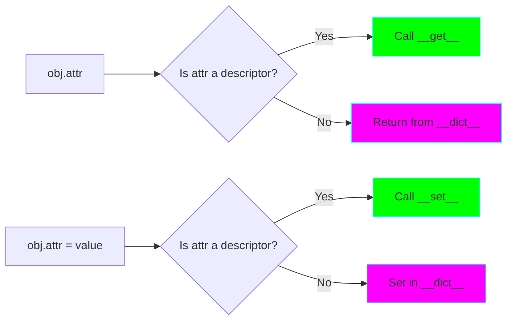

# Project 02: Descriptors - The Attribute Protocol

**Difficulty:** Intermediate ⭐⭐⭐

## Core Concepts

Descriptors are Python objects that define how attributes are accessed, set, or deleted. They're the mechanism behind properties, methods, static methods, and class methods.



### The Descriptor Protocol

```python
class Descriptor:
    def __get__(self, obj, objtype=None):
        """Called when attribute is accessed."""
        pass

    def __set__(self, obj, value):
        """Called when attribute is set."""
        pass

    def __delete__(self, obj):
        """Called when attribute is deleted."""
        pass

    def __set_name__(self, owner, name):
        """Called when descriptor is assigned to a class attribute."""
        pass
```

## Types of Descriptors

### Data Descriptors
Define both `__get__` and `__set__` (or `__delete__`)

```python
class DataDescriptor:
    def __get__(self, obj, objtype=None):
        return "data descriptor get"

    def __set__(self, obj, value):
        print("data descriptor set")
```

### Non-Data Descriptors
Define only `__get__`

```python
class NonDataDescriptor:
    def __get__(self, obj, objtype=None):
        return "non-data descriptor get"
```

**Key Difference:** Data descriptors take precedence over instance `__dict__`, non-data descriptors don't.

## Lookup Order (MRO for Attributes)

```mermaid
graph TD
    A[Attribute Access: obj.x] --> B{Data descriptor<br/>in type(obj)?}
    B -->|Yes| C[Return descriptor.__get__]
    B -->|No| D{x in obj.__dict__?}
    D -->|Yes| E[Return obj.__dict__['x']]
    D -->|No| F{Non-data descriptor<br/>in type(obj)?}
    F -->|Yes| G[Return descriptor.__get__]
    F -->|No| H{x in type(obj).__dict__?}
    H -->|Yes| I[Return class attribute]
    H -->|No| J[Raise AttributeError]

    style C fill:#00ff00,stroke:#00ffff
    style E fill:#ffff00,stroke:#00ffff
    style G fill:#00ff00,stroke:#00ffff
```

## Practical Examples

### Example 1: Type-Validated Attributes

```python
class TypedProperty:
    """Descriptor that validates type."""

    def __init__(self, name, expected_type):
        self.name = name
        self.expected_type = expected_type

    def __get__(self, obj, objtype=None):
        if obj is None:
            return self
        return obj.__dict__.get(self.name)

    def __set__(self, obj, value):
        if not isinstance(value, self.expected_type):
            raise TypeError(
                f"{self.name} must be {self.expected_type.__name__}"
            )
        obj.__dict__[self.name] = value

class Person:
    name = TypedProperty("name", str)
    age = TypedProperty("age", int)

    def __init__(self, name, age):
        self.name = name
        self.age = age

# Usage
person = Person("Alice", 30)
person.age = 31  # Works
# person.age = "invalid"  # Raises TypeError
```

### Example 2: Lazy Property (Cached Computation)

```python
class LazyProperty:
    """Computes value once and caches it."""

    def __init__(self, func):
        self.func = func
        self.name = func.__name__

    def __get__(self, obj, objtype=None):
        if obj is None:
            return self

        # Check if already computed
        if self.name not in obj.__dict__:
            # Compute and cache
            obj.__dict__[self.name] = self.func(obj)

        return obj.__dict__[self.name]

class DataSet:
    def __init__(self, data):
        self.data = data

    @LazyProperty
    def mean(self):
        """Expensive computation - only done once."""
        print("Computing mean...")
        return sum(self.data) / len(self.data)

    @LazyProperty
    def variance(self):
        """Another expensive computation."""
        print("Computing variance...")
        m = self.mean
        return sum((x - m) ** 2 for x in self.data) / len(self.data)

# Usage
dataset = DataSet([1, 2, 3, 4, 5])
print(dataset.mean)      # Prints "Computing mean..." then value
print(dataset.mean)      # Just returns cached value
print(dataset.variance)  # Prints "Computing variance..." then value
```

### Example 3: Validation with Custom Logic

```python
class Validated:
    """Base descriptor with validation."""

    def __init__(self, name=None):
        self.name = name

    def __set_name__(self, owner, name):
        if self.name is None:
            self.name = name

    def __get__(self, obj, objtype=None):
        if obj is None:
            return self
        return obj.__dict__.get(self.name)

    def __set__(self, obj, value):
        self.validate(value)
        obj.__dict__[self.name] = value

    def validate(self, value):
        """Override in subclasses."""
        pass

class PositiveNumber(Validated):
    """Must be a positive number."""

    def validate(self, value):
        if not isinstance(value, (int, float)):
            raise TypeError(f"{self.name} must be a number")
        if value <= 0:
            raise ValueError(f"{self.name} must be positive")

class String(Validated):
    """Must be a non-empty string."""

    def __init__(self, min_length=1, max_length=None):
        super().__init__()
        self.min_length = min_length
        self.max_length = max_length

    def validate(self, value):
        if not isinstance(value, str):
            raise TypeError(f"{self.name} must be a string")
        if len(value) < self.min_length:
            raise ValueError(
                f"{self.name} must be at least {self.min_length} chars"
            )
        if self.max_length and len(value) > self.max_length:
            raise ValueError(
                f"{self.name} must be at most {self.max_length} chars"
            )

class Product:
    name = String(min_length=3, max_length=50)
    price = PositiveNumber()
    quantity = PositiveNumber()

    def __init__(self, name, price, quantity):
        self.name = name
        self.price = price
        self.quantity = quantity
```

## Nuanced Scenarios

### Scenario 1: Descriptor vs Property

```python
# Using @property (simpler, but per-attribute)
class WithProperty:
    def __init__(self, value):
        self._value = value

    @property
    def value(self):
        return self._value

    @value.setter
    def value(self, val):
        if val < 0:
            raise ValueError("Must be positive")
        self._value = val

# Using Descriptor (reusable, DRY)
class Positive:
    def __init__(self, name):
        self.name = name

    def __get__(self, obj, objtype=None):
        if obj is None:
            return self
        return obj.__dict__.get(self.name)

    def __set__(self, obj, value):
        if value < 0:
            raise ValueError(f"{self.name} must be positive")
        obj.__dict__[self.name] = value

class WithDescriptor:
    x = Positive("x")
    y = Positive("y")
    z = Positive("z")  # Reused easily!

    def __init__(self, x, y, z):
        self.x = x
        self.y = y
        self.z = z
```

**When to use what:**
- **@property**: One-off custom logic for a single attribute
- **Descriptor**: Reusable validation/behavior across multiple attributes/classes

### Scenario 2: Instance vs Class Access

```python
class Descriptor:
    def __get__(self, obj, objtype=None):
        if obj is None:
            print("Accessed from class")
            return self
        print("Accessed from instance")
        return f"value for {obj}"

class MyClass:
    attr = Descriptor()

# Different behavior based on access type
MyClass.attr           # Accessed from class (returns descriptor)
MyClass().attr         # Accessed from instance (returns value)
```

### Scenario 3: Weakref for Avoiding Memory Leaks

```python
import weakref

class DescriptorWithWeakref:
    """Stores data in descriptor using weakref to avoid circular references."""

    def __init__(self):
        self.data = weakref.WeakKeyDictionary()

    def __get__(self, obj, objtype=None):
        if obj is None:
            return self
        return self.data.get(obj, None)

    def __set__(self, obj, value):
        self.data[obj] = value

class MyClass:
    value = DescriptorWithWeakref()

# When instance is deleted, data is automatically cleaned up
obj = MyClass()
obj.value = 100
del obj  # Automatically removes entry from WeakKeyDictionary
```

### Scenario 4: Read-Only Attributes

```python
class ReadOnly:
    """Descriptor that allows setting only once."""

    def __init__(self, name):
        self.name = name

    def __get__(self, obj, objtype=None):
        if obj is None:
            return self
        return obj.__dict__.get(self.name)

    def __set__(self, obj, value):
        if self.name in obj.__dict__:
            raise AttributeError(f"{self.name} is read-only")
        obj.__dict__[self.name] = value

class Configuration:
    api_key = ReadOnly("api_key")

    def __init__(self, api_key):
        self.api_key = api_key

config = Configuration("secret-key-123")
# config.api_key = "new-key"  # Raises AttributeError
```

## Advanced Pattern: ORM Column Descriptors

```python
class Column:
    """Database column descriptor."""

    def __init__(self, column_type, primary_key=False, nullable=True):
        self.column_type = column_type
        self.primary_key = primary_key
        self.nullable = nullable
        self.name = None

    def __set_name__(self, owner, name):
        self.name = name

    def __get__(self, obj, objtype=None):
        if obj is None:
            return self
        return obj.__dict__.get(self.name)

    def __set__(self, obj, value):
        # Type checking
        if value is not None and not isinstance(value, self.column_type):
            raise TypeError(
                f"{self.name} must be {self.column_type.__name__}"
            )

        # Null checking
        if value is None and not self.nullable:
            raise ValueError(f"{self.name} cannot be None")

        obj.__dict__[self.name] = value

class User:
    id = Column(int, primary_key=True, nullable=False)
    username = Column(str, nullable=False)
    email = Column(str, nullable=False)
    age = Column(int, nullable=True)

    def __init__(self, id, username, email, age=None):
        self.id = id
        self.username = username
        self.email = email
        self.age = age
```

## How Python's Built-ins Use Descriptors

### Functions are Descriptors!

```python
class MyClass:
    def method(self):
        return "instance method"

# Functions are non-data descriptors
obj = MyClass()
print(type(MyClass.method))      # <class 'function'>
print(type(obj.method))          # <class 'method'>

# The descriptor protocol binds 'self'
# MyClass.method.__get__(obj, MyClass) creates bound method
```

### Property is a Descriptor

```python
# property() is implemented roughly like this:
class Property:
    def __init__(self, fget=None, fset=None, fdel=None):
        self.fget = fget
        self.fset = fset
        self.fdel = fdel

    def __get__(self, obj, objtype=None):
        if obj is None:
            return self
        if self.fget is None:
            raise AttributeError("unreadable attribute")
        return self.fget(obj)

    def __set__(self, obj, value):
        if self.fset is None:
            raise AttributeError("can't set attribute")
        self.fset(obj, value)
```

## Exercises

1. **Range Validator**: Create a descriptor that validates numeric values are within a range
2. **Email Validator**: Build a descriptor that validates email format using regex
3. **Computed Property**: Implement a descriptor that computes a value from other attributes
4. **History Tracker**: Create a descriptor that tracks all changes to an attribute

## Key Takeaways

- Descriptors define `__get__`, `__set__`, and/or `__delete__` methods
- Data descriptors take precedence over instance `__dict__`
- Non-data descriptors are overridden by instance `__dict__`
- `__set_name__` is called when descriptor is assigned to class attribute
- Properties, methods, and classmethods are all implemented using descriptors
- Use descriptors for reusable attribute behavior across classes

## References

- Python Descriptor HowTo Guide - https://docs.python.org/3/howto/descriptor.html
- PEP 487 - Simpler customization of class creation
- Descriptor Protocol - https://docs.python.org/3/reference/datamodel.html#descriptors
