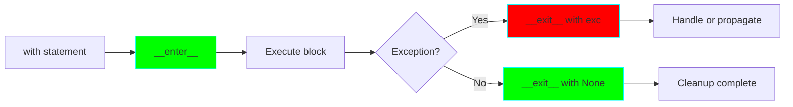

# Project 03: Context Managers - Resource Management Protocol

**Difficulty:** Intermediate ⭐⭐⭐

## Core Concepts

Context managers provide a clean way to allocate and release resources precisely when you need them. The `with` statement guarantees cleanup even if errors occur.



### The Context Manager Protocol

```python
class ContextManager:
    def __enter__(self):
        """Called when entering 'with' block."""
        # Setup code
        return self  # Or any object you want

    def __exit__(self, exc_type, exc_value, traceback):
        """Called when exiting 'with' block."""
        # Cleanup code
        # Return True to suppress exceptions, False to propagate
        return False
```

## Why Use Context Managers?

```python
# Without context manager (error-prone)
file = open('data.txt')
try:
    data = file.read()
finally:
    file.close()  # Easy to forget!

# With context manager (guaranteed cleanup)
with open('data.txt') as file:
    data = file.read()
# file automatically closed, even if exception occurs
```

## Creating Context Managers

### Method 1: Class-Based

```python
class ManagedFile:
    """File context manager with logging."""

    def __init__(self, filename, mode='r'):
        self.filename = filename
        self.mode = mode
        self.file = None

    def __enter__(self):
        print(f"Opening {self.filename}")
        self.file = open(self.filename, self.mode)
        return self.file

    def __exit__(self, exc_type, exc_value, traceback):
        print(f"Closing {self.filename}")
        if self.file:
            self.file.close()
        # Don't suppress exceptions
        return False

# Usage
with ManagedFile('data.txt', 'w') as f:
    f.write('Hello, World!')
```

### Method 2: contextlib.contextmanager Decorator

```python
from contextlib import contextmanager

@contextmanager
def managed_file(filename, mode='r'):
    """File context manager using generator."""
    print(f"Opening {filename}")
    file = open(filename, mode)
    try:
        yield file  # This is where 'with' block executes
    finally:
        print(f"Closing {filename}")
        file.close()

# Usage (identical)
with managed_file('data.txt', 'w') as f:
    f.write('Hello, World!')
```

## Practical Examples

### Example 1: Database Transaction Manager

```python
class DatabaseTransaction:
    """Manages database transactions with automatic rollback."""

    def __init__(self, connection):
        self.connection = connection
        self.transaction = None

    def __enter__(self):
        print("Beginning transaction")
        self.transaction = self.connection.begin()
        return self.transaction

    def __exit__(self, exc_type, exc_value, traceback):
        if exc_type is None:
            print("Committing transaction")
            self.transaction.commit()
        else:
            print(f"Rolling back transaction due to {exc_type.__name__}")
            self.transaction.rollback()
        return False  # Propagate exceptions

# Usage
with DatabaseTransaction(db_connection) as trans:
    # Execute queries
    trans.execute("INSERT INTO users VALUES (?)", (user_data,))
    trans.execute("UPDATE accounts SET balance = ?", (new_balance,))
    # Automatic commit if no exceptions, rollback if exception
```

### Example 2: Temporary Directory Manager

```python
import os
import tempfile
import shutil
from contextlib import contextmanager

@contextmanager
def temporary_directory():
    """Create and clean up a temporary directory."""
    temp_dir = tempfile.mkdtemp()
    print(f"Created temp directory: {temp_dir}")
    try:
        yield temp_dir
    finally:
        print(f"Removing temp directory: {temp_dir}")
        shutil.rmtree(temp_dir, ignore_errors=True)

# Usage
with temporary_directory() as temp_dir:
    # Work with temp directory
    file_path = os.path.join(temp_dir, 'test.txt')
    with open(file_path, 'w') as f:
        f.write('temporary data')
# Directory automatically deleted
```

### Example 3: Timer Context Manager

```python
import time

class Timer:
    """Measures execution time of code block."""

    def __init__(self, name="Block"):
        self.name = name
        self.start_time = None
        self.elapsed = None

    def __enter__(self):
        self.start_time = time.perf_counter()
        return self

    def __exit__(self, exc_type, exc_value, traceback):
        self.elapsed = time.perf_counter() - self.start_time
        print(f"{self.name} took {self.elapsed:.4f} seconds")
        return False

# Usage
with Timer("Data processing"):
    # Expensive operation
    result = sum(i**2 for i in range(1000000))
```

### Example 4: State Change Manager

```python
class TemporaryState:
    """Temporarily changes object state, then restores it."""

    def __init__(self, obj, **new_state):
        self.obj = obj
        self.new_state = new_state
        self.old_state = {}

    def __enter__(self):
        # Save current state
        for key in self.new_state:
            if hasattr(self.obj, key):
                self.old_state[key] = getattr(self.obj, key)

        # Apply new state
        for key, value in self.new_state.items():
            setattr(self.obj, key, value)

        return self.obj

    def __exit__(self, exc_type, exc_value, traceback):
        # Restore old state
        for key, value in self.old_state.items():
            setattr(self.obj, key, value)
        return False

# Usage
class Config:
    debug = False
    verbose = False

config = Config()
print(f"Debug: {config.debug}")  # False

with TemporaryState(config, debug=True, verbose=True):
    print(f"Debug: {config.debug}")  # True
    # Do something with debug enabled

print(f"Debug: {config.debug}")  # False (restored)
```

## Nuanced Scenarios

### Scenario 1: Suppressing Specific Exceptions

```python
from contextlib import contextmanager

@contextmanager
def suppress_exceptions(*exception_types):
    """Suppress specific exceptions."""
    try:
        yield
    except exception_types as e:
        print(f"Suppressed: {type(e).__name__}: {e}")
        # Return implicitly (None = False = don't suppress)
        # But exception is already caught, so it won't propagate

# Better: Use contextlib.suppress
from contextlib import suppress

with suppress(FileNotFoundError, PermissionError):
    os.remove('nonexistent_file.txt')
# No exception raised
```

### Scenario 2: Nested Context Managers

```python
# Multiple context managers
with open('input.txt') as infile, open('output.txt', 'w') as outfile:
    data = infile.read()
    outfile.write(data.upper())

# Equivalent to:
with open('input.txt') as infile:
    with open('output.txt', 'w') as outfile:
        data = infile.read()
        outfile.write(data.upper())
```

### Scenario 3: Reusable and Reentrant Context Managers

```python
class ReusableContextManager:
    """Can be used multiple times."""

    def __init__(self, name):
        self.name = name
        self.count = 0

    def __enter__(self):
        self.count += 1
        print(f"Entering {self.name} (count: {self.count})")
        return self

    def __exit__(self, exc_type, exc_value, traceback):
        print(f"Exiting {self.name}")
        return False

# Can be reused
manager = ReusableContextManager("MyManager")

with manager:
    print("First use")

with manager:
    print("Second use")  # Same manager, different invocation


# Reentrant (can be nested with itself)
from contextlib import contextmanager

@contextmanager
def reentrant_lock(lock):
    """Thread lock that can be acquired multiple times."""
    lock.acquire()
    try:
        yield
    finally:
        lock.release()
```

### Scenario 4: Returning Values from Context Managers

```python
class ValueReturningContext:
    """Context manager that provides computed values."""

    def __init__(self, items):
        self.items = items
        self.result = None

    def __enter__(self):
        # Perform expensive computation
        self.result = {
            'sum': sum(self.items),
            'mean': sum(self.items) / len(self.items),
            'count': len(self.items)
        }
        return self.result  # This is what 'as' captures

    def __exit__(self, exc_type, exc_value, traceback):
        self.result = None  # Cleanup
        return False

# Usage
with ValueReturningContext([1, 2, 3, 4, 5]) as stats:
    print(f"Sum: {stats['sum']}, Mean: {stats['mean']}")
```

## Advanced Patterns

### Pattern 1: Lock Manager with Timeout

```python
import threading
from contextlib import contextmanager

@contextmanager
def timeout_lock(lock, timeout=1.0):
    """Lock with timeout."""
    acquired = lock.acquire(timeout=timeout)
    if not acquired:
        raise TimeoutError(f"Could not acquire lock within {timeout}s")
    try:
        yield
    finally:
        lock.release()

# Usage
lock = threading.Lock()
try:
    with timeout_lock(lock, timeout=2.0):
        # Critical section
        pass
except TimeoutError:
    print("Lock acquisition timed out")
```

### Pattern 2: Environment Variable Manager

```python
import os

@contextmanager
def temporary_env(**env_vars):
    """Temporarily set environment variables."""
    old_env = {}

    # Save old values and set new ones
    for key, value in env_vars.items():
        old_env[key] = os.environ.get(key)
        os.environ[key] = value

    try:
        yield
    finally:
        # Restore old values
        for key, old_value in old_env.items():
            if old_value is None:
                os.environ.pop(key, None)
            else:
                os.environ[key] = old_value

# Usage
with temporary_env(DEBUG='true', LOG_LEVEL='verbose'):
    # Code runs with these env vars
    print(os.environ['DEBUG'])  # 'true'
# Original env vars restored
```

### Pattern 3: Multiple Resource Manager

```python
class ResourcePool:
    """Manages a pool of resources."""

    def __init__(self, resources):
        self.available = list(resources)
        self.in_use = set()

    def __enter__(self):
        if not self.available:
            raise RuntimeError("No resources available")
        resource = self.available.pop()
        self.in_use.add(resource)
        return resource

    def __exit__(self, exc_type, exc_value, traceback):
        # Return resource to pool
        resource = list(self.in_use)[0]
        self.in_use.remove(resource)
        self.available.append(resource)
        return False

# Usage
pool = ResourcePool(['conn1', 'conn2', 'conn3'])

with pool as conn:
    print(f"Using {conn}")
# Connection returned to pool
```

## contextlib Utilities

```python
from contextlib import (
    suppress,           # Suppress exceptions
    redirect_stdout,    # Redirect stdout
    redirect_stderr,    # Redirect stderr
    nullcontext,        # No-op context manager
    closing,            # Call close() on exit
    ExitStack,          # Manage dynamic number of contexts
)

# suppress - ignore specific exceptions
with suppress(FileNotFoundError):
    os.remove('file.txt')

# redirect_stdout - capture print output
import io
f = io.StringIO()
with redirect_stdout(f):
    print("Hello, World!")
output = f.getvalue()

# ExitStack - dynamic context managers
with ExitStack() as stack:
    files = [stack.enter_context(open(f'file{i}.txt', 'w')) for i in range(5)]
    # All files automatically closed
```

## Exercises

1. **Retry Context Manager**: Create a context manager that retries failed operations
2. **Change Directory**: Build `cd()` context manager that changes directory temporarily
3. **Mock Attributes**: Implement context manager for mocking object attributes in tests
4. **Connection Pool**: Create a context manager for database connection pooling

## Key Takeaways

- Context managers guarantee resource cleanup via `__enter__` and `__exit__`
- Use class-based for complex state, `@contextmanager` for simple cases
- `__exit__` receives exception info - return True to suppress
- Context managers can be reused and nested
- `contextlib` provides useful utilities for common patterns
- Always prefer context managers over try/finally for resource management

## References

- PEP 343 - The "with" Statement
- contextlib documentation - https://docs.python.org/3/library/contextlib.html
- Python Context Managers - https://docs.python.org/3/reference/datamodel.html#context-managers
