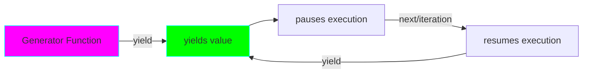
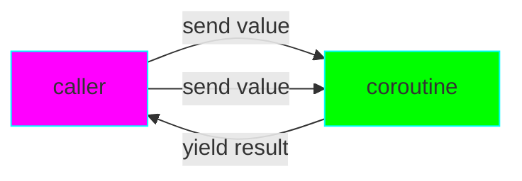

# Project 05: Generators & Coroutines - Lazy Evaluation

**Difficulty:** Intermediate-Advanced ⭐⭐⭐⭐

## Core Concepts

Generators are functions that can pause execution and resume later, yielding values one at a time. Coroutines extend this to allow bidirectional communication.



### Generator vs Regular Function

```python
# Regular function - returns all at once
def get_numbers():
    return [1, 2, 3, 4, 5]  # All in memory

# Generator - yields one at a time
def generate_numbers():
    yield 1  # Pauses here
    yield 2  # Resumes, pauses here
    yield 3
    yield 4
    yield 5

# Memory efficient for large datasets!
```

## Generator Basics

### Creating Generators

```python
# Method 1: Generator function
def countdown(n):
    """Count down from n to 1."""
    while n > 0:
        yield n
        n -= 1

# Method 2: Generator expression
squares = (x**2 for x in range(10))

# Usage
for num in countdown(5):
    print(num)  # 5, 4, 3, 2, 1
```

### Generator State

```python
def stateful_generator():
    """Generator maintains state between yields."""
    print("Starting")
    yield 1
    print("Between 1 and 2")
    yield 2
    print("Between 2 and 3")
    yield 3
    print("Ending")

gen = stateful_generator()
print(next(gen))  # Prints "Starting", returns 1
print(next(gen))  # Prints "Between 1 and 2", returns 2
print(next(gen))  # Prints "Between 2 and 3", returns 3
# next(gen)       # Raises StopIteration
```

## Practical Generator Patterns

### Pattern 1: Infinite Sequences

```python
def fibonacci():
    """Generate infinite fibonacci sequence."""
    a, b = 0, 1
    while True:
        yield a
        a, b = b, a + b

# Use with limit
from itertools import islice
first_10 = list(islice(fibonacci(), 10))
```

### Pattern 2: Pipeline Processing

```python
def read_lines(filename):
    """Read file line by line (memory efficient)."""
    with open(filename) as f:
        for line in f:
            yield line.strip()

def filter_comments(lines):
    """Filter out comment lines."""
    for line in lines:
        if not line.startswith('#'):
            yield line

def process_lines(lines):
    """Process each line."""
    for line in lines:
        yield line.upper()

# Create pipeline
lines = read_lines('data.txt')
filtered = filter_comments(lines)
processed = process_lines(filtered)

# Only processes when iterated!
for line in processed:
    print(line)
```


### Pattern 3: Batching

```python
def batch(iterable, n):
    """Yield batches of n items."""
    batch = []
    for item in iterable:
        batch.append(item)
        if len(batch) == n:
            yield batch
            batch = []
    if batch:  # Yield remaining items
        yield batch

# Usage
for group in batch(range(10), 3):
    print(group)
# [0, 1, 2]
# [3, 4, 5]
# [6, 7, 8]
# [9]
```

### Pattern 4: Tree Traversal

```python
class Node:
    def __init__(self, value, children=None):
        self.value = value
        self.children = children or []

def traverse_tree(node):
    """Depth-first tree traversal."""
    yield node.value
    for child in node.children:
        yield from traverse_tree(child)  # Delegate to sub-generator

# Usage
tree = Node(1, [
    Node(2, [Node(4), Node(5)]),
    Node(3, [Node(6)])
])

for value in traverse_tree(tree):
    print(value)  # 1, 2, 4, 5, 3, 6
```

## Coroutines (Advanced Generators)

### Bidirectional Communication

```python
def coroutine():
    """Coroutine that receives and yields values."""
    while True:
        value = yield  # Receive value via send()
        print(f"Received: {value}")

# Usage
coro = coroutine()
next(coro)  # Prime the coroutine (advance to first yield)
coro.send(10)  # Prints "Received: 10"
coro.send(20)  # Prints "Received: 20"
```



### Coroutine Pattern: Running Average

```python
def running_average():
    """Calculate running average of sent values."""
    total = 0
    count = 0
    average = None

    while True:
        value = yield average
        total += value
        count += 1
        average = total / count

# Usage
avg = running_average()
next(avg)  # Prime
print(avg.send(10))  # 10.0
print(avg.send(20))  # 15.0
print(avg.send(30))  # 20.0
```

### Coroutine Decorator (Primer)

```python
from functools import wraps

def coroutine(func):
    """Decorator to auto-prime coroutines."""
    @wraps(func)
    def primer(*args, **kwargs):
        gen = func(*args, **kwargs)
        next(gen)  # Prime it
        return gen
    return primer

@coroutine
def grep(pattern):
    """Coroutine that filters for pattern."""
    print(f"Looking for {pattern}")
    while True:
        line = yield
        if pattern in line:
            print(line)

# Usage (no need to prime!)
g = grep("python")
g.send("python is awesome")
g.send("java is meh")
g.send("python rocks")
```

## Advanced Patterns

### Pattern 1: Generator Delegation (`yield from`)

```python
def generator1():
    yield 1
    yield 2

def generator2():
    yield 3
    yield 4

def combined():
    yield from generator1()  # Delegate completely
    yield from generator2()

list(combined())  # [1, 2, 3, 4]

# Also used for flattening
def flatten(nested):
    for item in nested:
        if isinstance(item, list):
            yield from flatten(item)
        else:
            yield item

nested = [1, [2, [3, 4], 5], 6]
list(flatten(nested))  # [1, 2, 3, 4, 5, 6]
```

### Pattern 2: Generator Context Manager

```python
from contextlib import contextmanager

@contextmanager
def managed_resource():
    """Generator-based context manager."""
    print("Acquiring resource")
    resource = "resource"
    try:
        yield resource
    finally:
        print("Releasing resource")

with managed_resource() as res:
    print(f"Using {res}")
```

### Pattern 3: Cooperative Multitasking

```python
def task1():
    """Simulated task that yields control."""
    for i in range(3):
        print(f"Task 1 - step {i}")
        yield

def task2():
    """Another task."""
    for i in range(3):
        print(f"Task 2 - step {i}")
        yield

def scheduler(*tasks):
    """Simple round-robin scheduler."""
    tasks = list(tasks)
    while tasks:
        task = tasks.pop(0)
        try:
            next(task)
            tasks.append(task)  # Re-queue
        except StopIteration:
            pass  # Task complete

# Run tasks cooperatively
scheduler(task1(), task2())
# Interleaves: Task 1 step 0, Task 2 step 0, Task 1 step 1, ...
```

### Pattern 4: Data Pipeline with Coroutines

```python
@coroutine
def producer(target):
    """Produces data and sends to target."""
    for i in range(10):
        target.send(i)

@coroutine
def filter_even(target):
    """Filter even numbers."""
    while True:
        value = yield
        if value % 2 == 0:
            target.send(value)

@coroutine
def multiply_by_two(target):
    """Multiply by 2."""
    while True:
        value = yield
        target.send(value * 2)

@coroutine
def consumer():
    """Final consumer."""
    while True:
        value = yield
        print(f"Result: {value}")

# Build pipeline
c = consumer()
m = multiply_by_two(c)
f = filter_even(m)
producer(f)  # Produces: 0, 4, 8, 12, 16
```

## Generator Methods

```python
def my_generator():
    try:
        while True:
            value = yield
            print(f"Received: {value}")
    except GeneratorExit:
        print("Generator closing")

gen = my_generator()
next(gen)

# .send() - send value to generator
gen.send(10)

# .throw() - raise exception in generator
# gen.throw(ValueError("error"))

# .close() - stop generator (raises GeneratorExit)
gen.close()
```

## Performance Benefits

```python
import sys

# List - all in memory
numbers_list = [x**2 for x in range(1000000)]
print(f"List size: {sys.getsizeof(numbers_list)} bytes")

# Generator - one at a time
numbers_gen = (x**2 for x in range(1000000))
print(f"Generator size: {sys.getsizeof(numbers_gen)} bytes")

# Generator is ~87KB vs list at ~8MB!
```

## Exercises

1. **File Reader**: Create generator that reads large files in chunks
2. **Prime Generator**: Implement infinite prime number generator
3. **Sliding Window**: Build generator that yields sliding windows over sequence
4. **Async Simulator**: Use coroutines to simulate async task scheduling

## Key Takeaways

- Generators yield values lazily (one at a time)
- Memory efficient for large or infinite sequences
- Use `yield` for generators, `yield` + `send()` for coroutines
- `yield from` delegates to sub-generators
- Generators maintain state between yields
- Perfect for pipelines, streaming data, and lazy evaluation
- Coroutines enable cooperative multitasking
- Modern async/await is built on generator concepts

## References

- PEP 255 - Simple Generators
- PEP 342 - Coroutines via Enhanced Generators
- Python Generator Tricks - https://realpython.com/introduction-to-python-generators/
- itertools module - https://docs.python.org/3/library/itertools.html
