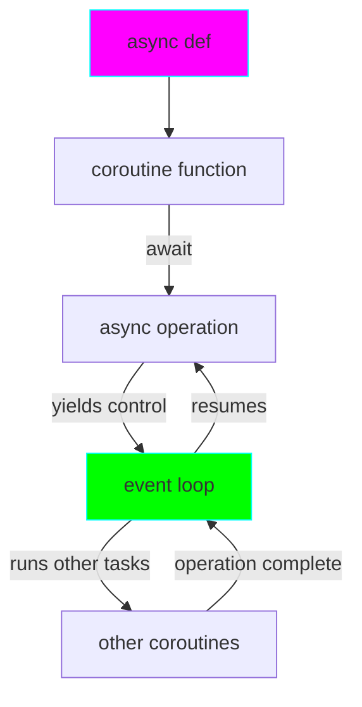

# Project 06: Async Programming - Concurrency with asyncio

**Difficulty:** Upper Intermediate ⭐⭐⭐⭐

## Core Concepts

Async/await enables concurrent I/O-bound operations without threads. Built on coroutines, it provides cooperative multitasking.



## Key Concepts

```python
import asyncio

# Async function (coroutine)
async def fetch_data():
    await asyncio.sleep(1)  # Non-blocking sleep
    return "data"

# Running async code
async def main():
    result = await fetch_data()
    print(result)

# Entry point
asyncio.run(main())
```

## Practical Patterns

### Pattern 1: Concurrent HTTP Requests
```python
import asyncio
import aiohttp

async def fetch_url(session, url):
    async with session.get(url) as response:
        return await response.text()

async def fetch_all(urls):
    async with aiohttp.ClientSession() as session:
        tasks = [fetch_url(session, url) for url in urls]
        return await asyncio.gather(*tasks)  # Concurrent!
```

### Pattern 2: Task Management
```python
async def background_task():
    while True:
        await asyncio.sleep(1)
        print("Background work")

async def main():
    # Create background task
    task = asyncio.create_task(background_task())

    # Do other work
    await asyncio.sleep(5)

    # Cancel task
    task.cancel()
    try:
        await task
    except asyncio.CancelledError:
        print("Task cancelled")
```

### Pattern 3: Async Context Managers
```python
class AsyncResource:
    async def __aenter__(self):
        print("Acquiring resource")
        await asyncio.sleep(0.1)
        return self

    async def __aexit__(self, exc_type, exc, tb):
        print("Releasing resource")
        await asyncio.sleep(0.1)

async def use_resource():
    async with AsyncResource() as res:
        print("Using resource")
```

## Advanced Patterns

### Semaphores for Rate Limiting
```python
async def limited_task(sem, task_id):
    async with sem:  # Max N concurrent
        print(f"Task {task_id} running")
        await asyncio.sleep(1)

async def main():
    sem = asyncio.Semaphore(3)  # Max 3 concurrent
    await asyncio.gather(*[limited_task(sem, i) for i in range(10)])
```

### Async Generators
```python
async def async_range(count):
    for i in range(count):
        await asyncio.sleep(0.1)
        yield i

async def consume():
    async for value in async_range(5):
        print(value)
```

## Key Takeaways

- Use `async def` for coroutine functions
- `await` yields control to event loop
- `asyncio.gather()` runs tasks concurrently
- Perfect for I/O-bound operations
- Not for CPU-bound tasks (use multiprocessing)
- Async context managers use `async with`
- Async iterators use `async for`

## References
- asyncio documentation - https://docs.python.org/3/library/asyncio.html
- PEP 492 - Coroutines with async/await
