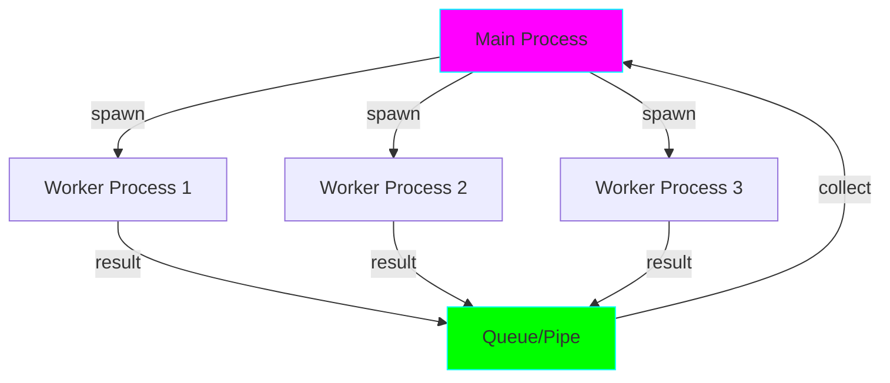

# Project 07: Multiprocessing - True Parallelism

**Difficulty:** Upper Intermediate ⭐⭐⭐⭐

## Core Concepts

Multiprocessing bypasses the GIL (Global Interpreter Lock) by using separate processes for true parallel execution of CPU-bound tasks.



## Threading vs Multiprocessing vs Asyncio

| Type | Best For | GIL | Overhead |
|------|----------|-----|----------|
| **Threading** | I/O-bound | Limited by GIL | Low |
| **Asyncio** | I/O-bound (many tasks) | Single thread | Very Low |
| **Multiprocessing** | CPU-bound | Bypasses GIL | High |

## Basic Patterns

### Pattern 1: Process Pool
```python
from multiprocessing import Pool

def cpu_intensive(n):
    """Expensive CPU operation."""
    return sum(i*i for i in range(n))

if __name__ == '__main__':
    with Pool(processes=4) as pool:
        results = pool.map(cpu_intensive, [10**6, 10**6, 10**6, 10**6])
    print(results)
```

### Pattern 2: Inter-Process Communication
```python
from multiprocessing import Process, Queue

def worker(q, num):
    """Worker that puts results in queue."""
    result = num * num
    q.put(result)

if __name__ == '__main__':
    queue = Queue()
    processes = [Process(target=worker, args=(queue, i)) for i in range(5)]

    for p in processes:
        p.start()

    results = [queue.get() for _ in processes]

    for p in processes:
        p.join()

    print(results)
```

### Pattern 3: Shared Memory
```python
from multiprocessing import Process, Value, Array

def increment(shared_val, shared_arr):
    shared_val.value += 1
    for i in range(len(shared_arr)):
        shared_arr[i] += 1

if __name__ == '__main__':
    val = Value('i', 0)  # Shared integer
    arr = Array('i', [0, 0, 0])  # Shared array

    processes = [Process(target=increment, args=(val, arr)) for _ in range(5)]

    for p in processes:
        p.start()
    for p in processes:
        p.join()

    print(f"Value: {val.value}, Array: {list(arr)}")
```

## Advanced Patterns

### Manager for Complex Objects
```python
from multiprocessing import Manager, Process

def worker(shared_dict, key, value):
    shared_dict[key] = value

if __name__ == '__main__':
    with Manager() as manager:
        shared = manager.dict()

        processes = [
            Process(target=worker, args=(shared, f"key{i}", i))
            for i in range(5)
        ]

        for p in processes:
            p.start()
        for p in processes:
            p.join()

        print(dict(shared))
```

### Process Locks
```python
from multiprocessing import Process, Lock

def safe_increment(lock, counter, n):
    for _ in range(n):
        with lock:
            # Critical section
            val = counter.value
            counter.value = val + 1

# Prevents race conditions
```

## Key Takeaways

- Multiprocessing bypasses GIL for true parallelism
- Each process has its own memory space
- Use for CPU-bound tasks
- Inter-process communication via Queue, Pipe
- Shared memory via Value, Array, Manager
- Higher overhead than threading
- Requires `if __name__ == '__main__':` guard

## References
- multiprocessing documentation - https://docs.python.org/3/library/multiprocessing.html
- Understanding the GIL - https://realpython.com/python-gil/
