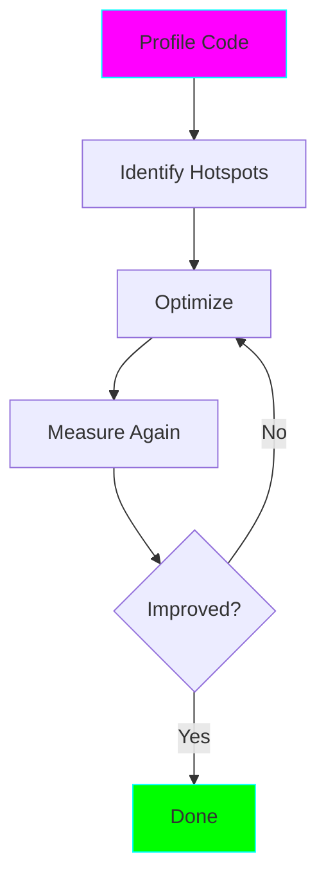

# Project 08: Memory Profiling - Optimization & Debugging

**Difficulty:** Upper Intermediate ⭐⭐⭐⭐

## Core Concepts

Memory profiling identifies memory leaks, inefficient data structures, and optimization opportunities.

## Tools

### 1. memory_profiler
```python
from memory_profiler import profile

@profile
def memory_heavy():
    a = [i for i in range(10**6)]
    b = [i*2 for i in range(10**6)]
    return len(a) + len(b)

# Run: python -m memory_profiler script.py
```

### 2. tracemalloc (Built-in)
```python
import tracemalloc

tracemalloc.start()

# Your code here
data = [i for i in range(10**6)]

current, peak = tracemalloc.get_traced_memory()
print(f"Current: {current / 10**6:.2f}MB, Peak: {peak / 10**6:.2f}MB")

tracemalloc.stop()
```

### 3. sys.getsizeof
```python
import sys

# Check object size
data = [1, 2, 3, 4, 5]
print(f"Size: {sys.getsizeof(data)} bytes")
```

## Common Memory Issues

### Issue 1: Unnecessary Copies
```python
# Bad - creates copy
def process_bad(data):
    return data[:]  # Copy!

# Good - use views/generators
def process_good(data):
    return iter(data)  # No copy
```

### Issue 2: Large In-Memory Structures
```python
# Bad - all in memory
data = [expensive_operation(i) for i in range(10**6)]

# Good - lazy evaluation
data = (expensive_operation(i) for i in range(10**6))
```

### Issue 3: Circular References
```python
import gc

class Node:
    def __init__(self):
        self.ref = None

# Creates circular reference
a = Node()
b = Node()
a.ref = b
b.ref = a  # Circular!

# Solution: use weakref
import weakref
b.ref = weakref.ref(a)

# Or manually break
a.ref = None
b.ref = None
gc.collect()
```

## Optimization Patterns

### Slots for Classes
```python
# Normal class - uses __dict__
class Normal:
    def __init__(self, x, y):
        self.x = x
        self.y = y

# With __slots__ - saves memory
class Optimized:
    __slots__ = ['x', 'y']

    def __init__(self, x, y):
        self.x = x
        self.y = y

# 40% less memory per instance!
```

### Generators vs Lists
```python
import sys

# List - all in memory
list_data = [i for i in range(10**6)]
print(f"List: {sys.getsizeof(list_data)} bytes")

# Generator - one at a time
gen_data = (i for i in range(10**6))
print(f"Generator: {sys.getsizeof(gen_data)} bytes")
```

## Profiling Workflow



## Key Takeaways

- Use `tracemalloc` for built-in profiling
- `__slots__` reduces memory for many instances
- Generators save memory vs lists
- Watch for circular references
- Profile before and after optimization
- Use `weakref` to avoid keeping objects alive

## References
- memory_profiler - https://pypi.org/project/memory-profiler/
- tracemalloc - https://docs.python.org/3/library/tracemalloc.html
- Python Memory Management - https://realpython.com/python-memory-management/
