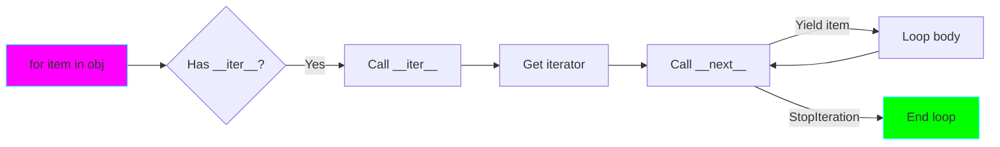

# Project 09: Custom Iterators - The Iterator Protocol

**Difficulty:** Upper Intermediate ⭐⭐⭐⭐

## Core Concepts

Iterators implement `__iter__()` and `__next__()`, enabling `for` loops and iteration protocols.



## Iterator Protocol

```python
class CountDown:
    """Iterator that counts down."""

    def __init__(self, start):
        self.current = start

    def __iter__(self):
        return self  # Return self for simple iterators

    def __next__(self):
        if self.current <= 0:
            raise StopIteration
        self.current -= 1
        return self.current + 1

# Usage
for num in CountDown(5):
    print(num)  # 5, 4, 3, 2, 1
```

## Iterable vs Iterator

```python
# Iterable - has __iter__(), returns iterator
class Range:
    def __init__(self, start, end):
        self.start = start
        self.end = end

    def __iter__(self):
        return RangeIterator(self.start, self.end)

# Iterator - has __iter__() and __next__()
class RangeIterator:
    def __init__(self, start, end):
        self.current = start
        self.end = end

    def __iter__(self):
        return self

    def __next__(self):
        if self.current >= self.end:
            raise StopIteration
        value = self.current
        self.current += 1
        return value

# Can iterate multiple times!
r = Range(0, 5)
list(r)  # [0, 1, 2, 3, 4]
list(r)  # [0, 1, 2, 3, 4] - works again!
```

## Practical Patterns

### Pattern 1: Infinite Iterator
```python
class InfiniteCounter:
    def __init__(self, start=0):
        self.current = start

    def __iter__(self):
        return self

    def __next__(self):
        value = self.current
        self.current += 1
        return value

# Use with itertools.islice
from itertools import islice
counter = InfiniteCounter(10)
first_5 = list(islice(counter, 5))  # [10, 11, 12, 13, 14]
```

### Pattern 2: Reverse Iterator
```python
class Reverse:
    """Iterate sequence in reverse."""

    def __init__(self, data):
        self.data = data
        self.index = len(data)

    def __iter__(self):
        return self

    def __next__(self):
        if self.index == 0:
            raise StopIteration
        self.index -= 1
        return self.data[self.index]

# Usage
for char in Reverse("hello"):
    print(char)  # o, l, l, e, h
```

### Pattern 3: Cycle Iterator
```python
class Cycle:
    """Cycle through items infinitely."""

    def __init__(self, items):
        self.items = items
        self.index = 0

    def __iter__(self):
        return self

    def __next__(self):
        if not self.items:
            raise StopIteration
        value = self.items[self.index]
        self.index = (self.index + 1) % len(self.items)
        return value

# Usage
cycle = Cycle(['A', 'B', 'C'])
# Yields: A, B, C, A, B, C, ...
```

### Pattern 4: Filtered Iterator
```python
class FilteredIterator:
    """Iterator that filters based on predicate."""

    def __init__(self, iterable, predicate):
        self.iterator = iter(iterable)
        self.predicate = predicate

    def __iter__(self):
        return self

    def __next__(self):
        while True:
            value = next(self.iterator)
            if self.predicate(value):
                return value

# Usage
evens = FilteredIterator(range(10), lambda x: x % 2 == 0)
list(evens)  # [0, 2, 4, 6, 8]
```

## Advanced Patterns

### Chained Iterators
```python
class Chain:
    """Chain multiple iterables."""

    def __init__(self, *iterables):
        self.iterables = iterables
        self.current_iter = None
        self.iter_index = 0

    def __iter__(self):
        return self

    def __next__(self):
        while self.iter_index < len(self.iterables):
            if self.current_iter is None:
                self.current_iter = iter(self.iterables[self.iter_index])

            try:
                return next(self.current_iter)
            except StopIteration:
                self.current_iter = None
                self.iter_index += 1

        raise StopIteration

# Usage
chained = Chain([1, 2], [3, 4], [5, 6])
list(chained)  # [1, 2, 3, 4, 5, 6]
```

### Peeking Iterator
```python
class PeekableIterator:
    """Iterator with peek() method."""

    def __init__(self, iterable):
        self.iterator = iter(iterable)
        self._next = None
        self._has_next = False

    def __iter__(self):
        return self

    def __next__(self):
        if self._has_next:
            value = self._next
            self._has_next = False
            return value
        return next(self.iterator)

    def peek(self):
        """Look at next value without consuming."""
        if not self._has_next:
            self._next = next(self.iterator)
            self._has_next = True
        return self._next

# Usage
it = PeekableIterator([1, 2, 3])
print(it.peek())  # 1
print(it.peek())  # 1 (still 1!)
print(next(it))   # 1
print(next(it))   # 2
```

## Key Takeaways

- Iterators implement `__iter__()` and `__next__()`
- Raise `StopIteration` when exhausted
- Iterables return iterators from `__iter__()`
- Iterators can be stateful
- Generators are simpler for most cases
- Use iterators for complex iteration logic
- Can implement infinite sequences

## References
- Iterator Types - https://docs.python.org/3/library/stdtypes.html#iterator-types
- PEP 234 - Iterators
- itertools module - https://docs.python.org/3/library/itertools.html
