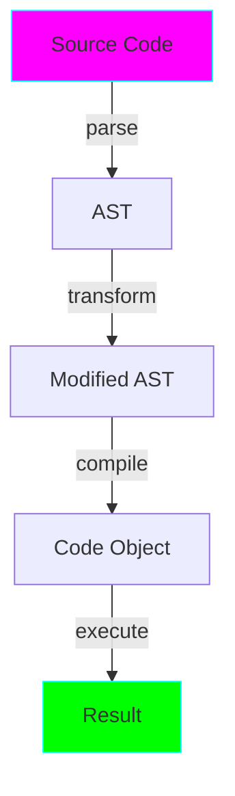

# Project 12: AST Manipulation - Code as Data

**Difficulty:** Advanced ⭐⭐⭐⭐⭐

## Core Concepts

The Abstract Syntax Tree (AST) represents Python code as a tree structure, enabling code analysis and transformation.



## Basic AST Usage

```python
import ast

code = """
def greet(name):
    return f"Hello, {name}!"
"""

tree = ast.parse(code)
print(ast.dump(tree, indent=2))
```

## AST Visitors

```python
class FunctionVisitor(ast.NodeVisitor):
    """Visit all function definitions."""

    def visit_FunctionDef(self, node):
        print(f"Found function: {node.name}")
        # Visit children
        self.generic_visit(node)

tree = ast.parse(code)
visitor = FunctionVisitor()
visitor.visit(tree)
```

## AST Transformers

```python
class DebugTransformer(ast.NodeTransformer):
    """Add print statements before each function call."""

    def visit_Call(self, node):
        # Create print node
        print_node = ast.Call(
            func=ast.Name(id='print', ctx=ast.Load()),
            args=[ast.Constant(value='Calling function')],
            keywords=[]
        )
        # Visit children first
        self.generic_visit(node)
        return node

# Transform code
tree = ast.parse(code)
transformer = DebugTransformer()
new_tree = transformer.visit(tree)
ast.fix_missing_locations(new_tree)

# Compile and execute
code_obj = compile(new_tree, '<string>', 'exec')
exec(code_obj)
```

## Practical Applications

### 1. Code Analysis
```python
class ComplexityAnalyzer(ast.NodeVisitor):
    """Calculate cyclomatic complexity."""

    def __init__(self):
        self.complexity = 1

    def visit_If(self, node):
        self.complexity += 1
        self.generic_visit(node)

    def visit_For(self, node):
        self.complexity += 1
        self.generic_visit(node)

    def visit_While(self, node):
        self.complexity += 1
        self.generic_visit(node)
```

### 2. Code Instrumentation
```python
class TimerInjector(ast.NodeTransformer):
    """Add timing code to functions."""

    def visit_FunctionDef(self, node):
        # Add timing code at start and end
        start = ast.Assign(
            targets=[ast.Name(id='_start', ctx=ast.Store())],
            value=ast.Call(
                func=ast.Attribute(
                    value=ast.Name(id='time', ctx=ast.Load()),
                    attr='time',
                    ctx=ast.Load()
                ),
                args=[],
                keywords=[]
            )
        )

        # Insert at beginning of function
        node.body.insert(0, start)

        self.generic_visit(node)
        return node
```

### 3. DSL Implementation
```python
# Transform custom syntax to Python
class DSLTransformer(ast.NodeTransformer):
    """Transform domain-specific language constructs."""
    pass
```

## Key Takeaways
- AST represents code as a tree
- `NodeVisitor` for code analysis
- `NodeTransformer` for code transformation
- Use `ast.fix_missing_locations()` after transformation
- Enables powerful metaprogramming
- Useful for linters, formatters, code generators

## References
- ast module - https://docs.python.org/3/library/ast.html
- Green Tree Snakes - https://greentreesnakes.readthedocs.io/
