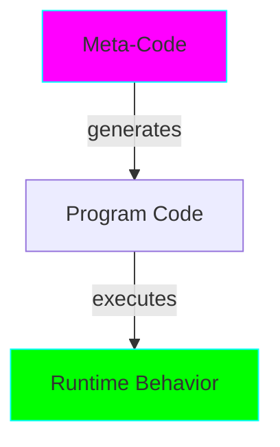

# Project 15: Metaprogramming - Code that Writes Code

**Difficulty:** Advanced ⭐⭐⭐⭐⭐

## Core Concepts

Metaprogramming is writing code that manipulates code at runtime or compile-time.



## Techniques

### 1. Dynamic Class Creation
```python
def create_class(name, attributes):
    """Create class dynamically."""
    return type(name, (object,), attributes)

# Create class at runtime
Person = create_class('Person', {
    '__init__': lambda self, name: setattr(self, 'name', name),
    'greet': lambda self: f"Hello, I'm {self.name}"
})

p = Person("Alice")
print(p.greet())
```

### 2. Attribute Access Hooks
```python
class DynamicAttributes:
    """Dynamic attribute access."""

    def __getattr__(self, name):
        """Called when attribute not found."""
        return f"Dynamic: {name}"

    def __setattr__(self, name, value):
        """Called on attribute assignment."""
        print(f"Setting {name} = {value}")
        super().__setattr__(name, value)

    def __delattr__(self, name):
        """Called on attribute deletion."""
        print(f"Deleting {name}")
        super().__delattr__(name)

obj = DynamicAttributes()
print(obj.anything)  # "Dynamic: anything"
obj.x = 10           # "Setting x = 10"
del obj.x            # "Deleting x"
```

### 3. `__getattribute__` Override
```python
class TrackedAccess:
    """Track all attribute access."""

    def __init__(self):
        object.__setattr__(self, 'access_log', [])

    def __getattribute__(self, name):
        # Avoid infinite recursion
        if name == 'access_log':
            return object.__getattribute__(self, name)

        log = object.__getattribute__(self, 'access_log')
        log.append(f"Accessed: {name}")

        return object.__getattribute__(self, name)

obj = TrackedAccess()
obj.value = 42
_ = obj.value
print(obj.access_log)  # ['Accessed: value']
```

### 4. Dynamic Method Addition
```python
class Extensible:
    """Class that can add methods at runtime."""
    pass

def new_method(self, x):
    return x * 2

# Add method to class
Extensible.double = new_method

obj = Extensible()
print(obj.double(5))  # 10
```

### 5. Class Decorators for Enhancement
```python
def add_methods(cls):
    """Add methods to class via decorator."""

    def to_dict(self):
        return {k: v for k, v in self.__dict__.items()}

    def from_dict(cls, data):
        obj = cls.__new__(cls)
        obj.__dict__.update(data)
        return obj

    cls.to_dict = to_dict
    cls.from_dict = classmethod(from_dict)
    return cls

@add_methods
class User:
    def __init__(self, name, age):
        self.name = name
        self.age = age

user = User("Alice", 30)
data = user.to_dict()
restored = User.from_dict(data)
```

### 6. Property Factories
```python
def typed_property(name, expected_type):
    """Create type-checked property."""
    storage_name = f'_{name}'

    @property
    def prop(self):
        return getattr(self, storage_name)

    @prop.setter
    def prop(self, value):
        if not isinstance(value, expected_type):
            raise TypeError(f"{name} must be {expected_type}")
        setattr(self, storage_name, value)

    return prop

class Person:
    name = typed_property('name', str)
    age = typed_property('age', int)

    def __init__(self, name, age):
        self.name = name
        self.age = age
```

### 7. exec and eval (Use Carefully!)
```python
# eval - evaluate expression
result = eval("2 + 2")  # 4

# exec - execute statements
code = """
def generated_function(x):
    return x ** 2
"""
exec(code)
print(generated_function(5))  # 25

# Security warning: Never use with untrusted input!
```

### 8. Code Generation
```python
def generate_class_code(class_name, fields):
    """Generate class source code."""
    field_init = ', '.join(f"{f}={f}" for f in fields)
    field_assign = '\n        '.join(f"self.{f} = {f}" for f in fields)

    code = f"""
class {class_name}:
    def __init__(self, {', '.join(fields)}):
        {field_assign}

    def __repr__(self):
        return f"{class_name}({field_init})"
"""
    return code

# Generate and execute
code = generate_class_code('Point', ['x', 'y', 'z'])
print(code)
exec(code)

p = Point(1, 2, 3)
print(p)
```

### 9. Import Hooks
```python
import sys
from importlib.abc import Loader, MetaPathFinder
from importlib.machinery import ModuleSpec

class CustomImporter(MetaPathFinder, Loader):
    """Custom import hook."""

    def find_spec(self, fullname, path, target=None):
        if fullname == 'mymodule':
            return ModuleSpec(fullname, self)
        return None

    def create_module(self, spec):
        return None  # Use default

    def exec_module(self, module):
        # Inject code into module
        module.greeting = "Hello from custom importer!"

sys.meta_path.insert(0, CustomImporter())

# Now can import non-existent module
import mymodule
print(mymodule.greeting)
```

### 10. Function Transformation
```python
def transform_function(func):
    """Transform function code."""
    import inspect
    source = inspect.getsource(func)

    # Modify source
    new_source = source.replace('return', 'print("Returning:"); return')

    # Compile and create new function
    exec(new_source, func.__globals__)
    return func.__globals__[func.__name__]

def original(x):
    return x * 2

# Transform
transformed = transform_function(original)
```

## Practical Applications

### ORM-Style Model
```python
class Field:
    def __init__(self, field_type):
        self.field_type = field_type

class ModelMeta(type):
    def __new__(mcs, name, bases, attrs):
        fields = {k: v for k, v in attrs.items() if isinstance(v, Field)}
        attrs['_fields'] = fields
        return super().__new__(mcs, name, bases, attrs)

class Model(metaclass=ModelMeta):
    pass

class User(Model):
    name = Field(str)
    age = Field(int)

print(User._fields)  # {'name': Field(str), 'age': Field(int)}
```

### Auto-Registration
```python
_registry = {}

def register(cls):
    """Auto-register classes."""
    _registry[cls.__name__] = cls
    return cls

@register
class PluginA:
    pass

@register
class PluginB:
    pass

print(_registry)  # {'PluginA': <class 'PluginA'>, ...}
```

## Key Takeaways
- Metaprogramming manipulates code at runtime
- Use `type()` to create classes dynamically
- `__getattr__` and `__setattr__` for dynamic attributes
- Class decorators add behavior to classes
- exec/eval are powerful but dangerous
- Perfect for frameworks and DSLs
- Can make code harder to understand
- Use judiciously

## References
- Python Data Model - https://docs.python.org/3/reference/datamodel.html
- Metaprogramming - https://realpython.com/python-metaprogramming/
- Import System - https://docs.python.org/3/reference/import.html
