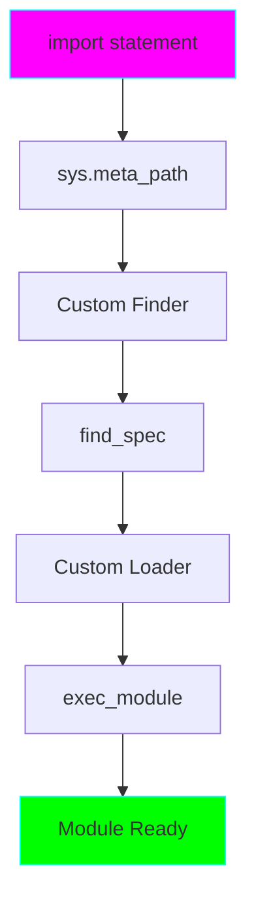

# Project 16: Custom Import System - Meta Path Finders

**Difficulty:** Expert ⭐⭐⭐⭐⭐⭐

## Core Concepts

Python's import system can be customized to load modules from non-standard sources (databases, networks, encrypted files).



## Import System Components

### Finder
Locates the module and returns a ModuleSpec

### Loader
Loads and executes the module code

## Custom Importer Example

```python
import sys
from importlib.abc import Loader, MetaPathFinder
from importlib.machinery import ModuleSpec
import types

class StringImporter(MetaPathFinder, Loader):
    """Import modules from string source code."""

    # Module source code storage
    _modules = {}

    @classmethod
    def register_module(cls, name, source):
        """Register a module's source code."""
        cls._modules[name] = source

    def find_spec(self, fullname, path, target=None):
        """Find module spec if we have its source."""
        if fullname in self._modules:
            return ModuleSpec(fullname, self, origin="string")
        return None

    def create_module(self, spec):
        """Return None to use default module creation."""
        return None

    def exec_module(self, module):
        """Execute the module code."""
        source = self._modules[module.__name__]
        code = compile(source, f"<{module.__name__}>", "exec")
        exec(code, module.__dict__)

# Install the importer
sys.meta_path.insert(0, StringImporter())

# Register a virtual module
StringImporter.register_module('mymodule', '''
def greet(name):
    return f"Hello, {name}!"

CONSTANT = 42
''')

# Now can import it!
import mymodule
print(mymodule.greet("World"))  # Hello, World!
print(mymodule.CONSTANT)        # 42
```

## Advanced Patterns

### Database-Backed Modules
```python
class DatabaseImporter(MetaPathFinder, Loader):
    """Load modules from database."""

    def __init__(self, db_connection):
        self.db = db_connection

    def find_spec(self, fullname, path, target=None):
        # Check if module exists in database
        if self.module_exists_in_db(fullname):
            return ModuleSpec(fullname, self)
        return None

    def exec_module(self, module):
        source = self.load_from_db(module.__name__)
        exec(compile(source, module.__name__, 'exec'), module.__dict__)
```

### Encrypted Module Loader
```python
class EncryptedImporter(MetaPathFinder, Loader):
    """Load encrypted .pye files."""

    def find_spec(self, fullname, path, target=None):
        # Look for .pye file
        filename = fullname.replace('.', '/') + '.pye'
        if os.path.exists(filename):
            return ModuleSpec(fullname, self, origin=filename)
        return None

    def exec_module(self, module):
        # Decrypt and execute
        with open(module.__spec__.origin, 'rb') as f:
            encrypted = f.read()
            source = decrypt(encrypted)
            exec(compile(source, module.__name__, 'exec'), module.__dict__)
```

### Network Importer
```python
class NetworkImporter(MetaPathFinder, Loader):
    """Import modules from HTTP server."""

    def __init__(self, base_url):
        self.base_url = base_url

    def find_spec(self, fullname, path, target=None):
        url = f"{self.base_url}/{fullname}.py"
        try:
            response = requests.head(url)
            if response.status_code == 200:
                return ModuleSpec(fullname, self, origin=url)
        except:
            pass
        return None

    def exec_module(self, module):
        response = requests.get(module.__spec__.origin)
        source = response.text
        exec(compile(source, module.__name__, 'exec'), module.__dict__)
```

### Plugin Auto-Discovery
```python
class PluginImporter(MetaPathFinder, Loader):
    """Auto-discover and load plugins from directory."""

    def __init__(self, plugin_dir):
        self.plugin_dir = plugin_dir
        self.plugins = {}
        self.discover_plugins()

    def discover_plugins(self):
        """Scan directory for plugins."""
        for file in os.listdir(self.plugin_dir):
            if file.endswith('.py'):
                name = file[:-3]
                path = os.path.join(self.plugin_dir, file)
                with open(path) as f:
                    self.plugins[name] = f.read()

    def find_spec(self, fullname, path, target=None):
        if fullname.startswith('plugins.') and fullname[8:] in self.plugins:
            return ModuleSpec(fullname, self)
        return None

    def exec_module(self, module):
        plugin_name = module.__name__[8:]  # Remove 'plugins.' prefix
        source = self.plugins[plugin_name]
        exec(compile(source, module.__name__, 'exec'), module.__dict__)
```

## Import Hooks

### Import Event Tracking
```python
import sys

class ImportTracker:
    """Track all imports."""

    def __init__(self):
        self.imports = []
        self.original_import = __builtins__.__import__

    def __call__(self, name, *args, **kwargs):
        self.imports.append(name)
        return self.original_import(name, *args, **kwargs)

    def install(self):
        __builtins__.__import__ = self

    def uninstall(self):
        __builtins__.__import__ = self.original_import

tracker = ImportTracker()
tracker.install()

import json  # Tracked!
print(tracker.imports)  # ['json']
```

### Lazy Imports
```python
class LazyModule:
    """Delay import until first use."""

    def __init__(self, name):
        self._name = name
        self._module = None

    def _load(self):
        if self._module is None:
            self._module = __import__(self._name)

    def __getattr__(self, name):
        self._load()
        return getattr(self._module, name)

# Usage
json = LazyModule('json')
# json not imported yet...
data = json.dumps({'key': 'value'})  # Now imported!
```

## Key Takeaways
- Custom importers via MetaPathFinder + Loader
- find_spec() locates module
- exec_module() executes module code
- Can load from any source (DB, network, memory)
- Useful for plugins, encryption, lazy loading
- sys.meta_path controls import search
- Powerful but complex
- Security implications with network imports

## References
- Import System - https://docs.python.org/3/reference/import.html
- importlib - https://docs.python.org/3/library/importlib.html
- PEP 302 - New Import Hooks
