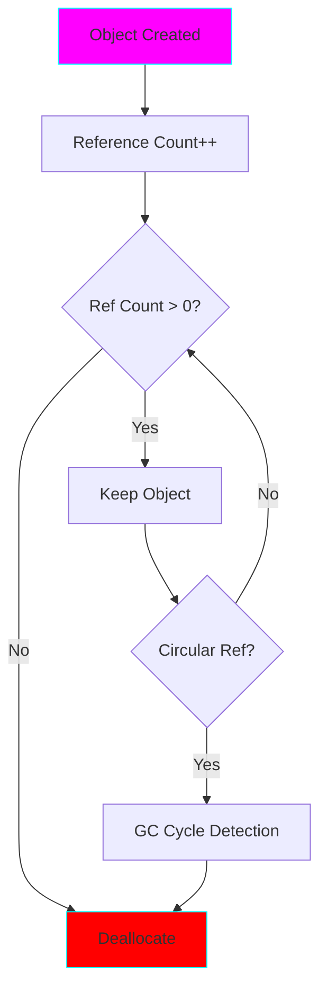

# Project 17: Memory Management - GC & Reference Counting

**Difficulty:** Expert ⭐⭐⭐⭐⭐⭐

## Core Concepts

Python uses reference counting + garbage collection to manage memory automatically.



## Reference Counting

```python
import sys

a = []
print(sys.getrefcount(a))  # 2 (a + temporary in getrefcount)

b = a
print(sys.getrefcount(a))  # 3 (a, b, temporary)

del b
print(sys.getrefcount(a))  # 2 (back to a + temporary)
```

## Garbage Collector

```python
import gc

# Check if GC is enabled
print(gc.isenabled())  # True

# Get GC stats
print(gc.get_count())  # (threshold counts)
print(gc.get_stats())

# Force collection
collected = gc.collect()
print(f"Collected {collected} objects")

# Disable/Enable
gc.disable()
gc.enable()
```

## Circular References

```python
class Node:
    def __init__(self, value):
        self.value = value
        self.next = None

# Create circular reference
a = Node(1)
b = Node(2)
a.next = b
b.next = a  # Circular!

# Delete references
del a
del b

# Objects still in memory (circular reference prevents ref count = 0)
# Garbage collector will clean them up eventually
print(gc.collect())  # Collects circular references
```

## Weak References

```python
import weakref

class Resource:
    def __init__(self, name):
        self.name = name

    def __del__(self):
        print(f"Deleting {self.name}")

# Strong reference
obj = Resource("strong")

# Weak reference (doesn't increase ref count)
weak = weakref.ref(obj)

print(weak())  # Access via weak()
print(weak())  # Still accessible

del obj  # "Deleting strong"
print(weak())  # None (object was deleted)
```

## WeakValueDictionary

```python
import weakref

class Cache:
    def __init__(self):
        self._cache = weakref.WeakValueDictionary()

    def get(self, key):
        return self._cache.get(key)

    def set(self, key, value):
        self._cache[key] = value

cache = Cache()
obj = Resource("cached")
cache.set("key", obj)

print(cache.get("key"))  # <Resource>

del obj  # "Deleting cached"
print(cache.get("key"))  # None (auto-removed from cache)
```

## Memory Pools

Python uses memory pools for efficiency:

```python
# Small objects (<512 bytes) use pymalloc
# Larger objects use system malloc

# Integer caching (-5 to 256)
a = 100
b = 100
print(a is b)  # True (same object)

a = 1000
b = 1000
print(a is b)  # False (different objects)

# String interning
s1 = "hello"
s2 = "hello"
print(s1 is s2)  # True (interned)

# Force interning
s1 = "hello world"
s2 = "hello world"
print(s1 is s2)  # False (not auto-interned)

import sys
s1 = sys.intern("hello world")
s2 = sys.intern("hello world")
print(s1 is s2)  # True (manually interned)
```

## Object Lifecycle

```python
class Tracked:
    def __init__(self, name):
        self.name = name
        print(f"[INIT] {self.name}")

    def __del__(self):
        print(f"[DEL] {self.name}")

# Object lifecycle
obj = Tracked("obj1")  # [INIT] obj1
obj = Tracked("obj2")  # [INIT] obj2, [DEL] obj1
del obj                # [DEL] obj2
```

## Finalization

```python
import weakref

class Resource:
    def __init__(self, name):
        self.name = name
        # Register finalizer
        self._finalizer = weakref.finalize(self, self.cleanup, name)

    @staticmethod
    def cleanup(name):
        print(f"Cleaning up {name}")

    def detach(self):
        """Prevent finalization."""
        self._finalizer.detach()

obj = Resource("resource")
del obj  # "Cleaning up resource"
```

## Memory Debugging

### Finding Memory Leaks

```python
import gc
import objgraph

# Show most common types
objgraph.show_most_common_types()

# Find all instances
objgraph.by_type('list')

# Show references
obj = [1, 2, 3]
objgraph.show_refs([obj], filename='refs.png')

# Find leaking objects
gc.set_debug(gc.DEBUG_LEAK)
gc.collect()
print(gc.garbage)  # Uncollectable objects
```

### tracemalloc

```python
import tracemalloc

tracemalloc.start()

# Your code
data = [i for i in range(1000000)]

snapshot = tracemalloc.take_snapshot()
top_stats = snapshot.statistics('lineno')

print("[ Top 10 ]")
for stat in top_stats[:10]:
    print(stat)

tracemalloc.stop()
```

## Advanced Patterns

### Object Pooling

```python
class ObjectPool:
    """Reuse objects instead of creating new ones."""

    def __init__(self, factory, max_size=10):
        self.factory = factory
        self.max_size = max_size
        self.pool = []

    def acquire(self):
        if self.pool:
            return self.pool.pop()
        return self.factory()

    def release(self, obj):
        if len(self.pool) < self.max_size:
            self.pool.append(obj)

# Usage
pool = ObjectPool(lambda: [], max_size=5)
obj = pool.acquire()
# Use obj
pool.release(obj)  # Return to pool
```

### Slots for Memory Efficiency

```python
# Normal class
class Normal:
    def __init__(self, x, y):
        self.x = x
        self.y = y

# With __slots__
class Optimized:
    __slots__ = ['x', 'y']

    def __init__(self, x, y):
        self.x = x
        self.y = y

import sys
n = Normal(1, 2)
o = Optimized(1, 2)

print(f"Normal: {sys.getsizeof(n)} bytes")      # ~48 bytes
print(f"Optimized: {sys.getsizeof(o)} bytes")  # ~40 bytes
# + no __dict__ overhead for millions of instances!
```

## Key Takeaways
- Python uses reference counting + GC
- Circular references require GC
- Weak references don't increase ref count
- Use weakref for caches and callbacks
- __slots__ saves memory
- tracemalloc for memory profiling
- GC can be tuned or disabled
- Understanding memory helps avoid leaks

## References
- gc module - https://docs.python.org/3/library/gc.html
- weakref - https://docs.python.org/3/library/weakref.html
- Memory Management - https://docs.python.org/3/c-api/memory.html
